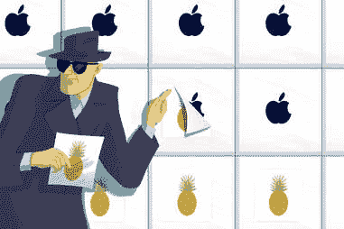
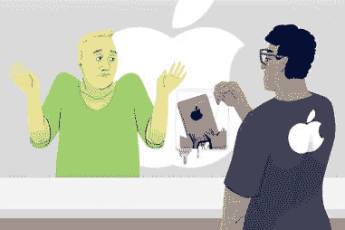
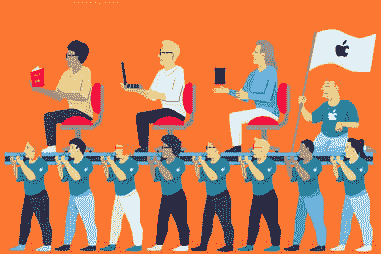

# 苹果商店的秘密&前雇员揭露的恐怖故事

> 原文：<https://www.thrillist.com/tech/nation/apple-store-secrets-horror-stories-revealed-by-former-employees?utm_source=wanqu.co&utm_campaign=Wanqu+Daily&utm_medium=website>

<picture class="swiper-lazy picture-tag" data-testid="picture-tag"><source srcset="https://assets3.thrillist.com/v1/image/1750202/1584x1056/crop;webp=auto;jpeg_quality=60;progressive.jpg" media="(min-width: 1024px)" data-size="desktop"><source srcset="https://assets3.thrillist.com/v1/image/1750202/1536x1024/crop;webp=auto;jpeg_quality=60;progressive.jpg" media="(min-width: 768px) and (max-width: 1023px)" data-size="tablet"><source srcset="https://assets3.thrillist.com/v1/image/1750202/828x620/crop;webp=auto;jpeg_quality=60;progressive.jpg" media="(max-width: 767px)" data-size="mobile">

<noscript></noscript></picture> 

杰森·霍夫曼/惊悚片

走进苹果店和走进百思买一点感觉都没有。天才吧里排着长队，情绪高涨，但出于某种原因，很多人觉得必须去那里，只是在任何一天闲逛。这是一种独一无二的零售体验。

但是在这个星球上最臭名昭著的秘密公司之一的幕后是什么样的呢？有没有想过商店员工对未经宣布的苹果产品到底了解多少？或者免费换手机有什么诀窍？我让一些前员工和前 Genii 坦白了一些苹果商店保守得最好的秘密。继续读下去，苹果恶魔们。

*我们的消息来源:* **卢卡斯**，一个五年经验的老手，一步步爬上苹果的图腾柱，成为领导天才；**大卫**，一名有四年半工作经验的兼职销售专员；托尼，他结束了五年家庭居室专家的任期。为了保护他们免受蒂姆·库克等人的愤怒，我们改了他们的名字。为了清楚起见，他们说的一些话经过了编辑。

## 员工不允许对你说“不”

卢卡斯:“在任何情况下，我们都不能直接告诉客户，‘不，这个问题我无能为力。’在某些情况下，这是一个棘手的问题。例如，如果客户不得不支付 199 美元来更换他们坏掉的 iPhone 屏幕，他们会非常不高兴。如果他们说‘你是说你不能帮我，你不能帮我修手机吗？!我们被训练回答‘是的，我绝对可以帮助你，我很乐意。替代价格为 199 美元。这可能会循环一段时间。"

## 他们承认某些产品很糟糕，即使苹果不会

大卫:“如果你有一台更旧的 MacBook，而且你的充电器能维持电脑的寿命，你应该为自己感到非常自豪。我们有无数人从电缆与电源插头连接处的磨损处带来了他们的产品，我们不得不说他们可能包装不正确或没有妥善护理，尽管很明显[很多人都有完全相同的问题](https://www.thrillist.com/tech/nation/why-apple-hasnt-fixed-its-crappy-charging-cables)
**卢卡斯:**“苹果地图那时候就是狗屎。现在是屎了。我也认为苹果手表是有史以来最愚蠢的东西。谁那么懒？”

<aside class="RecommendedVideostyles__RecVidWrap-sc-48fa0a-0 kbRlFK page-element page-element--recommended-video paragraph" data-element-type="ParagraphRecommendedVideo" data-element-index="5">

惊悚电视

Wine and Cheeseburger

葡萄酒和奶酪汉堡:哈利和劳拉搭配沙拉三明治和葡萄酒

</aside>

<picture class="swiper-lazy picture-tag picture-tag--lazy" data-testid="picture-tag"><source data-srcset="https://assets3.thrillist.com/v1/image/1750199/1584x1054/crop;webp=auto;jpeg_quality=60.jpg" media="(min-width: 1024px)" data-size="desktop"><source data-srcset="https://assets3.thrillist.com/v1/image/1750199/1454x970/crop;webp=auto;jpeg_quality=60.jpg" media="(min-width: 768px) and (max-width: 1023px)" data-size="tablet"><source data-srcset="https://assets3.thrillist.com/v1/image/1750199/762x508/crop;webp=auto;jpeg_quality=60.jpg" media="(max-width: 767px)" data-size="mobile">

<noscript></noscript></picture> 

Jason Hoffman/Thrillist

## 苹果竭尽全力对员工保密新产品

大卫:“我们*从未*得到任何新产品发布或设计的内部消息。我记得当 iPhone 5 发布时，我们在发布前一点点收到了一批新的 Lightning 电缆。即使像新电缆的设计这样简单的事情也是如此秘密，以至于当他们最初把它们发给我们时，它们被伪装在模仿旧的 30 针电缆设计的模拟外壳内。当新电缆被揭开时，他们给我们发来了如何撬开这些外壳的说明，以展示秘密藏在旧连接器内部的新连接器。疯狂的东西。”

## 他们看过你的鸡巴照片，还有很多其他疯狂的东西

托尼:“当我们进行数据迁移时，会在人们的电脑上弹出的东西...当照片导入 iPhoto 时，它会在导入时在屏幕上闪烁每张照片。所以。很多。迪克。图片。有些东西就是看不见。”
**卢卡斯:**“我在一个备受瞩目的时尚区域工作。有一次 Diplo 进来告诉我他的 iPhone 被伏特加损坏了。至少他对此是诚实的。我给他换了他的手机，他当众给了我一根烟作为感谢。

“我们还有一位客户，他对我们备份时的长时间等待非常不满。他威胁说他背包里有炸弹，如果我们不帮他，他就要炸掉商店。他被我们的保安护送出去，并被要求不要回来。一周后，一则新闻报道称，洛杉矶当地一家健身中心受到炸弹威胁。一个穿着防爆服的特警队进去了。这个人被警察逮捕了。当大头照发布的时候:猜猜是谁？”

## 不，这不是邪教

**大卫:**“我共事过的绝大多数人从一开始就已经自称为‘粉丝男孩’，对苹果超级热情。他们都读过不久前出版的史蒂夫·乔布斯传记，拥有所有的产品，痴迷于所有的谣言，等等。

“对于任何呆了一两年以上的人来说，对这个品牌的总体喜爱确实会有一点厌倦，因为你每天都在和同样的人打交道，问同样的问题，买同样的东西。当有人问 Siri 是什么或者‘GB’是什么意思的时候，你只能满怀热情地卖给别人一部 iPhone 很多次，然后你的内心就会开始死去。”

<picture class="swiper-lazy picture-tag picture-tag--lazy" data-testid="picture-tag"><source data-srcset="https://assets3.thrillist.com/v1/image/1750200/1584x1054/crop;webp=auto;jpeg_quality=60.jpg" media="(min-width: 1024px)" data-size="desktop"><source data-srcset="https://assets3.thrillist.com/v1/image/1750200/1454x970/crop;webp=auto;jpeg_quality=60.jpg" media="(min-width: 768px) and (max-width: 1023px)" data-size="tablet"><source data-srcset="https://assets3.thrillist.com/v1/image/1750200/762x508/crop;webp=auto;jpeg_quality=60.jpg" media="(max-width: 767px)" data-size="mobile">

<noscript></noscript></picture> 

Jason Hoffman/Thrillist

## 他们知道你什么时候在胡说八道

卢卡斯:“当一个人说谎时，这是非常明显的。Genii 知道他们在说什么。客户通常不会。不要试图欺骗那些对产品了如指掌的人。有时我发现自己看到人们在排队等候，甚至在我和他们说话之前，我就会在脑海中想‘这家伙是个骗子。’"
**托尼:**“我让一个家伙试图说服我，液体损伤是他被(外星人)绑架时留下的某种外星人液体。在那期间很难保持面无表情。
**David:** “有一次，我们让一个家伙拿进来一部装在塑料袋里的完全损坏的 iPhone。我是说这东西 100%无法辨认。他告诉我们它工作不正常，所以他把它拿出来放在他的房子后面，用步枪射击它，因为他对这个东西已经厌倦了。我们没有替换它。Lucas: “我遇到过的最糟糕的客户是一个家伙，他走进来，把一部变异变形的 iPhone 放在我面前，说‘我的手机坏了。我礼貌地问发生了什么事。他解释说，他一直在用手机通话，突然手机变得非常热，开始烫伤他的手，所以他把手机扔在柜台上，手机突然燃烧起来。我把手机拿到天才屋打开...很明显它被某种液体处理过，我回到天才吧告诉他。他回答说，是的，它着火了，所以我把它扔进了水槽，用水浇了一下。对吧...我很确定他把手机掉进了水里，并认为最好的办法是用微波炉烘干。"

## 免费修手机有漏洞

卢卡斯:“有几个例子，你可以因为你的表达方式而逃脱惩罚。例如，iPhone 6 有一个问题，相机有一个薄膜会慢慢滑过镜头。当我说慢，我的意思是非常慢，但最终它会开始使你的照片奇怪的扭曲。假设你有一部破解了的手机。如果你把手机拿进来说‘我的手机掉了，它裂了’，现在你需要支付更换费用。如果你带了一部有裂纹的手机进来，但说“我仔细阅读了，知道这部电影是手机的一个缺陷，我开始看到它被忽略了。”好吧，现在我们不会因为屏幕破裂而更换手机，对吧？由于一个已知的问题，我们正在替换它。所以我想，提前查找这样的问题总是值得的，看看你是否可以跳过一个循环洞。"

<picture class="swiper-lazy picture-tag picture-tag--lazy" data-testid="picture-tag"><source data-srcset="https://assets3.thrillist.com/v1/image/1750201/1584x1054/crop;webp=auto;jpeg_quality=60.jpg" media="(min-width: 1024px)" data-size="desktop"><source data-srcset="https://assets3.thrillist.com/v1/image/1750201/1454x970/crop;webp=auto;jpeg_quality=60.jpg" media="(min-width: 768px) and (max-width: 1023px)" data-size="tablet"><source data-srcset="https://assets3.thrillist.com/v1/image/1750201/762x508/crop;webp=auto;jpeg_quality=60.jpg" media="(max-width: 767px)" data-size="mobile">

<noscript></noscript></picture> 

Jason Hoffman/Thrillist

## 并非所有的雇员生来平等

编者按:我们的消息来源给了我们一份苹果商店员工的名人录，所以下次你在那里的时候，你会明白你在和谁打交道。]

大卫:“一个**天才**在知识、任期和公司福利方面都是顶尖的。他们在天才吧给你修电脑。在零售店工作多年后，你会达到这个阶段。它被认为更有声望，因为你要飞到库比蒂诺(或奥斯汀)接受几周的强化训练。**红区专员**是帮助你购买电脑、手表、iPhone 等的销售代表。挂在产品区。一名家庭娱乐室专家在天才吧附近闲逛，处理非电脑维修事宜。就我个人而言，我认为他们的工作是商场中最艰难的，因为他们一直在努力完成预约(移动预约应该不超过 10 分钟)，并且是大量客户压力的接收端。一个**领导**基本上是管理，帮助解决客户服务问题和分配休息时间。通常情况下，一个人负责‘红区’(销售)，一个人负责家庭娱乐室，一个人监管整个商店。”

## 雇员之间有明显的等级制度

卢卡斯:“动态很奇怪。苹果公司任何高于入门级的人都认为他们很了不起，因为我们都专注于这些特定的、精细的领域。创意人员对软件了如指掌，而 Genii 则对其机制了如指掌。领导们如此热爱苹果，以至于他们从不离开，他们的墙上可能还钉着“蒂姆·库克(或史蒂夫·乔布斯)五年感谢你”的牌匾。
**大卫:**“是的——我要说兼职红区专家和兼职家庭室专家处于食物链的最底层，因为我们仍然必须工作相当长的时间，但没有全职员工的很多福利。成为一名天才无疑被视为一种成就，因为这需要大量的培训和飞到苹果公司去获得认证。如果你是新来的，权力动态可能会有点令人不快，因为上级喜欢一有机会就炫耀自己的知识。”

## 天才不会试图敲你竹杠...但是专家可能会

托尼:“天才没有佣金，所以我们没有追加销售的动力。事实上，我会试着降低销售。你四岁的女儿不需要 5k 的笔记本电脑。”
**卢卡斯:**“我从没说过任何天才会试图‘欺骗’无知的顾客。我们的成功与几个因素有关:一个是 NPS(净推介值)，这是一项客户在预约后会填写的调查，询问我们做得如何。另一个主要因素是 Genius Bar 预约的周转速度，以及我们实际上不得不保留他们设备的维修的周转速度。无论如何，欺骗客户对我们个人或团队的统计数据没有帮助，所以没有理由这样做。但是，专家的销售和销售的特定附加产品会受到监控。如果有人想对无知的客户‘耍花招’，那肯定是专家。”

## 你可以每天一整天都呆在那里...只要你没有味道

卢卡斯:“苹果商业模式的一部分是让人们尽可能频繁地回到商店，这样你就能学到更多，(并希望)买得更多。有怪人吗？当然可以。它是零售的。很多疯子。人们可以来到苹果公司，想在电脑上玩多久就玩多久，我们不会说一句话。”
**托尼:**“我们接待了很多无家可归的人。我们最终不得不告诉这个家伙，因为他身上的味道太难闻了，付费顾客都在抱怨，所以他不能回来了。”
**“我的店里总是有一模一样的家伙——我想可能是 50 年代末——在我工作的整个时间里每天都来，只是在那里闲逛使用电脑。他总是穿同样的衣服。大多数情况下，他只是在网上看看女明星的照片——他对米拉·库妮丝真的很有好感...他会看一些东西，比如最佳着装名单和他们拍摄的杂志照片——一点也不下流。但它仍然总是超级不舒服，因为他会在这几个小时，看着这些东西。我们从来没有真正说过什么，因为他不与人交往，也不打扰其他顾客或员工。并没有要求人们离开的政策。"**

***[在这里](https://signup.thrillist.com/)注册我们的每日惊险邮件，并获得您的最佳食物/饮料/娱乐。***

*****[Joe McGauley](https://www.facebook.com/joe.mcgauley)** is a senior writer for Thrillist who's attempted to lie his way into a free iPhone repair at the Genius Bar on several occasions. It's never worked. ***