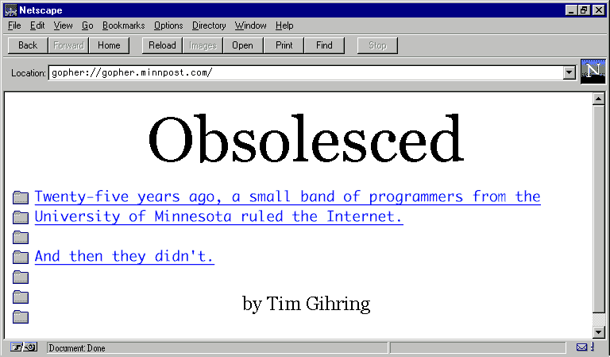
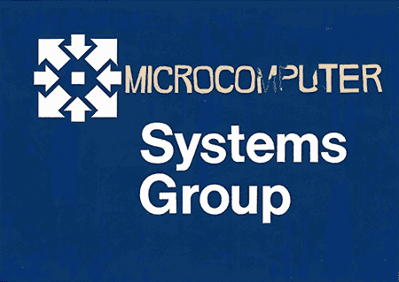
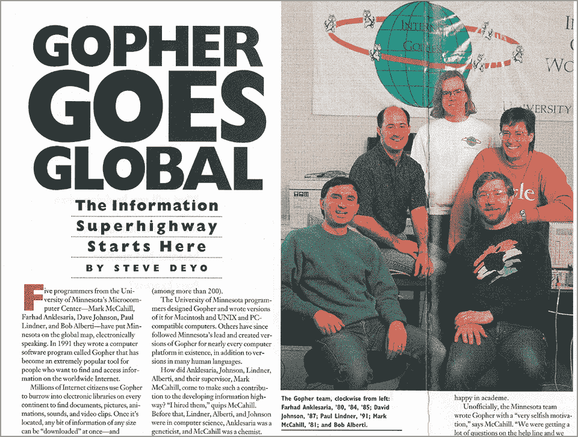
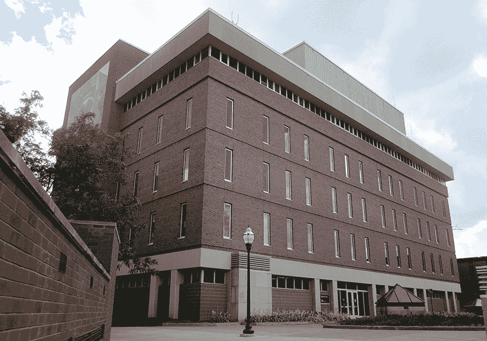
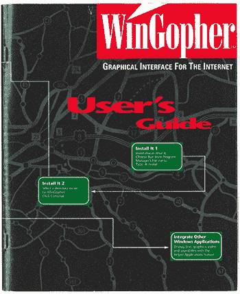
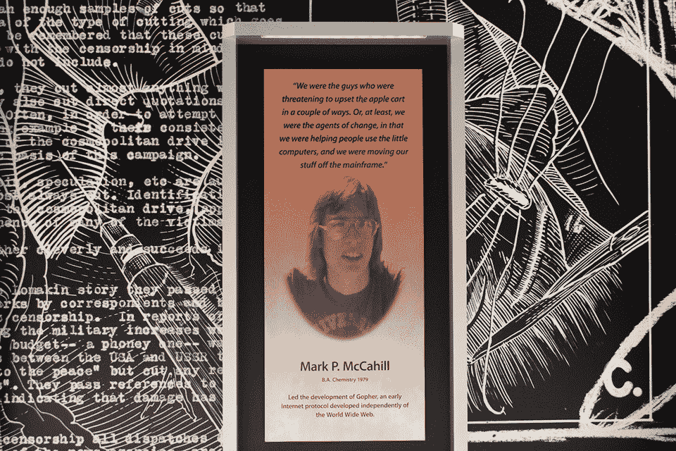
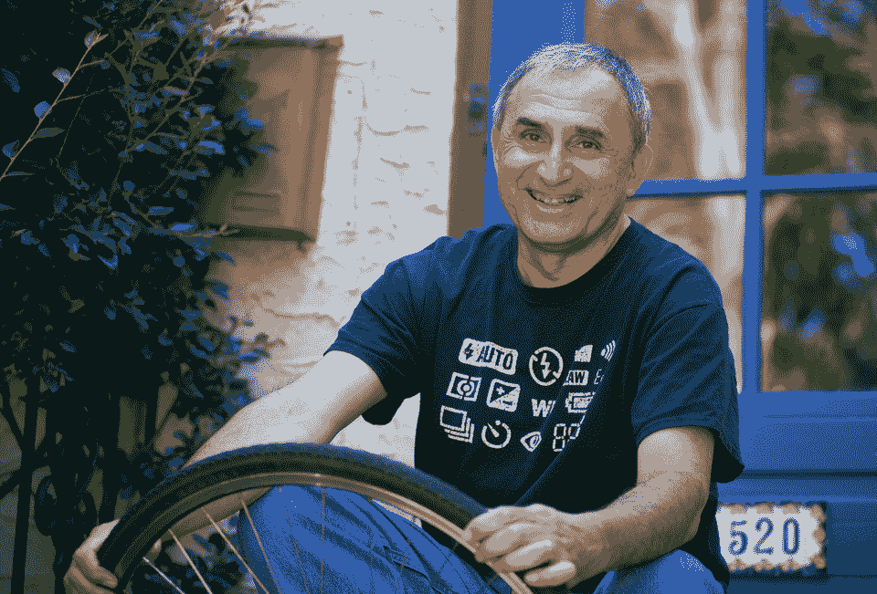
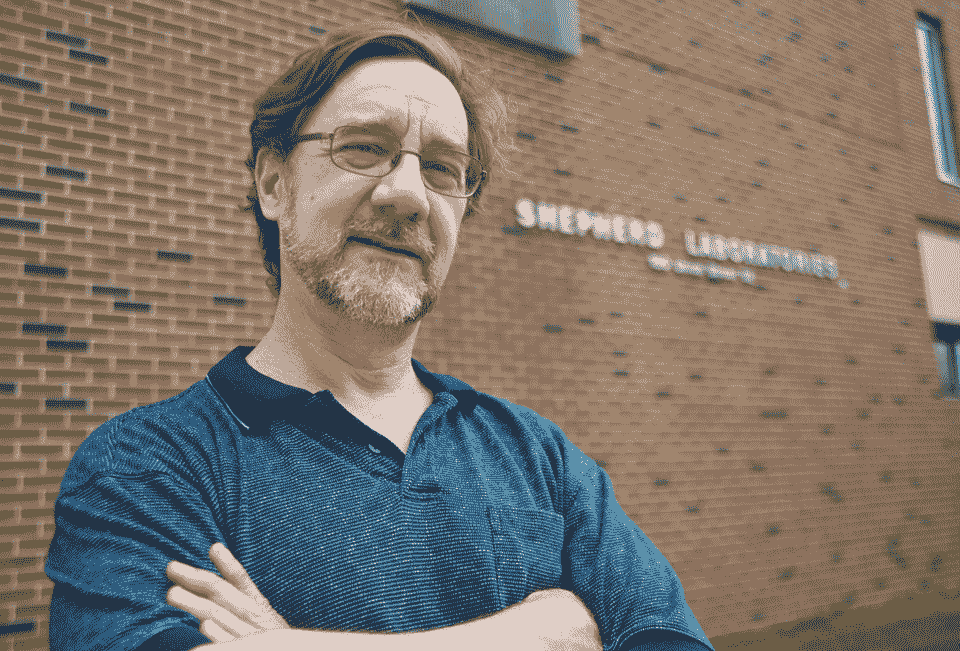

# 地鼠协议的兴衰

> 原文：<https://www.minnpost.com/business/2016/08/rise-and-fall-gopher-protocol?utm_source=wanqu.co&utm_campaign=Wanqu+Daily&utm_medium=website>

<noscript></noscript>

那是 1992 年 3 月中旬，马克·麦卡希尔以前从未去过圣地亚哥。在我的家乡明尼阿波利斯，大雪已经下了六个月，而且还会持续几个星期。麦卡希尔入住了凯悦岛酒店(Hyatt Islandia)，这是一家俯瞰米逊湾的 18 层高层酒店。“那里有棕榈树，”他回忆道。“好家伙，真好。”

麦卡希尔当时 35 岁左右，管理着明尼苏达大学双城分校的微型计算机中心，该中心促进了校园里个人电脑的兴起。他和该中心的程序员法尔哈德·安克勒萨里亚应邀在第 23 届互联网工程任务组(IETF)上发表演讲，这是一个由来自世界各地的学者和政府官员组成的精英集会，他们实际上决定了互联网应该如何工作。

<noscript></noscript>

明尼苏达大学查尔斯·巴贝奇研究所马克·麦卡希尔论文

“互联网之神，”麦卡希尔说，尽管在其他圈子里他们可能不会被注意到。另一位互联网先驱蒂姆·伯纳斯·李在他的回忆录中，将这些聚会描述为“穿着 t 恤和牛仔裤，有时不穿鞋的人”。他们会在不同的小房间里见面，兴奋地交谈。”

和现在一样，当时的互联网是存储在世界各地随机电脑中的大量信息，只是没有容易或一致的访问。甚至很难发现那里有什么——没有好的搜索引擎。最流行的协议，或从另一台计算机检索信息的方法是 FTP(文件传输协议)，这是一种原始的、劳动密集型的程序，相当于敲开某人的门，问你是否可以拿走他的钢琴。

IETF 自 1986 年以来一直在召开会议，以解决这些问题，这些问题阻止了互联网成为其创始人所预见的“星系间网络”，而是仍然是物理学家和军方的有限领域。但是这次会面感觉不一样。第一次，互联网似乎就要上市了。

3 月 18 日，在酒店的一个会议室里，伯纳斯-李展示了一个可能的突破:万维网。那是晚上。530 名与会者中的许多人已经去了酒吧或去吃饭。对于留下来的好奇者，伯纳斯-李解释说，网络可以用来通过超链接连接互联网上的所有信息。您可以点击文档中的一个单词或短语并立即检索相关文档，再次点击*文档中的一个短语，以此类推。它就像一张铺在互联网上的网，所以你可以用几乎看不见的线从一个信息源到另一个信息源。*

在同一会议上，还讨论了另外两个有可能扩大互联网接入的项目——WAIS 和 Prospero。在看过演示的人的报告中，网络并没有给人留下最好的印象，甚至也没有特别有前途。

第二天，鉴于下午，麦卡希尔和 Anklesaria 提出了互联网地鼠。这很容易解释:用最少的计算机知识，你可以下载一个界面——Gopher——并开始搜索互联网，从世界任何地方检索与之相关的信息。它就像网络一样，但是更简单，而且已经开始工作了。

事实上，大多数与会者几乎不需要了解 Gopher——这个软件已经推出几个月了。他们好奇的是开发者，是创造了第一个流行的互联网接入方式的明尼苏达人。“我们从未谋面的人告诉我们他们是如何使用我们的东西和添加东西的，”麦卡希尔说。“我们不知道 Gopher 会有多大，直到我们亲身经历了这一点，并意识到增长可能会呈指数增长一段时间。”

在接下来的几年里，未来似乎显而易见。Gopher 用户的数量比万维网增长了几个数量级。Gopher 开发者在全国各地举行集会，称为 GopherCons，并发布了一件 Gopher T 恤 MTV veejay Adam Curry 在宣布该网络的 Gopher 网站时穿着。白宫在“早安美国”上公布了它的地鼠网站。一位观察家指出，在统治互联网的竞赛中，“地鼠似乎已经赢了。”

麦卡希尔的父亲是石油公司康菲(Conoco)的一名高管，康菲大约每两年就把他调到全国各地。当一家人最终在双城定居时，麦卡希尔还在上初中。1979 年，他毕业于美国大学，获得化学学士学位，花了一年时间研究河流中的污水，并意识到他喜欢计算机分析(“重数粉碎”)胜过化学本身(“有点脏”)。所以他在美国微型计算机中心找了份工作，为苹果的第一批个人电脑编程。

这两个城市当时是一个典型的硅谷，在 UNIVAC、控制数据公司和工程研究协会生产一些世界上最强大的计算机方面有着悠久的历史，这些公司支持霍尼韦尔、IBM 和其他当地技术公司的工作。明尼苏达州教育计算联盟，或称 MECC，成立于 1973 年，旨在让学校拥有电脑，并为其开发软件——最著名的是俄勒冈之路。到 20 世纪 80 年代初，当邻近各州只有一小部分学校拥有电脑时，明尼苏达州的每所公立学校大约有三到四台电脑。

当麦卡希尔开始在微型计算机中心工作时，一场地盘之争正在升温——麦卡希尔称之为“宗教战争”——在监管美国古老的大型机、曾经占据整个房间的巨大机器的“计算高级牧师”和日益增长的个人计算机转换骨干之间。麦卡希尔说:“微型计算机的人远离主流，但仍然是美国计算机中心的一部分。”。Anklesaria 在被计算机科学吸引之前已经获得了遗传学博士学位，他说当他在 1987 年末加入时，微机中心是“一个分裂出来的团体”。"大型机仍然是唯一的东西 Mac 被认为是一个玩具."

麦卡希尔支持个人电脑。他说:“让计算大众化，把电脑放在普通人手中的想法引起了我的共鸣，这是早期个人电脑的一部分。”“如果你对个人电脑感兴趣，你就会潜移默化地接受这种态度。它存在于空气和水中。”

麦卡希尔当时留着长发，现在扎成了马尾辫，他在空闲时间在卡尔霍恩湖上冲浪，他说 PC 革命“看起来像是一个很好的浪潮……它将使我能够做我从那时起就一直试图做的事情:采用尖端技术，并让它为妈妈、爸爸和英语专业学生所接受。”

20 世纪 80 年代末，麦卡希尔和安克勒萨里亚开发了第一个流行的互联网电子邮件系统，名为 POPMail。“这部分是出于自私的原因，”麦卡希尔说。“我想让更多的人使用电子邮件，这样我就不必穿过大厅去我的邮箱，用小纸条收集我的电话留言。”相反，秘书可以发送电子邮件。就此而言，打电话的人也可以。

与此同时，U 决心把它的计算机在互联网上联网，组成一个所谓的校园信息系统，即 CWIS，这种分裂延缓了发展。到 1991 年初，一个由 20 多名部门主管和计算机专家组成的委员会开了几个月的会，列出了一长串要求——包括使用大型计算机——但没有代码。“他们有一些复杂的东西来做我不想做的搜索，”麦卡希尔说。"法尔哈德根本不想写它。"

“但我必须展示一些东西，”安克勒萨里亚说。因此，他将程序分解成最简单的部分——使一个地方的信息在其他地方可用的基本协议。他在一台 Mac 上把它拼凑起来，编写了一个服务器(一个使计算机能够“提供”所请求的文件的程序)和一个客户端(我们大多数计算机是如何被编程的，能够搜索和请求那些文件)。“我说，‘这东西挺管用的。’既然我们没有别的东西，我们就去试试。"

<noscript></noscript>

明尼苏达大学查尔斯·巴贝奇研究所马克·麦卡希尔论文

1994 年明尼苏达大学校友杂志上刊登了 Gopher 协议架构师的文章。

麦卡希尔推动了一个全文搜索引擎——我们现在认为是理所当然的东西——并借鉴了史蒂夫·乔布斯最近发明的名为 NeXT 的计算机系统的要点。“我们结合了法尔哈德的超级简单的协议，说给我一个项目清单，一份菜单，”麦卡希尔说，“还有我的搜索方式，我们把这两者粘在了一起。”

这是纯文本——没有图片，因为调制解调器速度太慢了。它的组织方式就像大多数生活在 20 世纪 90 年代早期的人所熟悉的一个信息源:一个图书馆，相似的主题被集中在一起。你只要用你的 gopher，就像行话所说的那样，指向任何你想探索的 Gopher 站点，你就在那里，在互联网上打洞。这是如此简单，几乎任何人都可以做到，甚至是英语专业的学生。

“那是少有的一次，我们俩看着对方说，‘天哪，我们有一个非常好的主意，’”麦卡希尔回忆道。Anklesaria 称之为互联网地鼠，一种三重文字游戏:美国的吉祥物，一种挖掘的动物，和一种获取的动物。“我们认为，如果我们称它为地鼠，委员会就不会抱怨，”麦卡希尔说。“是学校吉祥物！”

蒂姆·伯纳斯·李爵士——他于 2004 年被授予爵士头衔——1955 年出生于伦敦，比麦卡希尔早一年。他的父母都是数学家。当麦卡希尔的父亲被从科罗拉多州运往俄克拉荷马州再运往明尼苏达州时，蒂姆爵士的父母正在开发世界上第一台商用电脑。

伯纳斯-李是伴随着互联网，或者至少是互联网的概念长大的。小时候，他用纸板盒制作模拟电脑。有一天，他从高中回家，发现父亲正在写一篇演讲稿，讲的是计算机可能有一天会做出直观的联系，像大脑使用随机联想来联系思想一样联系信息。

<noscript></noscript>

知识共享/约翰和詹姆斯·奈特基金会

蒂姆·伯纳斯·李在 2008 年的照片中。

当互联网以阿帕网(ARPAnet)的形式出现时，他还是一名青少年，阿帕网连接着斯坦福大学和其他大学的几台计算机。它被设计成一种防御手段，一种万一苏联摧毁美国电话系统的安全通信手段，尽管它的实际目的是允许科学家使用另一个设施的计算能力进行大规模计算。

伯纳斯·李获得了牛津大学的物理学学位——在那里，他用一台旧电视的部件、一个计算器、一个电子工具包和一个汽车电池制造了他的第一台计算机——然后在瑞士日内瓦著名的粒子物理实验室 CERN 工作之前，作为一名软件工程师工作了几年。到那时，1984 年，互联网已经走向全球；CERN 是欧洲最大的互联网节点。

然而，即使在欧洲粒子物理研究所的实验室里，使用互联网也是有问题的。伯纳斯-李后来回忆说，当你想要信息时，“通常在人们喝咖啡时去问他们会更容易。”他认为他可以做得更好。他从未忘记父亲对大脑的研究，当他编织网络时，正是基于这种从一个模糊相关的想法到下一个想法的整体、偶然、奇怪的有益体验。

他在 1989 年完成了一个网络模型，但多年来毫无进展。这个概念太抽象了，只适用于 NeXT 电脑。但是在 1991 年初，就在 McCahill 和 Anklesaria 在明尼苏达州构思互联网 Gopher 的时候，CERN 之外的第一批网络服务器被打开了。

在概述了 Gopher 协议之后，McCahill 和 Anklesaria 召集了四名在微机中心工作的程序员来编写软件。麦卡希尔急着要。不是因为他在和伯纳斯-李比赛，而是因为他想结束这一切。他想在一个月后的下一次 CWIS 委员会会议前拿到。

程序员都是年轻人，大多 20 多岁，像麦卡希尔一样，大多是涅槃乐队的超级粉丝。保罗·林德纳，一个来自明尼苏达州北部的编码神童，因为他的布道被称为地鼠兄弟，留着长长的金属头头发，并在地鼠邮件上签名，歌词是“你必须吐痰才能看到阳光”，来自玩具王国的宝贝们。早期的 Gopher 服务器被命名为 Mudhoney、Danzig 和炭疽。微型计算机圈子里唯一的异类是鲍勃·阿尔贝提，他是一名程序员，将一台服务器命名为 Indigo，就像 Indigo Girls 中的一样。

<noscript></noscript>

科里·安德森拍摄的照片

明尼苏达大学校园里的牧羊人实验室。

该中心位于 Shepherd Labs，这是一座巨大的水泥建筑，1968 年建于美国明尼阿波利斯大学校园内，有混凝土地板，没有窗户。早期，它被用于美国宇航局的材料研究。“有一些管道流过奇怪的液体，”林德纳回忆道。

微机团队除了为美国开发软件外，还为有兴趣购买 Mac 的学生和教职员工开设了一个陈列室，教授计算机培训课程，测试软件，并为有个人电脑问题的人提供帮助中心——上门服务和电话咨询。“每个人每周至少有一天会接电话，”林德纳说，“即使你在编程。这样你就接近了你给人们带来的痛苦——如果今天的程序员还接电话，我们就会有更人性化的软件。”

然而，Gopher 占用了他们越来越多的时间。“它变得具有传染性，”林德纳说。“我们如何才能把它变成我们梦想中的科幻小说，获取世界上所有的信息，成为万物之库？”

这个团队在 36 个小时的会议中，以啤酒、披萨和速度金属为燃料，在大约三周内完成了 Gopher 的写作。他们安装了第一台运行 Gopher 服务器的电脑——Mac SE/30，这是一台内置 iPad 大小显示器的小型 droid 电脑，安装在办公室和展厅之间的狭窄走廊上，在一个有金属架子的壁橱里。它被称为地鼠妈妈。

团队首次提出地鼠协议的委员会会议是一场灾难，“简直是我见过的最糟糕的会议，”阿尔贝提说。“我仍然记得一个穿着高跟鞋的女人跳上跳下地喊着，‘你不能这么做！’"

该团队的缺点包括:Gopher 没有使用大型计算机，它的服务器-客户端设置使任何人都可以使用 PC，而不是中央权威。虽然它做了联合国要求的一切，甚至更多，但对委员会来说，它就像是一根中指。“你不应该写这个！”阿尔贝提谈到了该组织的反应。"这是闹着玩的，以后再也不要这样了！"Gopher 团队被禁止进一步研究该协议。

会后，麦卡希尔向计算机中心主任施保延(Shih Pau Yen)求助，他是一位美籍华人，一直支持地鼠。“我说过我会在停止我们创造的最酷的东西之前辞职，”麦卡希尔说。Yen 运行干扰，而 Gopher 团队在他们自己的时间里继续工作。

林德纳说:“在这个由小块领地组成的官僚机构中，每个人都很难一起工作，唯一能让我们团结起来的就是责备其他人。”。"这是我们的战斗口号。"

最后，在 1991 年 4 月，由于仍然无法说服美国政府接纳地鼠，林德纳将它放归野外。他通过 FTP 提供了 Gopher 软件，这是当时互联网上最流行的分享信息的方式，并在互联网邮件列表上写了一个简短、安静的声明:嘿，我们有这个东西，来拿吧。

几个月内，该团队就收到了来自全国各地的 Gopher 用户的来信。“这是第一个病毒软件，”阿尔贝提说。“所有这些人开始给 U 打电话，缠着总统和其他管理人员，说，‘这个 Gopher 很棒，你什么时候发布新版本？’管理员说，‘你在说什么？’"

禁令被解除了。这个团队的核心成员从未超过六人，他们分散到各个会议上传播地鼠福音，同时继续改进协议并使之多样化。在这个过程中，他们最终为我们如何浏览互联网奠定了基础。第一个超链接。第一批书签。想到风帆冲浪，麦卡希尔甚至创造了“网上冲浪”这个词。

<iframe src="https://www.youtube.com/embed/67nuO5UGsIw?rel=0" frameborder="0" allowfullscreen="">视频</iframe>

veejay Adam Curry 在 MTV 上穿着“互联网地鼠世界巡回赛”t 恤的视频。

不到一年，就有数百个 Gopher 服务器。伯纳斯-李在 Gopher 首次亮相几个月后公开介绍了万维网，他用 Gopher 做到了这一点。“人们今天看着万维网，认为它是从蒂姆·伯纳斯·李的额头冒出来的，”阿尔贝提说。“但事实是，他能够在网络上传播消息的唯一方式是因为互联网地鼠允许人们下载他的文件，找到一个讨论组，并谈论它。”

“我们在正确的时间拥有了正确的产品，”麦卡希尔说。“人们希望将互联网扩展到物理学家之外。Gopher 可以做到。它使用起来很简单，可以联网很多很多的电脑。它给了人们一个理由说，嘿，这个互联网真好。"

林德纳被邀请兼职——他两次去厄瓜多尔为该国刚刚起步的互联网建立 Gopher。“那时我知道我们真的在做一些事情，”他说，“当我帮助整个国家联网的时候。”

时任美国参议员的阿尔·戈尔前来拜访。1992 年至 1995 年举行的四次 GopherCons 吸引了来自纽约时报、世界银行、微软和其他全球重量级公司的代表。Gopher T 恤是黑色的，上面潦草地写着地名，背面有 Gopher 服务器，就像摇滚巡演 t 恤一样。这是一个恰当的比喻，正如 Gopher 团队成员丹尼尔·托里在 1996 年告诉先锋出版社的那样:“我们以为我们是摇滚明星。”

一些队员梦想着名利双收。但是互联网还没有对商业开放。它是建立在点-密和点-edu 基础上的，靠的是公共资金。程序员分享源代码；如果你需要什么，有人会给你。一个. com 地址被认为是粗鲁的。“好像所有的电视都是 PBS，”林德纳说。“没有商业广告。”

尽管如此，阿尔贝提还是用《时报言》提高了地鼠的利润潜力。在来微机中心工作之前，阿尔贝提曾帮助创建了第一个在线多人角色扮演游戏——名为哥特权杖，是魔兽世界之类的祖先。“我说我们应该把它私有化，我们应该把它做成生意，从中赚些钱，”阿尔贝提回忆道。"他看着我，好像我又长了一个脑袋。"

<noscript></noscript>

明尼苏达大学查尔斯·巴贝奇研究所马克·麦卡希尔论文

不过，最终，美国确实想要一些钱——为自己。在 GopherCon’93 上，Yen 宣布盈利的 Gopher 用户需要向 U a 支付许可费:数百或数千美元，取决于他们业务的规模和性质。许多用户感到被背叛了。本着当时开源计算的精神，他们为 Gopher 贡献了代码，帮助团队跟上时代的步伐。现在他们被要求付钱。

这一反应使该队士气低落。尽管他们被期望在 Gopher 上努力工作，但他们从未被免除其他职责，包括接听美国的帮助热线。“我们从来没有得到额外的资金，我们要破产了，”阿尔贝提说。“我们让整个互联网对我们大喊，你们什么时候更新你们的软件，什么时候把图像放到 Gopher 页面上，让它变得更流畅、更好？我们说:‘我们是六个人！’"

有一段时间，U 威胁要完全摆脱他们，试图外包大学的计算机工作，激怒了一名程序员在美国行政中心 Morrill Hall 的一台计算机上安装窃听器，以便团队可以监听讨论。

要求捐款似乎是合理的。当它适得其反时，该团队在 1993 年 3 月向 Gopher 用户发布了一封辩护信:“…有很多歇斯底里、错误信息和谣言在流传。…在我们削减预算的时候，除非明尼苏达大学有一些好的结果，否则不可能证明继续(增加)分配给 Gopher 开发的资源是合理的。这是生活的现实。…在您离开并再次燃烧之前，问问自己是否希望以尽可能少的麻烦和费用让您的特定服务器运行起来...或者你只是想搅汤。”

“这在社会上杀死了地鼠，”阿尔贝提谈到许可的惨败。

然而，这并不是结束。1993 年，Gopher 仍然比万维网更受欢迎，Gopher 流量增长了 997%。但是网络开始迎头赶上——那一年，它增长了 341，634%。

在 1992 年的圣地亚哥互联网大会上，Berners-Lee 在会议的最后一天把 McCahill 和 Anklesaria 拉到一边，问他们是否愿意合作开发 Web/Gopher 的混合体。他们不同设计的一些融合——一个互联网超级系统——尽管还不清楚这可能如何工作。

“蒂姆是一个很好的人，但他有点古怪，有点分散，”麦卡希尔说。“和他说话就像一团麻线的经历。你现在看到的网络，就是他这么想的。”

麦卡希尔告诉伯纳斯-李，他需要更密切地关注网络。但是当麦卡希尔回到明尼苏达州检查它的时候，它看起来并不怎么样。当时还没有图像。它仍然只能在 NeXT 电脑上运行。“我没有感觉到，”麦卡希尔说。我告诉他，‘蒂姆，我不这么认为。’当然，我回过头来说，“我可能错了。”"

很快，网络上就有了图片，并且可以在更多的平台上使用。1993 年，第一个受欢迎的网络浏览器 Mosaic 上市销售，打破了互联网的商业禁忌，并表明——至少对麦卡希尔来说——科技投资者站在了一边。“修复已经开始了，”他说。

1994 年，调制解调器的速度翻了一番，网络上无休止的图像渲染——一度被称为全球等待——大大加快了速度。个人电脑开始销售内置这些更快的调制解调器。对于任何想为网络的兴起寻找一个简单甚至粗糙的解释的人来说，这个解释就是:在你自己的家中观看一个裸体女人的合理复制品的能力。“这就是推动互联网发展的原因，”阿尔贝提说。“色情。”

互联网上的地鼠，只有文本菜单，没有光泽，机构的姿态，跟不上。他从浪头上掉了下来，几乎一夜之间就变成了一个锯齿状的正方形，被海滩上的女孩们忽视了，他的冲浪板被胶带粘在一起。正如一位观察家在 1994 年所说，“过时了”。过气的人。

“我记得那一刻，我知道我不再在正确的轨道上，”林德纳说。“那是 1993 年 9 月 9 日。我被邀请去普林斯顿做一个关于地鼠的演讲，我把我的幻灯片都打印在我的小小的大学预算的黑白箔纸上。在我之前发言的人正在谈论网络的未来，全彩色液晶投影。我说，‘我想我知道事情的发展方向了。’"

<noscript></noscript>

鲍勃·阿尔贝提的好意

马克·麦卡希尔登上明尼苏达大学的“发现之墙”，该墙庆祝学生和教师的成就。

对麦卡希尔来说，实现发生在街上。“我在一辆公交车上看到了一个网址，”他说。“那时我知道网络就是广告。地鼠不适合做广告。我知道它会开始减少。”

1994 年春天，网络流量第一次超过了地鼠流量。几个月后，Gopher 开始走下坡路。它的统治持续了三年。

致命一击来自于美国本身。1995 年，该大学著名的移植外科医生约翰·纳贾里安博士被指控逃税、贪污和欺诈。尽管纳贾里安后来被洗清了所有罪名，但美国国立卫生研究院(NIH)仍将该校置于缓刑状态，威胁到数千万美元的拨款和该校作为顶级研究机构的生存能力。“这是一个所有人都在甲板上的情况，”麦卡希尔说。

问题本质上很简单:糟糕的会计。文书工作实际上是写在纸上的，交易记录被搁置了几个星期才被记入分类账，如果它们被记入的话。Gopher 编程团队被转移到为美国创建一个更负责任的会计系统，这被证明是第一个基于网络的交易程序。“这就是我的超级开发店一年半以来所做的，”麦卡希尔说，“向国家卫生研究院表明我们正在清理东西。”当他们完成时，互联网地鼠已经死了。

一开始，当母 Gopher 是新的并且没有其他 Gopher 服务器可以链接时，Gopherspace 是空的。为了证明他们的发明的实用性，Gopher 团队翻了一本食谱并寻找茄子。直到 1993 年，Gopherspace 上最流行的信息还包括食谱、天气、电话簿和化学反应的电影。

“Gopher 代表了一个更简单、更天真的时代，”它的一位现代粉丝说。其他人称之为“一种更纯粹的互联网导航方式”，即“从混乱中构建结构”

今天，大约有 140 个 Gopher 服务器仍然存在，其中许多相对较新。技术世界不是一个多愁善感的地方，但它也同样欣赏简单和讽刺——许多这样的服务器都是在愚人节那天建立的。

<noscript></noscript>

比尔·凯利的照片

法尔哈德·安克勒萨里亚:“你必须在正确的时间和地点让你的技术起飞并变得受欢迎。”

卡梅伦·凯瑟(Cameron Kaiser)可能是互联网 Gopher 目前最大的倡导者(他经营着一个名为 Overbite Project 的 Gopher 支持网站)，他估计自己大约有 25%的互联网时间花在 Gopherspace 上。“拥有一个小型生态系统实际上相当不错，因为没有人在 Gopherspace 上运行烦人的广告或试图跟踪你的浏览习惯，”他说。"该协议使得前者难以实现，后者几乎不可能."

<noscript></noscript>

保罗·林德纳提供

保罗林德纳

随着网络成为互联网的代名词，我们越来越多地在网上生活，我们已经学会忍受混乱中滋生的错误信息、诱惑和骗局——尽管它已经以我们刚刚开始理解的方式改变了我们和社会。如果 Gopher 赢了，谁知道事情会有什么不同。

可以理解，Gopher 团队可能会感到失望，但他们似乎对事情的结果真的很满意。实际上，比好还要好，就像他们预料的那样。毕竟，他们是第一个。在技术的发展过程中，最先进的最终会落后。“这是事物的自然规律，”Anklesaria 说。“你已经有了一些构建模块——自然的事情就是在它们的基础上进行构建。文明就是这样起步的，我们也是这样进步的。”

如果有什么让他们感到惊讶的话，那就是网络是超越他们的系统，并且比其他任何东西都要长久。他们说，在奥地利开发了一个比 Web 或 Gopher 更好的协议，叫做 Hyper-G，但这个协议从未成功过。“你必须在正确的时间和地点让你的技术起飞并变得流行，”Anklesaria 说。“如果你在一个浪潮的底部，你就有机会与它一起上升。但如果你已经站在浪尖上，而浪头已经破碎，那就不好了——如果你来得太早，你就不会持久。”

<noscript></noscript>

比尔·凯利的照片

鲍勃·阿尔贝提:“蒂姆·伯纳斯·李能够在网络上传播消息的唯一方式是因为互联网地鼠允许人们下载他的文件，找到一个讨论组，并谈论它。”

1997 年 7 月 1 日，或者可能是 2009 年，最有可能是 2000 年，有人走进牧羊人实验室的壁橱，拔掉了母地鼠的插头。没有人能就日期达成一致。地鼠队的人都不在。

“当我在大学的时候，”麦卡希尔说，“我们一直在运行服务器，这是一种骄傲。”但麦卡希尔在 2007 年离开，成为杜克大学的系统架构师，开发教学和研究计算技术。林德纳在 1996 年离开，跟随一个 Gopher side gig 到瑞士日内瓦，在那里他为联合国工作，现在是谷歌的软件工程师。Anklesaria 去年春天退休了。在核心的 Gopher 团队成员中，阿尔贝提是唯一一个仍然留在美国的信息安全架构师。

在高峰期，地鼠妈妈由 10 台苹果 IIci 电脑组成。但是当它最终被安乐死时，谁知道它是什么形状。没有仪式。没有东西被运到博物馆。Gopherspace 变得更加空虚，没有网络的世界变得更加难以想象。