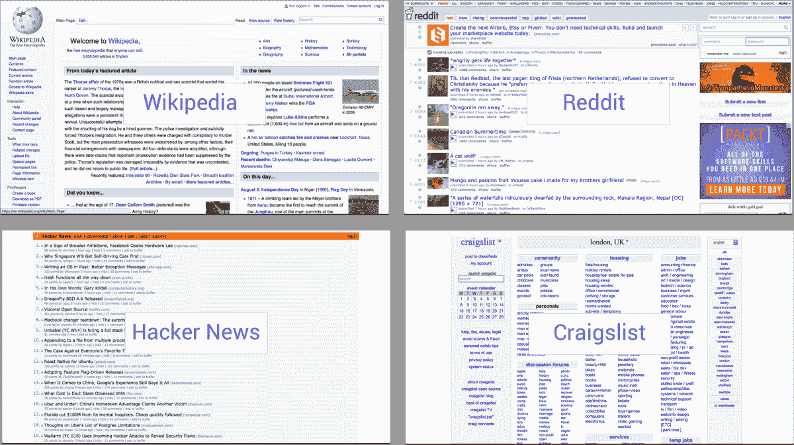
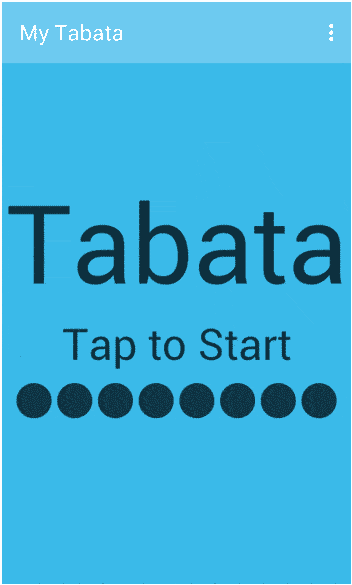
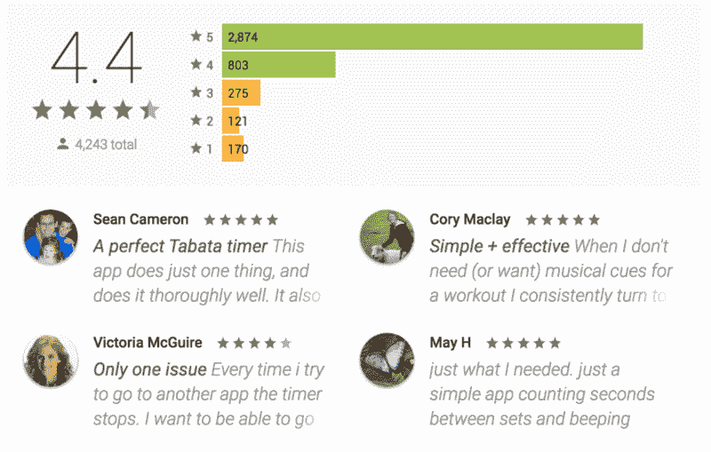
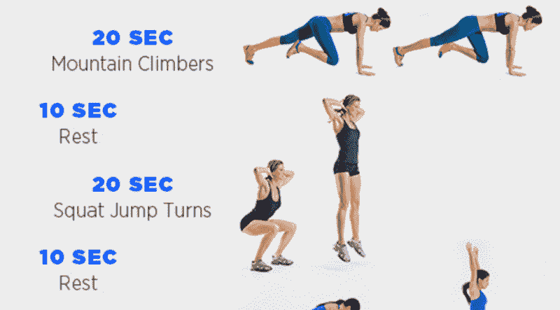
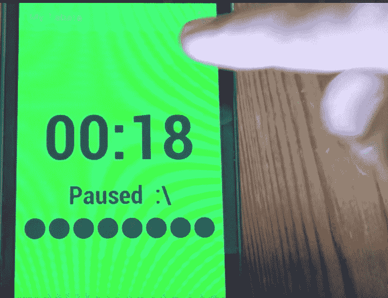
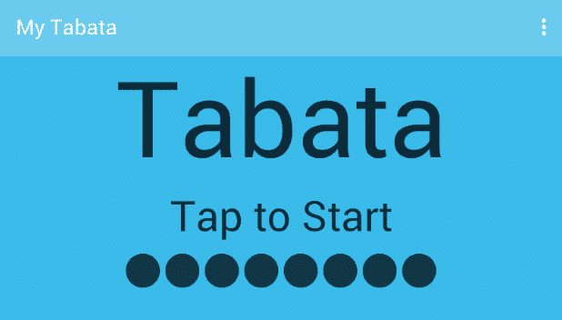
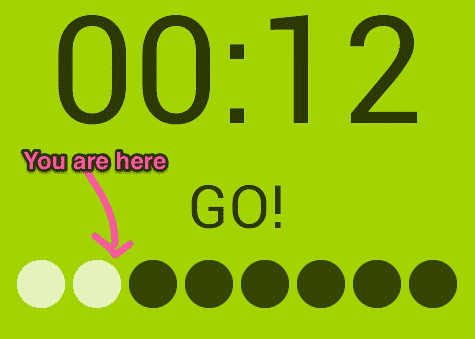
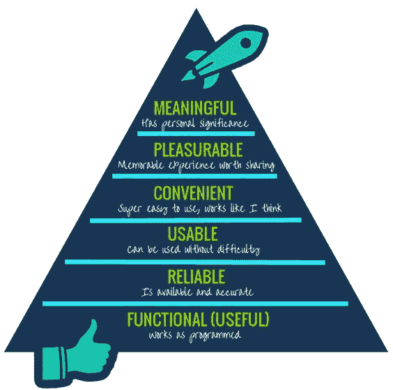
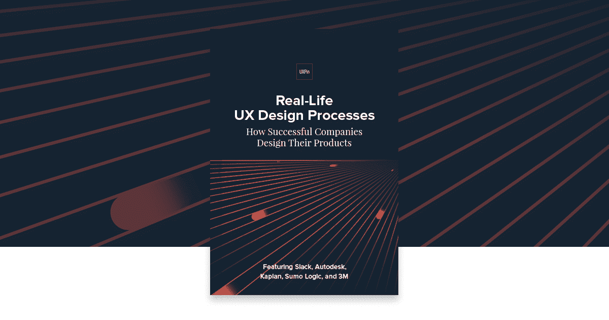

# 它很丑，但很有效:论可用性设计

> 原文：<https://www.uxpin.com/studio/blog/ugly-works-designing-usability/?utm_source=wanqu.co&utm_campaign=Wanqu+Daily&utm_medium=website>

即使在 2016 年的今天，你也会发现许多流行而丑陋的网站——它们自 90 年代以来几乎没有改变:

维基百科、Reddit、黑客新闻、Craigslist

尽管这些网站很丑，但它们都非常受欢迎，因为一个关键因素——它们做的正是人们需要的。比如:

*   Reddit 拥有 2.34 亿独立用户，81.9 亿月浏览量，2500 万日投票(截至 2016 年的统计数据)——而且加载速度仍然非常快！

*   维基百科很好地组织了信息，让用户能够轻松、一致地找到他们需要的东西。

当一个应用程序“正常工作”时，它看起来如何并不重要，重要的是它如何帮助解决问题。我最近遇到的一个很好的例子是在一个不太知名的应用程序中，名为“ [我的塔巴塔](https://play.google.com/store/apps/details?id=com.ellery.mytabata&hl=en) ”。

让我们把这款应用作为一个案例来研究，可用性为什么比视觉设计更重要。

## 我的塔巴塔:有用的 UX，界面很丑

在不知道这个应用程序是做什么的情况下(假设之前没有塔巴塔的知识)，它的视觉设计看起来很糟糕。然而，当在它被设计的环境中使用时，它会给人留下深刻的印象，因为它很好地解决了一个问题。这体现在 [4.4/5 平均评论](https://medium.com/r/?url=https%3A%2F%2Fplay.google.com%2Fstore%2Fapps%2Fdetails%3Fid%3Dcom.ellery.mytabata%26hl%3Den_GB) 来自 4200+用户:

我的塔巴塔概述

## 那么，它在解决什么问题呢？

塔巴塔包括做高强度的简单运动，每次 20 秒，每次间歇只有 10 秒钟的休息时间:

塔巴塔培训示例来自[女性健康杂志](http://www.womenshealthmag.com)

对于用户来说，使用手表或计时器来记录间隔和休息时间并不容易，尽管用户界面很丑，但“我的塔巴塔”非常直观地解决了这个问题。因此，它实际上通过一组良好的可用性原则增强了锻炼体验，这些原则如下所述。

## 我的塔巴塔给我上了 4 堂可用性课

### 1。使用在上下文中有意义的交互

当跳到空中做“超级深蹲”时，用户可能需要暂停塔巴塔时段去喝点东西。这款应用程序没有“停止”和“开始”按钮，只需点击屏幕上的任意位置，操作起来更加简单——点击开始，点击停止:

点击暂停

这有助于用户专注于锻炼，而不是在手机上摸索。

### 2。使用刚刚好的导航

启动应用程序时，用户面对的是“点击开始”屏幕——实际上是零导航。

点击屏幕，直接进入健身环节——体验变成了塔巴塔——不是用户界面，也不是手机。这种最小化导航的结果是，用户可以在第一次接触应用程序时就实现他们的目标。

> *“你的工作是帮助用户实现他们的目标。导航界面从来都不是用户的目标。如果你的工作做得好，这个应用程序只会做一件事，而且会做得很好，而且会在一个屏幕上完成。”~* [*安托万【瓦罗】*](https://medium.com/radical-ux/nine-nasty-ux-truths-83b30ea94355#.chjtlxkc3)

虽然用户可以点击屏幕右上方的烤肉串菜单来访问设置，但这一操作不会中断塔巴塔体验——设置会在每次会话之前或之后更改，应用程序会为下次会话保存这些偏好。

### 3。仅在必要时使用音频

当在一个间歇的最后几秒钟，用户会在紧张的锻炼中闭眼。

我的塔巴塔使用音频提示来倒数每个间隔的最后三秒，这样用户就不必将注意力从锻炼转移到手机上。

### 4。使用户能够跟踪他们的进度

随着应用程序经历不同的活动，用户很容易忘记他们在整个练习中的位置。虽然不是最好的可视化实现，但是用户可以通过最小化 UI 底部的一个有用的状态栏来快速评估进度:

结合计时器，这种战术进一步提高了练习的体验。

你会注意到《我的塔巴塔》中的许多经验与雅各布·尼尔森的 [10 种用户界面设计可用性启发](http://www.designprinciplesftw.com/collections/10-usability-heuristics-for-user-interface-design) 交叉，这是一套很好的广泛指导方针，有助于确保应用程序可用，并看起来很棒。

*了解更多: [UX 设计流程最佳实践](https://www.uxpin.com/studio/ebooks/ux-design-process-documentation-best-practices/)T3】*

## 接下来的步骤

不要陷入为了视觉技巧而牺牲背景的陷阱。

最后，永远记住 UX 的需求层次:

图片来源: [成长工程](https://www.pinterest.com/pin/258957047300069656/)

是的，令人愉快的设计当然可以让好的产品变得伟大，但这只有在产品实际上是有用的、可用的、可靠的时候才是最重要的。否则，你只是建立在一个不稳固的基础上。

*要想了解成功的公司如何设计他们的产品，请查看免费电子书**。该指南窥视 Slack、Autodesk、3M 和 Sumo Logic 的设计流程。T13】*

[T2】](https://www.uxpin.com/studio/ebooks/real-life-ux-process/)