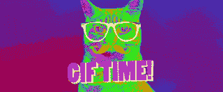

# GIF 漫长而非凡的历史

> 原文：<http://www.popularmechanics.com/technology/a21457/the-gif-is-dead-long-live-the-gif/?utm_source=wanqu.co&utm_campaign=Wanqu+Daily&utm_medium=website>

***编者按:**这篇故事最初发表于 2018 年 3 月。我们重新发布这篇文章是因为这个 GIF 的主要创作者之一，斯蒂芬·怀特，在与新冠肺炎签约后于本月早些时候在去世。20 世纪 80 年代，Wilhite 在为在线服务提供商 CompuServe 工作时，致力于 GIF，即图形交换格式的缩写。*

* * *

1999 年 11 月 5 日是烧掉所有 gif 的日子。如果你在那个星期五访问了 [<u data-redactor-tag="u" data-verified="redactor">的主页</u>](http://burnallgifs.org/archives/) ，你会看到这个运动的游戏计划就像它的名字一样简单明了:“在燃烧所有 GIF 日，所有 GIF 用户将聚集在优利系统，燃烧他们所有的 GIF 文件。”此外，还有一系列尖锐的反 GIF 图像——都是令人自豪的 PNG 文件。

尽管这是一个明显的笑话:放火焚烧文件，眨眼请求“在离开附近之前熄灭所有的 GIF”，愤怒是真实的，任务是认真的:一劳永逸地将网络从 GIF 的祸害中解放出来。

GIF 已经有十多年的历史了，它的历史可以追溯到 1987 年 6 月 15 日，比 T2 的万维网早了五年。它只支持微不足道的 256 种颜色。它的动画能力很容易被一本动画书匹敌。它明显不如后来的几乎所有文件格式。除此之外，还有来自母公司和专利持有者的诉讼威胁，在激烈的行动呼吁之前，这种威胁已经笼罩 GIF 用户长达五年。到了烧掉所有 GIF 日，GIF 已经摇摇欲坠，濒临毁灭。那些对文件格式和网络的未来非常关心的人手持火把和干草叉，在大门前行进。

然而，不知何故，我们在这里。十七年后，GIF 不仅没有死。它统治着网络。

T1。T3】

今年早些时候，Twitter 推出了一个内置的搜索引擎，提供了对成千上万 gif 库的瞬间访问。管理该图书馆的 Giphy 公司在最近一轮融资中筹集了 5500 万美元，使其总价值达到约 3 亿美元。在那之前的一年，Imgur 推出了 GIFV，这是它自己对这种有近 30 年历史的文件格式进行现代化的尝试。直到最近，Imgur 还是媒体巨头 Reddit 事实上的图像托管服务，也是一家拥有 2 亿美元资产的公司。

GIF 作为一种艺术形式——一种简短而无声的循环——从未像现在这样受欢迎。然而，GIF 作为一种文件类型，即我们存储计算机转化为动画的 1 和 0 库的方式，正悄然陷入困境。在幕后，一场消灭它的战争已经肆虐多年，从未真正结束。在“烧掉所有 GIF”日之后的这些年里，GIF 仍然存在严重的缺陷，但奇怪的是却不可替代。不管最近这种 GIF 流行的狂热是永久地保存它还是永久地消灭它，你可以非常肯定我们再也不会看到任何类似的东西了。

问任何人 GIF 是什么，会发生两件事。首先，你要么同意，要么为发音争论不休(硬 G，不管别人怎么说)。然后他们会说一些关于动画的东西。跳舞的香蕉，彩色旋转文字。他们会说，GIF 是一个很小的循环文件。自动重复的现代无声电影。这仅仅触及了故事的表面。

当 GIF 在 1987 年第一次诞生时，动画甚至还不存在——万维网也不存在。由众所周知的文件格式之父 Steve Wilhite 领导的 CompuServe 的程序员团队围绕着一个完全独立于动画派对的东西构建了 GIF 这是今天众所周知的技巧。基石是所谓的伦佩尔-齐夫-韦尔奇(LZW)压缩。

除非你是研究算法数据压缩的学生，否则这个笨拙的名字可能很陌生。它对数字世界的安静影响是不可否认的。LZW 是一种无损压缩算法，这是一系列指令，允许图像和文件的非常比特和字节适合越来越小的包(这是压缩部分)，而不会在这个过程中切掉任何数据(这是无损部分)。这就像把你所有的衣服塞进一个更小的行李箱，把它们塞得更紧，却什么也不拿出来。LZW 并不是同类算法中的第一个。在 1984 年 6 月号的 *<u data-redactor-tag="u" data-verified="redactor">IEEE 计算机</u>* 中第一次详细介绍，在一篇题为“一种高性能数据压缩技术”的浅显易懂的文章中，LZW 基于之前的 [<u data-redactor-tag="u" data-verified="redactor">LZ78 算法</u>](https://en.wikipedia.org/wiki/Lempel%E2%80%93Ziv%E2%80%93Welch) ，并对其前身进行了大幅改进。LZW 很快开始研究早期的 ZIP 文件压缩器，是的，还有 GIF。

<aside class="css-1643r8a e6pr2lz5">

###### 🖥更多科技故事我们爱

</aside>

这种压缩赋予了 GIF 功能，这在当时可能是一种超能力。以前图像压缩的创新，如“游程编码”，会通过简化重复数据的实例来缩小文件。图像中最初存储为“一个黑色像素、一个黑色像素、一个黑色像素”的像素串可以变成更简单、更小的列表“三个黑色像素”游程编码对于简单的黑白图片来说是不错的，但是当它们开始混合时，即使是几十种颜色的前景也会令人窒息。

LZW 更复杂的方法允许计算机一遍又一遍地折叠远比同一件事复杂的数据串，只要这些数据串包含某种重复模式。从本质上说，它让计算机发明了一个全新的短语，如“blite”pixel，代表“蓝色像素，白色像素”的组合，也有组合短语，如“blite pixel，紫色像素”，等等，将越来越多的信息塞进一个新单词。这种方法使得 GIF 在将逼真的彩色图像和它们交织的颜色组合成小而实用的包方面独树一帜。

这些把戏来得正是时候。随着调制解调器、图形卡和 CD-r om 在互联网出现之前的家庭计算热潮中蓬勃发展，GIF 立即成为照片级逼真图像的标准。静态 GIF 的想法在今天看来似乎是异端，但在 1992 年，这几乎是唯一的 GIF，而且它是辉煌的。只需看看“[<u data-redactor-tag="u" data-verified="redactor">gif Galore</u>](https://archive.org/details/GifsGalore_Aug92)”一张因为可能而塞满图片的光盘。当万维网在 90 年代中期发展起来的时候，GIF 已经被铺上了信息高速公路的柏油路。1993 年，当革命性的马赛克浏览器推出时，它支持两种图像格式:成熟的 GIF 和新生的 JPEG。第一张出现在网上的照片？ [<u data-redactor-tag="u" data-verified="redactor">一张 GIF</u>](https://en.wikipedia.org/wiki/Les_Horribles_Cernettes) 。

> > GIF 被铺成了信息高速公路的沥青。
> 
> T3】

二十年后，你很少看到用于静止图像的 GIF，因为它已经被更新更好的 JPEGs 和 png 有效地淘汰了。但是动画 GIF 仍然是无可匹敌的。无与伦比，到处都是该死的地方。这很讽刺，因为如果静态 GIF 是一个巨大的成功故事——熟练的图片——那么动画 GIF 就是它的孪生兄弟。尽管互联网发自内心地试图谋杀它，但它仍然存在，而且它是人们唯一使用它的东西，这很糟糕。

这里有一个关于现代动画 GIF 的肮脏的小秘密:在屏幕上循环播放的动画背后，通常根本没有 GIF，没有一个用“.”打包的文件。GIF "扩展名像一个弓放在上面。

推特上那些反应 gif？实际上不是 gif。你会发现 Reddit 上贴满了这些循环(尤其是那些看起来很可疑的循环)？大部分也不是 gif。这个页面上的一些 gif 图片是冒名顶替的。它们是视频文件——与你在 YouTube 上找到的没有什么不同——但它们被悄悄地指示表现得像动画 gif。

一个 GIF 会因为固有的化妆而自动播放，无声循环；这是文件中内置的功能。然而，这些视频文件冒名顶替者是不同的。它们需要嵌入在它们周围的页面中的代码——命令它们采用一些古怪特征的代码:静音播放，永远循环，不显示任何控制条，或者，但愿不会，暂停按钮。这些是他们双手被绑在背后的视频，所以他们看起来比实际情况简单。

语义学？一点也不。一旦你开始梳理出真的 GIF 和假的 GIF 之间的区别，就很容易明白为什么这些更复杂的冒名顶替者往往比真品更受欢迎。

动画 GIF 是一系列按顺序播放的连续帧，它们之间有延迟，以产生运动的错觉。这些帧都包含在一个 GIF 文件中，这个文件保存了所有的静止图像以及如何快速浏览它们的指令。这是一本小小的数字动画书。

> GIF 不仅仅是重复播放的静音视频片段。数字视频要复杂得多。T3】

GIF 是*而不是*只是静音视频的一个片段。数字视频要复杂得多。与 gif 不同，视频文件实际上并不包含你看到的每一帧动画，至少不是传统意义上的。给定视频文件中的一些帧，称为 I 帧，将被存储为完整的完整图片，但在这些帧之间是 B 帧和 P 帧，它们只包含如何通过改变这里的几个像素和那里的一大块颜色来将一帧转换为下一帧的指令，同时保持其他所有内容不变。

还记得我们说的 LZW 吗——静态图像 GIF 保存指令而不是每个像素的方式？数字视频采取 GIF 在空间中做的事情，但它是在空间*和时间*中做的。考虑到你的视频平均每秒可以有 60 帧，这可以节省大量的字节。gif 必须牺牲质量来节省空间，但视频可以看起来更好，同时也更小。

以这个短片为例，一只可爱的狗是一个非常好的男孩:

此内容从第三方导入。您可以在他们的网站上找到另一种格式的相同内容，或者找到更多信息。

作为一个 GIF 文件，它要占用 60 MB 以上的空间，因为每一帧都需要存储为一个完整的图像。作为一个. mp4 视频文件，这个剪辑不到 3 MB，因为将一帧好狗转换为下一帧好狗所需的指令非常少。这种文件大小的差异就是流媒体播放几个小时的音乐和下载一首歌曲之间的差异。

只需要一张像这样的 GIF 图片就能让一个网页陷入困境并像糖蜜一样加载。在移动设备上，每兆字节的数据都是宝贵的，一张巨大的 GIF 图片也会消耗掉你每月的一大块配额。最重要的是，GIF 没有播放按钮，你可以选择不按；它会立刻破门而入，开始装货。而且很差！现代视频可以流式传输，首先加载它们的前位，这样你就可以在下载剩余片段的同时观看无缝镜头。与此同时，沉默寡言的 gif 除了在整个第一个循环中不停地走来走去之外，什么也做不了。尽管奇思妙想，真正的动画 gif 是现代移动网络的威胁。

但是所有这些可怕的缺点都被一个巨大的优势抵消了:与视频相比，GIF 非常容易使用。使用 GIF 不需要插件，不需要编解码器，不需要修改嵌入代码。它在任何地方都有效，简单而迅速。只需复制链接或下载文件，您就可以开始了。

那么为什么没有一种格式将这两部分放在一起呢？为什么没有人把视频的聪明和 GIF 的简单结合起来呢？

他们试过了。20 年前，最好的机会来了又走了。

"我们都觉得有点被出卖了。"

1994 年末，GIF 是互联网上过时但舒适的标准。但到 1995 年初，一个联盟组织起来摧毁它。发生了什么事？

迈克尔·c·巴蒂拉纳(Michael C. Battilana)是一名开发人员，他写的《T0》<u data-redactor-tag="u" data-verified="redactor">是对当时</u> 争议最好、最深入的描述之一，当一切发生变化时，他也在最激烈的地方。“在所有的工作和成功之后，原来突然有了专利。整个社区没有人知道。”

这是 GIF 的原罪，这一疏忽在 1994 年引发了一场战争，当时 CompuServe 和 Unisys 突然宣布:Unisys 将许可 LZW 在 GIF 中使用 CompuServe，以换取象征性的费用。不仅如此，Unisys 公司还希望与所有交易这些文件的人达成类似的许可协议。精通技术的人看到了不祥之兆。经过多年的免费使用——形成期，在此期间万维网诞生了——制作 gif 要花钱了。

这种所谓的“GIF 税”的幽灵突然引发了一波愤怒，包括从 BBS 和网站上戏剧性地大规模删除 GIF。一家 TeleGrafix 通信公司的总裁兼首席执行官 Pat Clawson 在 T3 宣布几天后的一封 [<u data-redactor-tag="u" data-verified="redactor">公开信中，不失时机地提到了第二次世界大战:</u>](https://groups.google.com/forum/#!topic/comp.graphics/jb4XThSu-A8%5B1-25%5D)

> CompuServe 和 Unisys 宣布，GIF 图像格式的用户必须在 1 月 10 日之前注册，并支付版税，否则将因过去的使用而面临诉讼，这是在线通信社区对珍珠港的偷袭。12 月 29 日宣布征收 CompuServe-Unisys GIF 税，是在圣诞节和元旦之间的间歇期，显然是为了在不知情的公众庆祝节日的时候造成最大的损失。

人们普遍认为优利系统公司想对 gif 本身征税，向日常的书呆子和网站管理员收取使用费，与此相反，法律行动主要针对制作 gif 的软件。酿酒厂，不是酒。然而，这对于制作和销售图像编辑软件的开发者来说是一个冰冷的安慰，根除 GIF 的第一步已经开始:疯狂的寻找替代品。

愤怒在新闻组“comp.graphics”上合并成一个可操作的计划，在一个名为“[<u data-redactor-tag="u" data-verified="redactor">GIF 替换文件格式的想法</u>](https://groups.google.com/forum/#!msg/comp.graphics/tylpVt2y9s8/eHWKNVLYMREJ) ”的链中在这里，一些最杰出的网络工程师——包括一些早期创建 JPEG 的人——讨论了一系列 GIF 替代方案。最终的结果是一种新的无损文件类型，它可以服务于 GIF 的许多相同目的，同时改进了它的破旧技术:一个叫做 PNG 的小东西。

仅仅一年后的 1996 年，该组织发布了 1.0 版的可移植网络图形(从提议的 PING 缩短为“PING 不是 GIF”)来埋葬 GIF。PNG 支持数千种颜色，而 GIF 的硬限制是 256 种。它对透明度有更好的选择。最棒的是，它是完全开源的*和*无专利，让用户从任何潜在的诉讼恐惧中解脱出来。它几乎在各个方面都比 GIF 好。

> > 再说了，逻辑就去了，这整个动画的事情反正只是个噱头。
> 
> T3】

差不多了。巴布亚新几内亚无法制作动画，但这个后来被证明是巴布亚新几内亚致命弱点的细节是一个决定，而不是一个缺陷。巴布亚新几内亚的设计者没有将 GIF 的双重职责视为超级大国，而是视为糟糕的设计。“他们非常激进地不想要动画，”巴蒂拉纳回忆道。这是一个非常容易防守的位置。哪种图像格式保留了自发动画的权利？哪种视频格式的工作效率如此之低？很糟糕的一个。因此，PNG 将永远只覆盖静止图像，它的创造者宣布，而动画将是其他更好的文件类型的领域。此外，从逻辑上来说，这整个动画只是一个噱头。

如果你最近在互联网上呆过一段时间，那么你就会知道这种想法被证明是多么的错误。那些重量级的网络工程师忽略了动画噱头的用处。Battilana 说:“GIF 从来就不是一种视频格式，但对于除了 Flash 之外从不支持任何视频格式的页面和浏览器来说，它是唯一的选择。”“即使是今天的浏览器也没有一个好的 GIF 替代品，除非你想要一个非常复杂的、仍然受专利保护的视频，如 MPEG-2 或 MPEG-4。”GIF 就可以了。

在接下来的几年里，PNG 的速度越来越快，帮助推动了主导早期网络的单图像 gif 走向灭绝。但是那些噱头十足的动画 gif 保持了这种格式的活力，即使巴布亚新几内亚的支持者正在磨刀霍霍。即使到了 1999 年的“烧掉所有 GIF”日 Unisys 再次试图澄清(和/或赚钱)其将在几年后到期的 LZW 专利，这又是一次反 GIF 情绪的高峰——也没有可行的替代方案可以做动画 GIF 可以做的一件简单的事情。直到 2001 年，巴布亚新几内亚集团的动画《GIF 杀手——不能——MNG》出现，才发现一个最终屈从于 GIF 的网站。

然后在 2004 年，战斗结束了。那年夏天，优利系统公司在 LZW 的专利在全球范围内到期。“那是一场爆炸，”巴蒂拉娜回忆道。“每个人都可以再次使用 GIF。”在受到互联网最有影响力的用户集团近十年的攻击后，动画 GIF 依然高高在上，尽管有些过时。

如果当时的世界不能用这种统一的目的取代 GIF，现在又怎么可能发生呢？

你可以去参观一下 GIF 最后开始破解的时刻。它被冻在琥珀深处 [<u data-redactor-tag="u" data-verified="redactor">环球网财团的档案</u>](https://www.w3.org/TR/2008/WD-html5-20080122/) 里，被近 20 万字难以理解的技术行话包围着。这个 2008 年的庞大文档是 HTML 5 的第一个公开工作草案，该词典定义了构成现代网络的构件。感兴趣的项目是 3.14.7。 [<u data-redactor-tag="u" data-verified="redactor">视频元素</u>](https://www.w3.org/TR/2008/WD-html5-20080122/#video) 多亏了这一部分，移动图片在网络上的工作方式终于有了标准。

在过去糟糕的日子里，网络视频被 Adobe Flash 和 RealPlayer 之类的东西所主宰，这些解决方案需要第三方插件或其他软件，你必须选择、下载和更新这些软件。这是一个复杂的解决方案，建立在一个没有考虑视频的网络之上。这种情况如此恼人，以至于 GIF 的无处不在和简单性——实际上是它仅有的两个优点——足以让它保持领先。但当 HTML 5 让视频成为一等公民，用简单的方法处理浏览器之间的无数差异，并精确控制视频的显示方式时，这两个优势开始消退。随着 HTML 5 的传播，GIF 突然迎来了近十年来的第一次激烈竞争。

2014 年初，当 Gfycat 开始将其 gif 图片转换为视频文件时，这种巨大变化的第一个迹象就出现了。但最精炼和最引人注目的变化发生在那年晚些时候，以 Imgur 的 GIFVT3 的形式出现。

此内容从第三方导入。您可以在他们的网站上找到另一种格式的相同内容，或者找到更多信息。

具有讽刺意味的是，上面的内容被放在了 Gfycat 上，因为最近对 GIFV 的改动意味着它与我们的网站不协调。一会儿会有更多的内容。

从本质上讲，GIFV 只是 HTML 5 视频的标准实现。 [<u data-redactor-tag="u" data-verified="redactor">点击一个 GIFV</u>](http://i.imgur.com/e4N6gN6.gifv) 的链接，你会被带到一个看起来只有 GIF 文件的页面。剪辑会自动播放。它循环。它没有滚动条，没有暂停按钮，没有可视控件，没有声音。这是更常见的冒名顶替者 GIF 的一个完美例子，GIF 是一个被压缩的视频文件，看起来像它的旧版本。这个冒名顶替者的名字来源于它上面的樱桃，是文件扩展名”。当您在浏览器中看到它时，它位于地址的末尾。这是一个友好而熟悉的小触摸，让它感觉就像你习惯的文件一样。

但是 GIFV 不是 GIF，也不是视频，甚至不是某种混合了两者的文件类型。这是一种错觉。Imgur 创始人兼首席执行官艾伦·沙夫在电话中向我解释道:

> GIFV 实际上并不是一种新格式；我们没有创建新的文件类型。它只是一个智能包装器，一个智能文件扩展名，表明你将获得什么，并使视频在尽可能多的地方完全像 gif 一样工作。许多不同的浏览器都有默认控件，但是 GIFV 说明了这一点，所以无论你把 GIFV 放在哪里，它都应该像普通的 GIF 一样。

这个聪明的技巧有一个副作用:GIFV 与其说是一个东西，不如说是一个地方，一个你需要互联网连接才能到达的地方。你可以下载和存储 GIFV 的片段——一个. webm 或. mp4 视频文件，巨大而笨拙的 GIF 本身——但真正的 GIFV 必须存在于网络上，嫁接到显示它的页面上，依靠 Imgur 继续托管文件，而不是以一种把一切都搞砸的方式修改 GIFV 的内部工作。你可以像发链接到任何其他网站一样发邮件或发短信，但是你不能像一个好的 ol' GIF 那样把它拉下来到处移动。

Imgur 的 GIFV 并不是这种权衡的唯一例子。许多支持 GIF 的社交媒体网络也是以类似的方式进行的。当你上传一张 GIF 到 Twitter 时，它不只是照原样发布。在这个过程中，它会不可逆转地转换成一个. mp4 视频文件。当你把一张 GIF 上传到脸书时，它就变成了某种视频和代码的机器人噩梦，复杂到我都搞不清它是什么，更不用说下载下来放到别的地方了。

2016 年的互联网不是 2006 年的互联网。到处都是这些有围墙的花园，这些“ [<u data-redactor-tag="u" data-verified="redactor">站台</u>](https://medium.com/tag/the-content-wars) ”虽然每个人可能仍然明白 GIF 是什么，但这些人通常不会“支持”GIF，而是把它们吸收进来，永远不会让它们跑掉。你可以这样想:如果 GIF 就像是你可以拿下来搬到新家的相框，那么这些类似 GIF 的视频就是直接画在墙上的壁画。相同的一般形式，但是缺少一大块功能。GIF 是用来分享的，你不能带着一张 Twitter 的 GIF。

> > gif 是带框的图片，你可以拿下来移动。类似 GIF 的视频是直接画在墙上的壁画。
> 
> T3】

完美的解决方案？一种无缝地将 gif 移入和移出各种网站和服务的方法，这些网站和服务现在对 gif 提供了部分支持。你可以把 Twitter .mp4 加入书签，然后在短信中使用。无论文件类型如何，它都可以随时随地保存你的收藏库。总之: [<u data-redactor-tag="u" data-verified="redactor">吉菲</u>](http://giphy.com/) 。

截至 2 月，自称 GIFs 的 [<u data-redactor-tag="u" data-verified="redactor">网飞已经对</u>](https://www.engadget.com/2016/03/15/giphy-wants-to-be-the-netflix-of-gifs/) <u data-redactor-tag="u" data-verified="redactor">[<u data-redactor-tag="u" data-verified="redactor">进行了估值约 3 亿美元</u>](http://techcrunch.com/2016/02/16/giphy-closes-55-million-series-c-at-a-300-million-post-money-valuation/) 部分基于这个梦想。Giphy 拥有所有 gif，Giphy 无处不在。推特上的“GIF”按钮？由 Giphy</u> 提供动力(部分) [<u data-redactor-tag="u" data-verified="redactor">。脸书？</u>](https://blog.twitter.com/2016/introducing-gif-search-on-twitter) <u data-redactor-tag="u" data-verified="redactor">[<u data-redactor-tag="u" data-verified="redactor">吉菲</u>](http://giphy.com/posts/how-to-share-giphy-gifs-on-facebook) 是[T21【那里】](http://giphy.com/posts/facebook-messenger-giphy-make-it-easier-than-ever-to-share-gifs)</u> 。手机键盘？[查<u data-redactor-tag="u" data-verified="redactor">查</u>查](http://giphy.com/posts/introducing-giphy-keys-the-gif-keyboard-for-ios)。短信应用？ [<u data-redactor-tag="u" data-verified="redactor">十拿九稳</u>](http://giphy.com/posts/giphy-now-available-for-verizon-messages-users-everywhere-start-sharing-today) ！邮件？<u data-redactor-tag="u" data-verified="redactor">[<u data-redactor-tag="u" data-verified="redactor">课程</u>](http://giphy.com/posts/youve-got-mail-giphy-now-in-microsoft-outlook) 。火绒？ [<u data-redactor-tag="u" data-verified="redactor">是</u>](http://www.theverge.com/2016/1/27/10855286/tinder-adds-gifs-giphy) 。懈怠？ [<u data-redactor-tag="u" data-verified="redactor">Duhhhh</u>](http://giphy.com/posts/slack-adds-giphy-to-every-chatroom-wut) 。</u>

<u data-redactor-tag="u" data-verified="redactor">有了这几十根卷须，Giphy 在解决 GIF 类视频的两个问题上处于独特的地位:无法将 GIF 从一个应用程序或社交网络转移到另一个应用程序或社交网络，以及无法将其保存为网站链接之外的任何内容。如果 GIF 在 Giphy 上，你可以在 Giphy 所在的任何地方使用它(几乎任何地方)。创建一个帐户，您可以将您的收藏夹保存到个人库中。到了谈正事的时候，Giphy 会处理所有烦人的后勤工作，把实际的 GIF 图片翻译成脸书或推特想用的任何奇怪的视频。</u>

<u data-redactor-tag="u" data-verified="redactor">但是它也不是没有缺点，首先是棘手的所有权问题。以 GIF 文件为代价拥抱 Giphy 就像为了订阅网飞而放弃你的 DVD 收藏。你放弃控制来获得便利和选择。随着 Giphy 包含 GIF，它正在用品牌佳能取代已经发展成为艺术媒体的不可知论文件类型——以及所有需要的东西。</u>

<u data-redactor-tag="u" data-verified="redactor">以 [<u data-redactor-tag="u" data-verified="redactor">服务条款</u>](http://giphy.com/terms) 为例。Giphy 禁止显而易见的东西，比如色情图片(gif 中非常流行的主题)!)，但也禁止其他更模糊的内容，如“你知道是虚假、误导、不真实或不准确的”内容，无论这意味着什么。Giphy 符合 DMCA 标准。病毒式体育 gif 是否侵犯版权，是否会被下架？或者是占流行 gif 绝大多数的电视节目和电影片段？文件类型不必关心这些废话，因为你不能起诉 GIF。服务有。</u>

<u data-redactor-tag="u" data-verified="redactor">这是一个 Twitter 已经在努力解决的问题，它决定在审查方面犯错误，并暂停各种体育博客的发布 gif，因为 NFL 认为它拥有 T3。当我们都在嘲笑国际奥委会试图 [<u data-redactor-tag="u" data-verified="redactor">禁止 2016 年奥运会 gif</u>](https://www.washingtonpost.com/news/the-intersect/wp/2016/08/05/the-ioc-is-cracking-down-on-olympic-gifs-but-how-effective-can-they-be/)的荒唐举动时，推特却在悄悄地、亲切地 [<u data-redactor-tag="u" data-verified="redactor">尊重 DMCA 的撤下请求</u>](http://www.vocativ.com/350674/twitter-is-deleting-olympics-videos-harassment-nah/) 。在互联网上的其他地方，YouTube 的内容识别系统 [<u data-redactor-tag="u" data-verified="redactor">会自动删除最轻微的违规视频</u>](http://www.theverge.com/2016/2/1/10887120/youtube-complaint-takedown-copyright-community) 。在被证明无罪之前，我们都是有罪的，合理使用的案例最多也就是模糊的。</u>

<u data-redactor-tag="u" data-verified="redactor">Giphy 作为一家拥有资金和员工的公司，如果不采取同样的方式，那将是鲁莽的。此外，你不会仅仅为了打官司而接受数百万美元的风险投资——尤其是当你的理想未来是广告业的时候。就拿 Giphy 首席执行官 Alex Chung 去年在美国消费者新闻与商业频道 做的这个假设来说:</u>

> <u data-redactor-tag="u" data-verified="redactor">想象一下，有人饿了，就搜索麦当劳的巨无霸 gif，然后分享出来。这是广告的圣杯。你的营销不再成为营销，而是以一种非常自然的方式成为文化的一部分，成为对话的一部分。那里有很大的潜力。</u>

<u data-redactor-tag="u" data-verified="redactor">并不是说这些都是邪恶的。这只是作为一家公司的领域，就像 Unisys 公司寻求从它拥有专利的算法中获得某些东西。但是 Giphy 创建的不是文件类型，而是服务。没有即将过期的专利，没有某一天会被释放的基础技术。</u>

<u data-redactor-tag="u" data-verified="redactor">好消息是 Giphy 仍然保持着它与旧的免费技术的联系。如果你深入 Giphy 的在线档案，你会发现可嵌入的 HTML 5 视频，当然。但是你仍然可以找到 GIF 文件。为什么？正如 Giphy 的工程总监 Nick Hasty 通过电子邮件向我解释的那样:</u>

> <u data-redactor-tag="u" data-verified="redactor">吉菲相信观看一系列无限循环的图像的经验魔力。虽然我们已经将所有的 gif 编码成最流行的视频格式，并在我们的网站上提供这些格式，但 gif 可以在任何地方播放，可以复制和粘贴，拖放，并且不会强迫你打开不同的界面或应用程序进行查看，这一事实使它们成为我们比任何其他格式更好的选择。</u>

<u data-redactor-tag="u" data-verified="redactor">他是对的，GIF 的无处不在使得它作为几十个应用程序和平台之间的通用语非常有用。这是你可以复印的原件。但是如果 Giphy 变得无处不在或者足够接近，GIF 的最后用途就会消失。有一天 Giphy 可能会取代 GIF，不是用其他的文件类型，甚至是 GIFV 风格的 GIF 和视频的融合，而是用*本身*。</u>

<u data-redactor-tag="u" data-verified="redactor">这种未来已经在 Tinder 等应用程序上实现了，Giphy 实际上是类似 GIF 的唯一选择。Twitter 和脸书都朝着这个方向迈出了半步。不难想象，未来世界上最受欢迎的网站将逐步淘汰 GIF 直接上传，Giphy 将成为唯一的选择。</u>

<u data-redactor-tag="u" data-verified="redactor">如果 Giphy 本身不再接受与其同名的 GIF 怎么办？不再需要在 Photoshop 中调整框架和上传成品。相反，每个人都将通过点击 Giphy 的创建按钮<u data-redactor-tag="u" data-verified="redactor">来制作“gif ”,分割 YouTube 视频，并将他们的创作发送到云端。这些循环将比任何真正的 GIF 加载得更快，看起来更漂亮，消耗掉你的数据量——只要 Giphy 的服务器启动并且没有被关闭。</u></u>

<u data-redactor-tag="u" data-verified="redactor"><u data-redactor-tag="u" data-verified="redactor">这将是 GIF 的一个合适的结尾。它长达数十年的弹性植根于简单和在正确的时间出现在正确的地方。Giphy 则相反，无定形，新锐。GIF 是一种蒲公英，年复一年无情地出现在花园里所有其他的花中。Giphy 是一层沥青。</u></u>

<u data-redactor-tag="u" data-verified="redactor"><u data-redactor-tag="u" data-verified="redactor">此内容从第三方导入。您可以在他们的网站上找到另一种格式的相同内容，或者找到更多信息。</u></u>

<u data-redactor-tag="u" data-verified="redactor"><u data-redactor-tag="u" data-verified="redactor">“我再也不能看任何东西而不寻找其中潜在的 gif 了。”</u></u>

<u data-redactor-tag="u" data-verified="redactor"><u data-redactor-tag="u" data-verified="redactor">可以理解。在你制作了几千个无声视频循环后，你开始到处都能看到它们。这发生在我身上，但是 Jason Walter——以他的 handle 和 Layout 在网上出名——在另一个层面上。有了自己的子编辑 和多年的循环，他的作品是最好的礼物。他以谦逊但无与伦比的风格而闻名。“所有这些图形设计师都在制作具有电影级特效的 gif。我不知道该怎么做，”他说。他喜欢使用老电影中的剪辑，从压缩的数字视频中提取剪辑，然后把它们转换成更像电影胶片的东西。他最喜欢的是 1953 年的*罗马假日*。“奥黛丽·赫本，只是她在笑。我就是喜欢。我不知道为什么。”</u></u>

<u data-redactor-tag="u" data-verified="redactor"><u data-redactor-tag="u" data-verified="redactor">反应 GIF，这种经常伴随字幕的流行文化剪辑，可以说是艺术形式中最平淡无奇的类型，但沃尔特无疑是它的最佳实践者之一。“当我开始制作 gif 时，”他回忆道，“几乎没有人用 Photoshop 来制作。你有所有这些片段显示一些人物说两个词，但在底部有两个句子。标准 Tumblr 的东西。”</u></u>

<u data-redactor-tag="u" data-verified="redactor"><u data-redactor-tag="u" data-verified="redactor">沃尔特的 gif 绝不是。你可能见过他们；他们四处走动。它们如丝般光滑，颜色鲜艳。最重要的是，字幕与场景相匹配( [<u data-redactor-tag="u" data-verified="redactor">当他们不谈论其他事情的时候</u>](http://i.imgur.com/kI0paOV.gifv) )。</u></u>

<u data-redactor-tag="u" data-verified="redactor"><u data-redactor-tag="u" data-verified="redactor">他的作品，尽管质量令人着迷，却使他成为使用视频 gif 的主要候选人。如果没有视频压缩的帮助，他的一些更长、更雄心勃勃的 gif 图片将难以观看。但他的心仍然留在旧学校的 GIF，不是尽管它的局限性，而是因为它们。</u></u>

<u data-redactor-tag="u" data-verified="redactor"><u data-redactor-tag="u" data-verified="redactor">“当我真正开始时，Imgur 的限制是 2 MB。你甚至不能上传比那个更大的文件。你只需要想办法让它变得更小。”</u></u>

<u data-redactor-tag="u" data-verified="redactor"><u data-redactor-tag="u" data-verified="redactor">有很多方法，从剪切或冻结帧，搞乱透明度，降低分辨率，选择更小的调色板，或混合几种不同形式的可见和有损压缩技术。所有这些选择都是以质量为代价的，但当专家巧妙处理时，你很难注意到。</u></u>

<u data-redactor-tag="u" data-verified="redactor"><u data-redactor-tag="u" data-verified="redactor">这些技巧不再像以前那样是强制性的了。Imgur 会把 100 MB 以上的 gif 图片转换成视频，Gfycat 也差不多。一些顽固分子仍然限制上传。在将上限提高到更大的 15 MB 之前，Twitter 一度保持在 5 MB，因此循环艺术与其原始数字媒体之间的裂痕继续扩大。“GIF-to-video 在某种程度上扼杀了优化和制作更好、更小的 GIF 的这一方面。我还是有点怀念那种感觉。我有时仍会努力让它们保持在 5 MB 以下。”</u></u>

> <u data-redactor-tag="u" data-verified="redactor"><u data-redactor-tag="u" data-verified="redactor">试图让一张 GIF 看起来不错，同时又不超出尺寸的难题，对我来说就像一种艺术形式。T3】</u></u>

<u data-redactor-tag="u" data-verified="redactor"><u data-redactor-tag="u" data-verified="redactor">沃尔特并不反对视频-GIF 的替代品，但他对这一趋势的走向保持警惕。“任何可以缩小格式大小的东西都是好东西。我家里有数据上限。电话数据套餐是有限制的。但是这项技术在某种程度上鼓励了制作 gif 的人偷懒。他们在制作这些 gif 图片，并把它们保持在 1920×1080 的尺寸，用大量的颜色。比如 50 MB。做到这一点并不难。那真的只是一段没有声音的视频片段。”</u></u>

<u data-redactor-tag="u" data-verified="redactor"><u data-redactor-tag="u" data-verified="redactor">最终，这种担忧——仅仅是意识到正在发生的事情——本身就有其作用。GIF 的历史贯穿了它的未来。在我们聊天之后的时间里，沃尔特宣布了他的“<u data-redactor-tag="u" data-verified="redactor">”退休，“但他创建的 subreddit，[<u data-redactor-tag="u" data-verified="redactor">R/highlightigfs</u>](https://www.reddit.com/r/highqualitygifs)，作为精心制作的 GIF*和类似 GIF 的*视频的堡垒继续存在。它拥有约 15 万名订户和各种专家信息，内容涉及如何在 Photoshop 或 Adobe After Effects 中制作 gif，或者如何让它们完美循环。它只是互联网上众多致力于艺术形式，尊重和保护其起源媒介，平等的学校和博物馆的口袋中的一个。</u></u></u>

<u data-redactor-tag="u" data-verified="redactor"><u data-redactor-tag="u" data-verified="redactor">“试图让 GIF 看起来不错，同时又让尺寸保持在线下，这对我来说就像是一种艺术形式。”</u></u>

<u data-redactor-tag="u" data-verified="redactor"><u data-redactor-tag="u" data-verified="redactor">只要至少还有一个真正的 GIFsmith 存在，GIF 就永远不会真正消亡。</u></u>