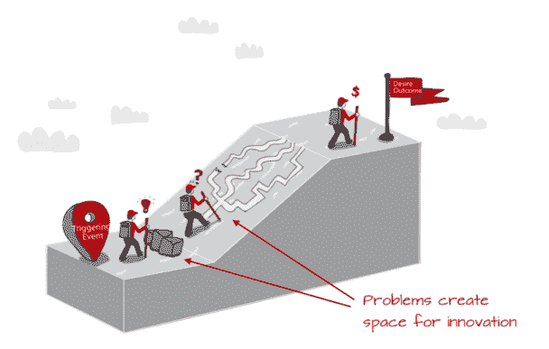
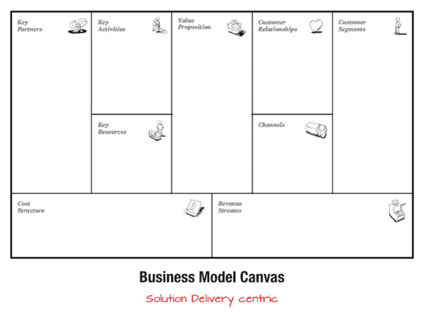

# 爱问题，而不是你的解决方案

> 原文：<https://leanstack.com/love-the-problem-not-your-solution/?utm_source=wanqu.co&utm_campaign=Wanqu+Daily&utm_medium=website>

最近有人问我，创业者最容易犯的错误是什么。我清单上的第一项是:**爱上你的解决方案**。我之前将这种对解决方案的偏好称为“创新者的偏见”。

在科学中，我们试图克服这种偏见的方法之一是通过从第一原理进行推理。同样的道理也可以应用在商业上。

> 有了基本原则，你就可以把事情归结为最基本的真理……然后从那里推理。
> *——埃隆马斯克*

正如你将在这篇文章中看到的，“创新者偏见”是一个狡猾的巨魔——不仅仅在构思阶段，而是在整个创新生命周期中，经常是在你最意想不到的时候。在每一步，一些最基本的真理来自于在解决问题之前对问题的深刻理解。

### 伟大的想法

当我们第一次被一个想法击中时，解决方案是我们最清楚地看到的，也是我们花费最多精力的。但是大多数产品都失败了——不是因为我们没能构建出我们的解决方案，而是因为我们没能解决一个“足够大”的客户问题。

> 你最初所有的精力都应该用于寻找货币化问题的证据，而不是获取更多的资源来构建你的解决方案。

那么，如何找到一个“足够大”的问题呢？

首先要认识到你真正的工作是创造客户(而不是你的解决方案)。客户是结果或结果驱动的。寻找他们正在努力完成的工作(待完成的工作)，并研究他们是如何完成的(现有的替代方案)。

如果工作完成得很好，这对你来说是个坏消息，因为很难用一个听起来类似的价值主张来取代现有的解决方案。另一方面，如果你发现工作做得不够好，这对你来说是个好消息。阻碍客户实现其期望结果的障碍或问题正是您可以找到创新空间的地方。

这种对问题而非解决方案的强调是我想通过[精益画布](http://leancanvas.com/)传达的核心思想转变，也是我修改最初的[商业模式画布](http://businessmodelgeneration.com/)的原因。

当我听到企业家推销他们的商业模式画布时，我听到了很多关于他们将要构建什么(价值主张/解决方案)以及他们将如何向客户交付它(渠道、关键活动、关键合作伙伴、关键资源、客户关系)。但是我没有听到任何关于为什么客户会首先需要或想要您的解决方案，或者您将如何让他们从他们今天正在做的事情转向您的解决方案。

> *你的商业模式没有问题才是问题。*

精益画布不是更好的商业模式画布，而是完全不同的画布。尽管我改变了 4 个盒子，但仅仅是增加了问题盒子，就继续在最终的商业模式中产生最大的思维转变。

***陷阱:*** *大部分大创意都过于以解决方案为中心。*
***解药:*** *爱情的问题，不是你的解决方法。*

### 不断增长的功能积压

让我们快进到一个已经发布的产品——一个有很多客户的产品。有了大量的客户，就会有大量的新功能需求。你听谁的？

如果你听取所有顾客的意见，很快你就会有一个臃肿的庞然大物。即使你只听取你最有价值的客户的意见，你也可能最终会开发出他们都不使用的东西。这是因为大多数特性请求是作为解决方案而不是问题提出的。顾客通常不擅长设计解决方案——甚至是他们自己的问题。

> “知道顾客想要什么不是他们的工作。”
> *——乔布斯*

区分客户功能请求优先级的更好方法是首先了解触发请求的根本问题。他们在哪里？他们想做什么？为什么？

你可以通过简单地应用上面提到的同样的工作要做的思维过程来回答所有这些问题。

这是我们的 LEANSTACK 软件的一个例子:

**功能请求 1** :我希望能够将我的精益画布导出为 PDF 格式。
**功能要求 2** :我希望能够改变精益画布上的颜色。
**功能要求 3** :我希望能够改变精益画布上的字体。

每一个都是足够简单的特性请求，但是我们不仅仅是实现它们，而是让请求者打电话。我们问他们想要完成什么(结果),并探究为什么当前产品让他们失望(问题)。在这种情况下，我们了解到，这些用户希望在投资者演示中使用他们的精益画布，而默认视图在视觉上不够有趣。

> 一旦你理解了这份工作,“更好”的目标就变得更加清晰。

我们没有一字不差地实现他们的特性请求，而是模拟了一个“演示模式”特性并展示给他们看。这就是我们最终建造的。

***陷阱:*** *大多数客户的功能请求都被框定为解决方案，但客户往往不是好的解决方案设计者。*
***解药:*** *爱情的问题，不是你的解决方法。*

### 专业化的诅咒

随着你种植任何产品，事情开始走下坡路。为了识别问题并对其进行优先排序，我们投资于指标。好的指标有助于暴露你的商业模式中最易泄漏的桶或瓶颈。但是简单地要求您的团队为糟糕的度量提供解决方案也会导致您的积压工作中内部特性请求的雪崩。

这是我们 LEANSTACK 产品的另一个例子。

我们的新精益画布(激活)的完成率指标开始下降。我在我们的每周例会上提出了这个问题，事情是这样的:

1.我的设计师建议我们简化精益画布创建工作流程。
2。我的开发人员建议我们在工作流程中添加更多的特性，以及
3。我的营销人员希望实施生命周期电子邮件，引导用户完成工作流程。

请注意“创新者的偏见”是如何潜入这里的。我们每个人都被训练成擅长某些学科，当遇到问题时，我们会自动伸出最有力的工具。毫不奇怪，我的设计师提出了一个设计解决方案，我的开发人员提出了一个技术解决方案，我的营销人员提出了一个，是的，你猜对了，营销解决方案。

在太多过度构建的功能之后，我们不会陷入集体喜爱我们闪亮的新功能的陷阱，而是学会了总是退回到第一原则。在制定或提出任何解决方案之前，我们会寻找问题的证据。

仅仅依靠度量标准的问题是，虽然它们可以告诉你哪里出错了，但是它们通常不会告诉你为什么出错。为了找到原因，你通常需要设计一个学习实验。在这种情况下，我们没有自动购买 UX 的解决方案，而是决定对新用户进行可用性测试，证明 UX 不是激活率下降的原因。我们确实发现了另一个完全不同的解决方案。

***陷阱:*** *度量只能告诉你哪里出了问题而不是为什么，你的团队会有“不同的好主意”来解决它。*
***解药:*** *爱情的问题，不是你的解决方法。*

### 避免失败

我们都不喜欢失败，但当我想到避免失败时，我经常想起《银河系漫游指南》:

> 飞行是一门艺术，或者说是一种诀窍。它的诀窍在于学会扑倒在地，失手。……显然，正是这第二部分，即失踪，带来了困难。
> *——道格拉斯·亚当斯*

我们花了太多时间试图“错过”失败，以至于没有意识到:**失败是突破的必要前提**。

如果你做了一个实验，只验证了你已经预料到的事情，你可以拍拍自己的背，但是没有突破。只有通过探索意想不到的事物，你才能获得突破。科学和商业领域都充斥着这种意外突破的故事:青霉素、x 光、微波、便利贴、Velcro 等等。

> 突破性的见解往往隐藏在失败的实验中。

当我们尝试新事物时，失败是意料之中的事。曲棍球棒曲线在开始是平坦的是有原因的。学习突破和避免失败的方法有三点:

1.通过使用小的、快速的、附加的实验来消除大的彻底失败类型。
2。从你的词汇中删除失败。我更喜欢“意想不到的结果”这个词。
3。最后，追逐每一个意想不到的结果，明白为什么。

> 不以学习为基础的支点是一种伪装的“看什么能坚持”策略。

***陷阱:*** *逃避失败只会延误真正的突破。*
***解药:*** *爱情的问题，不是你的解决方法。*

### 最后一份外卖

在你离开之前，我想给你最后一个建议。我们对毅力和勇气给予了很多口头上的支持，但是如果你只是简单地试图用蛮力来解决问题，毅力和勇气只能让你到此为止。

从一个解决方案开始就像建造一把不知道能打开什么门的钥匙。你可以试着在很多门上测试你的钥匙，或者从你想打开的门开始。当你爱上了这个问题，而不是你的解决方案，你就开始建造通往真正带你去的地方的门的钥匙。