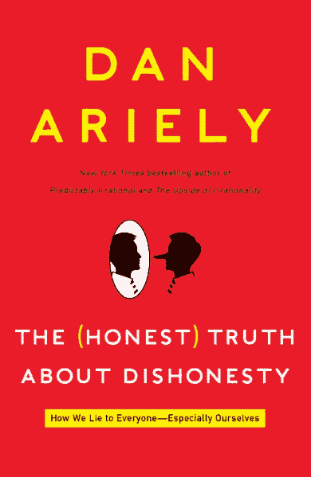
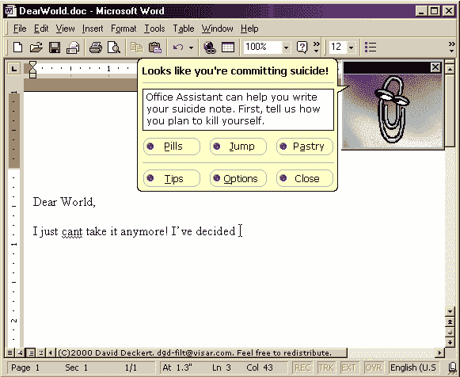
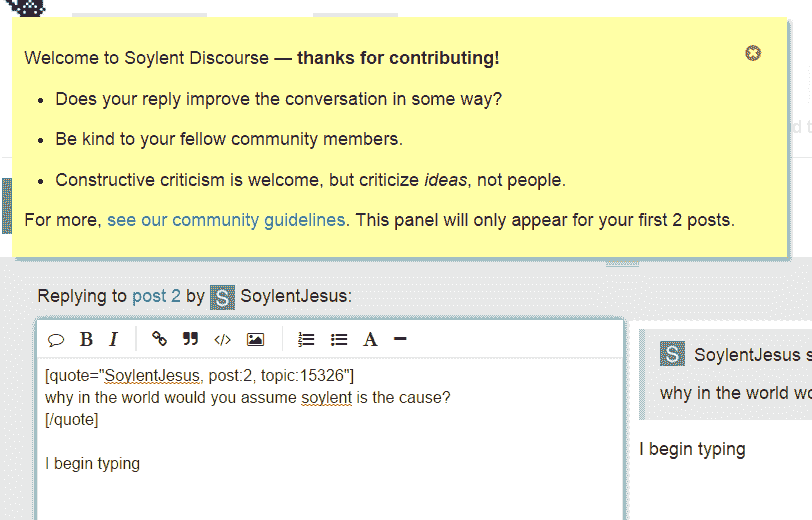

# 用户行为的“适时”理论

> 原文：<https://blog.codinghorror.com/the-just-in-time-theory/?utm_source=wanqu.co&utm_campaign=Wanqu+Daily&utm_medium=website>

我一直认为软件的设计对用户在软件中的行为有着深远的影响。但是这个故事有两个方面:

*   通过故意让“正确”的事情变得简单来鼓励这些事情。

*   通过故意让事情变得困难、复杂和尴尬来阻止“错误”的事情。

无论软件是有意还是完全无意地这样做，这是一个生活事实:[阻力最小的路径是每个人最好的朋友](https://blog.codinghorror.com/training-your-users/)。学会掌握这条路，否则别人会为你掌握它。

为了证明这一点，考虑一下丹·艾瑞里的新书《关于不诚实的(诚实)真相:我们如何欺骗每个人——尤其是我们自己》。

[T2】](http://www.amazon.com/dp/0062183613?tag=codihorr-20)

事实上，让我们诚实地说:[我们都在撒谎，一直都在撒谎](https://blog.codinghorror.com/every-user-lies/)。请注意，不是因为我们是坏人，而是因为我们*有*经常对自己撒谎说[是一种生存机制](https://blog.codinghorror.com/the-trap-you-set-for-yourself/)。你觉得我们应该一直完全坦诚吗？是啊。祝你好运。

但是我们学会告诉自己的这些健康的善意的小谎言有其黑暗的一面。你听过这句古老的格言吗？

> 一天，彼得把自己锁在了门外。过了一会儿，锁匠把他的卡车停了下来，大约一分钟就把锁撬开了。
> 
> “我很惊讶这个家伙能如此迅速和轻松地打开门，”彼得说。锁匠告诉他，门上的锁只是为了让诚实的人保持诚实。百分之一的人会一直老实，从来不偷。另外 1%的人总是不诚实，总是试图撬开你的锁，偷走你的电视；锁不能很好地保护你免受惯偷的侵害，如果他们真的想进入你的房子，他们是可以的。
> 
> 锁匠说，锁的目的是保护你免受 98%的大多数诚实的人的伤害，如果你的门没有锁，他们可能会试图打开你的门。

我以前听到过不太乐观的说法

> 10%的人将*永远不会*偷窃，10%的人将*永远*偷窃，对于其他人来说……这要看情况。

“视情况而定”这一部分对于理解人性至关重要，这也是艾瑞里在书中花了大部分时间在各种测试中检验的。如果说对大多数人来说，诚信靠的是什么，那到底靠的是什么？Ariely 进行的实验一次又一次地证明了大多数人会持续可靠地欺骗“一点点”，以至于他们仍然认为自己是诚实的人。门槛因素不是法律、惩罚或道德。令人惊讶的是，这种东西实际上对行为没有影响。然而，真正的问题是他们个人是否还能让 T2 觉得他们是诚实的人。

这是因为他们甚至不认为这是作弊——他们只是多拿了一点，给自己一个小小的休息，享受一个小小的提升，因为，嗯，他们最近不是特别努力工作并赢得了它吗？难道他们不值得偶尔享受一些美好的东西吗？谁会错过这么一点点呢？有这么多！

这些善意的小谎言是阻力最小的途径。他们无处不在。如果法律不起作用，如果道德课不起作用，如果严厉的惩罚不起作用，你如何鼓励人们以一种“感觉”诚实的方式行事，那就是真正的诚实？感情是一些非常黏糊糊的东西。

这比你想象的要容易。

> 我和我的同事在加州大学洛杉矶分校进行了一项实验。我们找了一组 450 名参与者，把他们分成两组，让他们执行我们通常的矩阵任务。我们让其中一半人回忆十诫，另一半人回忆他们在高中读过的 10 本书。
> 
> 在回忆这 10 本书的小组中，我们看到了典型的普遍但适度的欺骗。但是在被要求回忆十诫的小组中，我们没有观察到任何作弊行为。我们重新做了这个实验，提醒学生他们学校的荣誉准则而不是十诫，我们得到了同样的结果。我们甚至对一组自称无神论者的人重新进行了实验，让他们对着《圣经》发誓，结果还是一样，没有作弊。

这是个好消息:在受到诱惑的时候，一个简单的提醒*通常会让人们突然“记起”他们的诚实。*

 *坏消息是 Clippy 是对的。

以我的经验，没人看手册，没人看 FAQ，也没人看教程。当然，为了效果，我在这里夸大了一点。有些 A+的学生会特意去读这些东西。他们就是这样成为 A+学生的，自然而然地多走了一步，通常是那种不需要特殊资源就能很好地自学的用户。当我说“没有人”的时候，我指的是绝大多数人，你真的很想[阅读这样的东西。那些除了绝对最低要求之外，根本没有时间或意愿付出任何努力的人，那些最肯定*不会*付出额外努力的人。](https://blog.codinghorror.com/treating-user-myopia/)

换句话说，整个世界。

那么，你如何帮助那些像我们这样的人，他们似乎从来没有时间去解决这些事情，因为他们很忙。

你可以通过展示给他们看…

*   最小的有益提醒
*   在正确的时间

这就是我多年来称之为用户行为的“及时”理论。当然，常见问题解答、教程和帮助中心都很棒，但是谁有时间做这些呢？我们在这里充其量都是永久的中间用户。

你的软件越接近实用、有用的“及时”提醒，你就能更好地帮助最需要的用户。不是那些已经阅读了 FAQ，并认真研究了帮助中心的 A+学生，而是那些*从来没有阅读过任何东西*的用户。现在，多亏了丹·艾瑞里，我有了科学来支持这个观点。甚至一些简单的事情，比如把你的名字写在汽车保险里程报告表格的顶部，而不是底部，都会导致报告的平均里程神秘地增加 10%。一开始就提醒*嘿，你的名字在这张表上，激发了更多的诚实。它工作了。*

 *我们在堆栈溢出和堆栈交换中使用了这种技术吗？的确如此。我会在[演讲](http://www.discourse.org)中使用这种技巧吗？当然，在更多的地方，因为这是社会讨论，而不是技术问题。我们是[的礼仪大师](http://blog.discourse.org/2013/03/the-universal-rules-of-civilized-discourse/)，所以我们喜欢提醒人们，当他们在网上发表言论时，他们不是在和计算机或机器人说话，而是和一个真实的人说话[，和你很像](http://sivers.org/real)。

什么时候是提醒别人这一点的合适时机？不是在他们注册的时候，不是在他们阅读的时候，而是在他们开始在他们的第一篇文章中输入他们的第一个单词的那一刻。这是一个诱惑的时刻，你可能会超级确信[网上有人是错的](http://xkcd.com/386/)。所以我们及时在他们打字的地方贴了一个小小的提醒:

[T2】](http://discourse.soylent.me/)

然后，希望就像丹·艾瑞里诚实地向我们展示的那样，这个小小的提醒将挖掘人们友好和礼貌的自然储备，因此更冷静的头脑将占上风——并且一些人受到鼓舞，比昨天相处得更好一点。仅仅因为你在互联网上并不意味着你需要 24/7 对人们大喊大叫。

我们在很多其他地方也使用同样的技术:如果你发布了很多帖子，但没有设置头像，如果你在一个特别旧的对话中添加了一个新帖子，如果你在同一个主题中回复了很多次，等等。只要我们觉得轻轻一推可能会有帮助，就在行为发生的准确时间。

重要的是要明白，我们在[话语](http://www.discourse.org)中使用这些提醒，并不是因为我们认为人们是哑巴；恰恰相反，我们使用它们是因为**我们相信人们聪明、文明、有趣。**事实证明，每个人都需要时不时地被提醒一下，它才会继续正确。** 