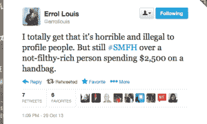

# 愚蠢的穷人的逻辑

> 原文：<https://tressiemc.com/2013/10/29/the-logic-of-stupid-poor-people/?utm_source=wanqu.co&utm_campaign=Wanqu+Daily&utm_medium=website>

我们讨厌我们一些可怜的人。首先，当不贫穷如此容易时，他们却坚持贫穷。他们会买昂贵的名牌皮带和价值 2500 美元的奢侈手袋。

 平心而论，这与埃罗尔·路易无关。他的信念被很多人持有，包括[很多黑人](http://www.hark.com/clips/tygwdjhmym-we-hate-black-people-too)、穷人、[以前的穷人](http://www.wnd.com/2003/10/21236/)等。我怀疑这是怀疑的真实表现。如果你很穷，为什么要把钱花在无用的身份象征上，比如手袋、皮带、衣服、鞋子、电视和汽车？

我学到的一点是，一个人不合逻辑的信仰是另一个人的生存技能。没有什么比努力生存更合乎逻辑的了。

我家是典型的美国黑人移民家庭。我们来自南方农村，搬到了北方，几乎所有人都回来了。我是看着我的曾祖母，后来是我的祖母和母亲，用我们最少的资源帮助其他人实现收支平衡长大的。我们是那种很好的穷人，那种基本上量入为出的人。我们有一点运气，当一位男性亲属截瘫回家时，他们得到了额外的军饷，或者用退伍军人管理局的钱买了一栋吉姆·沃尔特的房子。如果你真的很幸运，当你的一个亲戚带着一份已付清的保险单去世时，你可能会被赠予一笔钱来购买吉姆·沃尔特斯用来担保你房屋租赁的土地。在我的家乡，世代财富就是这样产生的:失去一条腿，一部分脊椎，正确死去，也许你可以租赁拥有一个模块化的房子。

我们有一点这种农村黑人的财富，所以我们经常能够帮助那些不那么幸运的人。但也许我们拥有的最大资源是更多的教育。我们是大读者，我们尤其鼓励女孩去上某种大学。因此，我的祖母和母亲有一套特殊的社会资源，帮助我们在白人官僚机构中为自己谋福利。正如我祖父所说，我们可以像白人一样交谈。我们把这种特权借给了很多人。

我记得我妈妈带隔壁邻居去了社会服务机构。这位老妇人被剥夺了照顾她所抚养的孙女的福利。这位女士以优雅的官僚方式被拒绝——许多她无法驾驭的等待、表格和最后期限。我看着母亲穿上她最好的黛安娜·罗丝[桃花心木](http://www.ebony.com/photos/style/icon-inspired-diana-ross-in-mahogany)套装:一件驼色斗篷，搭配宽松裤和及膝长靴。作为一个独生子女，我对和邻家女孩分享母亲的时间感到恼火。我一定说过我们为什么要这么做。薇薇安戴上珍珠耳环时盯着我，告诉我能做的人就必须做。花了半天时间，但我母亲作为受人尊敬的黑人的一些表现——她标准的英语、她的桃花心木服装、她直直的波波头和珍珠耳环——完成了隔壁老太太一年多来没能完成的事情。看着我的母亲，我明白了，为了向看门人表明我们值得交往，我们必须付出代价。这意味着穿着得体，谈吐得体。可能行不通。很可能[不会成功，但是万一成功了，你必须试一试。这是不公平的，但正如薇薇安也总是说，“生活是不公平的小女孩。”](http://www.furiousandbrave.com/2013/07/everybody-gotta-have-dream.html)

我吸取了这个教训，我认为它对我有用，尽管不均衡。贝尔克商店的一位女士曾拒绝向我展示我有兴趣购买的 Dooney and Burke 钱包。薇薇安曾经在一家空荡荡的商店里把一个无视我们的女售货员弄哭了。在柜台上的一些顽固分子侮辱了我和我的母亲之后，我已经放弃了许多非常渴望购买的东西，比如我非常想要的不实用的米白色冬季外套。但是，我有半个博士学位，我支持自己模仿白人男性的特权生活。这是一个混合的包。当然，诀窍是你永远不知道你生活的反事实。没有拒绝访问的证据。谁知道我没有被授予什么，因为我没有在正确的时间为一个令人愉快的权威制定正确的身份行为或象征？受人尊敬的奖励是一种废话，但我们在一系列复杂的结构和社会互动所施加的限制范围内尽我们所能，这些互动旨在限制获得地位、财富和权力。

我不知道我母亲在她的驼色斗篷或及膝长靴上花了多少钱，但我知道无论她付出了什么，都会得到难以衡量的回报。福利办公室的一名职员认为你可能不像候诊室里的其他微不足道的妇女一样，并提供了一份关于填写表格的额外信息，而你本来不知道要询问这份表格，你怎么能对这种双重行为定价呢？一位校长对你的孩子多一点尊重，因为你母亲对自我的展示表明，她可能会释放中产阶级父母的官僚精明，为她的孩子辩护，这位校长的零售价值是什么？我不知道在我成长的过程中，相对于我们的贫困，这些与组织和看门人的重要接触的代价。但是，我是它投资收益的活生生的证明。

为什么穷人会做出愚蠢的、不合逻辑的决定去购买身份象征？出于同样的原因，我想除了最富有的人以外，所有人都会购买身份象征。我们想要归属。而且，不仅仅是为了精神上的回报，在正确的时间属于一个群体可能意味着失业和就业之间的区别，一份好工作与一份坏工作的区别，住房或庇护所，等等。有人在 twitter 上提到，穷人可以通过凯马特的平价选项变得体面。但问题不在于是否像样。得体是社交礼仪的最低标准。它意味着干净，没有气味，穿着衬衫和鞋子服务之类的。体面是有报酬、有尊严的工作或成功的社会交往的充分条件，是一种特权。衰老的白人嬉皮士可以剪掉年轻时叛逆的马尾辫，走进高级管理层，而衰老的黑豹永远无法完全摆脱他们追求革命的污名化影响。像样是相对的，就像生活一样，这是不公平的。

相比之下，“可接受”是指获得一组有限的奖励。我无法确切知道我的“可接受”陈述对我有多少帮助，但我有足够的反馈，知道它不是无关紧要的。我上大学时工作过的公寓大楼的一位经理反复告诉我，她知道我“没事”，因为我的小尼桑很干净。我穿了一套纽约琼斯的西装去面试，真的成交了。她可以直呼西装的名字，因为她在采访中问了我关于品牌的问题。我第一份专业工作的另一位招聘经理在等候室里上下打量我，给我的服装分类，后来告诉我，她认为我太优雅了，不适合在呼叫中心工作。我被聘为培训师。这种不同意味着我不用轮班，更高的声望，更高的薪水，以及未来所有工作的基本工资。

我还有半打类似的故事。值得注意的不是这件事发生了。有经验证据表明，对女性和有色人种的外貌评价与白人男性不同，也更为苛刻。值得注意的是，这些守门人*告诉了我这个故事*。他们想让我知道我是如何恰当地表明我不是一个典型的黑人或典型的女性，这两种身份结合在一起几乎总是与贫穷混为一谈。

我曾经参加过一个新行政助理的面试。我的地区副总裁负责招聘。因为我们是一所美容学校，所以申请的都是黑人和棕色皮肤的女性。在性别化领域中，处于熟练劳动力边缘的职业学校必然会被分类和竞争。我发现有一位候选人特别有魅力。她试图离开沙龙，因为她站着理发 10 个小时的平均时薪将低于最低工资。对她来说，有 40 个固定工作时间和医疗福利的办公室工作代表着流动性。当她离开时，我的副总裁转身对我说，“你看到她上衣里面穿的那件背心了吗？！OMG，你穿的是真丝*壳，*不是背心！”两个女人都是黑人。

副总裁构建了她作为高级管理人员的工作。她开着一辆崭新的宝马，因为她“应该犒劳自己”，并喜欢告诉我们，我们的公司是一家形象公司。一个穿着棉质背心作为外壳的女孩与驾驶宝马的形象业务副总裁格格不入。守门是一项管理边界的复杂工作，它不仅定义了他人，也定义了我们自己。地位的象征——丝绸外壳、名牌鞋、奢侈手袋——成为打开这些大门的钥匙。如果我需要一份工作来拯救我的下背部，并把我的孩子从医疗补助转移到健康维护组织，我应该花多少钱向像我的前副总裁这样的人发出信号，告诉他们我不会因为向我敞开大门而损害她的地位？那个候选人可能买不起合适的外壳。我永远不会知道。但我知道，如果她饿了两天去买它，或者错过了去商店买它的工资，她可能会得到一份工作，可以让她超过最低工资。或许，贝壳不是名牌手袋。但是在商业街上的美容学校也不是美国银行的工作。

这些关于穷人做出的糟糕决定的怀疑性陈述的核心是一种信念，即我们永远不会像他们一样。我们会更清楚。我们知道要存钱，避开地位的象征，削减优惠券，实践清教徒式的牺牲来积累一百万美元。有一个经常性的新闻故事，一个卖午餐的女人，不知道所有认识她的人，死的时候很富有，把所有财产留给了一只猫或者一个慈善机构之类的机构。关于富人简朴生活的书喜欢告诉我们他们如何驾驶别克而不是宝马。我们忘记的是，如果我们曾经知道的话，我们现在所知道的关于地位、财富创造和牺牲是基于我们是谁，也就是说，我们不是穷人。如果你改变了你并不贫穷的状况，你就改变了你作为一个并不贫穷的人所知道的一切。你不知道你会做什么，如果你很穷，直到你很穷。不是间歇性的贫穷或以前不贫穷，而是生来贫穷，被期望贫穷，被官僚机构、看门人和善意的权威人士视为天生贫穷。到那时，也只有到那时，你才会明白一个荒谬的身份象征对那些直觉地认为自己不能没有它的人的相对价值。