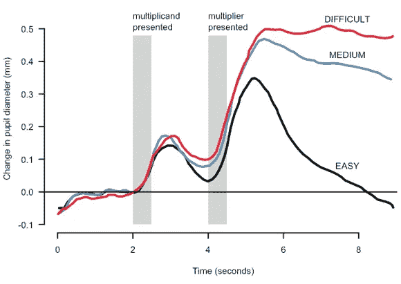
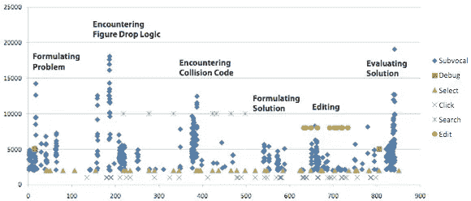
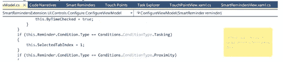
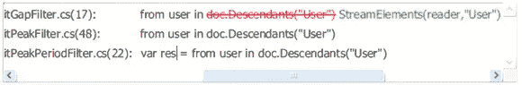
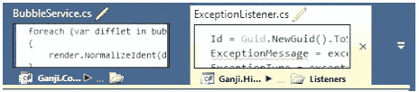
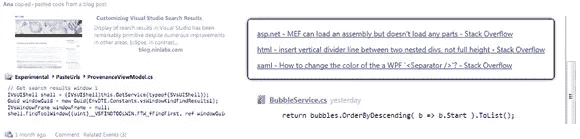
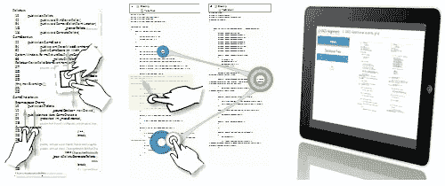

# 程序员，中断

> 原文：<http://www.gamasutra.com/view/feature/190891/programmer_interrupted.php?utm_source=wanqu.co&utm_campaign=Wanqu+Daily&utm_medium=website>

这篇文章被认为是 gama sutra 2013 年的头条新闻之一。T3】

***转载自 Gamaustra 的姐妹出版物《游戏开发者杂志》2013 年 4 月刊，这篇文章针对程序员，探讨了帮助你从分心中恢复工作的方法。**T3】*

我在一种沉闷的状态下写这篇文章:睡眠不足，忙碌，迷失方向，被打断。我尝试了所有的补救措施:使用番茄工作法，在咖啡店工作，戴耳机，避免工作直到深夜没有分心。但是，在干扰找到办法刺破我的保护罩之前，时间已经不多了。

和你一样，我是“程序员，被打断了。”不幸的是，我们对中断和恢复聚焦的补救措施的理解与顺势疗法和放血疗法相差不远。但是证据是什么，我们能做些什么呢？

中断的成本

每隔几个月，我就会看到另一个程序员被要求不要在工作时间使用耳机，或者频繁地被会议打断而无法工作，他对这些要求几乎没有什么防备。我还担心随着年龄的增长，我们处理这些脑力负荷和干扰的能力会下降。

研究办公室环境中干扰成本的研究人员估计，被干扰的任务比未被干扰的任务花费的时间多一倍，包含的错误也多一倍。他们还发现，员工必须在分散的状态下工作，因为 57%的任务会被打断(参见**参考文献**中的引用)。

对于程序员来说，关于中断的影响和流行的证据较少；一般来说，在被打断至少 15 分钟后，被抛来抛去的号码才能回到“区域”。对程序员的采访得出了类似的数字。尽管如此，软件开发领域的众多数字也加入了进来:Y Combinator 创始人保罗·格拉厄姆强调了创业家的时间表和经理的时间表之间的差异，37signals 创始人杰森·弗里德表示，办公室是我们被打扰的地方。

学习程序员中断

基于对 86 名使用 Eclipse 和 Visual Studio 的程序员记录的 10，000 次编程会话的分析，以及对 414 名程序员的调查，我们发现:

*   程序员从中断中恢复工作后，需要 10-15 分钟来开始编辑代码。
*   当在一个方法的编辑过程中被中断时，程序员只有 10%的机会在不到一分钟的时间内恢复工作。
*   一个程序员可能一天只有一次不受干扰的两小时会议。

我们还看了程序员处理中断的一些方法:

*   大多数会话程序员在继续编辑之前导航到几个位置来重建上下文。
*   程序员故意插入编译错误来强制“路障”提醒。
*   源差异被视为恢复状态的最后手段，因为检查它可能很麻烦。

中断一个程序员的最坏时间

研究表明，打断任何人的最糟糕的时候是他们的记忆负荷最大的时候。使用记忆负荷的神经关联(例如，通过测量瞳孔直径)，研究表明，峰值负荷期间的中断会导致最大的中断(见**图 1** )。

**<picture><source type="image/webp" media="(max-width: 576px)" srcset="https://eu-images.contentstack.com/v3/assets/blt95b381df7c12c15d/bltff9efd0a2e3e2936/611e6e559829ed638b315088/figure01_PupilCMYK.jpg?width=480&amp;quality=80&amp;format=webply&amp;disable=upscale"><source type="image/webp" media="(max-width: 767px)" srcset="https://eu-images.contentstack.com/v3/assets/blt95b381df7c12c15d/bltff9efd0a2e3e2936/611e6e559829ed638b315088/figure01_PupilCMYK.jpg?width=768&amp;quality=80&amp;format=webply&amp;disable=upscale"><source type="image/webp" media="(min-width: 768px)" srcset="https://eu-images.contentstack.com/v3/assets/blt95b381df7c12c15d/bltff9efd0a2e3e2936/611e6e559829ed638b315088/figure01_PupilCMYK.jpg?width=828&amp;quality=80&amp;format=webply&amp;disable=upscale"><source type="image/jpeg" srcset="https://eu-images.contentstack.com/v3/assets/blt95b381df7c12c15d/bltff9efd0a2e3e2936/611e6e559829ed638b315088/figure01_PupilCMYK.jpg?width=828&amp;quality=80&amp;format=jpg&amp;disable=upscale"></picture>**

**图 1:追踪不同难度任务个体瞳孔直径随时间的变化**。

在我们的研究中，我们观察了编程任务中的次声话语，以发现编程任务中不同水平的内存负载(见**图 2** )。当人们执行复杂的任务时，可以检测到潜在的话语(设置到舌头、嘴唇或声带的电信号)。这一现象长期以来引起了研究人员的兴趣，一些人将次声信号比作我们思想的管道。最近，研究人员甚至能够将这些信号解码成文字。

**<picture><source type="image/webp" media="(max-width: 576px)" srcset="https://eu-images.contentstack.com/v3/assets/blt95b381df7c12c15d/blt05e3801fb1d60e35/611e6e588ab5544acc63fe1a/figure02_SubvocalCMYK.jpg?width=480&amp;quality=80&amp;format=webply&amp;disable=upscale"><source type="image/webp" media="(max-width: 767px)" srcset="https://eu-images.contentstack.com/v3/assets/blt95b381df7c12c15d/blt05e3801fb1d60e35/611e6e588ab5544acc63fe1a/figure02_SubvocalCMYK.jpg?width=768&amp;quality=80&amp;format=webply&amp;disable=upscale"><source type="image/webp" media="(min-width: 768px)" srcset="https://eu-images.contentstack.com/v3/assets/blt95b381df7c12c15d/blt05e3801fb1d60e35/611e6e588ab5544acc63fe1a/figure02_SubvocalCMYK.jpg?width=828&amp;quality=80&amp;format=webply&amp;disable=upscale"><source type="image/jpeg" srcset="https://eu-images.contentstack.com/v3/assets/blt95b381df7c12c15d/blt05e3801fb1d60e35/611e6e588ab5544acc63fe1a/figure02_SubvocalCMYK.jpg?width=828&amp;quality=80&amp;format=jpg&amp;disable=upscale"></picture>**

**图 2:与修改*俄罗斯方块*游戏的 13 分钟编程任务相关的肌电图(EMG)信号。**

* * *

如果一个被打断的人被允许暂停他们的工作状态或者到达一个“好的断点”，那么中断的影响可以被减少。然而，程序员通常需要至少七分钟才能从高内存状态转换到低内存状态。一个评估程序员不太希望中断的状态的实验发现这些状态特别有问题:

*   在编辑过程中，尤其是在多个位置同时进行编辑时
*   导航和搜索活动
*   理解代码中的数据流和控制流
*   IDE 窗口不在焦点上

### 构建你的环境来支持你的记忆

最终，我们无法消除干扰。(在某些情况下，中断甚至可能是有益的；40%被中断的任务没有恢复，可能是因为我们意识到任务没有那么重要，或者是因为中断给了我们一个反思问题的机会。)但是我们*可以*找到方法来减少中断经常导致的内存故障的影响。在下一节中，我将介绍一些在编程过程中受到干扰或负担过重的内存类型，并讨论一些可以支持它们的概念性辅助工具。

### 前瞻记忆

前瞻记忆会提醒你在特定的情况下执行未来的行动，例如，提醒你在下班回家的路上买牛奶。

各种研究描述了开发人员如何试图应对预期的记忆失败。例如，开发人员经常在他们正在处理的代码中留下 TODO 注释。这种机制的缺点是没有查看这些提醒的动力。相反，为了强制预期提示，开发人员可能会故意留下一个编译错误，以确保他们记得执行某个任务。然而，引入编译错误会产生不同的问题，因为它们会抑制切换到同一代码库上的另一个任务的能力。最后，开发人员也会做其他上班族做的事情:给自己留便条和邮件。

“智能提醒”是一种可以基于特定条件触发的提醒，例如队友签入代码，或者与提醒的空间接近度(参见**图 3** )。它基本上相当于便利贴。

**[<picture><source type="image/webp" media="(max-width: 576px)" srcset="https://eu-images.contentstack.com/v3/assets/blt95b381df7c12c15d/blt1b3c6926e0e86452/611e6e5c0804be31fb79a206/figure03_Smart-ReminderCMYK_thumb.jpg?width=480&amp;quality=80&amp;format=webply&amp;disable=upscale"><source type="image/webp" media="(max-width: 767px)" srcset="https://eu-images.contentstack.com/v3/assets/blt95b381df7c12c15d/blt1b3c6926e0e86452/611e6e5c0804be31fb79a206/figure03_Smart-ReminderCMYK_thumb.jpg?width=768&amp;quality=80&amp;format=webply&amp;disable=upscale"><source type="image/webp" media="(min-width: 768px)" srcset="https://eu-images.contentstack.com/v3/assets/blt95b381df7c12c15d/blt1b3c6926e0e86452/611e6e5c0804be31fb79a206/figure03_Smart-ReminderCMYK_thumb.jpg?width=828&amp;quality=80&amp;format=webply&amp;disable=upscale"><source type="image/jpeg" srcset="https://eu-images.contentstack.com/v3/assets/blt95b381df7c12c15d/blt1b3c6926e0e86452/611e6e5c0804be31fb79a206/figure03_Smart-ReminderCMYK_thumb.jpg?width=828&amp;quality=80&amp;format=jpg&amp;disable=upscale"></picture>](/db_arimg/feature/190891/figure03_Smart-ReminderCMYK.jpg)** **图 3:当靠近提醒的源时变得更加可见的环境提醒(例如，当在另一个项目或名称空间中时不可见)。点击查看大图** 。

### 专注记忆

专注记忆拥有可以自由处理的意识记忆。当开发人员必须对代码库进行类似的更改时，这可能会在编程中出现——例如，如果开发人员需要重构代码，以便将组件从一个位置移动到另一个位置，或者更新代码以使用 API 的新版本，那么该开发人员需要系统地、仔细地编辑受所需更改影响的所有位置。不幸的是，即使是一个简单的更改也会导致许多复杂的情况，需要开发人员跟踪代码中许多位置的状态。更糟糕的是，在中断后，注意力集中的记忆中被跟踪的状态很快消失，大量被访问和编辑的位置混淆了检索。

接触点(见**图 4** )允许程序员跟踪代码中许多位置的状态。检查重构实践的研究发现了工具支持中的几个缺陷，其中之一是缺乏跟踪代码中许多位置的能力。作为一种变通方法，开发人员放弃重构工具，转而依赖重构时引入的编译错误。不幸的是，使用编译错误来跟踪更改并不是一个通用的解决方案，仍然会导致错误。接触点的灵感来自开发人员如何使用编译错误。它们可以通过导出最近访问、编辑和搜索的所有代码点来自动恢复。

**<picture><source type="image/webp" media="(max-width: 576px)" srcset="https://eu-images.contentstack.com/v3/assets/blt95b381df7c12c15d/blt83cf0e2c5a2514b0/611e6e6075830930bf6dea88/figure04_TouchPointCMYK.jpg?width=480&amp;quality=80&amp;format=webply&amp;disable=upscale"> <source type="image/webp" media="(max-width: 767px)" srcset="https://eu-images.contentstack.com/v3/assets/blt95b381df7c12c15d/blt83cf0e2c5a2514b0/611e6e6075830930bf6dea88/figure04_TouchPointCMYK.jpg?width=768&amp;quality=80&amp;format=webply&amp;disable=upscale"> <source type="image/webp" media="(min-width: 768px)" srcset="https://eu-images.contentstack.com/v3/assets/blt95b381df7c12c15d/blt83cf0e2c5a2514b0/611e6e6075830930bf6dea88/figure04_TouchPointCMYK.jpg?width=828&amp;quality=80&amp;format=webply&amp;disable=upscale"> <source type="image/jpeg" srcset="https://eu-images.contentstack.com/v3/assets/blt95b381df7c12c15d/blt83cf0e2c5a2514b0/611e6e6075830930bf6dea88/figure04_TouchPointCMYK.jpg?width=828&amp;quality=80&amp;format=jpg&amp;disable=upscale"> </picture> 图 4:从搜索和编辑操作中创建的一组接触点，允许开发者看到哪些地方发生了变化，并标记可能需要特别注意的位置**。

* * *

联想记忆

联想记忆在同现刺激的表现之间有一组无意识的联系。

当导航到不熟悉的代码时，开发人员通常会感到迷惑。当开发人员必须回忆起他们正在查看的代码位置或接下来要查看什么的信息时，这种迷惑源于联想记忆的失败。研究人员认为，在界面元素中缺乏丰富和稳定的环境线索，如文档标签，会阻止开发者回忆起联想记忆。

刺激中多模态的存在增加了形成联想记忆的能力。从这个意义上说，*模态*指的是由大脑不同区域处理的不同类型的感知，如听觉或视觉路径。不同模态和相应刺激的例子包括:视觉(错误下划线条、高亮代码)、词汇(文件名)、空间(滚动条或标签的位置)、操作(文件上的编辑/搜索/调试步骤动作)和结构(文件在层次结构中的逻辑位置)。

当同一刺激中存在多种形式时，更多的通路被激活，从而增加了形成联想记忆的机会。相比之下，单一模态的单调刺激不太可能形成联想记忆。

关联链接通过用程序元素定位多个模态的信息来帮助程序员；对开发人员的观察表明，他们经常依赖于与环境线索的关联，如标签和滚动条，来维护导航过程中的上下文。然而，这些提示通常是不够的:导航的行为通常会扰乱提示的状态，而界面元素(如选项卡，通常只包含一个文件名)的缺乏会使关联性丧失。通过改进导航文档选项卡(默认配置中非常简单，通常只显示文档名称),我们可以看到联想记忆的召回率有所提高。

**<picture><source type="image/webp" media="(max-width: 576px)" srcset="https://eu-images.contentstack.com/v3/assets/blt95b381df7c12c15d/blt71b00188f2ac0317/611e6e63c1ce5659b9a5696e/twotabs_AssociativeLinkCMYK.jpg?width=480&amp;quality=80&amp;format=webply&amp;disable=upscale"><source type="image/webp" media="(max-width: 767px)" srcset="https://eu-images.contentstack.com/v3/assets/blt95b381df7c12c15d/blt71b00188f2ac0317/611e6e63c1ce5659b9a5696e/twotabs_AssociativeLinkCMYK.jpg?width=768&amp;quality=80&amp;format=webply&amp;disable=upscale"><source type="image/webp" media="(min-width: 768px)" srcset="https://eu-images.contentstack.com/v3/assets/blt95b381df7c12c15d/blt71b00188f2ac0317/611e6e63c1ce5659b9a5696e/twotabs_AssociativeLinkCMYK.jpg?width=828&amp;quality=80&amp;format=webply&amp;disable=upscale"><source type="image/jpeg" srcset="https://eu-images.contentstack.com/v3/assets/blt95b381df7c12c15d/blt71b00188f2ac0317/611e6e63c1ce5659b9a5696e/twotabs_AssociativeLinkCMYK.jpg?width=828&amp;quality=80&amp;format=jpg&amp;disable=upscale"></picture>**

两个标签装饰着不同模态的提示:如错误线(视觉)和编辑图标(操作)。

**情景记忆**

情节记忆是对过去事件的回忆。软件开发人员不断遇到关于他们技术的新的学习经历。保留和利用这些获得的知识要求开发者能够从他们的情节记忆中回忆起那些经历。

当从情节记忆中回忆时，开发人员通常会经历失败，这限制了他们回忆基本细节或回忆关键事件的能力。例如，开发人员可能会忘记他们为编程任务所做的更改，或者忘记一些细节，比如用于实现部分任务的博客帖子。

代码叙述是一种情景记忆辅助手段，帮助开发人员回忆上下文细节和编程活动的历史。可以支持不同类型的叙述；例如，用于事件的高级回忆的审阅模式和用于为其他人发布编码任务的共享模式。

**[<picture><source type="image/webp" media="(max-width: 576px)" srcset="https://eu-images.contentstack.com/v3/assets/blt95b381df7c12c15d/bltc384bbbd848c22b8/611e6e658d060c638cda3fcf/timeline_CodeNarrativeExCMYK_thumb.jpg?width=480&amp;quality=80&amp;format=webply&amp;disable=upscale"><source type="image/webp" media="(max-width: 767px)" srcset="https://eu-images.contentstack.com/v3/assets/blt95b381df7c12c15d/bltc384bbbd848c22b8/611e6e658d060c638cda3fcf/timeline_CodeNarrativeExCMYK_thumb.jpg?width=768&amp;quality=80&amp;format=webply&amp;disable=upscale"><source type="image/webp" media="(min-width: 768px)" srcset="https://eu-images.contentstack.com/v3/assets/blt95b381df7c12c15d/bltc384bbbd848c22b8/611e6e658d060c638cda3fcf/timeline_CodeNarrativeExCMYK_thumb.jpg?width=828&amp;quality=80&amp;format=webply&amp;disable=upscale"><source type="image/jpeg" srcset="https://eu-images.contentstack.com/v3/assets/blt95b381df7c12c15d/bltc384bbbd848c22b8/611e6e658d060c638cda3fcf/timeline_CodeNarrativeExCMYK_thumb.jpg?width=828&amp;quality=80&amp;format=jpg&amp;disable=upscale"></picture>](/db_arimg/feature/190891/timeline_CodeNarrativeExCMYK.jpg)**

编程活动的时间表可以帮助你或你的队友记住你是如何完成任务的，以及你使用了哪些资源。点击查看大图。

关于代码叙述的更多信息，请查看这个博客，它是通过代码叙述半自动共享和发布的。(注意，在我写这篇文章时，博客最近没有更新。)

* * *

概念记忆

概念记忆是感知和抽象之间的连续统一体。大脑是如何记住锤子等物体和“工具”等概念的？嗯，它首先学习遇到的刺激的基本特征，如木纹和锤子的金属曲线，然后将这些特征组织到逐渐更高的抽象层次。

开发人员被期望在他们的职业生涯中保持专业技能。不幸的是，成为专家的道路并不容易走:对于新手来说，证据表明这可能是一个 10 年的旅程。此外，对于试图成为新领域专家的专家来说，就像桌面开发人员成为 web 开发人员一样，有许多概念必须放在一边，学习新的概念。

研究专家和新手之间的差异的研究发现，表现的差异源于大脑活动的差异。专家不仅比新手需要更少的大脑活动，他们还使用大脑的不同部分:专家使用概念记忆，而新手使用专注记忆。也就是说，专家能够利用概念记忆中的抽象概念，而新手必须在专注的记忆中保持原始的表征。

Sketchlet (alpha)是一个软件工具，旨在通过支持抽象和审查需要更新的概念来帮助程序员形成和编写概念。你可以在 sketchlet.sourceforge.net 亲自尝试一下。

**<picture><source type="image/webp" media="(max-width: 576px)" srcset="https://eu-images.contentstack.com/v3/assets/blt95b381df7c12c15d/blt89a66c4ec15162b6/611e6e6854e6e12f74949d7f/SketchletsCMYK.jpg?width=480&amp;quality=80&amp;format=webply&amp;disable=upscale"><source type="image/webp" media="(max-width: 767px)" srcset="https://eu-images.contentstack.com/v3/assets/blt95b381df7c12c15d/blt89a66c4ec15162b6/611e6e6854e6e12f74949d7f/SketchletsCMYK.jpg?width=768&amp;quality=80&amp;format=webply&amp;disable=upscale"><source type="image/webp" media="(min-width: 768px)" srcset="https://eu-images.contentstack.com/v3/assets/blt95b381df7c12c15d/blt89a66c4ec15162b6/611e6e6854e6e12f74949d7f/SketchletsCMYK.jpg?width=828&amp;quality=80&amp;format=webply&amp;disable=upscale"><source type="image/jpeg" srcset="https://eu-images.contentstack.com/v3/assets/blt95b381df7c12c15d/blt89a66c4ec15162b6/611e6e6854e6e12f74949d7f/SketchletsCMYK.jpg?width=828&amp;quality=80&amp;format=jpg&amp;disable=upscale"></picture>**

通过将编程环境扩展到平板电脑，“代码板”上的 sketchlets 可以提供额外的思维空间来构建和记忆关于代码的概念。**T3】**

### 参考

*完整的引用和参考列表，[点击这里阅读原文](http://blog.ninlabs.com/2013/01/programmer-interrupted/)。*

任务转换和中断的日记研究

没有落下任何任务？:检查碎片化工作的性质 (Mark)

被中断的编程任务的恢复策略

[虚拟化——倾听开发者的内心想法](http://www.cc.gatech.edu/~vector/papers/emg.pdf)(帕宁)

任务诱发的瞳孔对 HCI 中脑力负荷的反应