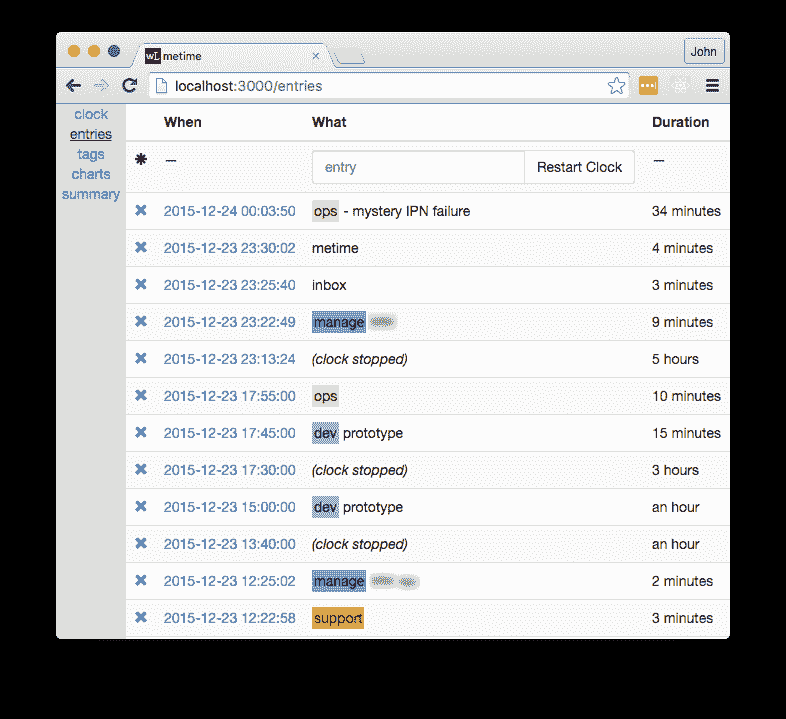

# 技术型联合创始人如何度过他们的时间:一年的分分秒秒的数据

> 原文：<http://jdlm.info/articles/2016/07/04/cto-time-minute-by-minute.html?utm_source=wanqu.co&utm_campaign=Wanqu+Daily&utm_medium=website>

**更新**

**2016-08-30** 黑客新闻上有一些关于这篇文章的热烈讨论[。](https://news.ycombinator.com/item?id=12385707)

* * *

我是总部位于伦敦的 SaaS 初创公司的联合创始人兼首席技术官。从 2014 年 8 月到 2015 年 12 月，我手动跟踪我所有的工作时间，每分钟，并在 r。

像大多数记录时间的人一样，我的目标是提高我的工作效率。它给了我数据来回答我在特定活动上花费的时间是太多还是太少的问题，例如用户支持或客户项目。数据显示，我对这些问题的直觉往往是错误的。

还有一些不太明显的好处。在周五，对于这个通常带有修辞色彩的问题，“这一周去了哪里？”我觉得它还减少了上下文切换:如果我停下手头的工作去回复聊天信息或电子邮件，我必须花时间把它记录在我的时间跟踪器中。我认为这种增加的摩擦是整体生产率的胜利，这或许有些矛盾。

这篇文章记录了我建立的记录时间的(简单)系统，我是如何分析数据的，以及结果。我学到的主要东西是:

*   我跟踪了平均每周超过 50 小时的实际工作时间。我更怀疑传说中的每周 130 小时工作制。
*   我的管理时间增加了 230%,因为开发团队增长了 200% (2 到 6 人),但有趣的是，我开会的时间减少了 70%。
*   我的开发时间基本保持不变，但这主要是因为它从工作周转移到了周末。

在分析数据的过程中，我也学到了很多关于回归的知识。我写了一份详细的，我希望可以得到的关于它的附录，给那些对具体细节感兴趣的人。

CTO 是一个非常多样化的角色，我不期望这里的结果在总体上是正确的。这只是我的故事。希望是有意思的，而且是唯一有数据做后盾的！

## 背景

我可能应该说一下公司的背景。

我和我的[联合创始人](https://twitter.com/DrHammersley)在 2012 年底创办了[。到 2014 年 8 月，当我的时间追踪实验开始时，我们已经通过了一个名为](https://www.overleaf.com/) [Bethnal Green Ventures](https://bethnalgreenventures.com/) 的加速器，雇佣了我们的第一个开发者，总共 3 名员工，并从伦敦的贸易投资者 [Digital Science](https://www.digital-science.com) 那里筹集了一轮种子资金。到 2015 年 12 月，当我的实验结束时，我们有[多达 9 名员工](https://www.overleaf.com/about)，其中 5 名是向我汇报的开发人员。我们开始主要是 B2C，但随着我们试图向大学和学术出版商销售产品，我们变得越来越 B2B。我们现在有大约 40 万用户。

该产品是一个类似谷歌文档的在线协作编辑器，但专门用于科学论文——它出色地完成了公式、数字、表格、参考文献等的排版工作。，主要是通过在引擎盖下使用古老的 LaTeX 排版系统。所以，我们是一家非常古怪的公司，这里鼓励像这样疯狂的实验。

## 方法

你可以在这部分找到更多关于我如何收集和处理我的时间跟踪数据的信息，或者你可以直接[跳到图表](#results)！

### metime 应用程序

**更新 2016-08-30:** 我现在已经[开源了 metime](https://github.com/jdleesmiller/metime) 以防你想看的更详细。

我构建了一个简单的 web 应用程序来记录我的时间。有很多时间追踪应用程序，但我想要一些我可以定制的东西。既然是写在[流星](https://www.meteor.com/)里，我就叫它“metime”。它不会赢得任何奖项，但它做了工作。它看起来像这样:



关键点是:

*   在每个活动的**结束**时，我在 app 里记录了一个条目来描述。
*   每个条目包含一个或多个**标签**和一个包含更多细节的可选注释。

为了便于输入，我使用了简单的文本格式。标签由空格分隔，标签列表由连字符与注释分开。

例如，在截图的顶部，在`2015-12-24 00:03:50`，我完成了一个标记为`ops`的活动，并添加了一条注释，说明我正在尝试调试一个“神秘的 IPN 故障”。之前的参赛项目是在`2015-12-23 23:30:02`，所以那个`ops`活动的时长是 34 分钟。

如果我在一项活动后停止工作，当我回到工作岗位时，我会按下“重启时钟”按钮。这产生了一个特殊的`(clock stopped)`信息。例如，我从`17:55:00`到`23:13:24`不打卡，大约 5 个小时，可能是为了吃晚饭和陪家人。

当然，我有时会忘记录入。在这种情况下，我会一次创建几个条目，然后编辑时间戳以获得大致正确的持续时间。这就是为什么有些时间戳是可疑的整数。这样做很痛苦，这提供了实时跟踪事情的额外动力。

我决定使用标签而不是类别，所以我可以将一个商务会议标记为`biz`和`meeting`。该应用程序可以识别并对一些标签进行颜色编码，但破折号之前的任何单词都被视为标签。我还标记了人、项目和客户(在上面的截图中模糊了)，但出于明显的原因，我必须保持这些数据的私密性。

正如标记经常发生的那样，我的标记习惯在实验过程中发生了变化，所以最后我有一个相当漫长而艰巨的任务，将各种标记合并成一个更一致的集合，以便在本文中进行分析。主要标签及其含义如下:

*   行政、销售、营销、投资、供应商管理、管理用户反馈、指标和分析
*   编码、原型制作、线框、操作、缺陷调查和缺陷修复
*   阅读简历、面试、合同、会面、与招聘人员打交道
*   `inbox`:关注电子邮件和通知
*   个人计划、冲刺计划、培训开发、一对一、设备、代码评审、回顾
*   `meeting`:预定会议和电话
*   `metime`:在我的应用程序中跟踪时间所花费的时间(以及构建应用程序所花费的时间)
*   `qa`:手动测试
*   `support`:最终用户支持

### 数据处理

需要一些额外的处理来正确处理时区、夏令时和节假日。

该应用程序没有记录每条消息的时区,而这可能是它应该记录的。对于“一天中的时间”的计算，时区是必要的，以便考虑到夏令时和旅行，因为我有相当多的美国和欧洲大陆的旅行。我返回并根据我的日历手动添加了时区数据。

我认为没有必要对假期进行特殊的注释，但是仅仅将它们作为“时钟停止”包括在内会导致一些相当大的异常值，因为度过假期的一周显然不是典型的一周。所以，我也手工标注了我的假期。(我确实休了一些假！亲提示:如果你真的想下线，去中国；伟大的防火墙将保护您免受大多数电子邮件。)

## 结果

生成的数据集是一个包含 2014 年 8 月 17 日和 2015 年 12 月 23 日之间 11，978 个条目的表，时间跨度为 493 天。每个条目都有一个开始时间(UTC)、时区和持续时间(以秒为单位),每个标签有一个布尔列。还有一个`stopped`伪标签，表示时钟停止了。对于上面截图的后半部分，该表如下所示:

```
 start            tz  duration holiday stopped   biz   dev hiring inbox manage meeting metime    qa support
...
2015-12-23 17:45:00 Europe/London   600.000   FALSE   FALSE FALSE  TRUE  FALSE FALSE  FALSE   FALSE  FALSE FALSE   FALSE
2015-12-23 17:55:00 Europe/London 19104.000   FALSE    TRUE FALSE FALSE  FALSE FALSE  FALSE   FALSE  FALSE FALSE   FALSE
2015-12-23 23:13:24 Europe/London   565.000   FALSE   FALSE FALSE FALSE  FALSE FALSE   TRUE   FALSE  FALSE FALSE   FALSE
2015-12-23 23:22:49 Europe/London   171.000   FALSE   FALSE FALSE FALSE  FALSE  TRUE  FALSE   FALSE  FALSE FALSE   FALSE
2015-12-23 23:25:40 Europe/London   262.252   FALSE   FALSE FALSE FALSE  FALSE FALSE  FALSE   FALSE   TRUE FALSE   FALSE
2015-12-23 23:30:02 Europe/London  2028.444   FALSE   FALSE FALSE  TRUE  FALSE FALSE  FALSE   FALSE  FALSE FALSE   FALSE 
```

我将其中的 41 天标记为假期，并将其从随后的结果中排除。剩下 452 天，平均每天 26 个条目。现在来看图表！

### 时钟上的时间

也许是最基本的问题:我花了多少时间工作？我平均每周工作 52 小时(虚线水平线)。2015 年 5 月至 6 月的下降是由于假期前后。


这些数字来自对“工作”的一个相当严格的定义。如果我花了几分钟去添满杯子或者伸伸腿，或者去上厕所，或者读读黑客新闻，我就停止了计时，所以这不算工作。

在我们谈论 130 小时工作周的行业里，52 小时没什么可夸耀的，但我不认为我被称为懒惰。我没有记录我的非工作时间，但我仍然更加意识到我是如何度过的。每天有几个小时被吃饭、通勤、卫生和其他琐事占据。回想我每周工作 70 个小时的那几周，通常是因为我避免(或忽略)了其中的一些事情。当然，我们都需要睡觉，当日子不好过的时候，你会很高兴至少有一些工作以外的生活。创业是马拉松，不是短跑。

### 标签时间

接下来，我是怎么度过那段时间的？在整个期间，最大的两个标签是`biz`和`dev`，平均每周 18 小时。管理和会议排在第三和第四位，接下来是招聘和客户支持。


值得注意的是，一些标签经常重合(例如`biz meeting`)，因此将不同标签的持续时间相加并不总是有意义的。然而，标签之间的比较是可以的。

同样值得注意的是，我用`metime`标签跟踪了我花在跟踪时间上的时间。(很 meta。)我只在花了一分多钟左右跟踪的时候加了一个`metime`条目，一般都是在错过几个条目之后正在追赶的时候。所以，这有点低估了，但这是相当低的，大约每周一小时。

### 一段时间的趋势

随着时间的推移，我度过时间的方式发生了怎样的变化？完整的每周和标签数据对于一个图来说太多了，而且相当嘈杂，所以为了回答这个问题，我运行了几种回归，并决定采用对数线性回归。血淋淋的(但有趣！)模型和结果的详细信息在[附录](#appendix-regressions)中。值得注意的趋势(和非趋势)如下。

| 标签 | 初始小时/周 | 最终小时/周 | 变化百分比 | p < 0.05 |
| --- | --- | --- | --- | --- |
| 商业 | Twenty | Thirteen | –36% | -好的 |
| 偏差 | Seventeen | Sixteen | –3.1% |   |
| 收件箱 | One point three | Two point nine | 120% | -好的 |
| 经营 | Three point one | Ten | 230% | -好的 |
| 会议 | eight | Two point three | –72% | -好的 |
| 质量保证 | One point two | Two point eight | 120% | -好的 |
| 支持 | Three point three | one point six | –51% | -好的 |
| (时钟上的总时间) | forty-nine | Fifty-three | 8.6% |   |

例如，在实验过程中，我每周花在`biz`上的平均时间减少了 36%，从 20 小时减少到 13 小时。最后一列中的刻度表示这一趋势在 p = 0.05 的水平上具有统计学意义，也就是说，尽管存在周与周之间的差异，但我们可以相当肯定地说，该标签的平均水平确实有下降趋势。

看看其他具有统计意义的趋势，总体情况是，随着团队的壮大，我的角色发生了变化，包括更多的管理(`manage`)、质量保证(`qa`)和回复电子邮件(`inbox`)。也许令人惊讶的是，尽管管理呈上升趋势，但会议呈下降趋势(`meeting`)。这可能是因为我的许多管理活动，比如代码审查，都是通过 GitHub 和各种聊天程序进行的，而不是在预定的会议上。此外，许多会议是为了完成`biz`的任务，比如会见客户，而且总体`biz`活动减少了，因为它被管理活动所取代。

我还包含了没有明显趋势的两行:`dev`和时钟上的总时间。时钟上没有明显的时间趋势，这意味着在实验过程中，我花在工作上的总时间并没有增加多少；主要是我所从事的工作发生了变化。我们将在下一节看到为什么我的总`dev`时间保持不变。

总而言之，这里有一个图表显示了前 5 个标签的每周小时数(褪色的阶梯线)和对数线性趋势线(粗线)，因此您可以感受一下数据的实际情况。这里的`onClock`伪标签表示时钟上的总时间。


### 一周对周末

我什么时候做了某些类型的工作，随着时间的推移这种情况有所改变吗？为了回答这个问题，我将条目按时间细分为三类:

*   周五晚上 7 点到周一早上 7 点
*   周一至周五上午 7 点至下午 7 点
*   剩余时间(周一至周四晚上)

上午 7 点和下午 7 点的阈值是当地时间，考虑了时区和夏令时。

然后，我对一天中的每个时间类别重复上一节中的回归分析；细节再次在[附录](#appendix-regressions)中。由于跟踪的大部分时间是在工作日，统计上显著的趋势大体上保持不变。然而，通过分解工作日和周末，我们获得了`dev`在统计上的显著趋势，以及对`support`更细微的理解，如下所示。

| 标签 | 一天中的时间 | 初始小时/周 | 最终小时/周 | 变化百分比 |
| --- | --- | --- | --- | --- |
| 偏差 | 周末 | Three point six | Eight point five | 140% |
| 偏差 | 工作日 | Eleven | Six point five | –40% |
| 支持 | 周末 | Zero point two nine | Zero point six eight | 130% |
| 支持 | 工作日 | Two point four | Zero point eight three | –65% |

表格显示，每周大约有五个小时的开发时间从我的工作日转移到了周末。换句话说，虽然管理活动取代了工作日的开发，但我主要是通过在周末做更多的开发来弥补这种下降。用户支持活动也向周末迁移，但这不足以抵消我们在上一节中看到的整体下降趋势。

这个发现对我来说是适度的警告，首先是因为我没有真正注意到它的发生，其次是因为，“我只是在周末做那个关键的开发任务”，显然不适合作为一个策略。在我们计划下一轮招聘时，这是非常有用的信息。

最后，这是这些信息的图表形式。该图与之前的图相似，但数据是按一天中的时间分面的。`dev`中的积极趋势和消极趋势清晰可见，工作日中的其他重要趋势也是如此。


## 结论

我记录了自己创业生涯中一段激动人心的时光。数据清楚地显示了我作为 CTO 的角色在这段时间里的变化，从建立 MVP 转变为发展和管理一个团队来构建产品。它帮助我提高了对如何利用时间的理解和认识。

这就引出了一个问题，我为什么停下来？正如你所料，记录一切变得乏味。我也开始觉得我的数据收集走在了数据分析的前面，这在任何研究项目中都是一个重要的警告信号。我的应用程序内置了一些简单的图表，但没有真正的分析。直到现在，六个月后，我才有机会真正进入数据集，这给了我新的想法来跟踪其他东西和不同的系统来跟踪它们。

这个项目是我最近一次做研究。因为背页主要是研究人员的工具，它是一个有用的提醒，提醒人们研究是什么样的。很容易忘记研究过程有多乱。这篇博文有大约 3000 行充满死胡同的 R-markdown 文件支持，如果它是一篇论文，可能会有很多很多。

我最初的计划是公开这篇文章的数据和分析，这是我过去一直做的。不过，这次我已经决定反对了。我还没有完全意识到这个数据集会有多私人和私密，尽管这只是我的工作时间，尽管我已经删除了更具商业敏感性的标签和注释。我也很高兴我拥有通过我的应用程序收集的数据，而不是把它交给第三方。

当我停止追踪时，我有几天感到很迷茫，但这种感觉最终过去了。我已经转而制作待办事项清单来组织我每天打算做的事情，我发现这比记录一整天要简单得多。我试着吸取一些经验，比如减少上下文切换，并分别应用它们。所以，我不打算很快再次这样跟踪我的时间，但我正在考虑跟踪一两个月，做一个“那时和现在”的比较，今年晚些时候。敬请期待！

* * *

感谢[霍普·托马斯](https://twitter.com/h0peth0mas)和[约翰·哈默斯利](https://twitter.com/DrHammersley)审阅本文草稿。

如果你已经读到这里，也许你应该[在推特](https://twitter.com/jdleesmiller)上关注我，或者甚至申请在背面的[工作。`:)`](https://www.overleaf.com)

## 附录:回归

标签数据中有足够的周-周可变性，我们不能只看图；我们需要做一些统计来发现重要的趋势。我使用了两种主要方法:线性回归和对数线性回归。

线性回归是最简单的，因此是我尝试的第一个。我主要担心的是它会预测一个标签的负持续时间，这是没有意义的。一条(非水平的)直线趋势线必须在某处与 x 轴相交，当趋势急剧上升或下降时，这很容易发生。幸运的是，在这种情况下，线性回归结果表现得相当好，它们在实验期间本身没有预测到任何负值。然而，他们确实在实验前后不久预测到了负值。

这促使我也研究对数线性回归，这仅仅意味着我们将持续时间的对数建模为线性函数，而不是持续时间本身。这意味着持续时间本身是一个指数函数，这确保了它总是正的。本文主体中报告的结果来自对数线性回归。

### 数据准备

我首先按周和按标签汇总数据，以获得每个标签每周的总持续时间。设\(i\)表示周数，第一周为\(i = 0\)，设\(t\)表示标签，为`biz`、`dev`等中的一个..设\(s_{it}\)是 tag \(t\)在周\(i\)中的持续时间之和，设\(S_i\)表示周\(i\)的总持续时间，两者都以秒为单位。

由于夏令时的原因，各周的持续时间可能略有不同，由于节假日的原因，持续时间可能会有较大差异，但节假日已从数据集中移除。为了控制可变周持续时间的影响，让

\[d _ { it } = 24 \乘以 7 \乘以 s_{it} / S_i \]

是周(I)和标签(t)的比例持续时间，以每周额定(24 小时乘以 7 小时)小时为单位。

最后，由于我们可以自由选择回归输入的比例，以使输出系数更容易阅读，这也将有助于让

\[ w_i = \frac{i}{52.17746} \]

是经过缩放的周数。分母是典型年份的平均周数，所以第一周为\(w_i = 0\ ),一年后为\(w_i = 1\)。数据集中的最后一周是\(w = 1.32241\)，我们称之为\(w_\max\)。

结果数据集如下所示:

```
 utcBucket       t          s      S           d         w
...
2014-10-25 23:00:00  manage  21540.242 608400  5.94799582 0.1724883
2014-10-25 23:00:00     biz  99940.840 608400 27.59707613 0.1724883
2014-10-25 23:00:00   inbox    930.477 608400  0.25693645 0.1724883
2014-10-25 23:00:00     dev  26555.566 608400  7.33289791 0.1724883
2014-10-25 23:00:00 support  13020.592 608400  3.59542974 0.1724883
2014-10-25 23:00:00  metime   1286.681 608400  0.35529653 0.1724883
2014-10-25 23:00:00  hiring   5898.124 608400  1.62867329 0.1724883
2014-10-25 23:00:00 onClock 166329.261 608400 45.92918450 0.1724883
2014-10-25 23:00:00      qa      0.000 608400  0.00000000 0.1724883
2014-10-25 23:00:00 meeting  20911.815 608400  5.77446568 0.1724883
2014-11-02 00:00:00  metime    578.111 604800  0.16058639 0.1916536
2014-11-02 00:00:00     dev  62853.446 604800 17.45929056 0.1916536
2014-11-02 00:00:00 onClock 150366.738 604800 41.76853833 0.1916536
2014-11-02 00:00:00      qa      0.000 604800  0.00000000 0.1916536
2014-11-02 00:00:00  hiring      0.000 604800  0.00000000 0.1916536
2014-11-02 00:00:00 support  13011.108 604800  3.61419667 0.1916536
2014-11-02 00:00:00  manage  20345.111 604800  5.65141972 0.1916536
2014-11-02 00:00:00 meeting  19357.701 604800  5.37713917 0.1916536
2014-11-02 00:00:00     biz  56968.522 604800 15.82458944 0.1916536
2014-11-02 00:00:00   inbox   1800.000 604800  0.50000000 0.1916536
... 
```

值得注意的是，第一周的周持续时间(S_i\)大于第二周，因为第一周的夏令时发生了变化，而且一些周和标签的持续时间为零。

### 线性回归

现在我们有了合适形式的数据，我们准备运行一些回归！因为我们说过我们会首先尝试最简单的东西，所以我们的第一个模型是一个简单的线性回归模型。我们将为每个标签运行单独的回归，因此为了简化符号，我们将去掉\(t\)下标。对于每个单独的标签，我们断言

\ begin { equation } d _ { I } = a w _ I+b+ \ var epsilon _ { I } \ label { linear-model } \ end { equation }

其中\(d_i\)和\(w_i\)是周\(i\)的缩放持续时间和周数，正如刚刚定义的那样，\(a\)和\(b\)是由所讨论的标签的回归确定的系数，而\(\varepsilon_i\)是噪声项，假设从零均值正态分布中提取。

在一个例子的上下文中解释这一点很有帮助，所以这里是 R 在对`manage`标签运行回归后生成的摘要输出。阅读它需要一些时间来适应，但它包含了许多有用的信息:

```
Call:
lm(formula = d ~ w, data = subset(data, t == 'manage'))

Residuals:
    Min      1Q  Median      3Q     Max
-5.9996 -2.0362 -0.3115  1.6047  8.8690

Coefficients:
            Estimate Std. Error t value Pr(>|t|)    
(Intercept)   3.6726     0.7169   5.123 2.68e-06 ***
w             4.6316     0.9420   4.917 5.85e-06 ***
---
Signif. codes:  0 ‘***’ 0.001 ‘**’ 0.01 ‘*’ 0.05 ‘.’ 0.1 ‘ ’ 1

Residual standard error: 3.113 on 68 degrees of freedom
Multiple R-squared:  0.2623,	Adjusted R-squared:  0.2514
F-statistic: 24.17 on 1 and 68 DF,  p-value: 5.854e-06 
```

让我们从系数开始。`(Intercept)`和`w`系数分别是我们所说的\(b\)和\(a\)。这些系数的`Estimate`允许我们使用\eqref{linear-model}根据周数预测`manage`标签的持续时间。所以，在实验开始时，当\(w = 0\)时，我平均每周花\(a \乘以 0 + b = b = 3.7\)小时在管理上。一年后，当\(w = 1\)时，我平均每周\(a \乘以 1 + b = a + b = 3.67 + 4.63 = 8.3\)小时。(我们假设噪声项平均为零，所以在讨论平均值时可以忽略不计。)

`Pr(>|t|)`列中的 p 值给出了利用这种大小的数据集获得至少同样大的估计值的概率(由于噪声),即使真实系数为零。系数实际为零的假设通常被称为*零假设*。对于\(b\)系数，零假设是在实验开始时，当\(w = 0\)时，我没有进行任何管理。对于\(a\)系数，零假设是在实验过程中，我每周的平均管理量没有总体变化(也就是说，没有趋势)。

经验法则是，p 值 0.05 足够小，我们可以感觉到结果具有统计学意义，并且我们的 p 值确实比该阈值小得多(小几个数量级)，因此我们可以安全地拒绝两个系数的零假设。

`Std. Error`列给出了每个系数的采样分布的标准偏差，即在 1 个标准偏差下系数误差线的大小。所以，我们可以这样写，比如每周(b = 3.7 \pm 0.7\)小时。

R 平方值(接近底部)为 0.26(可能值为 1.0)，表明仍有许多周与周之间的差异，这是这个非常简单的模型无法解释的。[残差](https://en.wikipedia.org/wiki/Errors_and_residuals#Regressions)的分布，即预测持续时间和观察持续时间之间的差异，以每周小时数表示，讲述了一个类似的故事——它们相对于预测值来说相当大。然而，对于一个简单的人类行为模型来说，这些拟合度统计数据实际上并不坏，尤其是当它只有一个人的时候！

依次对每个标签重复这些回归，关键输出是:

| 标签 | \(b\) | \(a\) | \(p_a\) | \(R^2\) | 变化百分比 |
| --- | --- | --- | --- | --- | --- |
| onclick | 50 ± 2 | 3 ± 2 | Zero point one seven | Zero point zero two seven | 9 ± 7 |
| **商业** | **21 2** | **-4 2** | **0.047** | **0.057** | **-30 10** |
| 偏差 | 18 ± 2 | 0.2 ± 2 | Zero point nine four | 8.8e-05 | 1 ± 20 |
| 雇用 | 2.0 ± 0.7 | 1.2 ± 0.9 | Zero point one eight | Zero point zero two six | 80 ± 90 |
| 收件箱 | 1.8 ± 0.3 | 0.8 ± 0.4 | Zero point zero seven one | Zero point zero four seven | 60 ± 40 |
| **管理** | **3.7±0.7** | **4.6±0.9** | 5.9e-06 | **0.26** | **170 60** |
| **会议** | **7.8±0.7** | **-4.4±0.9** | 7.3e-06 | **0.26** | **-70 10** |
| 时间 | 0.9 ± 0.3 | -0.4 ± 0.4 | Zero point three one | Zero point zero one five | -60 ± 40 |
| **qa** | **0.7 0.4** | **2.0±0.5** | **0.00023** | **0.18** | **400 300** |
| **支持** | **3.6±0.4** | **-1.3±0.5** | **0.0087** | **0.097** | **-50 10** |

此处报告的 p 值(p_a\)用于趋势(a\)，具有统计显著性(\(p_a < 0.05\)趋势的标记以粗体显示。对于\(b\)和\(a\)，报告的值是\(b \pm \sigma_b\)和\(a \pm \sigma_a\)，其中\(\sigma_b\)和\(\sigma_a\)表示回归输出中对应的`Std. Error`值。

百分比变化是我在整个实验期间花费在每个标签上的时间的估计变化，我在这篇文章的正文中谈到过。计算为\(100 \乘以 a w \max/b \ ),其不确定度由通过商\(a / b\)传播不确定度的公式给出:

\[\ pm 100 \ left | \ frac { a w _ \ max } { b } \ right | \ sqrt { \left(\frac{\sigma_a}{a}\right)^2+\left(\frac{\sigma_b}{b}\right)^2-2 \ frac { \ sigma _ { ab } } { ab } } \]

这里\(\sigma_{ab}\)是两个系数估计值之间的协方差。r 也为我们计算回归中的协方差；它没有显示在上面的摘要输出中，但是可以通过`vcov`函数获得。

总的来说，结果似乎是合理的。在实验范围内没有负面预测，这很好。然而，一些更陡的斜率，如`qa`和`manage`标记的斜率，会在实验期前不久产生负的估计值，这是令人担忧的，因为这表明例如`qa`标记非常大的 400%的增长可能是虚假的。

### 对数线性回归

鉴于上述线性回归结果中发现的潜在问题，下一步自然是尝试对数线性回归。这意味着我们断言，久期的对数，而不是久期本身，具有线性趋势。也就是说，我们断言

\[\ log d _ I = u w _ I+v+ \ var epsilon _ I \]

其中\(d_i\)、\(w_i\)和\(\varepsilon_i\)如前，而\(u\)和\(v\)是回归中待确定的系数(如同线性模型中的\(a\)和\(b\)。唯一的问题是\(d_i\)现在不能为零，因为\(\log 0\)是未定义的。为了解决这个问题，我们只排除那些(d_i)为零的值；大部分零持续时间是针对我们在这篇文章中没有太注意的次要标签的。

虽然模型看起来相似，但对系数的解释却有很大的不同。如果我们对模型的两边取指数，我们会发现持续时间现在表示为乘积而不是总和:

\[d _ I = \ exp(u w _ I+v+ \ var epsilon _ I)=(e^u)^{w_i} \乘以 e^{v} \乘以 e^{\varepsilon_i} \]

如果我们让\(U = e^u\)、\(V = e^v\)和\(E_i = e^{\varepsilon_i}\)来简化符号，我们可以更容易地看出，这个方程的一般形式是

\[d _ I = v \乘以 u^{w_i} \乘以 E_i \]

所以我们可以把(V)看作初始量，把(U)看作增长因子。If \(U > 1\)，持续时间随着过去的一周而增长，if \(U < 1\), it shrinks. The scaling we chose for \(w\) means that \(U\) is effectively an annual growth factor, since \(w = 1\) occurs after one year. The noise factor, \(E_i\) is drawn from a [对数正态分布](https://en.wikipedia.org/wiki/Log-normal_distribution)。像以前一样重复回归，我们得到以下输出:

| 标签 | \(V\) | \(U\) | \(p_u\) | \(R^2\) | 变化百分比 |
| --- | --- | --- | --- | --- | --- |
| onclick | 49 ± 2 | 1.06 ± 0.05 | Zero point one nine | Zero point zero two five | 9 ± 7 |
| **商业** | **20 2** | **0.7 0.1** | **0.026** | **0.071** | **-40 10** |
| 偏差 | 17 ± 2 | 1 ± 0.1 | Zero point eight seven | 0.00041 | -3 ± 20 |
| 雇用 | 1.3 ± 0.5 | 1.4 ± 0.7 | Zero point four two | Zero point zero one one | 60 ± 100 |
| **收件箱** | **1.3 0.2** | **1.8±0.3** | **0.00084** | **0.15** | **120 50** |
| **管理** | **3.1 0.5** | **2.5±0.5** | 2.1e-05 | **0.24** | **230 90** |
| **会议** | **8 1** | **0.38 0.08** | 4.9e-05 | **0.24** | **-72 8** |
| 时间 | 0.45 ± 0.09 | 0.8 ± 0.2 | Zero point five | 0.0073 | -20 ± 30 |
| **qa** | **1.2 0.3** | **1.8±0.5** | **0.026** | **0.089** | **120 80** |
| **支持** | **3.3 0.4** | **0.58 0.1** | **0.0015** | **0.14** | **-50 10** |

\(U\)、\(V\)和百分比变化的不确定性使用通过指数运算传播不确定性的局部展开法进行近似。对于某些较大的相对不确定性，这种近似可能不是很精确，但它至少给出了一个粗略的指示。对于\(U\)，不确定度为\(\ pm \ sigma _ U \)，对于\(V\)也是类似的。百分比变化计算如下

\[100 次(U^{w_\max} - 1) \pm 100 次\西格玛 _ u w _ \马克斯·u^{w_\max}\]

与线性回归结果相比，我们看到了\(R^2\拟合优度统计数据的混合图像，有些较大，有些较小。令人担忧的对标签增长 400%的大估计已经减少到不那么令人担忧的 120%。另一方面，管理时间的变化从线性回归中的 170%增加到对数线性回归中的 230%。然而，总的来说，这两种模型之间的百分比变化在误差范围内是一致的。在这两个模型之间，我没有多少可以选择的，但是对数线性回归似乎更有原则，所以我在本文的主体部分使用了它的估计值。

### 时间回归

对于“一天中的时间”分析，我简单地重复了每个标签和一天中的时间的对数线性回归。结果是一样的。

| 一天中的时间 | 标签 | \(V\) | \(U\) | \(p_u\) | \(R^2\) | 变化百分比 |
| --- | --- | --- | --- | --- | --- | --- |
| 周末 | onclick | 4.9 ± 0.9 | 1.5 ± 0.4 | Zero point one three | Zero point zero three five | 70 ± 60 |
| 周末 | 商业 | 0.6 ± 0.2 | 0.8 ± 0.4 | Zero point six seven | 0.0045 | -30 ± 50 |
| **周末** | **开发** | **3.6±0.7** | **1.9±0.5** | **0.013** | **0.099** | **140 80** |
| 周末 | 雇用 | 0.4 ± 0.2 | 0.8 ± 0.6 | Zero point eight three | Zero point zero zero five | -20 ± 80 |
| 周末 | 收件箱 | 0.2 ± 0.05 | 0.8 ± 0.2 | Zero point five one | Zero point zero one | -20 ± 30 |
| 周末 | 经营 | 0.4 ± 0.1 | 0.5 ± 0.3 | Zero point two | Zero point zero eight one | -60 ± 30 |
| 周末 | 时间 | 0.4 ± 0.3 | 0.2 ± 0.2 | Zero point one two | Zero point one four | -90 ± 20 |
| 周末 | 质量保证 | 0.6 ± 0.6 | 0.8 ± 1 | Zero point eight eight | 0.0069 | -20 ± 100 |
| **周末** | **支持** | **0.29 0.06** | **1.9 0.6** | **0.048** | **0.075** | **130 100** |
| 工作日 | onclick | 38 ± 1 | 0.99 ± 0.05 | Zero point eight eight | 0.00034 | -0.9 ± 6 |
| **工作日** | **商业** | **17 2** | **0.59 0.1** | **0.0027** | **0.13** | **-50 10** |
| **工作日** | **开发** | **11 1** | **0.7 0.1** | **0.021** | **0.078** | **-40 10** |
| 工作日 | 雇用 | 1.4 ± 0.5 | 1.3 ± 0.6 | Zero point five six | 0.0063 | 40 ± 80 |
| **工作日** | **收件箱** | **1.1 0.1** | **1.9 0.3** | **0.00023** | **0.19** | **140 60** |
| **工作日** | **管理** | **3 0.5** | **2.6±0.6** | 1.5e-05 | **0.25** | **300 100** |
| **工作日** | **会议** | **8 1** | **0.44 0.1** | **0.00039** | **0.19** | **-66 10** |
| 工作日 | 时间 | 0.2 ± 0.03 | 1.5 ± 0.3 | Zero point zero five two | Zero point zero six two | 70 ± 50 |
| 工作日 | 质量保证 | 1.1 ± 0.3 | 1.6 ± 0.6 | Zero point one seven | Zero point zero three seven | 90 ± 90 |
| **工作日** | **支持** | **2.4±0.4** | **0.5 0.1** | **0.0013** | **0.15** | **-70 10** |
| 工作夜 | onclick | 3.5 ± 0.7 | 1.2 ± 0.3 | Zero point five eight | 0.0049 | 20 ± 40 |
| 工作灯 | 商业 | 1 ± 0.3 | 1.2 ± 0.5 | Zero point six four | 0.0041 | 30 ± 70 |
| 工作灯 | 偏差 | 1.5 ± 0.5 | 1 ± 0.4 | Zero point nine seven | 2.7e-05 | -2 ± 60 |
| 工作夜 | 雇用 | 0.4 ± 0.2 | 0.5 ± 0.3 | Zero point three one | Zero point zero seven eight | -60 ± 30 |
| 工作灯 | 收件箱 | 0.25 ± 0.05 | 0.6 ± 0.2 | Zero point zero six one | Zero point zero eight seven | -50 ± 20 |
| 工作灯 | 经营 | 0.26 ± 0.09 | 1.1 ± 0.5 | Zero point eight two | 0.0021 | 20 ± 70 |
| 工作灯 | 会议 | 0.3 ± 0.3 | 2 ± 3 | Zero point eight one | 0.0085 | 90 ± 500 |
| 工作灯 | 时间 | 0.22 ± 0.09 | 0.4 ± 0.3 | Zero point one eight | Zero point zero seven one | -70 ± 30 |
| 工作灯 | 质量保证 | 1 ± 0.7 | 0.5 ± 0.4 | Zero point four four | Zero point zero six | -60 ± 50 |
| 工作灯 | 支持 | 0.5 ± 0.1 | 1.1 ± 0.4 | Zero point eight eight | 0.00066 | 8 ± 60 |

### 其他税收减免

我还用每月汇总而不是每周汇总来检查这些结果，并获得了类似的结果。每月回归的数据点更少，因为样本中的月数只有周数的四分之一，但月内的平均数也比周内的平均数多，所以数据的噪音更小。因此，每月回归的\(R^2\值通常较高。预测值与每周结果在误差范围内一致。

值得一提的是，虽然对数线性回归确保我们不会在物理上现实的持续时间上越过下限，即零，但它并不阻止我们越过上限，这是因为一周只有一定数量的小时。然而，虽然我们相当接近某些标签的下限，但我们距离所有标签的上限(大约每周\(7 \乘以 24 = 168\)小时)相当远，所以这不太重要。也许逻辑回归的一些变化会让我们考虑这两个边界，但那是另一篇文章。

这篇文章中的结果来自运行多个单变量回归。我还用每个标签的指示(虚拟)变量(和一天中的时间，用于分析)运行了多变量线性回归。多变量回归返回相同的系数，因为聚集的数据在标签之间被完美地分割；也就是说，每行正好有一个指标变量为 1。然而，由于数据的固有噪声以及频繁使用的标签(如`dev`)和较少使用的标签(如`metime`)之间持续时间的巨大差异，存在显著的异方差。这使得拟合优度和统计显著性指标信息较少。

我记得多年前和我的博士生导师有过一次争论，当数据可以分割时，是运行一个大的回归模型好还是运行许多小的模型好。当时我主张使用一个大的回归模型。这个项目之后，我改变了我的想法；理解许多简单的模型比理解一个复杂的模型更容易。

### 参考

我发现这两篇文章对理解回归的实用性特别有帮助:

* * *

如果你已经读到这里，恭喜你！你可以在推特上关注我，获取更多类似的帖子。`:)`