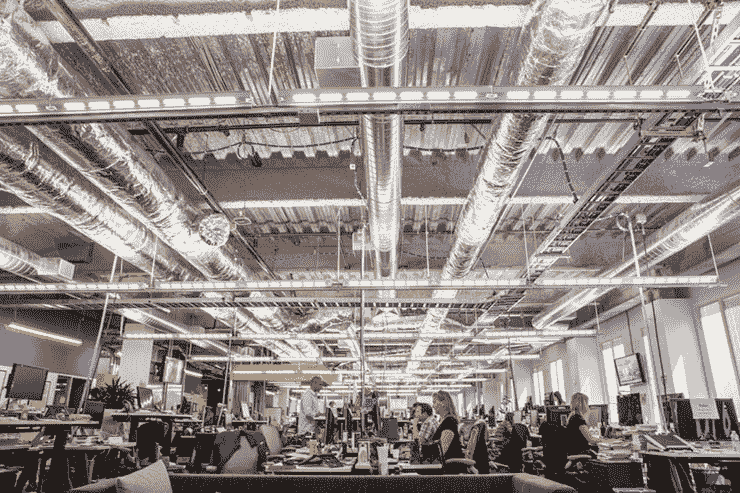
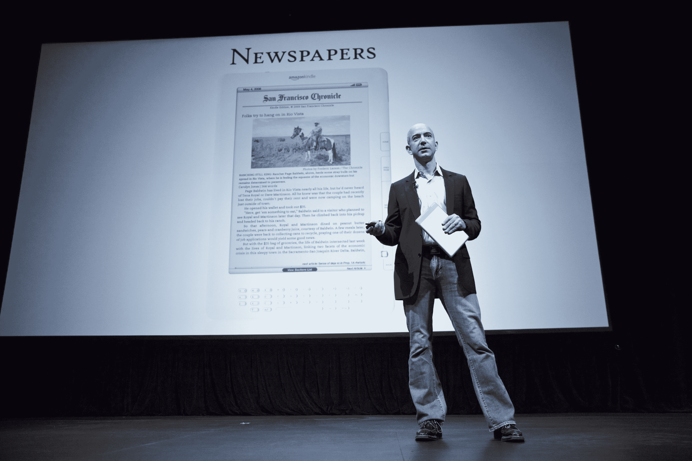
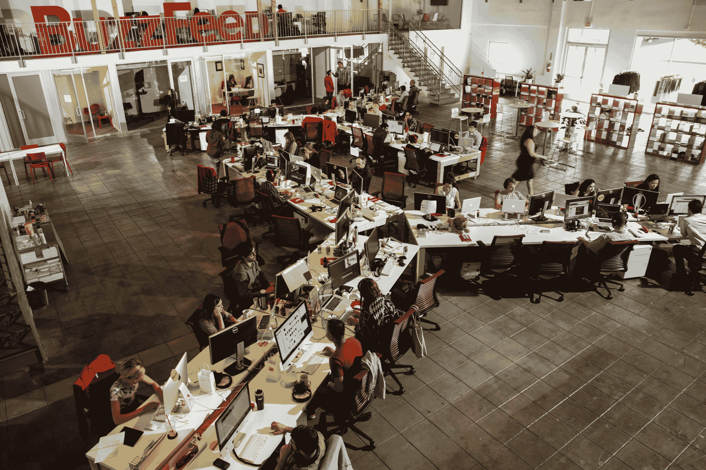

# 访问、责任报告和硅谷-尼曼报告

> 原文：<http://niemanreports.org/articles/media-company-or-tech-firm/?utm_source=wanqu.co&utm_campaign=Wanqu+Daily&utm_medium=website>

像谷歌和脸书这样的公司，他们的办公室在这里显示，现在被认为是新闻业的重要组成部分

我第一次去脸书在华盛顿特区的办公室时，被要求签署一份保密协议。我没有。

还有一次，我采访了苹果公司的一位产品经理，结果却被告知，这被认为是背景资料。“每个人都知道这是我们做事的方式，”一位发言人抱歉地解释道。没有。

就在几年前的圣诞节前，惠普送了我一台亮粉色的笔记本电脑，这是我从未要求过的。我把它退回去了。

我收到了 iPhones、国际机票和数不清的小玩意。“我也可以发一份新闻稿草稿和一大瓶葡萄酒给你，让你坐着看完我的邮件；)，”一位公关人士在 3 月份写道。

这就是 2016 年做科技记者的感觉。免费赠品无处不在，但真正能获得的却很少。像脸书和谷歌这样的强大公司是新闻工作的主要分销商，这意味着新闻编辑室越来越依赖科技巨头来接触读者，这种关系往好了说是尴尬，往坏了说可能是灾难性的。尤其是脸书，也在促使主要新闻编辑室调整他们的编辑和商业策略，包括向社交媒体网站直播视频以换取付费的举措。其他社交平台也正在成为发布者，包括 Snapchat Discover 和 Reddit，它们最近发布了一个编辑团队的职位列表。

在某些情况下，媒体公司和科技公司之间的界限变得越来越模糊。一些拥有强大新闻编辑室的网站的领导者，比如 BuzzFeed，甚至称自己首先是科技公司，其次是新闻机构。现金充裕的媒体初创企业和至少一份传统报纸《华盛顿邮报》为科技巨头所有。

然而，硅谷的领导人并不都是媒体的拥护者。风险投资家、PayPal 联合创始人彼得·泰尔投入了 1000 万美元的自有资金，最终导致 Gawker Media Group 在去年春天破产。Univision 在 8 月份以 1.35 亿美元收购了 Gawker，并在不久后关闭了其旗舰网站 Gawker.com。(Gawker 网络中的其他网站，如 Jezebel 和 Gizmodo，仍在运行。)Gawker 和 Thiel 的摊牌本身就是一场争端，但它也可以被视为媒体公司和技术公司之间更广泛紧张关系的缩影，这种关系如此紧张，正如 Nicholas Lemann 在《纽约客》中所写的那样，新闻业应该为自己的“持久战”做好准备

在某些情况下，媒体公司和科技公司之间的界限变得越来越模糊

在这种背景下，科技报道提出了现代新闻业最深刻的问责挑战之一。我们的覆盖范围对谁最有利？这是我们应得的和需要的覆盖范围吗？

《纽约时报》的科技记者大卫·斯特雷特菲尔德说:“硅谷的问责报告，就像任何地方的问责报告一样，既困难又重要。”。“科技界没有问责报告的伟大传统，也没有像白宫报告或市政报告那样的崇高前辈。没有伍德沃德和伯恩斯坦，也没有科技报道的凯特·布。”

我们今天所知的科技报道始于 20 世纪 80 年代初，不是因为一些调查冲动，而是因为个人电脑时代刚刚开始，报纸突然开始销售大量与科技相关的广告。《纽约时报》的资深科技记者约翰·马科夫(John Markoff)记得硅谷的原始文化是开放和合作的——甚至欢迎记者。80 年代初，Markoff 加入了家酿计算机俱乐部，这是一个传奇的业余爱好者团体，其成员包括后来经营硅谷的技术专家。苹果公司的联合创始人史蒂夫·沃兹尼亚克在 1976 年的一次家酿会议上首次分享了他的 Apple I 电脑设计。

“家酿计算机俱乐部的一个奇妙之处是每个计算机公司都会聚在一起，”Markoff 回忆道。“正是在这个随机访问时期，人们会分享公司机密。对于一个年轻的记者来说，这就像死了，然后去了天堂。但这是硅谷的原始文化。”

在接下来的几十年里，管理技术部门的人从占据一个小众的文化和经济空间变成了这个星球上最强大的商业领袖。硅谷的文化和影响力发生了巨大的变化。“早期，苹果是边缘产品，”《连线》杂志的创始执行主编凯文·凯利说。“这是书呆子气。现在的区别是，这些公司是世界上最赚钱的公司。这不再是一场杂耍；这是主秀。”

尽管苹果处于硅谷早期开放文化的中心，但也是这家公司促成了一场逆转。史蒂夫·乔布斯完善了产品惊喜的艺术，通过主持主题演讲为苹果公司制造了巨大的轰动，这些演讲都是人们热切期待的。有时，对此类事件的过度报道似乎既是粉丝文化的产物，也是为粉丝文化服务的新闻。

这也是一种鼓励有限访问的新闻方法。硅谷的保密文化也来自互联网提供的出版力量。科技巨头就像政治候选人一样，不再仅仅依靠媒体来传达他们的信息。

 

亚马逊创始人杰夫·贝索斯对《华盛顿邮报》的所有权引发了关于他在多大程度上参与了该报编辑工作的质疑

反过来，一些世界上最强大的公司最终决定了对它们的报道达到惊人的程度——因为记者通常只依赖这些公司发布的信息，除了一些关键的例外，很少有机会质疑它们。“这就是为什么像谷歌这样的公司可以用一些实际上还没有准备好的技术的承诺来让人们眼花缭乱，”《今日美国》的前副主编约翰·m·辛普森说，他是非营利倡导组织消费者监督机构的隐私项目主任，他在那里专注于谷歌。例如，与报道谷歌的众多记者相比，[辛普森一直是该公司无人驾驶汽车项目](http://www.consumerwatchdog.org/newsrelease/consumer-watchdog-says-nhtsa-must-protect-safety-require-steering-wheel-driver-robot-car)最突出的批评声音之一。

常见的技术报道都是直接从一家科技公司的博客(相当于现代版的新闻稿)中汇总而来，很少或根本没有分析或额外报道。这种缺乏怀疑态度的一个明显例子是早期对 Theranos 的热情报道，这家健康技术公司表示，它已经开发出一种廉价的无针采血和验血方法。直到去年，一名来自华尔街日报的调查记者受到 Theranos 创始人 T2 在《纽约客》上的一篇充满阳光的简介的启发，开始严肃地询问这项技术是否真的像 Theranos 声称的那样工作。约翰·卡雷鲁的报道也鼓励其他记者更加怀疑，并最终导致联邦刑事调查该公司是否在其技术状态上误导了投资者和监管者。

像卡瑞鲁这样的调查——或者像《纽约时报》去年所做的那样深入了解亚马逊严酷的企业文化；或者详细描述谷歌强大而隐蔽的游说努力，比如《华盛顿邮报》的[；或者将像脸书的免费基础这样的项目的文化复杂性联系起来，正如我曾经尝试过的](https://www.washingtonpost.com/politics/how-google-is-transforming-power-and-politicsgoogle-once-disdainful-of-lobbying-now-a-master-of-washington-influence/2014/04/12/51648b92-b4d3-11e3-8cb6-284052554d74_story.html)；或者对苹果和联邦调查局之间的斗争进行深入报道，这是开始理解技术的复杂社会和政治影响的唯一途径。

科技公司“都致力于改造我们的日常生活，”斯特雷特菲尔德说，他与乔迪·坎特一起为《纽约时报》报道和撰写了这篇亚马逊文章。“当他们成功时会发生什么？谁输了？当他们跌倒时，就像印度的脸书，这意味着什么？在我看来，科技的崛起是我们这个时代的伟大故事。”

坎特补充道:“科技公司是先锋。他们决定着文化的走向。它是文化的发源地，也让我们看到了自己的未来。”

为了他们的亚马逊故事，坎特和斯特雷特菲尔德采访了 100 多名亚马逊现任和前任员工。坎特说，在与亚马逊员工的采访中，她听的比说的多，故事只是从人们口中涌出。她说，关于人们经常在办公桌前哭泣的令人难忘的轶事反复出现，而且不仅仅是来自他们最终引用的那个人。“很久以前，当我还是一名年轻的记者时，我就被告知，最好的故事往往是调查一些显而易见的事情，”斯特雷特费尔德说。“在这种情况下，亚马逊从一开始就说——甚至自夸——这是一个要求极高的工作场所。我们所做的只是问，这意味着什么？”

一个主要的报道障碍是渗透保密文化。事实证明，LinkedIn 是一个至关重要的来源，一位斯特雷特菲尔德说，他梳理了几个小时:“它就像一张企业 x 光照片。”总而言之，施特莱菲尔德和坎特花了六个多月的时间——即使在《纽约时报》看来，这也是一种奢侈——报道了这个故事，这个故事引起了公众的极大关注，并以公关反击的形式在媒体上发表，遭到了迅速的指责。亚马逊以及谷歌、优步、苹果和脸书的代表要么拒绝了这篇报道的采访请求，要么根本没有回应这些请求。

“制作一个像亚马逊那样的故事，或者任何挑战社区自我概念的关于技术社区的报道，最大的挑战是，技术想要，期望，并且经常得到乐观的作品，”斯特雷特菲尔德说。“有一种感觉，在太多的科技报道中，当你跨过大桥进入硅谷时，你就处于一个旧的新闻规则不再适用的世界。硅谷最老生常谈的一句话是，他们说，‘这不是钱的问题。我们只想改变世界。有时这甚至可能是真的。但这是更好覆盖的原因，而不是更弱。"

但哥伦比亚新闻学院数字新闻 Tow 中心主任艾米丽·贝尔(Emily Bell)表示，许多领先的新闻机构，即使是那些拥有强大技术部门的新闻机构，也没有投入足够的资源来开发和维持这样的报道。“要真正恰当地报道技术，”贝尔说，“它关乎社会、文化和人权。是关于政治的。这种想法，你可以有一个华盛顿局，那里没有真正理解[计算]基础设施或人工智能中的一些问题的人，以及数据如何真正具有政治性？它们是新的权力体系，而这是我认为新闻机构发展缓慢的领域之一。”

虽然贝尔和其他人认为，对计算机和互联网如何工作的基本理解对所有记者来说都是必不可少的，但真正的技术报道并不局限于技术部分。技术塑造了商业、文化、政治、教育和日常生活的方方面面。只要看看苹果和联邦调查局之间关于苹果是否应该被要求解锁加州圣贝纳迪诺致命恐怖袭击中一名枪手的 iPhone 的斗争的复杂性就知道了。(最终，美国联邦调查局表示，它能够在没有苹果帮助的情况下解锁该设备。)

“有恐怖主义，有技术，有苹果，有美国联邦调查局，奥巴马也参与进来了，”《纽约时报》编辑谭佩荣说，他协调了报纸对争议的报道。“它跨越了各种不同的事物。它将关于加密和隐私的非常理论化的辩论带入了现实世界。”

从某些方面来说，报道一个像加密争议这样的大事件，比搞清楚日常或长期的技术报道更直接。坎特说:“重要的是要真正宽泛地定义覆盖技术，而不是认为它只覆盖硅谷的一群初创公司。”她举了一个[的例子，她写了一个关于自动日程安排软件](http://www.nytimes.com/interactive/2014/08/13/us/starbucks-workers-scheduling-hours.html)的故事，这是一个被星巴克这样的大公司使用的软件，它给低薪工人带来了压力和混乱。“这是一个基本上没人听说过的软件，真的很难懂，但它控制着数百万工人的生活，”她说。文章发表后 24 小时内，[星巴克宣布将改变其排班惯例](http://www.nytimes.com/times-insider/2014/08/22/times-article-changes-a-policy-fast/)。

“有一种感觉，在太多的科技报道中，当你穿过大桥进入硅谷，你就置身于一个旧的新闻规则不再适用的世界”——大卫·斯特雷特菲尔德，NYT 科技记者

对于坎特来说，报道技术意味着质疑技术影响人们生活的方式——这是一个如此广泛的框架，对于必须决定报道什么的记者来说，它可能会令人眼花缭乱，也可能是一种解放。

调查报告中心(Center for Investigative Reporting)的网站 Reveal 本身没有技术板块，但它涵盖了技术，其中大部分属于隐私和监控领域。对该网站的资深编辑费尔南多·迪亚兹(Fernando Díaz)来说，“聚焦范围更窄，有助于利用调查记者长期积累的知识，也有助于让观众在我们的报道方面保持一定的一致性，即我们致力于一个特定的主题。”

例如，Reveal 报道了一个由加州警察保存的涉嫌帮派成员的秘密数据库，以及执法部门是否需要搜查证才能访问数字记录的问题。这种故事特别适合无情的后续报道——这种势头你可能会在一个轰动性的独家新闻之后在地铁日报的页面上看到。有监管和法律的角度来探索，加上大量的问题，这样一个数据库的存在如何影响个人，并反映了执法机构在其他地方使用的工具。

Reveal [发表了一篇关于公众成员如何可能在不知道](https://www.revealnews.org/article/you-may-be-in-californias-gang-database-and-not-even-know-it/)的情况下进入数据库的故事，而[发表了另一篇关于将数据库开放给更多公众监督的立法的故事](https://www.revealnews.org/article/bill-to-shed-light-on-californias-gang-database-moves-forward/)。但截至 7 月中旬，该网站自 4 月以来没有在监控和隐私部分发表过任何内容。许多这样的报道需要大量的资源，而很少有新闻编辑室拥有这些资源——也就是报道它们所需要的时间。迪亚斯说:“长期、长期、深入调查的工作之间存在固有的挑战，当新闻的节奏如此之快时，这种工作有可能会感到乏味。”“我们必须为这种特殊的节奏找出一种更适中的速度，因为科技发展得太快了。”

我是《大西洋月刊》的特约撰稿人，该报尝试了一种类似的方法来保持敏捷，深入特定的节拍，[部分受到 Quartz 在 2012 年推出时建立的流畅节拍结构](http://www.niemanlab.org/2013/12/the-rise-of-the-fluid-beat-structure/)的启发。当我负责技术部分时，我请我们的一名记者罗宾逊·迈耶(Robinson Meyer)优先考虑“警察佩戴的人体摄像机”，作为他在密苏里州弗格森警察枪杀一名手无寸铁的青少年后几个月的主要工作之一。作为关于使用这类技术的更大范围的全国性对话的一部分，这个话题是及时的、复杂的，并对个人隐私和监控有着巨大的影响。迈耶对原本可以被认为是微拍的东西的关注，产生了一些引人入胜的、重要的、与全国相关的故事。

一个意想不到的好处是，在某些情况下，这种狭隘的方法扩大了迈耶的地理重点。在一个令人难忘的故事中，他发现在爱达荷州的一个城市里，警察佩戴的照相机已经很常见了。这篇报道有助于阐明围绕体戴式相机的政治——包括警察有时支持佩戴它们的命令这一事实，这一叙事在当时没有得到很好的探讨。它还挑战了该技术是新的或未经测试的想法，并有助于解决体戴式相机带来的实际责任问题。他接着写了这些问题，比如录像是否可以由官员编辑，它将如何存储和维护，以及最重要的是，公众如何访问它。

 

图中所示的艾伦·哈维被 Reveal 发现错误地记录在加州秘密黑帮数据库中。该网站本身没有技术部分，但它涵盖了技术，主要属于隐私和监控领域

现在，作为一名专职作家，我正在自己的作品中尝试类似的东西。我的一个拍子是“自动驾驶汽车”，这个名称足够窄，以鼓励深度，但又足够宽，以产生一连串有趣的故事想法。当然，我可能会撰写最新的谷歌事故报告，但我也会向州和联邦机构提交公开记录的请求，参观测试跑道和大学实验室，采访致力于为这些车辆开发特殊传感器的技术专家，阅读关于机器人与人类互动的学术著作，并报道国会听证会。随着这项技术的发展和普及，对调查报道的需求将变得更加明显。联邦政府正在对一名特斯拉司机使用汽车自动驾驶系统造成的致命事故进行调查，这可能是一个文化转折点，最终将塑造驾驶的未来。但这也是一个很好的例子，说明专注于无人驾驶汽车的垮掉的记者是如何(或应该)准备好报道这项调查及其引发的更广泛的问题的。

这些策略试图避免技术覆盖，用迪亚兹的话说就是“一英里宽一英寸深”。我不只是在报道谷歌，这家致力于此类技术的领先公司和塑造公众对它的看法的杰出声音，我还在跟踪技术本身以及它将融入公共生活的过程。

Tow 数字新闻中心的研究员萨拉·沃森(Sara Watson)表示，科技报道(尤其是批评)的质量正在提高，但仍有很长的路要走。“对技术的批评可以以多种不同的形式存在:报道、专栏、博客、商业版、讽刺、科幻小说，”她说。“在报道的关键方面，缺少的是对积极的、建设性的替代方案的关注。这是最难回答的问题，如果你是一名记者，这个问题就更难回答了。但帮助读者想象那些对我们或对我们的利益不太合适的东西的替代品，是让机构负起责任的一种方式。”

沃森说，进步的迹象可以在一些新闻编辑室的构成中看到。例如，在 BuzzFeed，专注于技术的旧金山分社有一名记者负责劳工节拍。“几年前，这是一个很难想象的职位，但考虑到人们对科技工作和劳动力市场混乱的担忧，这似乎是很自然的，”她说。

沃森认为，在某些情况下，做得最好的评论家不一定是记者，但可能是与科技行业关系最密切的人。她引用博客和科技企业家阿尼尔·达什(Anil Dash)和程序员马尔科·阿门特(Marco Arment)的话，称他们拥有“批评的声音”，他们“最接近机器，所以他们很受欢迎。”换句话说，他们说的话更有可能产生实际影响。

在技术世界里做一个相对的圈内人对记者来说也是有帮助的。马克·古尔曼从高中就开始报道苹果公司的科技内幕网站 9to5Mac，在业内被称为“独家新闻机器”，他刚刚大学毕业，在彭博找到了一份科技报道的工作。他最初在苹果培养消息来源，因为他对技术感兴趣——而不是新闻——并且知道如何去“合适的场合”去见人。这些联系，以及他对技术的理解，在他进入博客世界时，证明了对他的价值。“与在科技公司工作的人交谈，你必须具备一定的专业水平，”他说。“你必须会说同一种语言。”

他将自己成功爆料这个星球上最神秘的公司之一归功于与合适的人见面，并仔细选择故事。“我在平衡报道和大学生活，”他说，“所以我真的只有时间关注更大的新闻。”另外，他小心翼翼地补充道，“独家新闻不是来自公关人员。”

尽管有各种优秀的技术报道，但信噪比会让我们很难从垃圾中找出丑闻。

对记者来说，显而易见的困难是，你不可能面面俱到。当你深度覆盖一部分节拍时，选择跳过什么会有更大的压力。当然，任何一个记者在任何一个节拍上都面临着同样的压力。但由于新闻编辑室的资源有限且经常缩减，加上科技行业与媒体的关系越来越密切，它们变得更加困难。

毕竟，媒体公司不只是报道科技公司，而是与它们合作，并在更深的层面上与之竞争

即使对于网络原生媒体企业来说，2016 年也是亏损的一年。Mashable 解雇了几名编辑员工，作为编辑方向重大转变的一部分，计划将视频娱乐置于新闻之上。裁员也影响了国际商业时报、BuzzFeed、新闻周刊和 Vice News——尽管在 Vice，该公司将裁员描述为其更大规模视频扩张的一部分。

与此同时，观众一如既往地四分五裂，迫使新闻编辑室更加慎重地考虑他们在为谁服务。像 The Information、Pando Daily、Recode 和 TechCrunch 这样的网站在硅谷广为人知，但在科技行业之外不一定有影响力。在相反的方向有 The Verge，这是一个曾经的小众技术网站，已经超越了小工具的覆盖范围，专注于娱乐，科学和交通。(拥有 The Verge 的 Vox Media 去年收购了 Recode。)

在《The Verge 》,一种既重视广度又重视深度的编辑方法似乎获得了回报。它的编辑团队对当天的新闻报道非常敏感，但也经常以原创的专题报道发出惊叹，这些报道既涉及科技，也涉及商业、文化、健康和刑事司法。一个令人难忘的故事，其中科林·莱赫详述了监狱电话服务的垄断，无论是报道还是网上展示都令人印象深刻。它有一个自动收报机，如果你阅读这篇文章的时间是你在监狱里打电话的时间，它会计算你需要支付多少钱。

The Verge 最近还推出了一个新栏目——一个被称为[断路器](https://www.facebook.com/circuitbreaker)的小工具博客——主要以脸书页面的形式存在，这一举动表明了在数字空间进行实验的精明意愿，许多读者已经在这个空间花了很多时间。在脸书的成功似乎与新闻机构的福祉相左之际，这是一个大胆的举措。在其他地方，越来越多的新闻机构发现自己依赖于亿万富翁的财政支持。

易贝创始人皮埃尔·奥米迪亚创办了两家调查性新闻机构:2013 年创办了 First Look Media，在此之前，我在檀香山公民报(檀香山 Civil Beat)做了几年调查性记者，报道政治。亚马逊创始人杰夫·贝索斯在 2013 年以 2.5 亿美元收购了《华盛顿邮报》，此后他利用自己在科技产品上的所有权，在 Kindle Fire 应用上提供有限的免费阅读《华盛顿邮报》故事的机会，并为亚马逊 Prime 会员提供免费的六个月《华盛顿邮报》数字订阅服务，例如。他还在新闻编辑室进行了大量投资。

早在贝佐斯时代之前，《华盛顿邮报》就已经有了坚实的技术报道，包括专注于技术的文化和政策方面的专门博客(现在是时事通讯)。但目前还不清楚新闻编辑室的更多资源，或者贝佐斯大幅提升《华盛顿邮报》全国地位的目标，是否显著增强了该报现有的技术手段。这是局外人特别感兴趣的一个领域，他们想知道贝佐斯在多大程度上参与了编辑工作。《华盛顿邮报》驳斥了关于贝佐斯试图左右《华盛顿邮报》对亚马逊或他本人的报道的说法。当报纸发表《纽约时报》对亚马逊工作场所文化的调查时，很大程度上是同情贝佐斯的。标题是:“在亚马逊工作真的有那么难吗？”公平地说，这篇报道还重复了《纽约时报》报道中许多最具毁灭性的细节。另外，T2《华盛顿邮报》的媒体评论家埃里克·温普尔在他的博客上抨击亚马逊对《纽约时报》的回应“软弱无力”《华盛顿邮报》的女发言人妮莎·乔治表示，贝佐斯对该报的所有权“绝对不会”影响该报对他或他的公司的报道。该报拒绝了进一步置评的请求。

BuzzFeed 有自己强大而严肃的新闻业务，[因重振赞助内容](http://www.poynter.org/2013/the-problem-with-buzzfeeds-sponsored-posts/200214/)而引发争议，这是一种已经存在了一个世纪的广告策略，但在一个原子化内容单独在社交网络上传播的世界里，这种策略可能会变得复杂，因为它与最初的网站无关。即使是脸书，一个不是真正的新闻机构，但现在被认为对新闻业至关重要的平台，也面临着编辑决策的审查。早在五月，在 Gizmodo [报道](http://gizmodo.com/former-facebook-workers-we-routinely-suppressed-conser-1775461006)前脸书员工称他们经常压制保守派读者感兴趣的新闻报道后，脸书创始人兼首席执行官马克·扎克伯格[发表声明承诺没有这种偏见的证据](https://www.facebook.com/zuck/posts/10102830259184701)。《卫报》获得的内部文件描绘了一幅稍微微妙一些的画面:脸书指南指导编辑如何将故事“注入”脸书的“趋势话题”栏目，或者将话题“列入黑名单”以供删除。

8 月，一个谎称记者梅根·凯利因支持希拉里而被福克斯新闻频道解雇的恶作剧被脸书作为热门话题宣传了几个小时后被移除。9 月，Facebook 删除了挪威最大的报纸发布的一篇文章，该文章刊登了潘·thị·金·普克在越战时期的标志性照片，他经常被称为“凝固汽油弹女孩”脸书最初为这一决定辩护，称其符合禁止用户发布裸体儿童图片的标准。

《晚邮报》的编辑埃斯彭·埃吉尔·汉森回复了一封言辞激烈的公开信给扎克伯格。“首先，你制定了不区分儿童色情和著名战争照片的规则。汉森写道，他称扎克伯格为“世界上最强大的编辑”。最终，脸书让步了。但这一事件引发了新一轮的辩论，即脸书是否有道德义务承认其履行的新闻职能。

九月，在尼曼基金会的一次演讲中,《纽约时报》前执行主编吉尔·爱博松称脸书是“地球上最大的出版商”她指着因其新闻反馈和撤下获得普利策奖的凝固汽油弹照片而引发的愤怒说，“我不认为(脸书)能永远保持这种‘我们内容中立’的立场。他们必须站出来，承担一些责任。”

所有这些都发生在新闻业基于广告的收入模式比以往任何时候都不稳定的时候，新闻机构几乎已经失去了对发行的控制。根据社交媒体管理公司 Shareaholic 去年的数据，脸书推动了网络上压倒性的流量——高达所有网站访问量的四分之一，根据网络分析公司 Parse.ly 的数据，几个顶级新闻网站的流量占 40%。该平台最近决定在人民新闻订阅中强调个人状态更新，而不是出版商，这在新闻编辑室中引起了恐慌，最近几个月，脸书的流量已经大幅下降。

像脸书和谷歌这样的公司有能力建立或摧毁一个新闻编辑室。正如作家约翰·赫尔曼所说，这使得脸书成为一个令人生畏的“伙伴-竞争对手-救世主-杀手”。

毕竟，媒体公司不只是报道科技公司，而是与它们合作，并在更深的层面上与之竞争。如果说发行是关键因素，那么它只是其中很小的一部分。根据皮尤的 2016 年新闻媒体状况报告，脸书和谷歌，以及其他几家领先的科技公司，也攫取了整体数字广告收入的很大一部分——其中的 65%，即 2015 年互联网广告支出 600 亿美元中的 390 亿美元。

对新闻机构来说，更具毁灭性的是脸书在移动广告领域的主导地位。去年，当观众从台式机转向移动设备时，脸书已经从移动广告销售中获得了总广告收入的 77%。新闻机构的受众大多是手机用户，就整体收入或手机份额而言，它们远不及脸书。皮尤在报告中写道，“网络上也赚钱，只是不是新闻机构。”

 

BuzzFeed 有自己强大而严肃的新闻业务，但却因重振赞助内容而引发争议Jay l . clen denin/洛杉矶时报通过 Getty Images

这可能反映了脸书正在痛击媒体的另一个领域:观众参与度。虽然对个别新闻品牌的忠诚度正在下降——根据皮尤的另一项研究，大多数在手机上阅读文章的人不会在同一个月内在该网站上阅读任何其他文章——但与脸书的互动仍然高得惊人。在全球范围内，脸书用户平均每天在脸书、Instagram 和 Messenger 平台上花费 50 分钟，这一数据对大多数媒体公司来说是不可想象的。这种影响似乎正在蔓延到一个脸书参与相对较新的领域:直播视频。“CNN 只播放脸书的现场视频，”五名警察遇害当晚，华尔街日报的科技编辑 Scott Austin 在推特上写道。"脸书几乎一夜之间变成了一个电视广播网。"

事实上，几乎从任何角度来看，科技公司都比媒体公司强大得多。赫尔曼去年为《锥子》撰写文章，认为这两个部门之间的混乱可能不会自行解决，直到出现彻底的分裂——媒体放弃接触，拒绝遵守硅谷的规则，并完全接受其作为“边缘化和侵略性”敌对力量的角色。不过，他承认，像这样的第四等级可能无法维持下去。其他人，如《连线》杂志的凯利，采取了相反的策略。新闻机构远离脸书实际上不会解决媒体在移动社交时代面临的根本问题。

“解决方案必须来自问题所在的同一个矩阵，”凯利说。“我怀疑我们前进的方式不是依靠大型报纸调查聚光灯团队，而是会稍微分散一些，稍微生态一些，稍微系统一些。”

在过去一年左右的时间里，几家领先的科技公司在新闻生态系统中为自己开辟了更加突出的位置。最近的例子是脸书视频直播倡议。在此之前，是[即时文章](https://instantarticles.fb.com/)，一个去年春天与几个高调出版物一起推出的平台。(即时文章现在对所有出版商开放。科技公司也做出了类似的努力，利用新闻来保持人们的注意力，包括 [Snapchat](http://snapchat-blog.com/post/109302961090/introducing-discover) 、[谷歌新闻](https://googleblog.blogspot.com/2015/10/introducing-accelerated-mobile-pages.html)和[苹果新闻](https://developer.apple.com/news-publisher/)的项目。

对于新闻机构来说，这种合作关系意味着发行控制权的实质性放弃，而此时媒体公司已经失去了作为新闻和信息主要把关者的重要地位。

事实上，几乎以任何标准衡量，科技公司都比媒体公司强大得多

"我们应该重新获得对分销的控制吗？"拖车中心的铃声问道。“我认为，如果新闻机构连这种情况会如何发生都不知道，那将是令人遗憾的。只是说，“好吧，这已经被分解到广告销售、技术、营销等都可以缩减到我们所做的很小一部分的地步，我们相信谷歌、脸书和接下来的任何东西都将把高质量新闻的传播作为优先事项。”但是很容易看出这些出版技能是如何从出版中消失的。"

对于任何相信自主新闻运作作为一种基本价值的记者来说，这种前景都具有可怕的含义。“真正不同于政府和商业，是新闻业成为新闻业而不是公关业的原因，”贝尔认为。“你如何保持分离的完整性，同时又不能脱离系统之外？”

贝尔表示，新闻机构面临的挑战将是批判性地思考 2016 年及以后作为一家媒体公司到底意味着什么。作为一家新闻机构，不仅仅是卖报纸，甚至不仅仅是拥有一个网站。例如，纽约时报[正在出售自己的晚餐套装](http://www.bloomberg.com/news/articles/2016-05-05/new-york-times-to-start-delivering-meal-kits-to-your-home)——包括你可以在 NYT 烹饪网站上找到的食谱配料。

五年或十年前，领先的技术头脑的记者和媒体理论家经常谈论多元化收入的重要性。如今，这种对话已经发生了变化。媒体公司的任务不仅仅是创造更多的资金流；他们被迫重新考虑他们实际上在生产和销售什么——以及为快速增长的平台生产和销售什么。

“收入是产品的代表，”贝尔说。“收入多元化不仅仅意味着新的赚钱方式。这实际上意味着彻底改变你所做的事情，并准备好继续改变。”