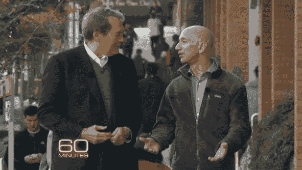

# 杰夫·贝索斯不得不召开 60 次会议为亚马逊筹集 100 万美元，将 20%的股份交给早期投资者 GeekWire

> 原文：<https://www.geekwire.com/2013/jeff-bezos-60-meetings-raise-1m-amazoncom-giving-20-early-investors/?utm_source=wanqu.co&utm_campaign=Wanqu+Daily&utm_medium=website>

Charlie Rose interviewing Amazon founder Jeff Bezos

Amazon.com 差点没能走出大门，年轻的杰夫·贝索斯遇到了一个共同的创业挑战:筹集资金。

在《60 分钟》的查理·罗斯采访中，贝佐斯回忆起 1995 年的那些日子，那时情况危急。

关于筹集资金的评论没有进入主要广播节目，这是有充分理由的，因为罗斯获得了独家新闻，披露 Amazon.com 正在试验一种通过无人机递送包裹的新系统。(**参见 GeekWire 早前的报道** : [亚马逊的大惊喜:会飞的无人机会把包裹送到顾客家门口](https://www.geekwire.com/2013/amazons-big-surprise-working-autonomous-flying-delivery-drones/))。

但是他们确实制作了一个 60 分钟的“额外”片段。贝佐斯谈到了筹集第一轮资金的更多情况。

> 贝索斯 :“查理，亚马逊最危险的时刻是在最开始的时候。在某个时候，我需要筹集 100 万美元，结果我为了 100 万美元放弃了公司 20%的股份。”
> 
> 罗斯:“对某些人来说，这是一笔了不起的交易。”
> 
> 贝佐斯:“很多人在那笔交易中获利颇丰(笑)。但他们也承担了风险，所以他们应该在这笔交易中表现出色。但是我不得不开了 60 次会议来筹集 100 万美元，我从 22 个人那里筹集到了大约每人 5 万美元。我是否能筹到那笔钱还很难说。所以，整件事可能在开始前就结束了。那是 1995 年，每个投资者问我的第一个问题是:‘互联网是什么？’"

当然，一些西雅图人从他们对亚马逊的早期投资中受益匪浅，包括 Madrona Venture Group 的汤姆·阿尔伯格(仍在公司董事会)和风险投资家兼企业家尼克·哈瑙尔(Nick Hanauer)(他已经卖掉了他的股份)。

听贝佐斯谈论他筹集资本的斗争，表明他没有忘记那些企业家的根源，这很有趣。事实上，这些评论可能预示着他在未来几年可能会如何花费估计为 270 亿美元的财富，也许会通过他的风险投资部门贝佐斯探险公司将更多的钱投入到新的风险投资中。

但是，就目前而言，贝佐斯非常专注于长期建设亚马逊。在主要采访中，贝佐斯谈到了所有公司如何随着时间的推移而失去光泽，指出“亚马逊有一天会被打乱”，并指出公司不可避免地“来来去去”。然后他告诉罗斯，他只希望在他死后亚马逊也能发生这样的事。

<object classid="clsid:d27cdb6e-ae6d-11cf-96b8-444553540000" codebase="http://download.macromedia.com/pub/shockwave/cabs/flash/swflash.cab#version=6,0,40,0"><param name="src" value="http://www.cbsnews.com/common/video/cbsnews_player.swf"><param name="scale" value="noscale"><param name="salign" value="lt"><param name="background" value="#000000"><param name="allowfullscreen" value="true"><param name="allowscriptaccess" value="always"><param name="flashvars" value="&quot;type=embed&amp;si=254&amp;pid=ap6AGn5UwYwL&amp;url=http://www.cbsnews.com/test"></object>