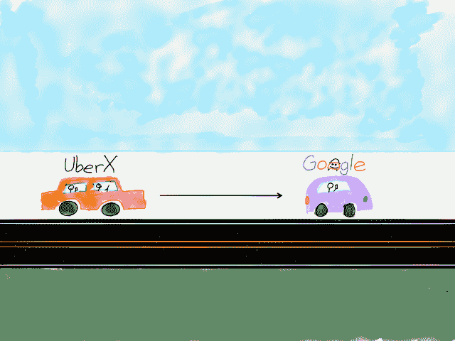
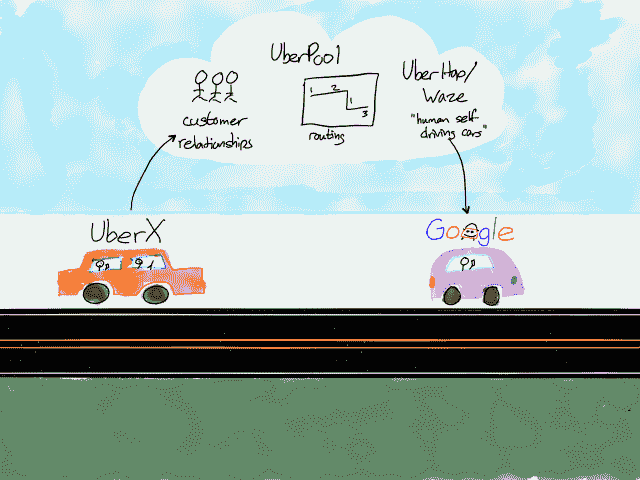

# 谷歌、优步和交通即服务的发展——战略

> 原文：<https://stratechery.com/2016/google-uber-and-the-evolution-of-transportation-as-a-service/?utm_source=wanqu.co&utm_campaign=Wanqu+Daily&utm_medium=website>

在我写完《汽车与未来》的八个月里，关于交通运输未来的新闻爆炸式增长，大部分发生在过去几周:

这五条新闻大致按照它们的重要性顺序排列；优步和谷歌是最重要的。

#### 从 UberX 到谷歌的自动驾驶汽车

当思考交通即服务的未来时，很容易从 UberX 到谷歌自动驾驶汽车画一条直线:

[T2】](https://i0.wp.com/stratechery.com/wp-content/uploads/2016/08/stratechery-Year-One-287.png?ssl=1)

优步首席执行官特拉维斯·卡兰尼克肯定能看出其中的联系；本月早些时候，他告诉彭博:

> 卡兰尼克说:“当我们清楚山景城的朋友将进入拼车领域时，我们需要确保有一种替代(自动驾驶汽车)。“因为如果没有，我们就没有生意了。”他补充说，开发自动驾驶汽车“对我们来说基本上是生死攸关的。”

优步的问题是，他们在拼车市场的主导地位是建立在乘客和司机的双边市场基础上的，这一点我两年前在[为什么优步打架](https://stratechery.com/2014/uber-fights/)中解释过:

> 司机和骑手市场确实相互作用，正是这种相互作用创造了赢家通吃的动态……在优步和 Lyft 的情况下，拼车(理论上)是习惯性的，两家公司都将确保价格相似，差异化的主要手段是汽车流动性，这有利于更大的服务。随着时间的推移，有理由假设多数玩家将成为主导。

这确实是拼车市场的发展方式:截至今年早些时候优步提供了美国超过 80%的拼车服务(Lyft 竞争的唯一市场)，尽管 Lyft 决心花费数亿美元补贴和免费乘车。另一方面，优步[本月早些时候离开了中国](https://stratechery.com/2016/didi-acquires-uber-china-why-uber-china-was-doomed-was-uber-china-worth-it/)，厌倦了花费自己的数十亿美元徒劳地试图取代占主导地位的滴滴。

自动驾驶汽车以两种重要方式改变了这些市场动态:首先，司机不再是一种稀缺资源，这意味着不再有双边市场力量在发挥作用。第二，改变消费者习惯和偏好的最佳方式是降低价格，而消除司机是实现这一目标的最显而易见的方式。

难怪优步在无人驾驶汽车上投入了如此巨大的资金，包括[雇佣了大量卡耐基梅隆大学的研究人员](http://www.wsj.com/articles/is-uber-a-friend-or-foe-of-carnegie-mellon-in-robotics-1433084582)(因此无人驾驶试验的地点在匹兹堡)，以及为奥托支付了约 6 . 8 亿美元。

卡兰尼克告诉《商业内幕》,优步仍然落后:

> 我想我们正在赶上。看看一些人，他们在这上面工作了多长时间。对他们开创的领域充满敬意，我们必须迎头赶上。这没关系，但这意味着我们要早起，我们要晚睡。

我相信卡兰尼克的话；然而，优步仍然有一些非常重要的优势，这使得这场比赛比它看起来更复杂，我上面描述的旅程比它看起来更不线性。

#### 运输即服务的五个组成部分

司机和乘客对于理解交通即服务(TaaS)的未来很重要，但他们不是唯一重要的部分——也不是优步仍然具有优势的唯一领域。我认为真正重要的有五个组成部分:

*   司机
*   汽车
*   绘图
*   按指定路线发送
*   附文

从 UberX 模型到自动驾驶汽车的转变需要改变每个部件。

**TaaS 1.0: UberX**

很明显，为什么司机和骑手是这里最重要的部分:司机自带汽车，现有的地图解决方案足够好，路线选择相对简单。诚然，*相对*修饰语是重要的:管理车手和车手之间每天数百万场比赛是一项非常复杂的任务，而优步多年来一直致力于底层算法的事实是一大优势。这也是一个将变得越来越重要的优势。

TaaS 1.5: UberPool

UberPool 可以说是优步迄今为止推出的最重要的服务，看看它的各个组成部分就知道为什么了:

*   司机:同 UberX
*   汽车:同 UberX
*   映射:与 UberX 相同
*   路由:相对于 UberX，复杂性大幅增加
*   乘客:相对于 UberX 的期望变化(以及关于上下车点的行为)

路由部分是最重要的；优步投资者比尔·格利(Bill Gurley)称，开发必要的算法以使 UberPool 取得成功是一个 [BHAG:重大而大胆的目标](http://abovethecrowd.com/2015/01/30/ubers-new-bhag-uberpool/)，这是一项对优步未来至关重要的投资。

首先，正如 Gurley 的标题所示，让 UberPool 背后的算法正确是一个极其复杂的问题。这基本上是类固醇上的旅行推销员问题，唯一真正的解决方法是慢慢地但肯定地找出在现实世界中有效的启发式方法。 [1](#fn1-2258 "Machine learning is relatively ineffective at solving this specific type of problem") 将这一现实与优步在司机和乘客中占主导地位的事实相结合，使该公司有足够的流动性在多个市场提供 UberPool，结果是优步在解决这些问题方面无疑远远领先于现有和潜在的竞争对手。

这一点之所以重要，是因为制造自动驾驶汽车就像制造智能手机一样:当然，这是一个难题，但就交通即服务而言，这只是等式的一半。毕竟，如果没有云，iPhone 或 Android 设备会有多大用处呢？类似地，围绕自动驾驶汽车建立的交通即服务公司不仅需要能够自动驾驶的汽车，还需要后端的整个基础设施，以最大化无疑将是对汽车本身的巨大资本投资的方式告诉这些汽车准确地去哪里。

这可能是谷歌基于 Waze 的拼车服务背后的动机。卡兰尼克可能是对的，谷歌在无人驾驶汽车方面领先，但在告诉这些汽车向何处去方面，他们还有很多工作要做。

**TaaS 2.0:人类自动驾驶汽车**

关于新 Waze 服务的一个更有趣的事实是，它是真正的拼车服务:谷歌将价格限制在每英里 54 美分，这意味着仅靠出租汽车是不可能赚钱的。更平淡无奇的是，这恰好是美国国税局的标准里程费率，这意味着谷歌可以振振有词地声称他们的服务正在促进拼车和分享油钱，而没有雇用承包商的所有复杂问题。

尽管如此，真正的拼车本身也是一种重要的交通即服务的演变，我在去年的文章中提到过。从短期到中期来看，如果汽车是一种沉没成本，而且司机无论如何都会走那条路，那么与已经朝你的方向前进的人一起搭车实际上比自动驾驶汽车更经济。在那篇文章中，我将这种拼车服务称为“人力驱动的自动驾驶汽车”

请注意，这再次标志着“运输即服务”中组件的重要转变:

*   司机:因为他们已经朝那个方向去了，他们实际上是自由的
*   汽车:因为它们已经被购买用于运送司机，它们实际上是免费的
*   映射:与 UberX 相同
*   路由:比 UberPool 稍微复杂一些
*   骑手:与 UberPool 类似的体验

这篇文章发表几周后，优步推出了 UberCommute 鉴于 UberCommute 的经济性正在接近无人驾驶汽车，这意味着该公司在解决商业模式方面也处于领先地位。

**TaaS 3.0:自动驾驶汽车**

无论何时无人驾驶汽车到来，交通即服务拼图中的几乎每一块都将不同于今天的 UberX:

*   司机:不存在！
*   汽车:自动驾驶，这意味着至少在开始时可能会非常昂贵，需要大量的资本成本
*   映射:更加详细
*   路由:与 UberPool 相似的复杂性
*   乘客:类似于 UberCommute/Waze 的经济学

请注意，有两个关键的飞跃需要完成:汽车*和*地图。谷歌在地图领域显然遥遥领先，但优步[正在投资 5 亿美元](http://www.ft.com/cms/s/0%2Fe0dfa45e-5522-11e6-befd-2fc0c26b3c60.html?ft_site=falcon&desktop=true#axzz4G0M5oyu8)追赶，就像它在自动驾驶技术上做的一样。

然而，这一分析的要点是强调，尽管优步必须做所有的工作，但他们绝不是因为谷歌的进入而注定失败，因为从 UberX 到谷歌的自动驾驶汽车没有一条直线:

[T2】](https://i0.wp.com/stratechery.com/wp-content/uploads/2016/08/stratechery-Year-One-288.png?ssl=1)

事实上，优步在路线、商业模式和客户忠诚度方面有自己的优势，这些优势同样强大，而且可能比谷歌的技术领先地位更有说服力。

#### 阻碍未来

有了这个框架，就更容易理解我为什么要对这五条新闻进行排序了:

*   福特当然知道怎么造车，但自动驾驶技术是软件问题；没有证据表明福特有能力超越谷歌或优步。此外，尽管福特相对较低的利润率可能使拼车服务具有吸引力，但该公司的几乎每个方面都需要从产品模式转变为服务模式，这比该公司在自动驾驶技术方面领先的可能性更小。我认为，福特更有可能最终与谷歌或优步合作，成为原始设备制造商。
*   特斯拉是一家在技术上比福特先进得多的公司，并且已经在考虑制造轮子上的计算机。此外，它今天有数千辆汽车在路上行驶，既捕捉数据，又测试自动驾驶技术([是好是坏](https://stratechery.com/2016/the-tesla-autopilot-fatality-uber-partners-with-hertz/))。然而，特斯拉在建立服务业务时面临几个重大障碍:它没有路由能力；它将汽车作为产品销售，而不是服务；而且，坦率地说，在负现金流赶上它之前，它已经忙着建造 Model 3 了。 [2](#fn2-2258 "One company I haven’t mentioned is Apple, but I put them in the same category as Tesla: they are a product company with legitimate questions about their cloud capabilities")
*   Nutonomy 非常有趣，不仅仅是因为他们的技术，还因为他们处理交通即服务中最重要的部分——政府——的聪明方式。多年来，我一直认为新加坡可能是无人驾驶汽车起飞的第一个地方:只要你摆脱那些讨厌的人类司机，这项技术就已经在发挥作用，而新加坡多年来一直对汽车进行严格限制，说得委婉一点，新加坡的政府结构可以完全摆脱非无人驾驶汽车。从那里开始，Nutonomy 在现实世界的体验和迭代方面有很大的优势，可以从新加坡跳板到其他城市地区。

那就只剩下谷歌和优步了，尽管有昨天的新闻，我仍然看好优步的机会。

首先，用卡兰尼克的话说，自动驾驶汽车的发展对公司来说是“生死攸关”的。永远不要低估简单生存的激励力量，另一方面，请记住谷歌在任何非广告业务中的表现是多么糟糕。

第二，我怀疑优步的路线优势(当你遇到一个走错路的司机时，这种优势可能会令人恼火)是真实存在的:告诉汽车去哪里是一个极其困难的问题，而优步有多年的领先优势。

第三，任何关于自动驾驶汽车对优步构成威胁的讨论，都倾向于想象这样一个世界，在这个世界里，如果没有数百万辆自动驾驶汽车，也会有数万辆自动驾驶汽车奇迹般地立即随处可见。从纯物流的角度来看，这是不切实际的；制造所有这些汽车所需的时间——更重要的是，获得政府批准——是优步必须赶上的时间。

此外，完全不清楚谷歌是否愿意进行必要的投资来建立一支可以与优步抗衡的无人驾驶车队。该公司最近缩减谷歌光纤的规模在这方面很有启发性:对于一个建立在搜索广告利润基础上的公司来说，很难承受组建一支能够在一两个以上的市场挑战优步的舰队所需的资本成本。

最后，作为运输即服务领域的现任者，优步的优势在于只需要做得足够好。在一定程度上，该公司可以建立 UberPool 和 UberCommute，他们可以确保他们自己的无人驾驶汽车能够得到消费者的优先考虑，这些消费者接受过培训，无论何时外出都可以打开他们的应用程序。

不用说，接下来的几年将会引人入胜。唯一可以肯定的是，优步和谷歌之间的竞争将会非常激烈。

### *相关*