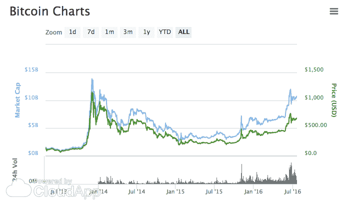
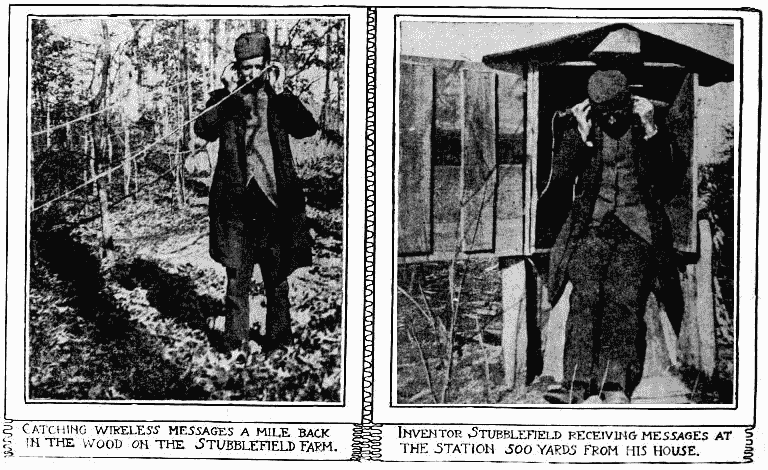

# 乔纳森·利博夫的《初级风险投资》

> 原文：<http://whoo.ps/2016/08/31/a-junior-vc?utm_source=wanqu.co&utm_campaign=Wanqu+Daily&utm_medium=website>

前言:这篇文章综合了我在 USV 做分析师时学到的一些东西。如果这些想法和观察完全是我自己的，这篇文章的标题应该是“我是如何在风险投资中成功的”。此外，这篇文章的灵感来自于我最近阅读的吴添的《总开关》，我引用了他的观点。

我从一家名为 [Appsfire](http://appsfire.com/) 的公司加入了 USV。Appsfire 始于 2010 年，是一款用于发现应用的应用。我们在 App Store 和谷歌 Play 商店上运营，帮助人们发现和消费应用。2010 年，开发人员正在计算所有的原子单位和用户体验，以及利用传感器和在移动设备上赚钱的方式。随着 2008 年至 2014 年间应用程序的爆炸式增长，消费者几乎无法跟上人们在 iPhone 上可以做的所有有趣和富有成效的事情。

我是 Appsfire 的产品经理，所以自然会花很多时间看应用程序。作为一名设计师，我非常关注应用程序图标的精细度和排版中的选择。我知道很多关于如何在设计和用户体验的基础上在应用商店取得成功；我知道太多关于如何玩游戏或如何花你的方式到应用商店的顶端；除了大多数人从阅读科技杂志中获得的一些陈词滥调之外，我对创业公司如何真正成功知之甚少。

因此，当我 2014 年 9 月开始在 USV 工作时，我非常擅长发现优秀的应用程序，在发现优秀的企业时非常天真(嗯，可能有一个例外)，对风险投资非常无知。阅读布拉德·菲尔德的[风险交易](https://www.amazon.com/Venture-Deals-Smarter-Lawyer-Capitalist-ebook/dp/B00AO2PWOI/ref=sr_1_1?s=books&ie=UTF8&qid=1468921940&sr=1-1&keywords=venture+deals)很有帮助，尽管即使是几个月，当有人在周一的会议上说出“优先参与”这样的术语时，我会花十秒钟在脑海中回忆这个定义，直到我有点明白 USV 的合伙人在说什么。

2014 年底，是时候撰写我们的第四季度报告并促进审计了，这是我真正开始学到很多东西的时候。USV 的分析师大约 25%的时间花在与基金相关的管理工作上。我在其他风险投资公司遇到的许多分析师和同事都不这么认为。我不明白这些分析师和同事是如何在没有深入研究的情况下，理解资本表和基金财务状况的。我非常感谢这样做了。

另外 75%的工作涉及到如何将基金的资本作为投资进行配置。在工作的头几个月里，我发现了两个在应用商店排行榜上炙手可热的应用。他们都表现出许多与热门歌曲模式相匹配的稚嫩。我们带他们来见面。双方都没有达成协议；这是件好事，因为从那以后这两款应用的排名都下滑了。

事实证明，我加入 USV 的时候，美国消费者每月平均下载的应用数量下降到零到 T2 的 1.5 到 T3 之间。一路走来，已经有了热门产品——有一阵子是 Dubsmash，现在可能是 Musical.ly 和 Pokemon Go。 [Amino](http://aminoapps.com/) ，[是 USV 的一项投资](https://www.usv.com/blog/amino)，它非常明确地向移动用户传递了一些东西，这些东西是他们在进入 App Store 超过五年后仍然缺乏的。但是在发现了在手机上传递原子单位的正确形式后，我们基本上达到了注意力的能力。因此，许多东西在被捣碎成泥之前就被今天的在位者吞并了——苹果、谷歌、脸书、推特、亚马逊。或者，在今天的成熟市场中，这些应用被那些新的在位者吃掉，就像克罗诺斯吃掉他的年轻人一样。

克罗诺斯的比喻来自吴添的《总开关》。《总开关》讲述了分散式通信网络最初是由独立企业开发的，但随着市场的成熟，最终被霸权经济公司吞并。我希望我在 USV 任职期间就读过这本书，并强烈推荐给今天的其他分析师和同事。总开关不能更完美地提供我们今天所处的环境，在消费者网络(一个分散的网络)兴起大约 12 年后，在应用商店(一个集中的市场)诞生 8 年后。App Store 为开发者和社会带来了巨大的价值；它推动了世界向前发展；但是，随着应用商店图表扩大了领导者的领先优势——美国越来越少的顶级应用由新公司拥有或不依赖于旧知识产权——以及最终与苹果或谷歌自己的第一方服务之一竞争的恐惧——想想 Spotify 和 Soundcloud 与 Apple Music 的竞争，或者任何需要获得所有数据许可的准人工智能助手，苹果和谷歌在很大程度上无需请求即可获得这些数据——这是对风险投资者的挑战。我一点也不嫉妒 App Store——恰恰相反，它给这个世界带来了难以置信的好处——但随着 App Store 爆炸式的早期时代的消退，它影响了风险投资家的角色，这是我两年前开始从事的工作。

我认为，消费者应用环境中空气的稀薄推动了开发者和投资者对机器人和虚拟现实的热情，这种热情目前超过了消费者的兴趣。2006 年的时候，我还不是一名投资者，但根据我从 USV 的机构记忆中得出的结论，在消费互联网媒体兴起期间，情况并非如此。首先，博客和其他网络媒体实际上被热切地消费着。另一方面，消费媒体是一个没有许可的环境，而机器人坐在像脸书这样的平台上，将提取大部分(如果不是全部)的价值，目前没有理由看到现任者不会拥有虚拟现实的分发。这并不是说不会有一些有价值的新机器人或虚拟现实公司，而是说它们确实是当前互联网范式的附加界面(我有一段时间没有意识到这一点)，因此机会将越来越少。我认为，对机器人和虚拟现实的过度热情源于对网络计算从桌面到浏览器到手机，以及数码摄影从独立相机到手机所带来的广泛开放机会的渴望。

不要担心，这种完全开放的新范式确实存在。如今在比特币区块链和其他新区块链上发生的事情令人难以置信地兴奋，并且在智力上与熊彼特的创造性破坏模型和通信网络的周期性历史相一致。如果你仍然认为比特币是一种技术/无政府/乌托邦/自由主义的消费者支付模式，你没有注意到这一点。

我不愿意展示下面的图表，因为从表面上看，这似乎为比特币作为法定货币替代品的论点提供了支持。然而，它太引人注目了，不能忽略:

这张图表为“比特币的杀手级应用在哪里？”这个问题提供了一个答案字体尽管缺乏消费者应用，比特币仍然是一个有弹性的、不断增长的网络。我认为，围绕缺乏杀手级比特币应用的冷嘲热讽与对机器人和虚拟现实的过度热情有关:后者因过度扩展创造价值消费者服务的模式而受到影响，而前者则因对这些消费者服务的出现缺乏耐心而受到影响。

另一个反驳是，今天的区块链公司正在创造比当前互联网模式更有弹性甚至更自然的系统。他们也在探索[的筹资模式](https://startupboy.com/2014/03/09/the-bitcoin-model-for-crowdfunding/)，这种模式在很多方面比现在的在职者所遵循的模式更加精英化。这可能发生在边缘地带，但这里有一个无线电话在二十世纪之交的样子:农村，临时的，如果不是边缘，什么都没有。

  *来源* : [圣路易邮报，1902 年 1 月 12 日](http://earlyradiohistory.us/1902pd.htm)

同样的模式也出现在广播、电视和互联网的历史中。去读[主开关](https://www.amazon.com/Master-Switch-Rise-Information-Empires/dp/0307390993)。

这当然不是说，在这个成熟的市场中，唯一的巨大机会在区块链。但在某种程度上，这些机会也是边缘性的。这是 USV 目前专注于利基市场或特定市场网络的精髓。就在体面的智能手机完全饱和西方市场的几年后，我们看到网络在曾经网络不畅的行业中涌现，如卡车运输和医药，或支持新的行为，如[数字游牧生活](https://www.usv.com/thread/the-nomad-stack)，或支持[新的生活融资方式](https://www.usv.com/blog/payjoy)或业务。

如果你愿意的话，风险在很多方面对风险投资业务都是至关重要的。当然，有很大一部分投资从一开始就是完全主流的，可以通过在正确的时间出现在正确的地点和良好的执行相结合来找到(例如优步)。但有很大一部分人利用了思想、文化和研究的套利。从这个角度来看，像 AirBnb 这样的投资，在开始时是粗略的，边缘的，在事后看来是如此明显。我认为这是套利，因为投资自然不仅仅是把钱投到伟大的公司，而是以伟大的价格把钱投到伟大的公司。由于风险投资家已经对世界将如何发展有了想法和信念，所以在边缘徘徊是一个参与定价良好的大机会的机会，因为大多数其他投资者还没有跟上。

我通常不喜欢在我的博客上提供建议(不过，亲自见我，我会发表意见直到我脸色发青)。然而，正是在这种背景下，我会给初级风险投资者提供一些直截了当的建议:与其他投资者交往是件好事——在某种程度上，密切关注投资者和投资网络很重要——但你必须挑战自己，孤立那些你想与之交往的投资者。如果你不这样做，如果你把你的日历和任何人都联系在一起，你最好的情况是花费自己的时间去研究和理解一个市场，最坏的情况是用想法和趋势填满你的头脑，这些想法和趋势不会帮助你在这个世界上看不见的、未实现的价值上套利。找到正确的平衡不是一件容易的事情。我经常发现自己称赞同意我观点的其他投资者的智慧，同时质疑那些不同意我观点的人的远见，这与重新肯定那些已经出现在你的脸书和推特上的人的政治观点没有什么不同。为了打破循环，寻找历史类比和模式来帮助验证或否定你的想法。

但更重要的是，和正在建造东西的人交谈。不要只和可投资公司的创始人交谈，也要和他们所在领域的专家或遵循与主流思维相悖的思维模式的人交谈。玩他们的 API，深入论坛，即使看不到投资。*在互联网的角落里乱搞*。

正如涉水进入资本表和股票购买协议的泥沼是分析师学习风险投资机制的最佳方式一样，涉水进入代码、API 和论坛是发现他人尚未发现的事物的最佳方式。更实际地表述:这将有助于你发现其他人尚未意识到的机会，并有助于你以有吸引力的价格进行投资。

最后，重要的是要强调这篇文章针对的是谁:初级 VC。你公司的合伙人受益于已经建立的网络，这些网络将传递有趣的、有价值的机会。你的工作是用他们和他们的网络看不到的投资来补充这些投资，因为它们不符合他们习惯的模式。你比他们有更多的自由在边缘徘徊。别浪费了。

这是一项困难的工作。正如我在这篇文章的开头所描述的，当我进入这个行业时，我是天真的。两年后，我已经从天真毕业，变成了哑巴，因为现在我不再天真到无法意识到技术世界中正在发生的我还不了解的所有事情。研究这些东西的许可证使它成为在风险投资领域工作的特权。