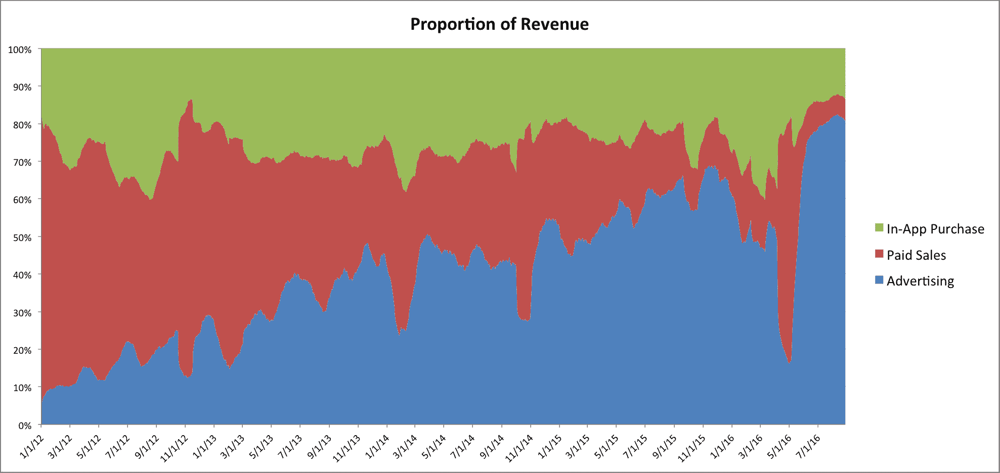
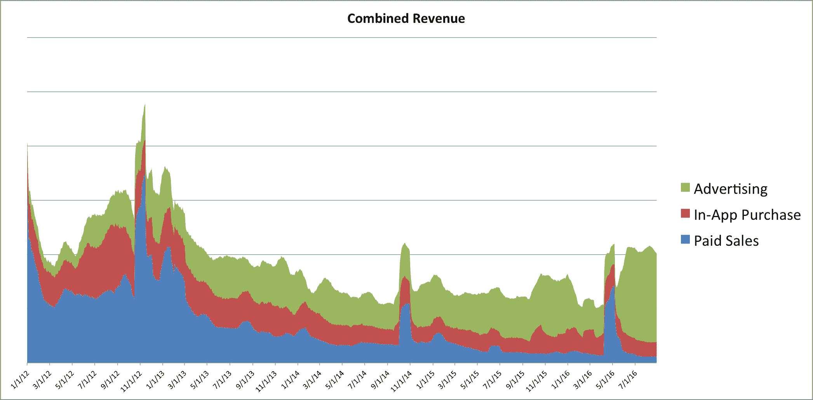
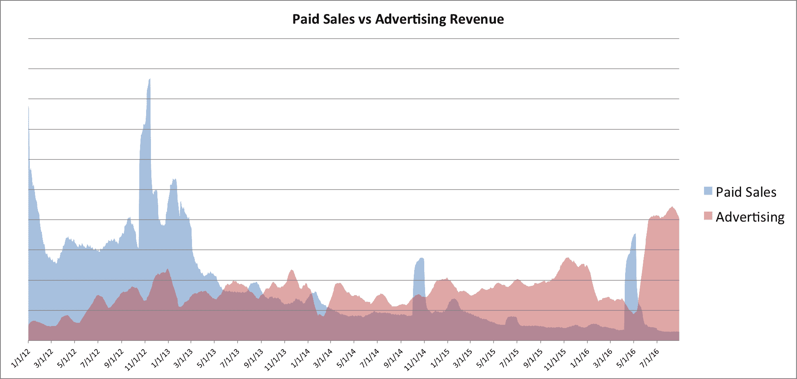

# 不断发展的应用商店商业模式——大卫·史密斯，独立 iOS 开发者

> 原文：<https://david-smith.org/blog/2016/09/05/evolving-business-app-store-business-models/?utm_source=wanqu.co&utm_campaign=Wanqu+Daily&utm_medium=website>

过去一周，我一直在思考(就像我经常做的那样)App Store 不断变化的格局。今年是我记忆中政策和结构发生最大变化的一年。我们有新的[订阅定价模式](https://developer.apple.com/app-store/subscriptions/whats-new/)、[搜索广告](https://developer.apple.com/app-store/search-ads/)、[对旧应用的大规模清理](https://developer.apple.com/news/?id=09012016a)、[对应用名称的新要求](https://developer.apple.com/news/?id=09012016a)以及 iOS 10 中对 App Store 应用本身的各种小变化。

大概要到今年秋天，我才会知道这些变化的总和会对我的业务产生怎样的影响，但这似乎是一个回顾过去几年并审视我来到这里的道路的好时机。

11 月 8 日，距离我的第一款应用在应用商店上线已经八年了。当我开始的时候，当我听说八年后我仍然完全靠应用程序谋生时，我会大吃一惊。

今天的 App Store 生态系统与当时大不相同。我把我的第一个应用程序发布到一个有大约 9 万个应用程序的商店里；今天，我们有 200 多万人。当时我们没有广告网络、应用内购买或订阅。你可以是自由的，也可以是有报酬的，如果你想谋生，你就必须有报酬。

今天，情况大不相同。付费应用现在只占我收入的很小一部分，而且我最近几乎所有的成功都来自免费应用。两端之间的过渡并不总是一帆风顺的，但在过渡期间，我一直努力保持适应性和开放性。

#### 数据

也许我可以用这张图表最简单地展示我的独立软件业务的演变:

我没有 2008 年推出第一款应用时的可靠数据，但我有 2012 年的数据。在过去的 4.5 年里，我的收入来源经历了一个清晰而不可阻挡的过程，从基于付费转向基于广告。从 2012 年开始，我的应用程序中的广告占销售额的 10%左右，而现在这一比例接近 80%。这一增长几乎完全来自于我的预付付费销售的崩溃(我的应用内购买收入基本没有变化)。

这种进展的稳定性，在过去几年中跟踪了一条近乎完美的线性曲线，最初让我担心我在数据分析中出错了。但是我仔细检查了我的数据，这是我的历史记录。

现在，在所有数据科学家开始叫嚣 100%堆积图有多糟糕之前，因为它很容易被总体变化所欺骗，这里有一张贝佐斯在此期间的总收入图:

同样的趋势在这里也很明显。除了推出新的付费应用程序(例如，2014 年 10 月的 Emoji++和 2016 年 5 月的 Activity++)导致的峰值，付费销售自 2013 年以来一直在稳步下降。应用内购买收入的绝对值有所下降，但自 2014 年左右以来保持稳定。而广告收入一直在稳步上升。

(今年广告收入的大幅增长是由于苹果宣布停止使用广告平台，从 iAd 转向 AdMob。今年 1 月至 5 月的收入下降是由于即使他们的费率开始下滑，仍然留在 iAd 上，这可能是服务结束的早期迹象)

当我把付费和广告放在一起时，你可以更容易地看到两者之间的过渡:

#### 结论

这只是一个开发者的经历。它并没有真正描绘出 App Store 的完整图景。但是尽管如此，我认为我的经历与我在过去几年里从无数其他开发者那里听到的一致。我就是一个活生生的例子，证明从应用商店获得稳定可靠的收入还是很有可能的。然而，我能够做到这一点的方法是与时俱进，不断适应市场的变化。

当我和几个朋友讨论这些数据时，有人问了我一个相当尖锐的问题:“这是你态度的变化，还是市场推动方式的变化？”每当我们回顾历史时，很容易看到你想看到的东西。挑选你的解释或者把因果关系归因于简单的偶然。

回顾过去几年，我得出的结论是，变化主要发生在应用商店市场，而不是我自己的态度。在很多情况下，在我的应用程序中添加广告是我一直在尽可能长时间抗争和抵制的事情。但最终务实的答案是，不要逆流而上，而是跟随我的客户所引领的方向。

市场一直在把我拉向基于广告的应用程序，我发现，我越少反驳关于软件如何销售的不合时宜的想法，我的业务就越可持续。