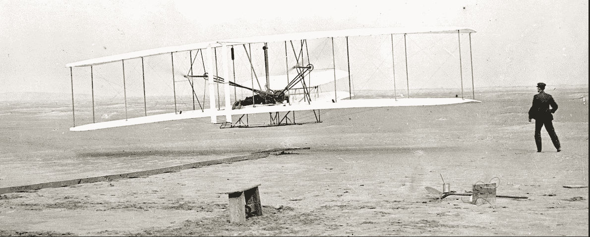
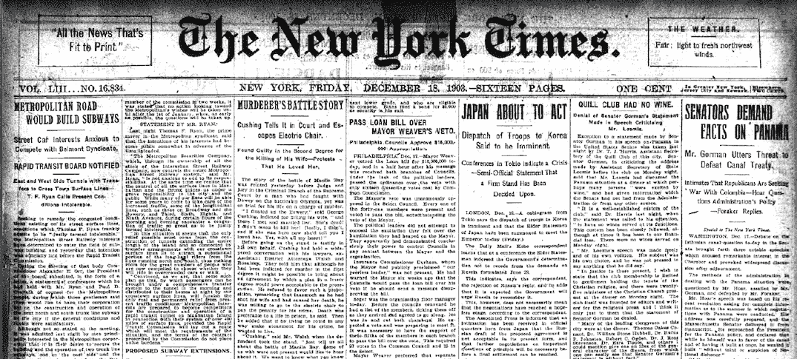
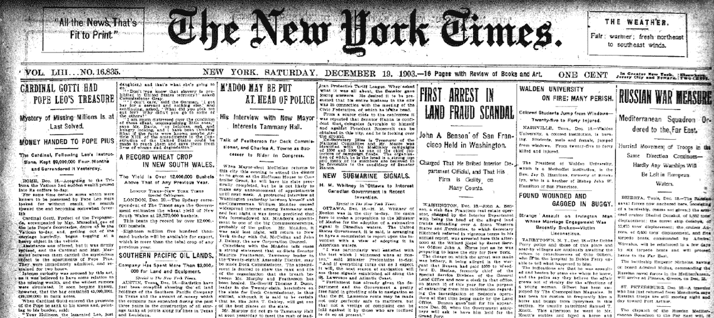
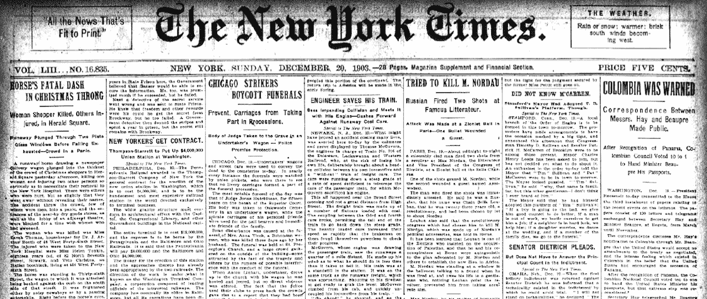
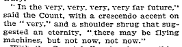
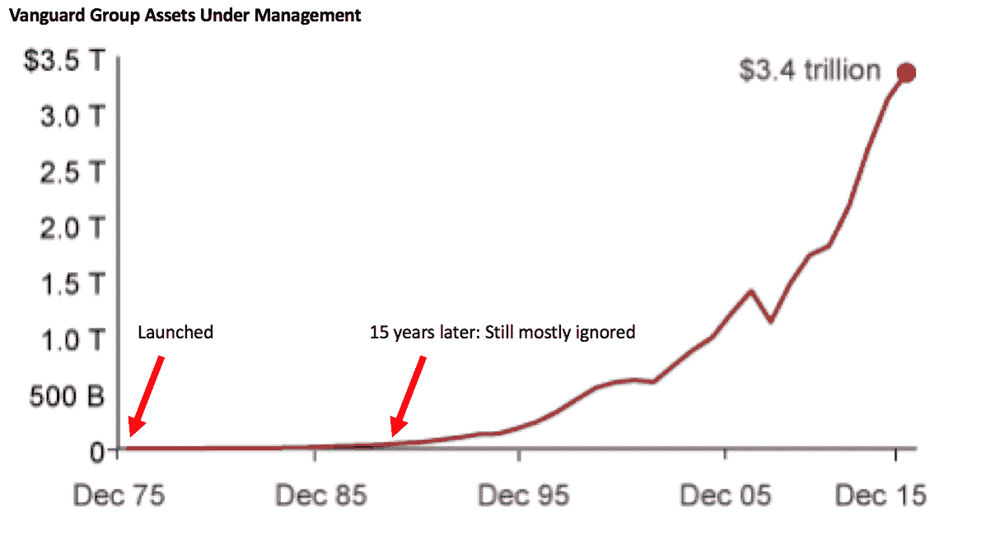

# 当你改变了世界，却没有人注意到慈善基金

> 原文：<http://www.collaborativefund.com/blog/when-you-change-the-world-and-no-one-notices/?utm_source=wanqu.co&utm_campaign=Wanqu+Daily&utm_medium=website>

# 当你改变了世界却没有人注意到

你知道这张照片里发生了什么吗？人类历史上最重要的事件之一。

但这是故事中最令人惊奇的部分:当时几乎没有人注意到。

威尔伯和奥维尔·莱特在 1903 年 12 月 17 日征服了飞行。在接下来的一个世纪里，很少有发明像它一样具有变革性。1900 年，乘火车从纽约到洛杉矶花了四天时间。到 20 世纪 30 年代，空运只需 17 个小时。到了 1950 年，六个小时。

比如说，与绘制基因组不同，一个外行人可以立即理解人类飞行的奇迹。一个人坐在盒子里，变成了一只鸟。

但是在莱特首次飞行几天、几个月甚至几年后，几乎没有人注意到。

这是第一次飞行后第二天《纽约时报》的头版。对莱特兄弟只字不提:

两天后。同样，什么都没有:

三天后，当莱特兄弟进行第四次飞行时，其中一次飞行持续了将近一分钟。什么都没有:

这样下去。四天。五天，六天，六周，六个月……不提人类历史上第一次征服天空的人。

我在国会图书馆发现了这些论文，揭示了两个惊人的细节。第一，纽约时报第一次提到莱特兄弟是在 1906 年，他们第一次飞行三年后。第二，1904 年,*时报*问一位热气球大亨，人类是否有一天可以飞行。他回答说:

那是莱特首次飞行后的一年。

弗雷德里克·刘易斯·艾伦在他 1952 年关于美国历史的书中写道:

> 几年过去了，公众才明白莱特兄弟在做什么；人们如此确信飞行是不可能的，以至于 1905 年在代顿(俄亥俄州)看到他们飞行的大多数人都认定他们看到的一定是一些没有意义的把戏——就像今天大多数人会认为的展示，比如说，心灵感应。直到 1908 年 5 月——在莱特首次飞行近四年半后——有经验的记者被派去观察他们在做什么，有经验的编辑完全相信这些记者激动的报道，世界终于意识到人类飞行已经成功完成的事实。

莱特兄弟的故事展示了比我们意识到的更普遍的东西:改变世界和让人们相信你改变了世界之间往往有很大的差距。

杰夫·贝索斯曾经说过:

> 发明需要长期愿意被误解。你做一些你真正相信的事情，你有信念，但在很长一段时间内，善意的人可能会批评你的努力…如果你真的确信他们是不对的，你需要有长期被误解的意愿。这是发明的关键部分。

这是一个非常重要的信息。立即受到追捧的东西通常只是现有产品的微小变化。我们喜欢他们，因为他们很熟悉。最具创新性的产品——那些真正改变世界的产品——最初几乎从未被理解，即使是真正聪明的人。

它发生在电话上。亚历山大·格雷厄姆·贝尔试图向西联汇款公司推销他的发明，西联汇款公司很快回复说:

> 这种“电话”有太多的缺点，不能被认真地认为是一种实用的通信形式。这个装置对我们来说本来就没有价值。这家公司能利用电动玩具做什么？

它发生在汽车上。在亨利·福特让世界相信他有所发现的 20 年前，国会发表了一份备忘录，警告说:

> 用汽油推动的不用马拉的马车可能达到每小时 14 英里甚至 20 英里的速度。这种类型的车辆在我们的街道和公路上疾驰，污染了空气，对我们的人民构成了威胁，需要立即采取立法行动。生产汽油的成本远远超出了私营企业的财务能力……此外，这种新型能源的开发可能会取代马的使用，这会破坏我们的农业。

指数基金就是一例，它无疑是过去半个世纪最重要的金融创新。约翰·博格尔在 1975 年推出了第一只指数基金。在接下来的 20 年里，没有人关注这个问题。它在 20 世纪 90 年代开始流行，一次一英寸。然后，三十年后，这个想法像野火一样蔓延。

现在也发生了。3D 打印在过去的五年里飞速发展。但这算不上什么新发明。查看 1989 年在*对 3D 系统公司首席执行官的采访。像许多创新一样，3D 打印在发明和采用之间有几十年的滞后。太阳能也类似。光伏在 1876 年被发现。它们在 20 世纪 50 年代就已经上市，吉米·卡特在 20 世纪 70 年代将太阳能电池板安装在白宫。但直到 2000 年代末，它们才真正起飞。*

重大突破通常遵循七个步骤:

*   首先，没人听说过你。
*   他们听说过你，但认为你是个疯子。
*   然后他们理解你的产品，但是认为它没有机会。
*   然后他们把你的产品当成玩具。
*   然后他们认为这是一个神奇的玩具。
*   然后他们开始使用它。
*   他们无法想象没有它的生活。

这个过程可能需要几十年。很少会少于几年。

由此引出三点。

改变世界需要智慧。耐心等待人们的注意完全是另外一回事。“禅宗般的耐心”并不是企业家的典型特征。但这通常是必需的，尤其是对于最具变革性的产品。

当创新以世代来衡量时，结果不应该以季度来衡量。历史是一个真实的故事，讲述了漫长、混乱和无序的变化。股票市场是数百万人期待当前公司快速、有序、干净地运行的滑稽故事。现实和期望之间的差距解释了无尽的沮丧。

**发明只是创新的第一步**。斯坦福大学教授保罗·萨佛这样说:

> 一个新思想渗入文化需要 30 年。技术不会推动变革。推动变革的是我们对技术带来的选择和机遇的集体回应。

