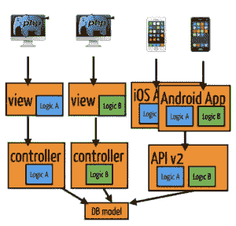
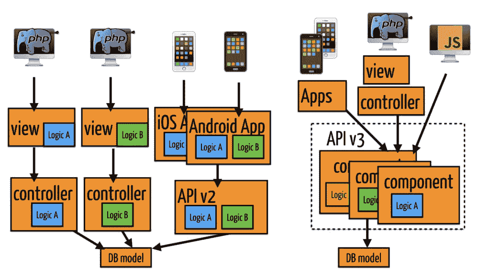
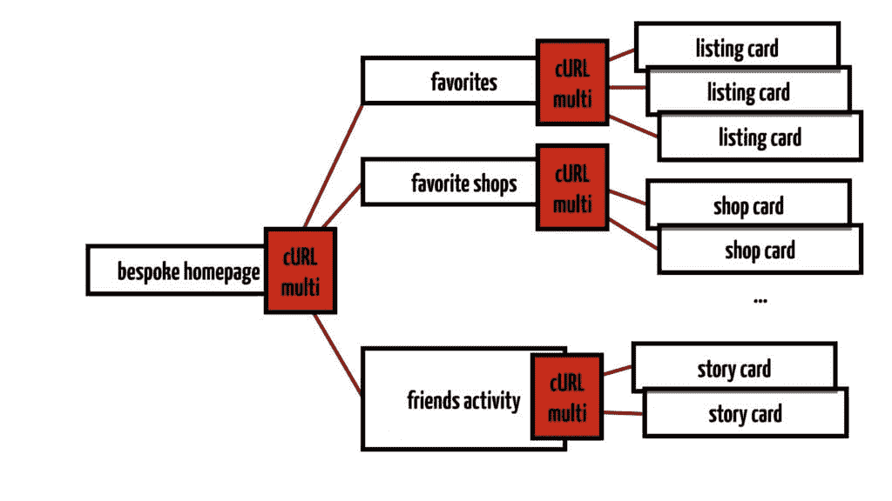

# Etsy 工程| Etsy 的 API 首次转型-并发

> 原文：<https://codeascraft.com/2016/09/06/api-first-transformation-at-etsy-concurrency/?utm_source=wanqu.co&utm_campaign=Wanqu+Daily&utm_medium=website>

在 Etsy，我们已经用我们的[Web API](https://en.wikipedia.org/wiki/Web_API)做了一些开创性的工作。我们切换到 API 优先的设计，在我们的组合层中试验并发处理，在我们的 API 设计中引入强类型，试验代码生成，并为 API 构建分布式跟踪工具，作为这个项目的一部分。

我们面临一个共同的挑战:我们的许多逻辑被实现了两次。所有为网站构建的代码都必须在我们的 API 中重新构建，以供我们的 iOS 和 Android 应用程序使用。

*问题:平台间逻辑重复*

我们想要一种方法，在这种方法中，我们在可重用的 API 组件上构建一切，这些组件可以在 web 和应用程序之间共享。不幸的是，我们现有的 API 框架不支持这种共享方法。我们选定的解决方案是放弃现有的框架，从头开始重新构建。

遵循这个构建 API 优先架构的案例研究，在这个案例研究中，在将功能更改集成到网站之前，功能更改是在 API 级别上表达的。听听是什么问题促使了这种剧烈的变化。了解我们必须构建哪些新工具才能与新系统一起工作，以及在此过程中我们犯了哪些错误。最后是怎么结束的？团队是如何采用新系统的，我们是否成功实现了 API First 的目标？

这篇文章将是关于我们当前的 API 基础设施的系列文章的第一篇，我们称之为版本 3。该系列基于纽约 QCon】上的[演讲。第一篇文章将讨论并发性，第二篇文章将讨论操作，第三篇文章将讨论 API 转换的人的方面。](https://www.infoq.com/presentations/etsy-api)

## 第一个问题:更多的设备和平台(还有:JavaScript)

如果我们展望未来，会有很多设备。大型机变成了台式电脑，台式电脑变成了便携式笔记本电脑和平板电脑，智能手机和手表。

这种趋势已经持续了一段时间，为了不在每个不同的设备上重新创造世界，我们几年前就开始通过内部 API 共享数据。

Etsy 的 API 的第一个版本是 flash 小部件的网关。第二个是供第三方和内部使用的 JSON RESTful API。它与底层数据库模式紧密耦合，使客户能够定制复杂的请求。它如此强大，以至于当我们推出第一款 iPad 应用时，我们不需要编写任何新的端点，就可以在现有的端点上单独构建它。客户可以一次请求多个资源，例如请求商店数据，还可以包括来自该商店的列表数据，并且他们可以指定字段，以将响应缩减为仅需要的数据。非常厉害。

## 第二个问题:性能和复杂性控制

权力越大，责任越大，这种方法有一些缺点。服务器代码很简单，但是我们不知道传入的参数。我们通过请求参数让客户控制请求的复杂性。这显然对服务器端的性能有影响。衡量性能也很困难，因为不清楚响应时间的增加是因为后端的性能，还是因为客户端请求了更多的资源。

## 第三个问题:重复和不一致

多年来不断变化的模式和 MVC 架构下不断发展的复杂代码库导致了一些坏习惯:在模板渲染期间获取数据，以及模板中的逻辑。我们的 API 是用于 AJAX 的，而后端代码是用 PHP 编写的。我们没有一个可供 Web 和 API 重用的逻辑。这导致 API 和 API 之前 web 之间的不一致。

API 资源的模式是数据模型在通过端点公开时的快照。这种一对一的映射导致了数据迁移的问题，因为 API 资源被“及时冻结”。是否应该随车型而变？旧的资源结构应该支持多久？

## API 优先的要求

我们重新讨论了 API 的需求。如果对用户来说表现为从请求到响应的延迟的性能是一个问题，那么瓶颈是什么？

首先是眼镜的时间，即我们在设备屏幕上看到东西的时间，正如伊利亚·格里戈利克在他的演讲“打破 1000 毫秒的眼镜时间”中所说，他指出，由于移动网络速度，如果我们想保持在预算内，我们在服务器端只有 100 毫秒的时间。第二个问题是，在 Etsy，我们来自一个无共享的 php 世界。没有内置并发。我们如何并行化和重用我们的工作，同时仍然保持较低的网络占用空间？

*API v2:平台间重复逻辑 API v3:可复用组件*

其他需求是如何考虑缓存。以前版本的 API 只有 memcached，缓存包括参数在内的调用，这导致了粒度问题。最后一个要求是从我们知道的和我们擅长的开始解决问题——用 PHP 构建我们自己的解决方案。

## 塑造我们的心智模式

基于这些经验，我们一点一点地构建了一个新版本，称为 API 版本 3。REST 资源在移动应用和传统网络上都运行良好，所以这是一个守护者。一个新的想法是将端点从承载它们的框架中分离出来。将端点的责任最小化到:

*   宣布路线
*   声明输入期望和输出保证
*   实现端点中发生的事情。

..仅此而已。

对于每个端点，我们都有一个非常简单的声明性文件。

其他一切都是有意设计的:StatsD 错误监控、端点输入和输出类型检查以及完整路由的编译——所有这些都由框架处理。基于开发人员选择的端点类别，身份验证和访问控制也在这里处理。

## 输入元端点

我们从[网飞](http://www.slideshare.net/danieljacobson/api-revolutions-16755403)和[易贝&那里获得了行业理念 39；s ql.io](http://www.ebaytechblog.com/2011/11/30/announcing-ql-io/) 将服务器端的资源组合成特定于设备视图的资源。或者换句话说:允许第二层端点作为我们自己的 API 的消费者，请求和聚合其他端点。这意味着服务器本身也是 API 的客户端，这使得服务器更加复杂，同时通过一个额外的代码执行层给它更多的控制。这提高了客户端的性能，因为它只需要发出一个请求——如果我们想要一个响应迅速的移动界面，这是最大的瓶颈！

这些请求使用了我们生成的 PHP 客户端，它们使用了 cURL。卷曲？让我们就此谈一会儿。并且让&39; s 退一步。有趣的问题是如何将并发引入 PHP 的单线程世界。

## 卷发很酷

我们处于 HTTP 上下文中，那么为并发性发出额外的 HTTP 请求怎么样呢？我们研究了这是否可以用 cURL 来实现。

2013 年的某个时候，保罗在推特上写道

_"curl_multi_info *read()是我新的事件循环."*

在 hack week 项目中，Etsy 核心团队的 Paul 和 Matt 发现，通过并行 cURL 调用和 curl_multi_info read，我们实际上可以在 HTTP 层实现并发。HTTP 层是一个有趣的层，因为有许多现有的路由、负载平衡和缓存解决方案。

除了 cURL，我们还添加了逻辑来建立对其他端点的请求的依赖性，我们称之为代理。当相应的代理被解除阻塞时，我们正在运行请求，这类似于一个事件循环，您可能从 NodeJS 中知道。整个并发依赖分析和调度都封装在一个软件中，我们称之为 curl 回调编制器。

这很好，因为从端点作者的角度来看，代码看起来是顺序的、单线程的，只是对其他端点的代理调用列表。我们越来越接近一种声明式风格，表达我们的意图，而 orchestrator 会计算出如何安排对完整结果必要的调用。

好了，我们对 API 的早期版本有了一些很好的观察，我们有了一个通过 cURL 实现并发的工作原型。

我们如何从这里发展出一个全新的 API 框架？

## 视角和服务

Etsy 的 API v3 有两个特殊的概念:透视图和服务。

透视图阐明了数据访问规则，并给出了每个透视图允许哪些代码的安全提示。它们表示 API 调用是代表谁进行的。例如，Public 透视图显示了一个注销的用户能够在 Etsy.com 上看到的数据。

成员视角用于代表特定 Etsy 成员发出的呼叫。用户 ID 是通过用户 cookie 或 OAuth 令牌确定的，这取决于服务，我们将在下面讨论。商店透视图类似于成员透视图，但是是针对商店的。该框架将验证给定的商店是否为经过身份验证的用户所有。Admin 透视图类似于 member 透视图，但用于 Etsy Admin。我们偶尔想从我们自己的服务器上采取可能不符合其他观点的行动。为此，我们有基础设施的观点。它只在私有的内部 API 上可用，并且可以用于数据集加载之类的事情。应用程序透视图用于代表特定 API 应用程序进行的调用。它包含已验证 API 密钥的应用程序数据。

虽然透视图表示代表谁进行调用，但是服务指示调用是从哪里进行的。服务也可以被认为是 API 框架的入口点。每个服务都有自己的身份验证要求。默认情况下，端点包含在某些服务中。其他服务是选择加入的，每个端点必须声明它是否希望在这些选择加入的服务上公开。

在 etsy.com 上运行 JavaScript 的页面可以访问 Ajax 服务。管理服务可从我们内部管理工具平台上运行 JavaScript 的页面访问。内部服务由已经在我们的 API 集群网络内部的其他 API 服务使用。应用服务可从我们的 iOS 和 Android 原生应用中访问。第三方服务面向第三方应用开发者。这些服务分隔不同的应用程序域。

## API 调用示例

让我们看一个对 etsy.com 主页的示例请求。我们知道主页看起来像什么:作为一个潜在买家，我可能会感兴趣的信息部分。顶部是我喜欢的列表，然后是 Etsy 的推荐算法为我挑选的一些商品，我最喜欢的商店的新商品，我朋友的活动，等等。我把它想成这样。

如果我们更详细地观察数据，我们会看到更多的结构。就像一棵树，从左向右生长。

我们的网络和服务器设置反映了 API 调用的结构。首先，我的浏览器向 Etsy 的 web 服务器发出一个 HTTP 请求。从那里，一个定制的 API 请求被发送到我们的 API 服务器，请求主页数据的个性化版本。在内部，这个请求由多个并发组件组成。它们本身是通过 API 请求获取的。比如我的收藏夹，这是一个并发组件，因为它们是大量可以并行提取的列表卡片。

因此，我们可以将一个 API 请求想象成一个多级树，启动其他 API 请求，并从这些子请求的结果中构建一个整体结果。

## API 端点的领域特定语言

让我开始深入研究 Etsy 的 API v3 框架的项目是努力统一 API 端点的语法。这真的很有趣，并且包含了统一 API 代码库的大规模自动化更改。在过去，可以用多种风格来编写端点。为了统一它们，我们开发了一种端点构建模块语言。

有些构造块对于每个端点都是必需的。每个端点都需要声明它的路由，所以我们知道它应该在 web 上的什么地方。此外，它需要一个人类可读的描述和一个 resultType。

结果类型描述端点返回的数据类型。我们返回的所有数据都是 JSON 编码的，但是在这里我们可以说我们返回的是原始数据类型，比如编码中的字符串或布尔值。或者我们可以返回我们称之为“类型化资源”的东西——一种复合类型，它引用 Etsy 应用程序域的特定组件，比如 ListingCard。

然后就是手柄功能。在那里，每个端点运行它需要运行的代码，以构建它的响应。

API 端点的可选构件也是可能的。只有当端点确实需要输入参数时,`declareInput`才是必需的。如果没有，可以省去该功能。

`includedServices`功能允许端点选择特定的服务。例如，EtsyApps 服务是选择性加入的，因此如果您想让您的端点在应用程序上可用，您必须通过此功能选择加入 EtsyApps 服务。

然后是`cacheTtlSeconds`函数，它允许您指定一个端点是否应该被缓存，以及它的生存时间应该是什么。

## 输入和输出:类型化参数，类型化结果

将请求路由到端点的第一步是设置输入参数。我们基于请求的 URL 和端点的 declareInput 函数创建一个输入对象。

输入声明告诉我们如何检查可选或强制的输入参数，这些参数根据路由中的模式进行解析。如果参数缺失或类型错误，框架将返回 HTTP 错误代码和消息。输入声明为每个参数指定了一个类型，比如字符串或用户 ID。这些类型是特定于 Etsy 的，每个类型都有自己的验证函数，由框架运行。根据透视图，关于登录用户、登录管理员、商店或认证应用程序的信息也被检查，并被添加到输入对象。

每个端点通过 resultType 函数指定自己的输出类型。目前，这些类型是可选的，并且具有不同的详细程度。我们鼓励开发人员要么返回一个原始数据类型，要么构建一个复合类型，称为类型化资源，对应于他们的端点返回的数据的形状。类型保证对 API 客户机很有用，它使我们离保证从浏览器输入字段到数据库记录的数据更近了一步。

为了使我们的框架完整，我们仍然缺少两端的一些动作。API 请求如何被路由到端点？当我们的站点使用 AJAX 时，我们如何从我们的代码中发出 API 请求，例如在元端点内部或在 JavaScript 中？

## 工具:API 编译器

我们还需要两个软件，我们可以根据端点声明文件自动编译它们。这是 API 编译器的工作。最初，这是一个脚本，它从端点声明中提取路由，连同服务和透视图信息，并通过修改。htaccess 文件。通过按透视图分割工作和文件，性能问题得到了缓解。

随着时间的推移，我们还添加了第二部分:用 PHP 和 JavaScript 生成 API 客户机代码。代码是使用 mustache 模板生成的，这是一种用于网站的模板语言，但在这种情况下也能很好地工作。在我们将代码部署到 Etsy.com 之前，我们通过 Jenkins 检查编译的路由和客户端代码是否是最新的。通过这种方式，我们控制了 API 栈的两端，从数据库访问代码到端点景观的外部形状，这反映在对客户端的更改中。我们将这一点巧妙地融入到我们的持续部署流程中。

这是关于 Etsy 的 API 的三篇系列文章中的第一篇，它是我们的逻辑和数据的抽象接口。下一篇文章[涵盖了 Etsy 的 API](https://etsy.com/codeascraft/api-first-transformation-at-etsy-operations) 的操作方面。