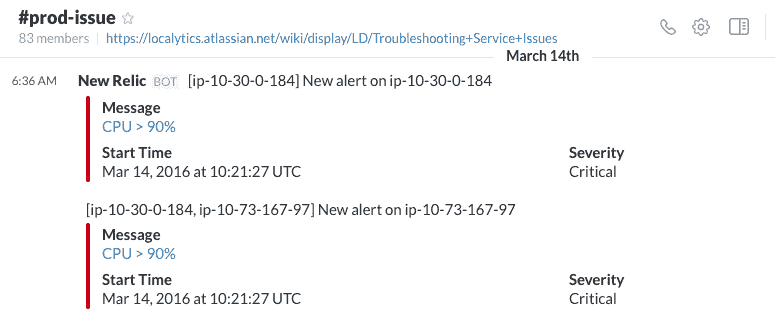

# 当事情出错时// Localytics 工程博客

> 原文：<http://eng.localytics.com/when-things-go-wrong/?utm_source=wanqu.co&utm_campaign=Wanqu+Daily&utm_medium=website>

我们相信，最高绩效的工程团队有一个识别、分类、修复和从服务质量下降和停机中学习的过程。在 Localytics，我们构建高度可用和可扩展的系统，我们成功的部分关键是从失败中学习。我们培养学习文化的一种方式是通过我们如何回应关于我们服务的页面。我们希望分享我们不断改进的过程。

### 1.通知、协调和修复松弛:`#prod-issue`

在 Localytics，我们非常相信[聊天工具](https://www.pagerduty.com/blog/what-is-chatops/)的力量能够扩大我们的团队。我们使用与 Slack 的集成来部署代码、运行数据库迁移和监控许多服务。

Pingdom、New Relic、AWS Cloudwatch 和编码的[断路器模式](http://martinfowler.com/bliki/CircuitBreaker.html)发布到 Slack 中的`#prod-issue`通道。所有这些系统通过[页面责任](https://www.pagerduty.com/)集成分别通知团队。工程师收到传呼任务的第一反应是打开 Slack 并检查`#prod-issue`以获得更多细节，从而快速对问题进行分类。虽然您可能会看到一个关于某个特定服务关闭的页面，但是检查`#prod-issue`可以让您在进一步挖掘之前看到是否存在更大的服务问题。

由于这是一个标准的 Slack 聊天室，工程师可以实时协调响应和调试问题，无论他们身在何处。聊天记录方便地记录了活动期间发生的事情，并作为活动的正式记录。

### 2.在空闲状态下调试和启动:`#postmorterm`

最初的危机结束后，我们的工程师进入了松弛渠道。

这是一个假设发生了什么，挑战假设，并自愿事件领导者跟进的地方。如果这个问题是一个已经实现的已知风险，那么这个对话很有可能会变成一系列解决潜在问题的想法。当我们在第四步中进行正式的、无可指责的尸检时，我们经常使用这里产生的想法。

### 3.与公司和客户沟通

一个自告奋勇的事件领导者，通常是第一个被通知的人或“第一个知道这件事的人”，会发送一封电子邮件让公司的其他人知道发生了什么。这份分发名单会发给我们的高管团队、产品负责人和营销部门。它让他们决定是主动通知我们的客户，还是生成内容发送给客户。

以下是我们使用的电子邮件模板:

> ***主题:*** 发布名称、日期和时间

> 大家好，

> 我们遇到了一个影响*【服务名称】*的生产问题。本期从*【日期】*的*【时间】*开始，到*【日期】*结束。

> **发行团队:**
> 
> *   工程:@name
> *   产品管理:@name
> *   产品营销:@name

> **问题是什么，是什么导致的？**
> 用一般的、非专业的听众能理解的术语陈述发生的事情和原因。示例:由于错误的查询，数据库关闭。

> **对客户有什么影响？**
> 陈述受影响的具体服务。示例:推送活动失败，属性未被归属，等等。

> **哪些客户受到了影响？**
> 包含一个到 Google 表单的链接，该表单包含以下字段:组织名称、`org_id`、`app_id`和`campaign_id`

> **该问题的当前状态如何？**
> 如果问题已经解决，说明修复方法以及部署时间。如果问题没有解决，给出一个大概的修复时间表。

> **后续步骤**
> 产品营销部门将跟进这封电子邮件，向客户传达信息。

在 24 个工作小时内，事故负责人安排并领导一次无可指责的尸检。这个会议可能从 30 分钟到几个小时不等。关键是要确定可能导致这一问题的流程、技术和监控差距。

无可指责的概念是一个重要的概念。事后分析不应该是一种识别和惩罚特定工程师的练习。服务问题很少是一个人的错。更有可能的是，我们的内部流程和工具导致了停机，事后分析应该集中解决这些问题。这需要一种信念，即在一个运作良好的团队中，人们会根据他们所拥有的信息、他们可用的资源以及他们得到的团队支持做出理性的决策。识别单个工程师的唯一时间是让他们参加事后讨论。

以下是一些你在责备性尸检和非责备性尸检中提出的不同类型问题的例子:

**示例事件 1:** 一个数据库查询导致数据库停机。

| “归咎于死后”(不好) | 《无可指责的死后》(好) |
| --- | --- |
| 为什么【工程师 X】没有足够的 SQL 知识来理解查询会破坏数据库？我们需要关闭他/她的入口。 | 同行评审过程没有抓住问题吗？可以在读取副本数据库而不是主数据库上运行此查询吗？团队在解释计划方面是否接受了足够的教育，能够被告知令人担忧的查询？ |

**示例事件 2:** 地理坐标处理不正确。

| “归咎于死后”(不好) | 《无可指责的死后》(好) |
| --- | --- |
| 哪个工程师忘记写测试了？ | 我们的发布时间表不鼓励写测试吗？代码的任何部分都有测试覆盖吗？我们是否有一个自动化的代码覆盖工具，可以暴露出需要更多测试的区域？ |

事故负责人的任务是在我们的内部 [Confluence](https://www.atlassian.com/software/confluence) wiki 上填写一个事后分析页面。这是我们使用的模板:

* * *

***日期***

***参与者***:@工程师 1，@工程师 2

开始每一次验尸，从以下开始

1.  这是一次无可指责的尸检。
2.  后知之明是 20/20——我们不会纠结于“本可以”和“本应该”。
3.  措施项将有被分配人。如果这个项目在会议结束时不是最重要的，就不要让它成为跟进项目。

***事件领导者***:@工程师

**描述**
【问题的简短描述】

**时间轴**
【2016-03-15】-@用户做一件事

**成因**
【是什么导致了这个问题？如果你愿意，可以使用 [5 个为什么](http://en.wikipedia.org/wiki/5_Whys)。]

我们是如何解决的？
【我们做了什么来稳定我们的系统，无论是暂时的还是永久的。]

**客户影响**
【这对客户有什么影响？]

**纠正措施**
【附有工程师姓名和预计日期的待办事项列表】

* * *

此事后模板已针对我们的流程进行了修改，来自【GitHub 用户 btm】(https://gist . GitHub . com/btm/7cb 421 F5 Fe 7d 1003083 a)。

我们希望这个过程对您有用。我们认为这是我们扩大 Localytics 成功的关键。

图片来源:javier ruiz77 的风暴