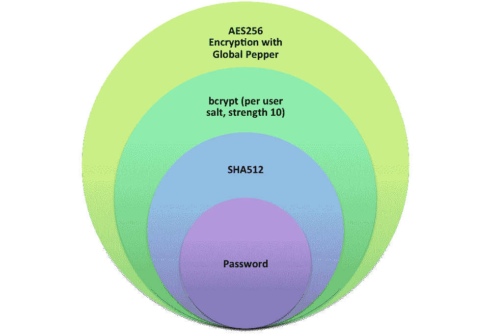

# Dropbox 如何安全地存储您的密码

> 原文：<https://blogs.dropbox.com/tech/2016/09/how-dropbox-securely-stores-your-passwords/?utm_source=wanqu.co&utm_campaign=Wanqu+Daily&utm_medium=website>

众所周知，存储纯文本密码不是一个好主意。如果包含明文密码的[数据库遭到破坏，用户账户将面临直接的危险。出于这个原因，早在 1976 年，业界就对使用安全的单向散列机制存储密码进行了标准化(从 Unix Crypt 开始)。不幸的是，虽然这防止了在泄露的情况下直接读取密码，但是所有的散列机制都必然允许攻击者通过遍历可能的密码列表、散列它们并比较结果来离线暴力破解散列。在这种情况下，像 SHA 这样的安全散列函数对于密码散列来说有一个严重的缺陷:它们被设计得很快。现代商用 CPU 每秒可以生成数百万个 SHA256 哈希。专门的 GPU 集群允许以每秒数十亿的速度计算](http://blog.moertel.com/posts/2006-12-15-never-store-passwords-in-a-database.html)[哈希](https://blog.codinghorror.com/speed-hashing/)。

多年来，我们已经悄悄地多次升级我们的密码哈希方法，以持续努力保持领先于坏人。在本帖中，我们想分享更多关于当前密码存储机制的细节以及我们的推理。我们的密码存储方案依赖于三层不同的加密保护，如下图所示。为了便于说明，在下图和下图中，我们省略了任何二进制编码(base64)的描述。

Multiple layers of protection for passwords

我们依靠[【bcrypt】](https://en.wikipedia.org/wiki/Bcrypt)作为我们的核心哈希算法，拥有一个 **每用户 salt** 和一个加密密钥(或 **全局 pepper** )，分别存储。我们的方法在几个重要方面不同于基本 bcrypt。

首先，使用 **SHA512** 将明文密码转换成哈希值。这解决了 bcrypt 的两个特殊问题。bcrypt 的一些实现将输入截断为 72 字节，这降低了密码的熵。其他实现不截断输入，因此容易受到 [DoS 攻击](http://arstechnica.com/security/2013/09/long-passwords-are-good-but-too-much-length-can-be-bad-for-security/) ，因为它们允许输入任意长的密码。通过应用 SHA，我们可以快速地将很长的密码转换成固定长度的 512 位值，从而解决这两个问题。

接下来，使用成本为 **10** 的**【bcrypt】**和唯一的、针对每个用户的 salt 再次散列 SHA512 散列。与 SHA 等加密哈希函数不同，bcrypt 被设计为*缓慢，难以通过定制硬件和 GPU 加速。对于我们的服务器上的所有这些步骤，工作因子 10 转化为大约 100 毫秒。*

 *最后，产生的 bcrypt 散列使用我们称为 **pepper** 的密钥(对所有散列通用)用 **AES256** 加密。胡椒是一种深度防御措施。pepper 值以难以被攻击者发现的方式单独存储(即，不在数据库表中)。因此，如果只有密码存储被破坏，密码哈希就会被加密，对攻击者没有任何用处。*  *## 为什么不用{scrypt，argon2}而不用 bcrypt？

我们考虑过使用 scrypt，但是我们有更多使用 bcrypt 的经验。关于哪种算法更好的争论仍未结束，大多数安全专家认为 scrypt 和 bcrypt 提供了类似的保护。

我们正在考虑 argon2 的下一次升级:当我们转向目前的方案时，argon2 还没有赢得[密码哈希竞赛](https://password-hashing.net/)。此外，虽然我们认为 argon2 是一个神奇的密码哈希函数，但我们喜欢 bcrypt 自 1999 年以来一直存在，没有发现任何重大漏洞。

## 为什么全局 pepper 用于加密而不是哈希？

回想一下，全局 pepper 是一种深度防御措施，我们单独存储它。但是分开存储也意味着我们必须考虑到 pepper(而不是密码散列)被破坏的可能性。如果我们使用全局 pepper 进行哈希，我们就不能轻松地旋转它。相反，使用它进行加密给我们带来了类似的安全性，但增加了旋转的能力。这个加密函数的输入是随机化的，但是我们还包括一个随机初始化向量(IV)。

展望未来，我们正在考虑将全球 pepper 存储在硬件安全模块(HSM)中。在我们的规模下，这是一项相当复杂的任务，但会大大降低 pepper 妥协的可能性。我们还计划在下一次更新中增加我们的加密强度。

我们相信 SHA512、bcrypt 和 AES256 的这种使用是目前保护密码的最强大和最经得起未来考验的方法之一。同时，我们知道攻击者在不断进化，我们的防御也将如此。我们的密码哈希程序只是我们用来保护 Dropbox 的众多措施之一。我们部署了额外的安全措施来抵御在线暴力攻击，如限速密码尝试、验证码和一系列滥用缓解措施。如上图所示，维护强大的安全性有许多层面，我们正在积极投资于所有层面。我们很想听听你的想法。*