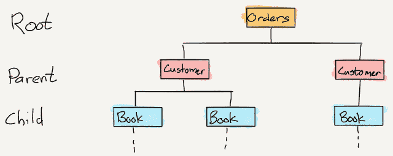
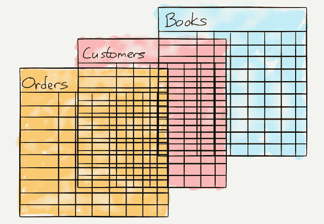

# 甲骨文的阴云密布的未来——本·汤普森的战略

> 原文：<https://stratechery.com/2016/oracles-cloudy-future/?utm_source=wanqu.co&utm_campaign=Wanqu+Daily&utm_medium=website>

每个人都知道 IBM 如何将城堡拱手让给微软(和英特尔)的故事:被需求低性能个人电脑的客户围困，这家以大型机为中心的垂直集成公司在佛罗里达州博卡拉顿(Boca Raton)委派一个团队，在远离公司总部纽约阿蒙克(Armonk)的地方，快速开发一些东西来满足这些低利润的要求。专注于速度和成本的团队决定外包几乎所有的东西，包括操作系统和处理器。这种方法得到了回报，至少在实现 IBM 的目标时是如此:IBM 的集成产品通常需要五年时间来开发和推出，而 Boca Raton 团队仅用了 12 个月就从概念转变为产品。然而，对标准部件的关注意味着个人电脑的所有后续价值(大大超过了大型机业务)都流向了两家独家供应商:微软和英特尔。 [1](#fn1-2286 "IBM did force Intel to share its design with AMD to ensure dual suppliers")

很少有人意识到个人电脑并不是 IBM 唯一的内部政治驱动的价值赠品；这些大型机上最重要的软件应用之一是 IBM 的[信息管理系统(IMS)](https://en.wikipedia.org/wiki/IBM_Information_Management_System) 。这是一个层次数据库，让我停下来做一个必要的说明:对于那些不理解数据库的人，我将尽可能简化下面的解释，对于那些理解的人，我很抱歉玷污了这个概述！

#### 数据库类型

分层数据库是数据的层次结构:

[T2】](https://i0.wp.com/stratechery.com/wp-content/uploads/2016/09/stratechery-Year-One-291.png?ssl=1)

分层数据库中的任何特定数据都可以通过两种方法中的任何一种找到:要么知道*父*并找到它的*子*，要么知道*子*并找到它的*父*。这是最容易理解的数据库，至少对于早期的计算机来说，这是最容易实现的:定义结构，输入数据，通过遍历层次结构找到数据层，直到找到相关的*父*或*子*。或者，更现实地说，利用你对层级的了解去一个特定的地方。

然而，分层数据库有两个很大的局限性:首先，关系是预先确定的；什么是*父*和什么是*子*是在实际输入任何数据之前做出的决定。这使得一旦数据库被使用，就很难对其进行修改。其次，分析不同父代的子代的查询是不切实际的:您需要遍历层次结构来检索每个潜在项的信息，然后丢弃绝大多数来获得您想要分析的数据集。

1969 年，一位名叫 Edgar F. Codd 的 IBM 计算机科学家写了一篇名为[的开创性论文，这是一个大型共享数据库](http://www.seas.upenn.edu/~zives/03f/cis550/codd.pdf)的数据关系模型，提出了一种新的方法。介绍非常清晰，即使对于外行人来说也是如此:

> 必须保护大型数据库的未来用户，使他们不必知道数据在机器中是如何组织的(内部表示)。提供这种信息的提示服务不是令人满意的解决方案。当数据的内部表示改变时，甚至当外部表示的某些方面改变时，终端用户的活动和大多数应用程序应该保持不受影响。由于查询、更新和报告流量的变化以及存储信息类型的自然增长，通常需要改变数据表示。

这篇论文是后来被称为关系数据库的基础:关系数据库包含表，而不是在层次结构中存储数据，其中所述数据之间的关系定义了它在数据库中的位置；因此，每条数据都由其表名、列名和键值定义，*而不是由数据本身定义*(存储在其他地方)。这意味着您可以根据数据与数据库中所有其他数据的关系来理解数据；表名也可以是列名，就像键值也可以是表名一样。

[T2】](https://i0.wp.com/stratechery.com/wp-content/uploads/2016/09/stratechery-Year-One-292.png?ssl=1)

这种方法有几个巨大的好处:首先，数据库可以用新的数据类别扩展，而不会对以前的数据产生任何影响，也不需要完全重写层次结构；只需添加新表。第二，数据库可以扩展以容纳任意数量和类型的数据，因为数据实际上并不在数据库中；记住，它被抽象成整数和字符串文本。第三，使用“结构化查询语言”(SQL)，你可以很容易地生成关于这些关系的报告(*40 岁以上的顾客订购的最受欢迎的 10 本书是什么？因为上述查询只是检查整数和字符串之间的关系，所以你几乎可以问任何问题。毕竟，找出数据库中位置之间的关系不再是扫描一棵树——如果你不知道你在找什么，这本来就很慢，而且基本上是盲目的——而是数学。诚然，这是非常难的数学——当时许多人认为这太难了——但摩尔定律的现实正在慢慢实现；这不会永远是数学难题。*

唷。我可以想象，读起来和写起来一样痛苦，但是要点是:由于是预定义的，层次数据库在能力和可伸缩性方面都是有限的；关系数据库更有用，可伸缩性也更好，因为它将数据抽象出来，支持容易计算的值。

#### 甲骨文的崛起

Codd 博士开创性的想法被 IBM 几乎完全忽略了好几年，部分原因是前面提到的 IMSCodd 基本上是在说，对于许多潜在的数据库应用程序来说，IBM 最大的赚钱机器之一已经过时了，这是 IBM 管理层不太想听到的消息。事实上，即使当 IBM 最终在 1977 年建立了第一个关系数据库(它被称为 [System R](https://en.wikipedia.org/wiki/IBM_System_R) 并包括一种新的查询语言 SQL】，， [2](#fn2-2286 "Amazingly, IBM kept Codd separate from the engineering team") ，时，他们也没有将其商业化；直到 1982 年，该公司才发布了第一款名为 SQL/DS 的关系数据库软件。很自然，它只能在 IBM 的大型机上运行，尽管很小；IMS 在大铁上跑。

与此同时，一位名叫拉里·埃里森(Larry Ellison)的年轻程序员成立了一家名为软件开发实验室(Software Development Laboratories)的公司，最初是做合同工作，但很快就发现销售打包软件是一个更好的提议:做一次工作，然后多次转售是一个致富的好方法。他们只是需要一种产品，而 IBM 有效地给了他们；因为 System R 团队被视为一个研究项目，而不是一个商业项目，他们很高兴地写了多篇论文解释 System R 如何工作，并发表了 SQL 规范。软件开发实验室实现了它，称之为甲骨文，并在 1979 年卖给了中情局；合同的一个条件是它要在 IBM 的大型机上运行。 [3](#fn3-2286 "To be fair to IBM, SQL/DS and their later mainframe product, DB2, were far more reliable than Oracle’s earliest versions")

换句话说，IBM 不仅为有史以来最富有的打包软件公司(微软)的出现创造了条件，他们基本上给了第二个公司一个指导手册。

#### 打包软件业务

打包软件行业有点像过去的传统业务和互联网时代的纯数字业务的混合体(毕竟当时没有互联网)。一方面，正如埃里森很快意识到的那样，软件的边际成本为零:一旦你写了一个特定的程序，你就可以无限复制。另一方面，销售和以前一样是个挑战；在 Oracle 的关系数据库中，关系软件公司(née 软件开发实验室；该公司在 1982 年将自己命名为“甲骨文系统公司”，然后今天的甲骨文公司在 1995 年)必须建立一个销售队伍，让他们的产品进入可以使用它的企业(然后用磁带运送实际的产品)。

最经济的方法是制造出最符合大多数客户需求的产品，然后和他们一起工作，让它真正发挥作用。部分努力是在前端——Oracle 很快被当时新的编程语言 C 重写，C 语言有适用于大多数平台的编译器，使该公司能够推销可移植性——但更多的努力是在销售之后:客户必须安装 Oracle，让它工作，导入他们的数据，只有这样，在原始协议几个月或几年后，他们才能开始看到回报。

最终，这成为了商业模式:甲骨文的客户不仅仅是购买软件，他们还与该公司建立了多年的合作关系，包括许可、支持合同和审计，以确保甲骨文得到应有的回报。虽然客户抱怨，但他们肯定不会去任何地方:那些关系数据库和其中的数据造就了这些公司；他们已经投入工作，让他们开始运作，谁想在另一家公司再经历一次这样的事情呢？事实上，考虑到他们已经在运行 Oracle 数据库，并且已经建立了这种关系，因此向 Oracle 寻求运行在这些数据库之上的应用程序通常会更容易。因此，在接下来的三十年里，Oracle 利用其最初的优势，在客户的 IT 支出中占据了越来越大的份额。最好是你认识的魔鬼！

#### 亚马逊的可选性

亚马逊网络服务(AWS)背后的主张完全不同:公司不会预先做出承诺，也不会参与长达数年的整合项目。相反，你在网上注册，然后离开。公平地说，对于亚马逊的最大客户来说，这是一种过于简单化的说法，他们谈判价格并做出长期承诺，但这是最近的发展；AWS 的核心支持者一直是初创公司[利用过去花费数百万美元的服务器基础设施](https://stratechery.com/2015/venture-capital-and-the-internets-impact/)来构建最低可行的产品，这些产品的所有成本都是可变的:更多地使用 AWS(因为你正在赢得客户)，支付更多；很少使用它，因为你找不到适合市场的产品，你失去的只是不做其他事情的机会成本。

让 AWS 如此有价值的是选项价值:需要更多容量？只要按一个按钮。需要构建一个新功能？AWS 可能有一个预构建的服务供您整合。当然，它可能会变得很贵——一个常见的神话是 AWS 在价格上胜出，但实际上亚马逊是更贵的选择之一——但当你需要时，拥有你需要的东西到底值多少钱？

与此同时，埃里森在本周的甲骨文全球大会上宣布，在基础设施即服务方面,亚马逊的领先地位已经结束，这都是因为甲骨文的顶级服务器实例比亚马逊更快、更便宜。当然，但是层次数据库也比关系数据库快；速度不是一切，价格也不是一切。可选性和可扩展性一如既往地重要，在这种情况下，Oracle 的基本产品毫无竞争力可言。

当你看到云服务真正重要的数字:资本支出时，埃里森的说法就更荒谬了。在过去的 12 个月中，甲骨文的资本支出总计 10.4 亿美元；亚马逊在最后一个*季度*、、 [4](#fn4-2286 "Specifically, Amazon spent $1.7 billion in capital expenditures and $1.7 billion in capital lease commitments") 、花费了 33.6 亿美元，在最后十二个月花费了 109 亿美元。 [5](#fn5-2286 "This expenditure includes distribution centers for the retail business; however, no matter how your split it, Amazon is spending a lot more") 基础设施即服务不是按单生产；事实上，基础设施和所有基于该基础设施的服务都已经建立，这使得 AWS 的产品如此诱人。甲骨文不仅没有赶上，反而越来越落后。

#### SaaS 焦点

[在他的主题演讲](https://www.youtube.com/watch?v=expwuJ4ovZ0)中，埃里森认为基础设施支出不一定是衡量甲骨文云承诺的标准；相反，他指出，该公司花了十年时间将其各种应用程序转移到云上。事实上，该公司上个季度将收入的 17%用于研发，埃里森吹嘘说甲骨文现在有 30 多个 SaaS 应用程序，这个数字很重要:

> 甲骨文的战略是什么:我们认为客户想要什么，我们在 SaaS 做什么？这是同样的事情:如果我们能弄清楚顾客想要什么，并交付给顾客，顾客就会挑选我们的产品并购买我们的产品。我们认为他们想要的是完整和集成的产品套件，而不是一次性产品。客户不希望必须集成来自五十个不同供应商的五十种不同产品。只是太难了。这太难了，相关的安全风险、人力成本和可靠性问题也太多了。因此，我们的重点不是交付一个、两个、三个、四个应用程序，而是交付完整的应用程序套件，用于 ERP、人力资本管理、客户关系管理，有时也称为客户体验或 CX。这就是我们在 SaaS 的战略:完整的集成套件。

当谈到内部软件时，埃里森的观点是绝对正确的；我在 2015 年写的关于微软的动态[:](https://stratechery.com/2015/redmond-reality/)

> 考虑一下前云时代的典型首席信息官:出于各种原因，她买入了微软堆栈的某些方面(可能是 Exchange)。因此，为了支持 Exchange，CIO 显然必须购买 Windows Server。Windows Server 包括活动目录，因此很明显，这将是身份服务。然而，现在首席信息官已经有了微软的部分产品，她可能更倾向于使用其他微软产品，无论是 SQL Server、Dynamics CRM 还是 SharePoint 等。诚然，微软的产品在真空中可能并不总是最好的，但没有首席信息官在真空中运作:维护和服务成本是一个巨大的问题，从更少而不是更多的供应商那里购买可以获得很多好处。事实上，微软在过去 15 年中的大部分增长可以追溯到鲍尔默的聪明之处，他通过新产品以及新的定价和许可协议来利用这一优势，这极大地激励了微软的客户从该公司购买更多的产品。

如上所述，这与 Oracle 的策略完全相同。然而，企业 IT 决策正在经历巨大的变化:首先，不需要大量的前期投资，与另一家供应商合作的风险要小得多，特别是因为试验通常发生在团队或部门级别。其次，如果没有持续的支持和维护成本，那么选择一家供应商的可变成本也就少了很多。诚然，这留下了合并埃里森警告的那 50 个不同供应商的潜在麻烦，但这也意味着软件的实际质量和用户体验等因素在决策中占据更重要的地位——基于团队的决策使这一点变得更加重要，因为买家也是用户。

#### 甲骨文在中间

简而言之，埃里森销售的新甲骨文看起来与旧甲骨文非常相似:一堆产品几乎是大多数客户想要的，至少在理论上是这样，但一方面没有 AWS 基础设施的灵活性和可扩展性，另一方面也没有专注于 SaaS 提供商的用户体验。用数据库术语来说，就像分层数据库一样，Oracle 预先决定客户想要和需要什么，没有灵活性。同时，AWS 和专门的 SaaS 提供商是关系数据库，为企业提供可选性和可扩展性，以便在需要时准确构建业务所需的内容；当然，它可能还没有完全发挥作用，但长期趋势再明显不过了。

应该注意的是，这种分析主要涉及第一次建立 It 系统的新公司；甲骨文对其现有客户的锁定仍然非常强，包括世界上绝大多数最大的公司和政府。为此，它基本上在云中复制其内部业务(或者甚至在内部移动其云硬件)的策略是完全有意义的；这和微软所依赖的混合策略是一样的。让他们同样传统的客户受益于减少他们的资本支出(增加他们的投资资本回报)，并希望赢得足够的时间来适应一个新的世界，在这个世界中，用户确实很重要，灵活和专注的云是为他们服务的最佳方式。

### *相关*