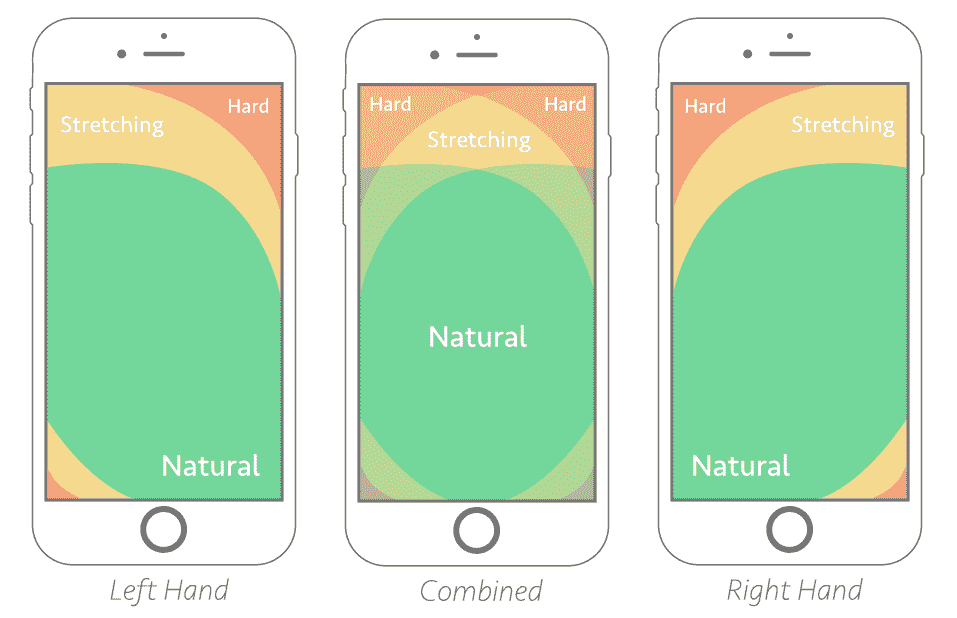
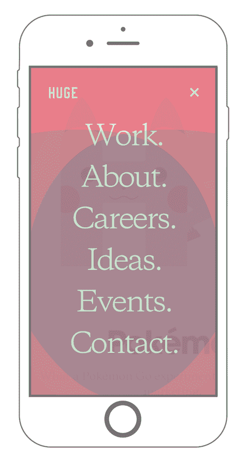
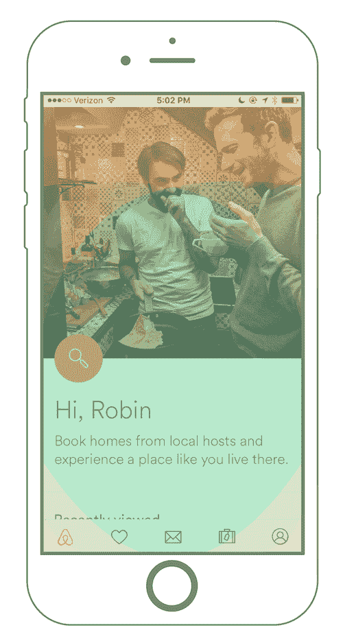
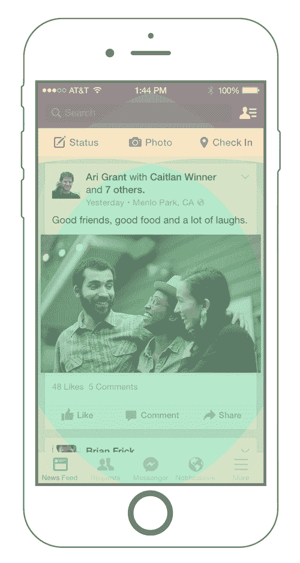
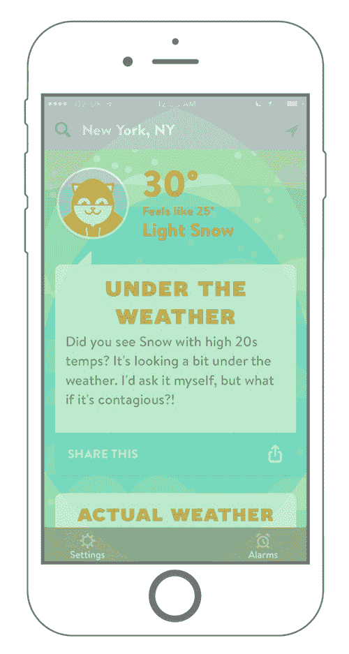
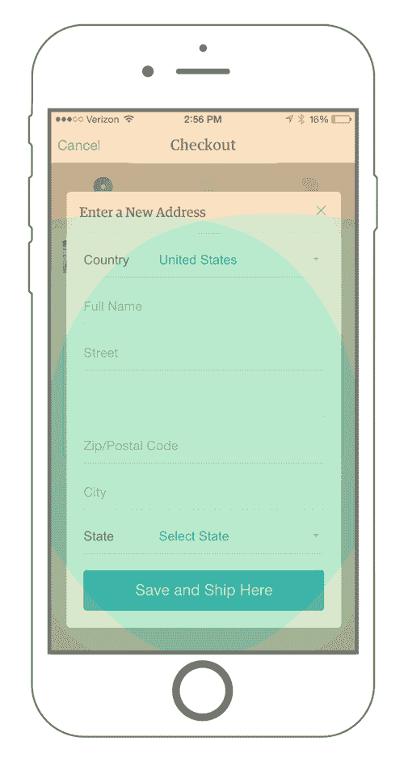
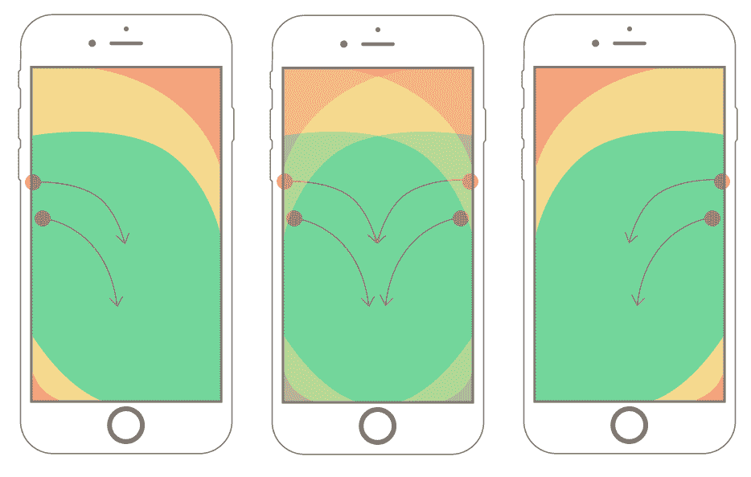
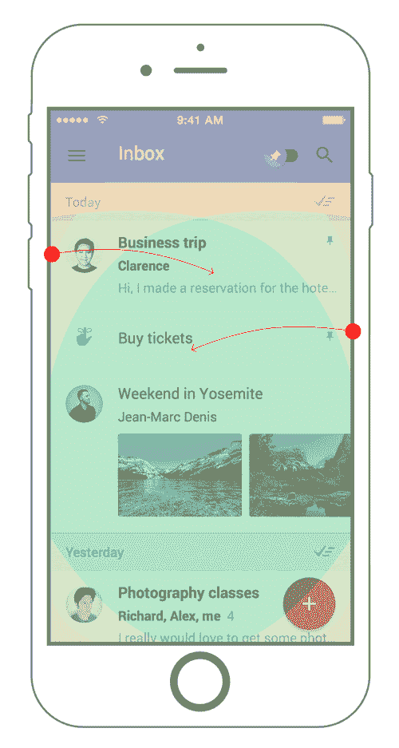

# 拇指区:为移动用户设计——粉碎杂志

> 原文：<https://www.smashingmagazine.com/2016/09/the-thumb-zone-designing-for-mobile-users/?utm_source=wanqu.co&utm_campaign=Wanqu+Daily&utm_medium=website>

如果有一样东西能经受住时间的考验，那就是拇指在移动设备上的位置。这使得对“拇指区域”的考虑成为移动界面设计和开发中的一个重要因素，这个术语是在 Steven Hoober 的研究中创造的。

你是否曾经与一个手机网站或应用程序互动过，而这个网站或应用程序根本无法用你的大拇指玩得很好？也许你不得不伸展身体才能进入一个重要的菜单，或者滑动变成了一场多滑动元素的战斗。诸如此类的事故暴露出对拇指区考虑不周。

在这篇文章中，我将分享我获得的关于拇指区的知识，以及如何将其规则应用于导航、卡片和滑动手势。

## 向最好的人学习

如上所述，Steven Hoober 在*设计移动界面*中研究并撰写了关于拇指区域的文章。这是我第一次遇到在开发时考虑拇指可能很重要的想法。

和胡伯一起，乔什·克拉克在他的书*为触摸而设计*中记录了关于人们如何手持设备的深入信息。你可以单独阅读列表上的[节选。](https://alistapart.com/article/how-we-hold-our-gadgets)

利用 Hoober 和 Clark 对拇指如何在设备上交互的研究，我对改变设计元素位置的线框进行了用户测试。我的测试在屏幕的顶部和底部运行导航元素，在不同的位置运行带有按钮的卡片，并在拇指区域的内部和外部运行手势区域。

我的测试结果验证了胡伯和克拉克的研究，同时为设计中什么可行什么不可行提供了坚实的证据。下面，我将分享我对测试的设计元素的发现。我们开始吧！

More after jump! Continue reading below ↓

## 拇指与触摸屏

有对生拇指很好，不是吗？除了让我们比水母更酷之外，拇指也是我们如何与移动触摸屏设备互动的关键。胡伯的研究表明，49%的人单手拿着智能手机，依靠拇指来完成繁重的工作。克拉克更进一步，确定 75%的交互是拇指驱动的。

了解了手的位置，我们可以得出结论，拇指运动的某些区域适用于大多数智能手机。我们将它们定义为容易触及、难以触及和介于两者之间的区域。

Thumb-zone mapping for left- and right-handed users. The "combined" zone shows the best possible placement areas for most users. ([View the large version](https://cloud.netlifyusercontent.com/assets/344dbf88-fdf9-42bb-adb4-46f01eedd629/496f7bc0-4c6c-4159-b731-ec3adcf91105/thumb-zone-mapping-opt.png)).

诀窍是为拇指区的流动而设计。这为做出更好的设计决策、创造人性化的体验和减少麻烦提供了一个框架。通过用户测试和实验，我发现了一些在日常开发中使用这些知识的方法。

### 导航问题

我们都记得手机导航只是一个下拉链接列表的时代。它并不漂亮，但它完成了任务。今天，我们看到了无数的[导航模式](https://www.nngroup.com/articles/mobile-navigation-patterns/)的例子。什么最适合拇指区？

用户的自然运动是我学会考虑的第一件事。提问:“我的应用程序有很长的链接列表吗？”“我需要混合菜单吗？”“我的网站设计适合什么？”这些问题的答案将帮助您确定在哪里放置导航触发器和挂钩。

如果你的应用程序有一个很长的链接列表，那么你可能会想要使用一个全屏幕覆盖菜单。这种类型的菜单为你组织列表、社交按钮和其他有用的内容提供了空间。这种模式在桌面和移动设备之间的伸缩性很好，菜单提供了在缩略图区域内对齐可点击元素的机会。

[巨大的](https://www.hugeinc.com/)一直大量使用移动设备上的全屏覆盖菜单:

Huge uses a full-screen overlay menu. ([View large version](https://cloud.netlifyusercontent.com/assets/344dbf88-fdf9-42bb-adb4-46f01eedd629/301bb91b-9d4b-4fe3-a8e2-cbbbf7b99a5c/huge-full-screen-opt.png))

另一方面，如果你的应用没有很长的链接列表，那么粘性菜单可能是最好的。这种类型的菜单附加到屏幕的顶部或底部，并根据设计为许多链接提供空间。

[Airbnb 的移动应用程序](https://www.airbnb.com/mobile)有一个粘性菜单，贴在屏幕底部，可以方便地访问重要的预订、信息和房源信息:

Airbnb’s mobile app has a fixed footer. ([View large version](https://cloud.netlifyusercontent.com/assets/344dbf88-fdf9-42bb-adb4-46f01eedd629/b60ab8ba-659a-4df5-8a74-14b96563b85f/airbnb-app-fixed-nav-opt.png))

如果你有一个大型网站，混合菜单可能会有用。因为混合菜单会变得复杂，所以根据菜单链接在应用程序中的重要性来区分它们的优先级是很有帮助的。粘性菜单对于经常访问的链接很有用，而全屏和抽屉菜单对于重要但优先级不高的链接很方便。

想想脸书的手机应用程序:

Facebook’s mobile app combines multiple fixed menus and drawers. ([View large version](https://cloud.netlifyusercontent.com/assets/344dbf88-fdf9-42bb-adb4-46f01eedd629/6ac5b12b-5852-4861-8515-c75fdde337a2/facebook-app-combined-menus-opt.png))

脸书根据菜单内容的大小来混合菜单。在上面的截图中，我们看到两个粘性菜单，每个都包含对用户有价值的链接。顶部的粘性菜单在拉伸区域，但是在页面上足够低，感觉很自然。底部的粘性菜单项是有组织的，以提供舒适的热门链接。

通过收集用户数据，实践良好的设计和利用拇指区，脸书拥有了粘性菜单。下一次你在浏览你朋友的帖子时，记住那些让你的浏览体验变得更好的一系列决定。

请记住，除了将重要的导航项目放在缩略图区域之外，有时将链接放在友好区域之外也是可以接受的。一般规则是将经常使用的链接放在容易到达的区域，将不常使用的链接放在难以到达的区域。

### 保持卡片友好

接下来，我们将回顾一个设计良好的卡片模式如何适用于您的应用程序。[卡牌图案](https://thenextweb.com/dd/2015/11/16/why-cards-are-dominating-mobile-design)现在已经广泛使用了一段时间了。卡片是快速、容易和可预测的；它们提供少量的突发信息，使得在正确的时间传递正确的内容变得容易。

通常，我们将卡片与动作联系起来:发送、保存、完成、关闭等。

Ponch: Wake Up Weather’s card pattern ([View large version](https://cloud.netlifyusercontent.com/assets/344dbf88-fdf9-42bb-adb4-46f01eedd629/0da4b2af-fada-4631-a35f-f57ed96819a8/poncho-card-actions-opt.png))

在这个例子中，我们看到了[雨披:唤醒天气](https://poncho.is/)应用。这是在卡片中放置可操作链接的一个很好的例子:天气预报不需要拇指点击，所以它被放置在不可及的区域内。操作项(在本例中是一个共享按钮)直接放置在自然区域中。

另一方面，Poncho 将其“位置搜索”和“使用当前位置”链接放在难以到达的区域内。这是可以接受的:用户不会经常使用这些功能，因为应用程序会记得你上次打开时的位置。

另一方面，有时卡片图案没有利用拇指区。Etsy 的移动应用程序就是一个很好的例子。在结帐时，Etsy 在弹出卡中提供一个表单，供用户输入他们的运输信息:

Etsy’s checkout flaws in the card pattern. ([View large version](https://cloud.netlifyusercontent.com/assets/344dbf88-fdf9-42bb-adb4-46f01eedd629/3742b839-a1bf-40dd-aeb8-8cb28ff17a0d/etsy-card-actions-opt.png))

乍一看，卡片的这种用法似乎很恰当，也很有设计头脑。深入挖掘，我们看到了缺陷。第一个问题是左上角的“取消”链接。这个链接是关闭卡还是取消结账过程(如果我不明白，其他人肯定也会不明白)。此外,“x”位于拇指区的边缘，迫使用户伸出手去够它。

这里有一个难题:在卡片的上角添加关闭按钮是一种常见的模式，但它违背了拇指区域规则。如果你要打破拇指区来满足用户的期望，寻找一个替代的解决方案。我们可以尝试在卡片底部添加一个关闭按钮，或者——因为卡片最适合传递短时间的内容——我们可以尝试限制卡片内容的长度。

随着卡片设计的流行，通过拇指区地图来运行设计是一个好主意，以确保大多数元素易于访问并且不会混淆。避免跟风；相反，在应用程序的设计和开发过程中，要做出以人为本的决策。

### 手势和动作

[手势](https://thenextweb.com/dd/2015/11/09/how-to-implement-gestures-into-your-mobile-design):轻击、双击、滑动、拖动、挤压和按压。这些都是智能手机蛋糕上的糖衣。手势使我们能够通过我们的触觉接触技术。

你也许能猜到这将走向何方。保持手势在拇指区域内。更重要的是，允许用户自然地做手势。这似乎是显而易见的，但要真正获得舒适的体验，计算手势应该发生的位置是很重要的。

让我们把重点放在滑动交互上。通过[滑动跟踪脚本](https://blog.blakesimpson.co.uk/read/51-swipe-js-detect-touch-direction-and-distance)，我发现了一些非常有趣的运动数据。

Visualization of swipe-gesture data found during user testing. ([View large version](https://cloud.netlifyusercontent.com/assets/344dbf88-fdf9-42bb-adb4-46f01eedd629/2d29ee60-dbfe-4575-a282-21e250d870a9/swipe-movements-opt.png))

在上面的地图中，圆圈代表点击，箭头代表滑动。我从测试中收集的数据显示，用户通常从设备的边缘向中间倾斜向下滑动。我还发现用户一般在拇指区的自然区域刷卡。

最初，我错误地认为用户水平滑动，这在测量滑动手势的拇指面积时产生了问题。我的设计规格没有提供足够的空间来滑动而不同时触发另一个滑动区域。与大多数移动设计元素一样，考虑滑动所需的拇指空间。我发现滑动区域的合适尺寸至少是 45 像素高和 45 像素宽。

有了所有这些信息，我们可以得出结论，最好将滑动手势操作放在容易触及的区域，同时也要留出足够的空间来防止意外输入。

滑动手势的一个很好的例子是谷歌的收件箱应用程序。

Google Inbox supports swipe gestures in the right places, with the right amount of space. ([View large version](https://cloud.netlifyusercontent.com/assets/344dbf88-fdf9-42bb-adb4-46f01eedd629/510c8257-e179-4b47-beba-08ba62633e17/swipe-zone-google-inbox-opt.png))

这里的明智决策是:

*   将滑动手势放在难以触及的区域之外；
*   提供足够的攻丝空间；
*   允许在每个电子邮件块元素的任何地方开始滑动。

有了这一切，手势感觉自然舒适，使电子邮件管理更快，更简单。继续坚持，谷歌！

## 摘要

我们学到了什么？希望你能更好地理解为什么拇指区很重要。记住这些要点:

*   移动设备和语言将会改变，但只要有触摸屏，拇指区仍将是设计的重要部分。
*   当重要的链接在容易到达的区域，不重要的链接在难以到达的区域时，导航设计是拇指友好的。
*   当内容和动作是拇指区域友好的时候，卡片是一个强大的设计资产。
*   当我们考虑一个人如何用拇指在玻璃屏幕上滑动时，确定滑动手势区域就变得简单了。

### 有用的链接

我留给你这个:继续读！从业内其他人那里可以学到很多东西。以下是一些关于为人类设计主题的链接:

## smashing mag 上的进一步阅读:

 (da, yk, al, il)