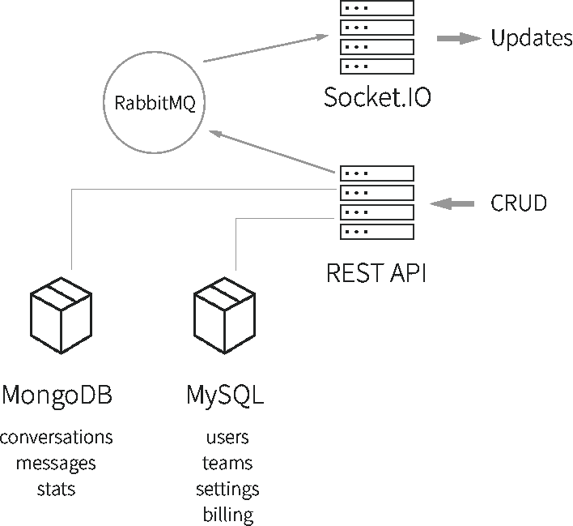

# 不使用 Firebase 的理由

> 原文：<https://crisp.im/blog/why-you-should-never-use-firebase-realtime-database/?utm_source=wanqu.co&utm_campaign=Wanqu+Daily&utm_medium=website>


构建实时应用程序是当今的标准。在 [Crisp](https://crisp.chat/en/) 的时候，我们从第一天开始，用 [Firebase](https://firebase.google.com) 生产了 9 个多月。*从梦到噩梦，这里是我们的经历。*

*请注意，本文涵盖了使用 Firebase 实时数据库的生产方面，我们仍然认为这个解决方案对于构建 MVP、Hackathon 项目，或者如果您有自己的理由，仍然是很棒的。*

编辑:Firebase 联系了我们，并且非常乐于接受我们遇到的问题。我们很高兴看到这样一个参与他们产品的团队。我们的情况很特殊，因为我们有非常具体的需求，我们达到了 Firebase 的极限(顺便说一下，这是 2016 年之前的 Google I/O 版本)。尽管如此，如果您需要的只是存储用户数据和处理实时问题，这是一个非常好的服务。

## 该项目

### 我们使用 Firebase 的最初(充分)理由

Crisp 是一个非常简单的实时聊天工具，专注于用户体验。我们想找到一个划算的解决方案，所以我们决定使用[插座。IO](http://socket.io) 后端处理网站上的实时聊天，同时，使用 Firebase 作为我们的仪表板，所有这些都与后端的 [AMQP](https://en.wikipedia.org/wiki/Advanced_Message_Queuing_Protocol) 同步。

**这种混合架构使我们能够在仅 3 周的时间内完成 MVP**，包括实时聊天和仪表盘，供不同的人同时使用，并让它与微服务进行通信。这种无服务器的 MVP 仪表板允许我们专注于 UI 和 UX，而不是服务器代码，这实际上是一件好事。

我们很快推出了产品，并且很早就进入了市场。正是你想要的 MVP。

### 然后暴风雨来了

最初几个月很顺利，然后就繁荣了。我们让[上了 ProductHunt](https://www.producthunt.com/tech/crisp) 的专题。我们有了很大的增长，但随之而来的是我们的第一个规模问题。

Firebase 从一个巨大的资产变成了一个噩梦，减缓了我们的执行速度。构建新功能是一个大难题，在生产中发布新产品之前，我们必须三思而行。

我们也发现了 Firebase 的技术限制，因为当我们每月扩展到 100GB 以上的 Firebase 流量时，我们遇到了性能问题。

## 转换的 10 个理由

#### 1.意大利面条代码

无服务器，不代表无代码！使用 Firebase 意味着**你所有的服务器逻辑现在都在你的 web 或移动客户端上运行。**

在大多数应用程序中，你必须发送欢迎电子邮件，处理图像(头像等)，处理支付，并建立你的业务核心功能。你真的不希望所有这些都在客户端上完成，因为这对你的业务来说可能是不可能的，也可能是危险的。

这些东西可能仍然会被 Firebase“入侵”,但这意味着你将不得不向你的 web 应用程序添加更多的代码，如果你也有一个移动应用程序，维护起来可能会是一场噩梦。

想想分布:任何数据库逻辑的改变都会导致客户端应用程序的更新。你如何处理没有更新的客户？您的用户停用旧客户端以强制更新是正确的做法吗？

#### 2.将 Firebase 与微服务集成在一起是不明智的

在 Crisp，我们使用微服务，在许多情况下，您必须查询数据库，以获取用户信息、id 等。

Firebase 既可以在客户端使用(例如:Web、移动应用)，也可以在后端使用(例如:NodeJS)。你可以直接从后端通过网络查询 Firebase，但是你应该避免这样做，因为它在规模上真的很慢。

我们使用 [Redis](http://redis.io) 来缓存所有这些操作，这意味着我们必须来回同步所有数据。做这项工作的微服务(换句话说——连接到 Firebase)有内存问题，因为 Firebase 在内存中缓存数据，似乎没有释放所有未使用的引用(我们使用了 [Firebase NodeJS 库](https://www.npmjs.com/package/firebase))。

#### 3.定价

无服务器并不意味着无成本。不不不:总有一天你要为你的懒惰付出代价。事实上，当我们收到来自 Firebase 的电子邮件时，我们不得不这样做:

> Firebase 付费等级有使用配额，如果超出计划限制，还会收取超额费用。你的 Firebase，crisp- <..>，已经超过了它的计划限制，并且，由于我们这边的一个错误，你没有被收取超龄费。我们将在下周开始纠正这一问题，这将导致您的帐户因任何超额使用而被收费。

> [..]

> 非常感谢您成为 Firebase 的客户！

谢谢你的邮件，Firebase！

每月支付 100 美元购买可以在 5 美元的 DigitalOcean droplet 上运行的东西，会让你在处理无服务器代码时三思而行。

使用您自己的服务器代码，您将获得可维护性和生产率，并且您将拥有一个具有成本效益的代码库。

#### 4.Firebase 在加载时下载所有子树

假设您正在构建一个类似 Slack 的应用程序，您将不得不在应用程序加载时下载所有通道数据。

有些人会说这可以通过分页得到改进，但是使用 Firebase，你不能分页，因为你不能得到查询数组长度，你不能对有序数组分页，等等...

#### 5.你可能会有矛盾

Firebase 支持离线操作。它的工作方式类似于“git commits ”,但主要问题是，如果您的客户端离线然后在线，并且您对一些输入数据(例如，一个共享的记事本)有并发性，您可能会有不一致。非常类似于 [Git 合并冲突](https://help.github.com/articles/resolving-a-merge-conflict-from-the-command-line/)。

#### 6.数据迁移的问题

使用 Firebase，您不能像处理简单的 SQL 数据库、ORM 或 T2 ODM 那样轻松处理数据迁移。

这意味着你必须做这样的事情:

```
if (user && user.new_subdocument && user.new_subdocument.new_property) {
  // Do stuff.
} 
```

**导致安全状况，无处不在。**

#### 7.关系非常好

处理与 NoSQL 的关系是困难的，处理与伊朗的关系是痛苦的。

例如:*一个用户属于一个团队，一个团队有用户*。

**用户:**

```
{
    name : "John Doe",
	team_ids : [...]
} 
```

**团队:**

```
{
    name : "Acme Inc",
	user_ids : [...]
} 
```

这意味着你的用户必须观察*团队标识*，然后填充到你自己的团队中，你的团队必须观察*用户标识*并填充用户。这个例子很简单。想象整个事情有更多的关系，你会得到一个意大利面条逻辑。

#### 8.队列是错误的

为了处理服务器代码和微服务，Firebase 引入了队列来在服务器之间共享操作并防止并发(例如:避免发送两次电子邮件)。

实现 Firebase 队列的 NodeJS 库被命名为: [firebase-queues](https://www.npmjs.com/package/firebase-queue) 。

Firebase 团队没有很好地维护这个特性，我们有几个 bug，包括同步问题、锁定等。

此外，队列是一个规模瓶颈，因为队列项可以快速插入(堆叠)，但消耗(非堆叠)非常慢。如果连接的客户端插入的数据超过了后端的处理能力(这似乎是受 firebase-queue 库计时器的限制，而不是 CPU 或网络)，这将导致巨大的处理延迟，这在处理实时应用程序时是不可接受的。此外，我刚刚描述了一个潜在的 DOS 攻击媒介:连接到一个客户机，用记录淹没队列，整个队列任务将被大大延迟，从而使服务变得不可用。

所以，是的，避免排队。

#### 9.你不拥有你的数据

除了你的数据存放在不属于你的服务器上，你也不可能导出你的用户数据。您不能导出电子邮件，并且用户帐户不可恢复(您不能导出带密码的用户帐户)。

另外，当我们有数百兆的主机时，不可能导出我们的数据。我们不得不通过电子邮件联系 Firebase。

**注意**:通过联系 Firebase 团队可以导出数据电子邮件/密码数据，但不能从仪表板导出。

#### 10.复杂的查询是不可能的

仍然无法查询您的数据库来查找具有某些属性的字段。

例如，你想建立一个类似 Slack 的应用程序:你不能计算未读消息，即使你有合适的结构允许这样做(例如:一个 read = <true>标签)。这种方法是在检索了整个数据集之后，**统计客户端的所有未读消息。这是一个巨大的性能问题。**</true>

您不能执行操作来获取活动用户，或者执行批处理操作来更新具有某些字段的文档。

#### 奖金。想为你的产品构建一个 API？不可能的。

今天，大多数应用程序都公开了一个开发者 API。这是不可能做到的。

当然，在收到来自客户端的 API 请求时，您仍然可以远程查询您的 Firebase 数据库，但是这将非常慢，因为数据是远程托管的，并且 Firebase 库正在泄漏内存(见上文)。

第二个解决方案是制作 HTTP 包装器。尽管如此，在这种情况下，最好的选择是使用您自己的数据库系统(关系型或非关系型)用您托管的标准存储后端构建您的 API。这就是我们所做的。

## 移民

#### 体系结构

我们决定迁移到 REST API。为了简单起见，我们选择使用老式的 SQL 数据库，它满足了我们 90%的数据存储需求。它有关系、模型，并且它是制作一个防弹的、简单的、可维护的 API 的完美选择。你可以在这里阅读我们的 API 文档

对于 10%的部分，我们决定使用 MongoDB 来大规模存储消息和对话。我们在 MongoDB(这是 MongoDB 中事实上的标准)和 SQL DB(这不是 SQL 世界中的标准)中使用 UUIDv4 作为主键，以使它对每个人都透明。

所有 CRUD(创建/读取/更新/删除)操作都在 REST HTTP 层上执行，一些异步回复(在一些 API 请求之后)通过 Websocket 层(我们称之为我们的实时 API)发回。

更新通过 AMQP 在内部转发，然后与套接字同步。IO 微服务，认证层过滤你订阅的资源。

简单、有效、可持续。我们现在可以自由地从插座切换。IO 到另一个引擎，或者甚至**从 MongoDB 迁移到另一个数据存储**。



#### 让我们编码

从 [Paw](https://paw.cloud/) (一个[邮差](https://www.getpostman.com/)样的应用，用于 Mac)开始构建 API，通过模仿 API 路线和模拟事物。然后，我们让它与真正的代码一起工作。我们使用 NodeJS，但是你也可以使用 PHP、Ruby 或者任何你和你的团队乐意使用的语言。

与此同时，我们从应用中移除了所有 Firebase 逻辑，从客户端移除了所有逻辑，并通过我们的 API 插入了所有网络操作。复杂性应该在服务器中实现。

这两部分花了大约三周时间，然后是我们的迁移脚本、迁移测试和生产迁移。

#### 让我们再次呼吸

这一迁移使我们能够再次专注于执行，我们的产品也有了一些改进:

*   Web 应用程序加载时间从一些有很多对话的用户的 **20 秒**减少到 **2.5 秒**(恒定时间，不管你有多少聊天)。
*   像搜索、分页等功能现在已经成为可能，因为:MongoDB。
*   我们的应用程序代码又变得简单了。
*   制作移动应用也变得简单了。
*   由于模式和 ORM，迁移现在变得很容易。
*   我们可以查询我们的数据库，以便在需要时更新 so 输入(应用折扣等)。
*   我们现在有了一个开发者 API。

**感谢您的阅读，现在，在使用 Firebase 之前请三思！**

