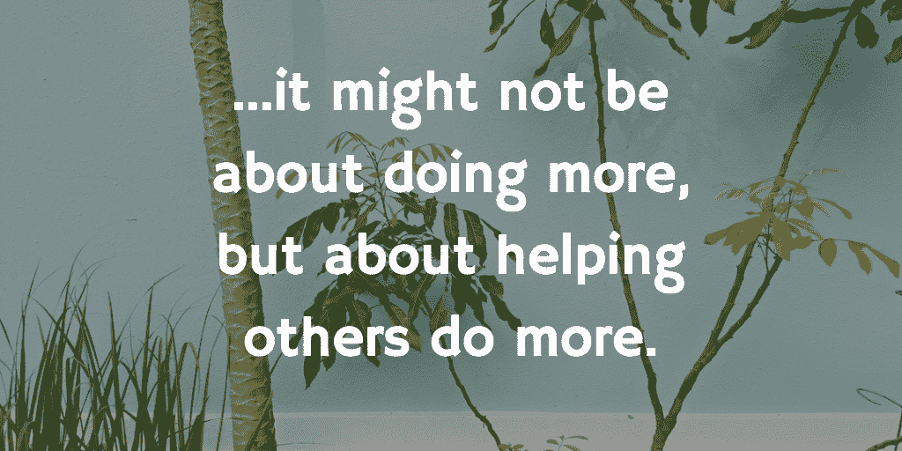
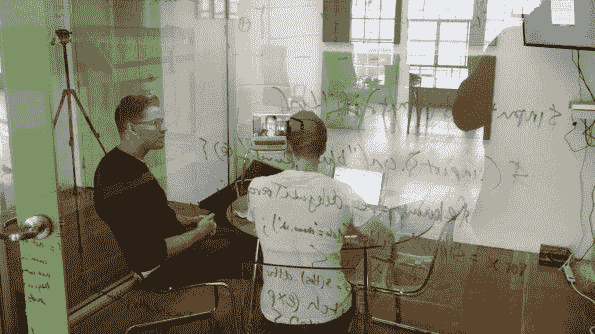
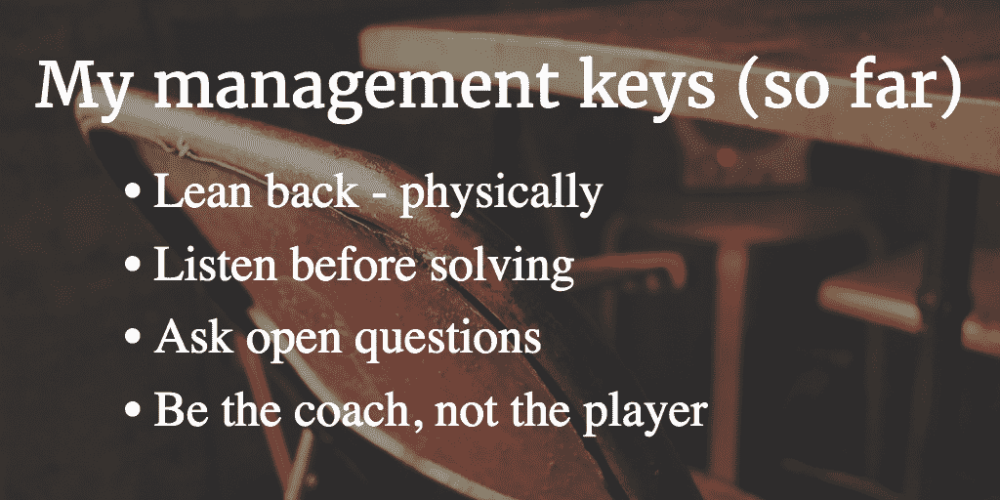
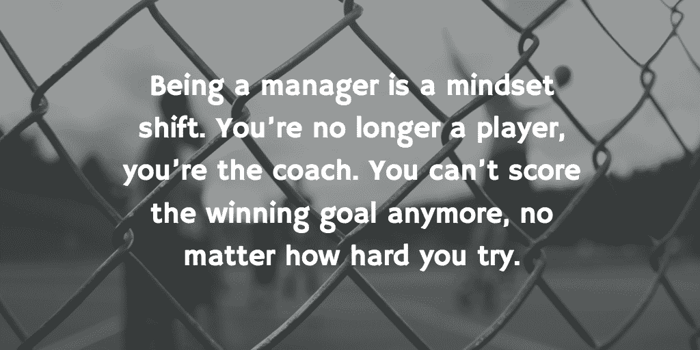

# 从创客到经理:我创业历程中最大的挑战

> 原文：<https://open.buffer.com/maker-manager/?utm_source=wanqu.co&utm_campaign=Wanqu+Daily&utm_medium=website>

2011 年 1 月 3 日，是我作为社交媒体实习生在 Buffer 的第一天。

乔尔和我想出的介绍性任务相当简单:**每天花 30 分钟在 Buffer 的 Twitter 账户上，[帮助它成长](https://blog.bufferapp.com/buffers-first-tweets-social-media-tactics-startup)。**当时我们有大约 78 名粉丝，100 名粉丝的目标指日可待。

我刚满 20 岁，大学二年级已经过了一半，我已经准备好了——做任何真正的事情。不管怎样，我只想去做。

Joel and Leo in May 2011

我照做了。我一开始就犯了很多错误，搞得一团糟。我开始在 Twitter 上自动给人们发信息，像卖二手车的一样把 Buffer 推给他们。我仍然畏缩现在想到这一点。而且还有些好东西！我发现，仅仅是与人互动和[提供优质的客户服务](https://blog.bufferapp.com/social-media-marketing/customer-service)就大有裨益。

从 Twitter 上，我发现了博客，尤其是博客评论。我开始和每一个写了类似社交媒体和营销话题的人交朋友。

乔尔给了我一本如何赢得朋友和影响他人的，我被深深吸引住了。不再有肮脏的策略——只是交朋友，为有问题的人提供帮助，并产生有价值的内容和见解。太好玩了！

## 从实习生到创客再到经理

从那里我发现，事实上，我可以自己写文章。我照做了——一开始很差，后来逐渐好了。这里有一个我早期文章的[例子。随着时间的推移，我在](https://blog.bufferapp.com/top-things-to-do-if-you-only-have-20-minutes-a-day-for-twitter)[制作了数百个帖子](https://blog.bufferapp.com/author/leo)，每天大概从早上 8 点工作到晚上 8 点，最后在晚上 8 点与乔尔同步，回顾当天的公开问题。我记得躺在床上时是如此疲惫不堪，但也是如此满足，以至于第二天早上我会直接从床上跳起来，从头再来一遍。评论，写博客，在 Twitter 上回答问题，与 Joel 同步。冲洗并重复。

渐渐地，我在 Buffer 的角色发生了变化，我学到了更多的东西。如何获得媒体报道，如何筹集资金，如何雇用人员，如何做更多的营销工作，如何进行业务开发和合作，如何进行销售电话，如何进行公开演讲，如何进行部分产品开发等等。我甚至在那里学习了一些 Ruby on Rails 和 Javascript。

我过去喜欢，现在仍然喜欢学习所有这些东西。这都是*在做*。前 2-3 年，我 100%在做事。

随着我们开始让更多的人加入进来，主要是在产品和客户服务方面，所以我一直在做一些事情——更大的项目，更大的合作伙伴，更大的公关渠道。我就是这样坚持学习的；通过给自己设定目标，比如“好了，我们做了 TechCrunch，现在让我们进入《纽约时报》。”

又过了一年，我勃然大怒。我很确定在所有这些方面我还可以做得更好；我同时做了这么多事情，以至于我从未真正成为其中任何一件事情的专家。然而，我开始对写下一篇博客感到不那么满意了，即使它拥有成千上万的读者，并带来了许多新客户。

这是幸运的，因为这个团队缓慢但稳定地成长，甚至在营销方面。突然间，我可以做其他事情了。那时我才明白，这可能不是做得更多，而是帮助别人做得更多。是时候开始了解管理的新旅程了。

Leo and Joel in San Francisco, 2014

起初，我以为我会像学习其他技能一样学习管理，比如公关或客户开发。

现在，大约两年后，我意识到成为一名经理不仅仅是另一种技能。这是关于在一个更基本的层面上改变。

## 做与管理:它们在许多方面是对立的

我注意到的第一件事是“做”和“管理”几乎是截然相反的。当我在做的时候，我正在制作作品，需要大量的埋头时间来制作东西。作为一名经理，我几乎什么都不生产。我能做的最好的事情就是帮助那些正在制作的人。

然而在我的一生中，我一直被“做”所束缚。从我 6 岁想踢职业足球的那天起，一切都是为了做——投入工作、训练和展示。一次又一次，就像后来在 Buffer 上的博文一样。

我不得不放弃向前做动作。字面上。当我今天在[一对一辅导会议](https://buffer.com/resources/coaching/)的时候，我确定要做的第一件事就是身体向后靠在椅子上。

这是给我自己的一个信号，我不在这里做。我是来听的。另一个人只是做了整整一周，所以从中会有很多挑战和成就。他们已经做得够多了；他们不需要我再跳下去。

这让我想起了很多冥想，当你静静地坐着时，你首先会注意到你有多少想法。慢慢的，渐渐的你的想法变少了。有了那个空间，我往后一靠，放手，一切都自然而然地发生了。从某种程度上来说，成为一名经理是一项巨大的冥想练习——注意我的“做事”习惯，并温和地避免采取行动。

## 我不是来做。我是来听的。

自从成为一名经理以来，同情和倾听对我来说有了全新的意义。

真正倾听真的很难。当别人带你经历一个挑战或观点时，要跟上他们的想法，而不是在 10 秒钟内用“让我打断你，给你解决办法”来阻止他们，是如此困难。做的习惯如此强烈和根深蒂固，以至于我想抓住每一个机会。

当我没有做好“后仰”的工作时，下面来看看当我与某人一对一时，我的大脑在想些什么:

> “哦有意思！是的，我明白了，这个项目有问题。是的，嗯，他/她应该这样做，然后对他们的团队这样说。他们也应该阅读这篇文章，这是一篇关于管理和提供反馈的好文章。嗯，一般来说，团队中的每个人都应该阅读这篇文章。也许在这之后，我应该与 Slack 上的团队分享它。或者在推特上，我应该把它加到我的缓冲区里。我已经有一段时间没有填满我的缓冲区了，所以我应该多做一些。我认为这会在 Twitter 上引起很多关注。”

我偏离了这个思路，错过了这个人所说的大部分内容。最重要的是，我用了大约 10 秒钟总结了我的建议。

## 自己试试这个快速听力练习

自己试试:问别人一个问题，或者让别人给你讲一个故事，然后就坐在那里听。注意你的想法是如何转移到你午饭要吃什么，或者你自己想在谈话中加入什么。注意你是如何被正在发生的事情或走过的人分心的。把它带给你每次都在听的那个人，把每一个字都吸收进去，就像它是你听到的第一个单词一样。

这很难，但很值得。当我开始练习时，我开始注意到更多的东西。有人是怎么说的，真的？他们的手部动作，他们的肢体语言，他们的语气。对我来说，这不是一种检查和审查的形式，而是一种真正倾听和理解他们试图表达的内容的方式。

作为一名经理，练习倾听可能是我学到的最值得做的事情。当然，作为一名经理还有很多其他的事情——组织、安排会议、跟进、对项目和人员做出艰难的决定、让人们承担责任、管理项目等等。但最大的回报和挑战是真正倾听和学习如何提出好问题。

## 问更好的问题:真正的好奇心是关键

问伟大的问题也很难。很长一段时间以来，我问的问题都很糟糕——在很大程度上，我现在仍然如此，但我已经学会了一些东西。我认为这都与再次“做”有关——养成问更多问题的习惯，而不是在听完之后想提供一个答案，这都是重新布线过程的一部分。

我明白了，我问的任何希望得到具体答案的问题都不是一个好问题。以“你愿意吗”或“你愿意吗”开头的问题不是好问题，因为我已经假设了非常有限的可能性。

好的问题往往更加开放，可以从“如何”或“为什么”开始即使是这些也很难——有时我纯粹出于好奇问这些问题，但有时我会掩饰一个“你愿意吗”的问题。棘手的事情！

但是我已经变好了。我明白了，我不需要知道所有的答案——事实上，如果我不知道会好得多。我问的问题越多，对方自己想出答案的可能性就越大。

## 作为教练而不是球员寻找快乐

有时候，从大量的工作、写作和制作到倾听和提问，感觉就像让一辆车以每小时 100 英里的速度停下来。我常常特别喜欢远程工作，尤其是当我注意到自己身体前倾然后后仰，再前倾再后仰的时候。在办公室里看起来会很有趣！

我明白了成为一名经理是一种思维方式的转变。你不再是运动员，你是教练。你再也进不了制胜球了，不管你怎么努力。

有时候我还是会尝试。我曾试图指导某人一步一步地从边线踢进制胜一球。它不起作用。教练能提供帮助的最好方式是倾听、提问，然后才提出建议。

我们在 HelpScout 的朋友实际上把经理和个人贡献者分别称为 [*教练*和*球员*](https://www.helpscout.net/blog/effective-teams/) 。我对其中的原因很感兴趣:

> “这些词加强了我们在文化上的重要联系。第一，想到职业体育，**选手第一**。球迷穿球员球衣是有原因的。球员…体现了我们想要成为的人。教练的角色是为球员服务，帮助他们追求卓越，并确保他们的团队大于各个部分的总和。”

为了帮助球员追求卓越，我认为教练需要从他们的角度来看，并分享适合他们情况和动机的建议。不要老说“这是我做过的有效的事，所以你也应该做。”倾听，然后提出好的问题可能是达到目的的唯一途径。

在 Buffer 工作了 5 年后，从[制造者到管理者](http://www.paulgraham.com/makersschedule.html)的转变是我迄今为止经历过的最艰难也是最有收获的事情。这花了我大约 2 年的时间，我仍然觉得自己还处在旅程的早期。慢慢地，随着我发现更多的盲点和机会，我开始看到我想成为一名真正优秀的经理的全貌。这可能是最令人满意的部分，我现在可以看到光明了——不管它有时看起来有多远。

我很想听听你对此的看法。你倾向于一个创造者还是一个管理者，或者两者兼而有之？你如何练习像深度倾听和提出很棒的问题这样的技巧？我渴望在评论中得到你的见解、建议和反馈！