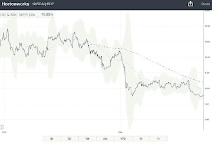
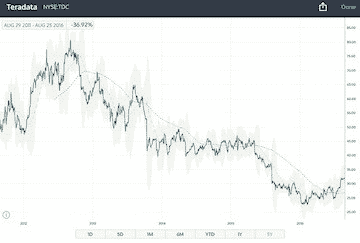
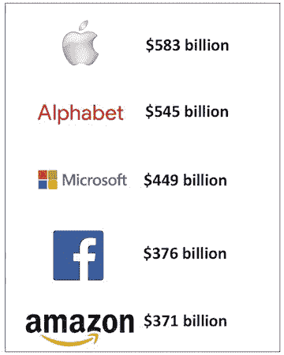
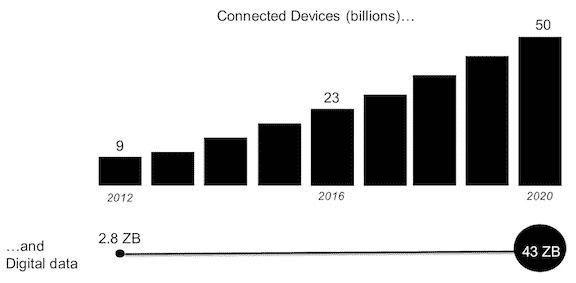
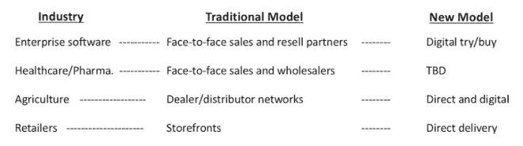
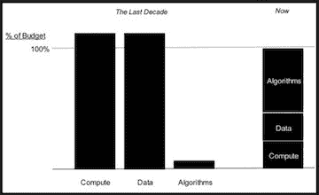
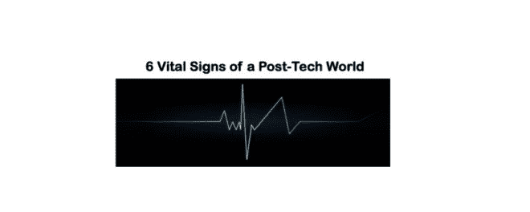
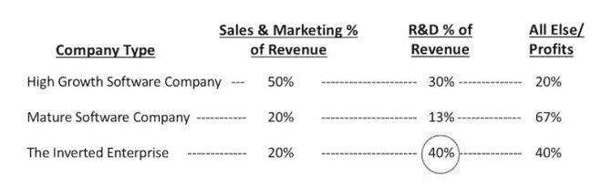
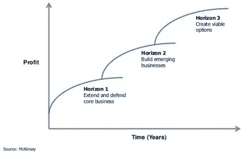
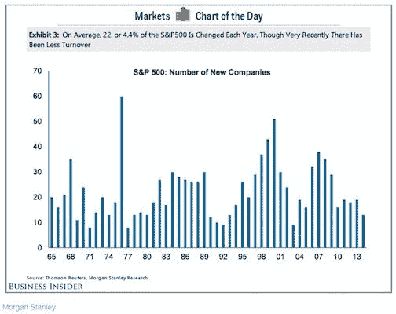

# 新公司转变|科技公司的终结

> 原文：<https://shift.newco.co/the-end-of-tech-companies-b093e82d1118?utm_source=wanqu.co&utm_campaign=Wanqu+Daily&utm_medium=website>

“如果你对战略选择中包含的风险没有真正感到痛苦，那就不算什么战略。”—雷德·哈斯汀斯

企业软件公司面临着前所未有的市场压力。随着云、数字、机器学习和分析(仅举几例)的出现，传统的商业模式、现金流和单位经济学面临压力。结果可以在一些公共股票价格(HDP、TDC、IMPV 等)中看到。)，以及几乎所有人的财务状况(传统领域的收入持平或下降)。

<noscript></noscript>

T4】

<noscript></noscript>

T4】

<noscript></noscript>

星探送来的图表

结果也可以从发生的私人交易数量中看出(Informatica、Qlik 等。);在公众视线之外改变你的商业模式更容易。简而言之，依赖传统分销模式、大额交易和人力密集型运营的商业模式仍将面临压力。

许多“非科技公司”告诉我，“谢天谢地，这不是我们所在的行业”，或者“科技变化太快了，我很高兴我们处于一个更传统的领域”。这些都是不切实际的希望。这一根本性转变正在(或已经)降临到世界各地的每一个企业和每一个行业。不管你是零售商、制造商、医疗保健提供商、农业生产商还是制药公司。未来 5 年，你们传统的分销模式、运营机制和价值创造方法将会改变；你要么领先，要么落后。

据说我们正处于下一次工业革命的风口浪尖。数据、物联网和软件正在取代工业化成为生产力和变革的驱动力。看看公共市场就知道了；全球市值最大的 5 家公司是:

<noscript></noscript>

T4】

正如本尼迪克特·埃文斯(Benedict Evans)所观察到的，“软件进入其他行业比其他行业雇佣软件人员更容易。”同样，[海军拉维坎特](https://medium.com/u/67f5049293c7)评论道，“没有软件的竞争就像没有电的竞争。”[数据时代](http://www.bigdatarevolutionbook.com)的兴起，加上软件和互联设备的蔓延，为一些公司超越其他公司创造了机会。那些知道如何利用这一优势的人将推动前所未有的财富创造，并组成新的 S & P 500。

这是“科技公司”的末日。“科技公司”的时代已经结束；只有沉浸在技术中的“公司”才能生存下来。

* * *

虽然这种趋势已经持续了一段时间，但现在变得更加严重，并开始在非科技精英的财务状况中显现出来(例如，过去 5 个季度中有 4 个季度的商业资本支出为负)。非科技精英尚未接受这样一个事实，即公司和科技公司正成为同义词。

有四种宏观冲击同时发生，加速了“科技公司”的终结，并迎来了所有公司都默认科技的时代。

**震惊 1:** 市场正在经历数字化转型:我们正在向全球 50 亿部智能手机迈进，这将影响所有类型的商务和客户/供应商参与。整体互联设备的增长甚至更大，同时伴随着数据爆炸。

<noscript></noscript>

数据来源:西门子公司

这改变了供应商、客户和利益相关者参与的性质，使得许多传统的分销和沟通形式在经济上不可行。正如 [MB](https://medium.com/u/3a0c38019af9) 曾经问的那样，“如果你将一些现有的行业数字化，你会以一种意想不到的方式引入网络效应，并导致潜在的指数增长，那么还剩下多少行业？”。

**震撼二:**消费世界和商业世界的用户都变了。正如[查马斯·帕里哈皮蒂亚](https://medium.com/u/dbfc705250be)曾经说过的，“未来的商业模式是为个人服务。”互联网正在使传统的现有优势民主化。任何行业的每个从业者都有传统的分销模式和客户/供应商互动方法。用户的变化和上述数字化转型正在侵蚀这些传统优势:

<noscript></noscript>

T4】

**冲击 3:** 计算价格暴跌，使得基于数据和分析的行业碎片化。与此同时，收集和分析数据的价格也大幅下降。

<noscript></noscript>

T4】

数据第一次成为竞争武器，在企业周围形成了护城河。对于一个要过渡到这个时代的公司来说，他们必须能够利用经济的这种转变，并利用分析和机器学习的力量。如今，对大量数据进行机器学习，就像网络效应或规模经济一样，是一种强大的竞争优势。

震惊 4: 公司不再具备转型所需的技能。[许多职业和行业的成功技能正在发生变化。一家曾经拥有一大批 IT 专家来运行系统的公司，现在需要一大批数据科学家。一家以商品销售为傲的公司，现在需要算法。当每个业务流程都被数字化或数据化时，业务的技能要求就会发生根本的变化。*我们正处于世界成熟经济体大规模再技能化的尖端。*](http://www.robdthomas.com/2015/10/preparing-your-career-for-data-science.html)

* * *

我相信有一种行之有效的方法可以在未来 5-10 年内适应并带领公司走向成功。它既需要技术技能，也需要业务、运营和财务技能。这不仅仅是一项 IT 计划或新业务应用程序的推出；这就是接受这是“科技公司”的终结，并接受科技是竞争的基础。所有决定采用这种技术的公司必须从评估他们的生命体征开始；我称之为后技术世界的 6 个重要标志。

<noscript></noscript>

T4】

1.  资本分配(再分配)
2.  产品策略
3.  走向市场战略
4.  工作习惯和工具
5.  才能
6.  使用仪器

这些重要的标志将决定一家公司在后技术时代的生存。虽然每个生命体征可能因行业、单位经济和商业模式而略有不同，但它们通常适用于每个企业。

* * *

**资本再分配**

如果资本结构和支出方式不发生巨大变化，一家公司就无法过渡到新时代。试想一下:一家公司的资本结构和支出是为过去十年成功的商业模式设计的，而不是未来十年。大多数公司的销售和营销费用被束缚在传统的分销渠道中，迫使它们在技术、产品创新和数字化参与方面投资不足。对于那些在未来十年寻求商业领导力的人来说，这是一个死亡螺旋。

每家公司都必须重新思考他们在产品开发、销售、营销和 G&A 方面的相对支出。这将不同于过去导致市场领先(或不领先)的组合。让我们以纯软件公司为例:

<noscript></noscript>

T4】

倒置企业颠倒了销售和市场营销、R&D 和其他一切之间的传统资本分配。如今，一个倒置企业的最佳例子是 Atlassian，这家公司成立于 2002 年，于 2015 年上市。Atlassian 基于数字分销建立了他们的商业模式，放弃了扩展企业软件公司的传统成本。他们专注于市场中的新用户(开发者)，将冲击#2 转化为优势。这给他们留下了更多的创新资本以及薪酬/股权，以雇佣最好的工程师来推动创新。

大多数认同资本结构现代化理念的公司都忽视了将支出重新分配给薪酬和股票的必要性。没有这种远见，人才争夺战(生命体征 5)几乎就要失败了。

**产品策略**

任何行业的产品都是从设计开始的。这也意味着从用户开始。在许多情况下，用户不是买方、顾客或经销商。这需要思维方式的重大转变。没有设计团队，公司无法实现产品的现代化。因此，雇佣一个设计团队(利用资本再分配的可用资金)是第一步。

虽然产品范围作为一种投资组合策略方法已经存在多年，但它仍然具有相关性。产品范围的传统模型如下:

<noscript></noscript>

T4】

鉴于当前市场的变化速度和之前讨论的宏观冲击，产品战略需要实施 Horizon 0。这些产品将被外包或完全停止，以便您可以将大部分投资用于 Horizons 2–3。这并不容易。事实上，这些是你在生命体征方面必须做出的最艰难的决定。但是，它不是可选的。每个公司在产品和产品生命周期的投资分配上都必须有选择性。

一旦按 Horizon 对产品或服务进行了分组，下一个任务就是为营销、公关和数字曝光选择您的主推产品。随着传统的分销渠道不再适用，展示任何特定公司的所有产品都是不现实的。每个公司必须选择代表公司的简洁的产品或服务。其他的将被出售，但这是 1-3 个将通过传统方式和数字方式积极营销。

**走向市场战略**

按照地平线的工作和产品策略，走向市场的第一个变化是最难的:停止销售你所有的产品。一家公司必须选择少量的领先产品，最好是那些被选为领先数字产品的产品。做出这个决定后，所有的营销路线(数字、内部销售、面对面)都可以围绕一个单一的信息展开。令人震惊的是，很少有大型企业能够做到这一点。随着时间的推移，通过收购和扩大产品/服务来实现增长，大多数公司从来不想停止任何事情，而是专注于少数可行的事情。一个公司如果没有一个单一而简单的走向市场的信息，不超过 1-3 个产品的支持，就不可能成功。

**工作习惯和工具**

尼克·多诺弗里奥说:“如果什么都不变，那就什么都不变。”除非用于执行关键操作的工作习惯和工具发生变化，否则一个组织无法发展成为技术领导者。它可以通过采用新的沟通形式(松弛等)从小处着手。)或文件共享(Box、Dropbox 等)，但它必须发展成一种全新的工作方式。想一想，有多少公司已经把他们的思维连线到相信创建一个 Powerpoint 是“工作”。它不是。Powerpoint 只是传达故事或数据的一种方式，可以通过 Watson Analytics 或类似功能通过实时仪表板轻松传达。改变工作习惯和工具的承诺可以简化为 3 个要点:

1.  减少或消除传统的沟通形式(Powerpoint、电子邮件、静态 BI 报告)
2.  引入新的协作形式，并使其成为强制性的(文件同步/共享、持续聊天、社交网络、面向开发人员的 github、视频会议和远程协作等)。).
3.  公司的领导层必须成为新工具的第一批采用者。

**天赋**

一个组织的专业知识必须比该组织期望的变化速度更快。这意味着天赋必须改变。而且，这不是 10%的变化。更接近 80%的变化。有两种方法可以达到目的:1)招聘和 2)培训。对于大多数公司来说，50%的员工应该接受培训和再培训，而 50%的员工可能需要从外部引进新的人才。没人说这容易。

强制性培训不起作用。如果一个人必须被要求学习，那么他们将无法做出必要的转变。为了让培训产生预期的效果，员工必须有学习的愿望和动力。领导者的责任是 a)提供一个自定进度的培训平台，b)为取得进步的人提供徽章和认可，以及 c)开发课程以确保正确的技能得到强调。

招聘中最困难的事情是，如果你的公司正在经历这种转变，在转变的早期，很难吸引到你需要的那种人。有两种方法可以克服这一点:首先，你必须彻底改变你的招聘流程和方法，包括薪酬。你想要的员工感兴趣的是他们的时间和成功后的收益。因此，奖金和股权变得非常重要，即使你通常不会为新员工提供这种类型的补偿。(注:这就是你的资本结构必须改变的原因)。其次，一个现代化的、鼓舞人心的工作环境对于吸引你需要的人是必要的。他们不想在你森林中杂乱无章的办公区工作；他们更倾向于在城市环境中拥有开放式座位的小办公室。

不是每个公司都必须对培训和招聘做出这些改变；只有那些想活下来的人。

**仪器仪表**

每个业务流程和相应的指标都必须进行测试。重要指标的实时每日仪表板是现代企业中的新管理系统。很少有公司有这个。由于传统方法(静态 BI 报告等)能够掩盖问题，向这种方法的转变将暴露出许多低效之处。一旦一个组织使用适当的工具探测了关键流程和应用程序，根据 KPI 的度量将在需要时立即可用。这将积极改变绩效管理。正如沃伦·巴菲特曾经说过的，“只有当潮水退去，你才能发现谁在裸泳。”

* * *

科技公司的末日即将来临。未来 5-10 年的生存需要每家公司在技术精英中拥抱未来，以便在任何行业保持竞争力。标准普尔 500 变幻无常的本质不应该被低估。标准普尔 500 每年平均有 22 家公司被增删(见下文)。

<noscript></noscript>

T4】

我预计这一数字将在未来十年翻一番，每年增加或减少 50-100 家公司。这是科技公司终结的本质，也是所有公司欢迎科技文化的本质。为后技术世界检查你的生命体征，以避免垮台。然而，检查你的生命体征必须成为你年度卫生的一部分，而不是一次性事件。第二次在任务上应该会更容易，但在要做出艰难决定方面可能不会更容易。

“如果你对战略选择中包含的风险没有真正感到痛苦，那就不算是什么战略。”雷德·哈斯汀斯是这么说的。当他将网飞从传统发行(邮寄 dvd)转向数字发行(流媒体)时，他亲身经历了这一切。这令人心痛，许多人怀疑自己是否有能力实现这一转变。未来 5 年，每家公司都会做出类似的痛苦决定。

***

这篇文章引出了我的新书《科技公司的终结》，在亚马逊[上可以找到。这本书只有 2.99 美元**从这本书项目中获得的所有利润都将流向**](https://www.amazon.com/End-Tech-Companies-Rob-Thomas-ebook/dp/B01M7Q6QSP/ref=sr_1_1?ie=UTF8&qid=1482246711&sr=8-1&keywords=the+end+of+tech+companies) [**DOMUS**](http://domuskids.org/about-us/) **，这是一家为康涅狄格儿童服务的非盈利性人类服务机构。**

***

*我是* [*大数据革命*](https://www.amazon.com/Big-Data-Revolution-insurance-discovering/dp/1118943716/ref=sr_1_2?ie=UTF8&qid=1474902052&sr=8-2&keywords=big+data+revolution) *的作者。*

*在*[*【www.robdthomas.com】*](http://www.robdthomas.com/)找到我所有的文字