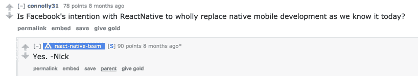
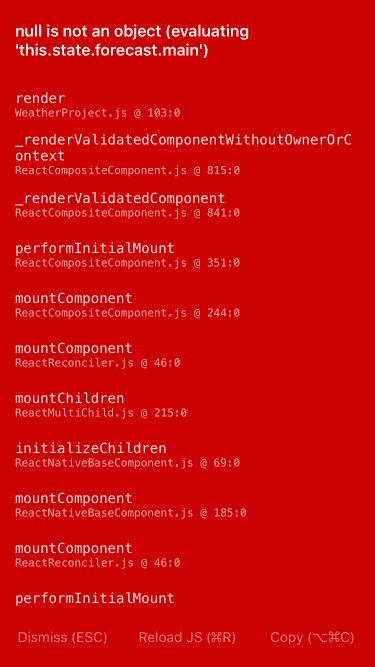
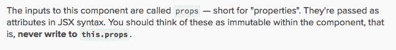
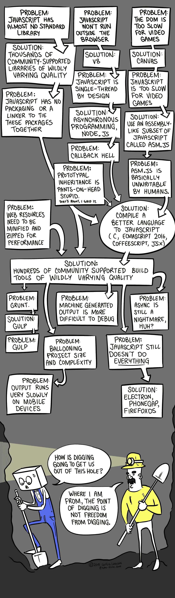

# 为什么我不是 React 本地开发人员

> 原文：<https://arielelkin.github.io/articles/why-im-not-a-react-native-developer?utm_source=wanqu.co&utm_campaign=Wanqu+Daily&utm_medium=website>

# 介绍

许多人目前正在评估 React Native，将其作为开发下一代移动应用的平台。这不是小事。切换您的软件开发平台需要很高的安装成本，并将深刻影响您的日常编程工作流程。这也是在任何实质性的东西建成后，撤销成本最高的决定之一。

也许更重要的是，你的软件开发平台也将你塑造成一名软件工程师。软件开发平台鼓励(或强制)使用一种语言而不是另一种语言，优先考虑某些架构，需要使用特定的工具和工作流，并将您与整个生态系统及其开发人员社区结合在一起。

脸书希望你改变:



而 React 原生团队的持之以恒和呕心沥血与野心相匹配。他们开发了一个如此强大的软件开发平台，可以合理地认为它是我们传统 Xcode/Swift/ObjC 栈的替代品。

它会是一个可行的替代品吗？我读过的关于 React Native 的博客文章提供了一个相当粗略的评估。没有人像你期望的那样从试图说服你改变你的软件开发平台的人那里评估它的优点和缺点。

在使用 React Native 几个月之后，我发现它既不是一个我愿意开发的平台，也不是一个我推荐使用的平台。本文建议对从快速开发转换到反应原生的利弊进行更全面的评估，并反对这种转换。

# 赞成的意见

## 声明式风格

我发现使用 React Native 令人愉快的一点是 UI 编程的声明式风格。在 React 中，UI 是状态和属性的函数，而在 Cocoa Touch 中，UI 是强制性编写的。

下面的例子将阐明我的意思。假设我们的 UI 需要在屏幕的左上方包含一个小方块，如果用户连接了，这个小方块应该是红色的，如果用户没有连接，这个小方块应该是绿色的。

下面是我们在 iOS 上通常的做法:

```
class ViewController: UIViewController {

  let indicatorView = ConnectivityIndicatorView()

  override func viewDidLoad() {
    super.viewDidLoad()

    let indicatorViewFrame = CGRect(origin: CGPoint.zero, size: CGSize(width: 20, height: 20))
    indicatorView.frame = indicatorViewFrame
    view.addSubview(indicatorView)
  }
}

class ConnectivityIndicatorView: UIView {

  var isConnected: Bool = false {
    didSet {
      if isConnected {
        backgroundColor = .green
      } else {
        backgroundColor = .red
      }
    }
  }

  override func didMoveToSuperview() {
    super.didMoveToSuperview()

    let weAreConnected: Bool = arc4random()%10 > 4
    self.isConnected = weAreConnected
  }
} 
```

在命令式风格中，您可以指定更新 UI 所需的所有步骤。我们需要监听`isConnected`中的变化，并相应地更新视图。我们告诉 iOS *如何*计算状态。

将此与 React 的声明方式进行比较:

> 只需表达您的应用在任何给定时间点的外观，当您的底层数据发生变化时，React 将自动管理所有 UI 更新。

```
class Root extends Component {
  render() {
    return (
      <ConnectivityIndicatorView />
    );
  }
}

class ConnectivityIndicatorView extends Component {

  constructor() {
    super()
    this.state = {
      isConnected: false
    }
  }

  componentDidMount() {
    var weAreConnected = Math.floor(Math.random() * 10) > 5;
    this.setState({ isConnected: weAreConnected });
  }

  render() {
    var color = this.state.isConnected ? 'green' : 'red';
    return (

      <View style={{'backgroundColor': color, 'width': 20, 'height': 20}}>
      </View>
    )
  }
} 
```

React 的声明式风格让你*在视图的`render()`方法中用 React 描述*你的 UI。React 框架确保状态的任何变化都会触发重新渲染。数据的变化(即当`backgroundColor`变化时)会自动触发用户界面的变化。

这有效地避免了您手动更新视图来响应模型中的变化。无论您是否喜欢摆脱这种责任，React 在确保根据您的描述执行更新方面做得非常好，您不再需要担心推出和维护那个`isConnected`变量的属性设置器。你更新的只是状态。

您还会注意到，您最终对 UI 元素的推理就像它们是函数而不是类的实例一样。它们接受状态并呈现一个 UIKit 对象。一个`Component`的目的是在被请求的时候，把它自己返回到它应该在的状态。

我发现这是一种思考 UI 的有用方式。这是对 MVC 的一个很好的进化，视图只负责显示自己，而不负责管理数据，这是对`UIViewController`的一个很好的背离，它对 V 和 c 之间的乱伦关系视而不见。

## 更快的迭代

React Native 吸引的不仅仅是知识分子，框架也会吸引务实的人。

当您在 React Native 中编程时，框架将创建一个本地服务器，为您正在处理的 JavaScript 文件提供服务。您只需构建一次应用程序*，在 iOS 模拟器或设备上运行它，React Native 就会确保您在 JavaScript 中所做的任何更改都会反映在应用程序中。*

 *你有两个选择:

*   实时重新加载将在您每次编辑和保存其中一个文件时重新加载应用程序。基本省去了你切换到模拟器按`⌘ + R`的麻烦。
*   热重新加载不会重新加载整个应用程序，它只会重新加载您刚刚编辑的文件。比方说，如果您正在导航堆栈内部的表格视图单元格的 UI 上工作，那么更改将立即反映在您在模拟器中看到的单元格中，您不必从启动屏幕导航到单元格来查看更改。组件将保持原来的状态。这是一种所见即所得的编程体验，是 Xcode 无法为您的应用程序提供的一种享受。

我记得我必须在 AppDelegate 中为我希望应用程序在启动时显示的每个 ViewController 添加一个 debug 方法，这样我就不必在每次运行应用程序时手动导航到它，以查看我刚才编码的更改。热重装现在让我觉得自己像个穴居人。

React Native 的反馈回路*低得令人着迷*。从你保存文件到在你的应用中看到改变只需要不到一两秒的时间。这比我们在 Xcode 中习惯的典型构建和运行周期少了 10 倍。

这允许空中代码更新。当应用程序处于生产阶段时，JavaScript 代码中的任何变化都可以立即推送给用户。

## 跨平台

还记得那次粗鲁尴尬的谈话吗？

> “很棒的 app！在 Android 上运行吗？[……]哦。你打算什么时候发布安卓版本？[……]哦。”

您的代码库现在可以创建一个可以在数百万台附加设备上运行的应用程序，并且您已经将您的影响范围提高了几个数量级。

我可以证明，相同的代码库将可靠地在两个平台上生成外观相同、行为相同的应用程序。

能够从相同的代码库生成你的应用程序的 Android 版本，在图形和功能上等同于它的 iOS 版本，这是一种授权。

任何跨平台框架的明显优势总是引人注目的:市场开发，统一的代码库，以及维护应用程序代码库所需的统一技能集。

# 骗局

## 不确定的路线图

使用 React Native 的一个主要问题是缺乏对项目的长期承诺。

如果这个项目仅仅是我的应用程序的一个即插即用组件*，就像一个网络库或一个 SVG to `CGPath`渲染器，它的长期生存和维护是我的第二关心的问题；因为如果它的开发者放弃了它，或者如果它的开发速度不令人满意——尽管这可能令人难过——我可以用一个大致相当的库来代替它，或者自己进行维护。这可能是一件大事，但无论如何都不会是一件大事；我确保与我所有的第三方库/CocoaPods 有足够宽松的耦合，以确保如果一个库停滞或丢失，整个项目不会崩溃。*

 *但是 React Native 不是一个即插即用的 CocoaPod，它不是一个简单的 SDK，它不是一个简单的库，它是一个完整的软件开发平台。说我的应用程序与它“紧密耦合”是一种保守的说法，我的应用程序完全依赖于 T2。如果脸书停止维护 React Native，我的应用将会停滞不前，也不会有“React Native 替代品”供我使用。如果我想自己进行开发，我必须熟悉 React 原生源代码、*以及*React . js 代码库、React 原生 CLI 工具和`JavaScriptCore`。社区能确保项目存活下来吗？也许吧——如果真的发生了，也可能不会以我们习惯的速度发生。

在 GitHub 存储库上，你会看到一个新的 React 原生版本，大约每两周发布一次。对于一个以两个独立而复杂的软件开发平台为目标的软件开发平台来说，这已经不错了。尽管今天看起来很有希望，但脸书还没有做出任何长期承诺来维持 React Native 一段时间。该公司还没有向*提供任何*保证，它*不会*停止这个项目——不仅仅是在可预见的未来，而是在*你的应用*的生命周期内。换句话说，你目前无法保证它会与 iOS 11 或 12 兼容。

> 为下一年干杯！

结束 2016 年 4 月的一篇官方 React Native 博客帖子。之后的呢？令人担忧的是，脸书对此保持沉默。

> 我们将很快公布计划-康斯坦丁

React 原生团队在 2015 年 12 月说道。这些计划尚未公布。脸书对 React Native 的长期成本效益分析的结果，如果曾经有过的话，听起来没有你想象的那么可怕。

同样，我们不是在讨论一个单独的 Cocoapod，我们是在讨论你的代码可以在上运行的唯一平台*。这是一种你需要长期关注的事情，而你没有。*

## 明显令人畏惧

除了其许可的 BSD 风格的许可证，React 本地船只与脸书的**额外授予专利权**，第 2 版。脸书公布这份文件的动机尚不清楚，文件本身也不清楚。

这是一份两极文件。在该文档授予您使用 React Native 的“永久、全球、免版税、非独家、不可撤销”许可证后，我们收到了以下条款:

> 如果您(或您的任何子公司、公司附属机构或代理)直接或间接发起任何专利主张，或在其中获得直接经济利益，则本协议授予的许可将自动终止，无需通知:(I)针对脸书或其任何子公司或公司附属机构；(ii)针对任何一方，如果此类专利主张全部或部分源于脸书或其任何子公司或公司附属机构的任何软件、技术、产品或服务；或(iii)针对与软件相关的任何一方。

我不是律师，所以我请了一位律师来帮我澄清这一点(如果你不是律师，你也应该这样做)。根据他的说法，该条款可以归结为:如果我对脸书提起任何专利侵权的诉讼，我使用 React Native 的许可将立即被终止。(我在下面的附录中引用了他更详细的分析。)

实际上，这似乎对我起诉脸书专利起到了威慑作用。言下之意，这似乎也给了脸书很大的喘息空间去侵犯我的专利(“你拥有很好的量子物理技术，如果你的应用发生了不好的事情，那将是一种耻辱”)。

你可能会觉得上面的解释很悲观。但是在评估软件许可和专利时，你应该持悲观态度。我们根据算法在最糟糕的情况下的表现来评估算法的效率。我认为我们也应该这样评估软件许可和专利——原因完全相同。

线性搜索算法在目标值恰好是列表中第一个的场景中表现最佳，但是事实*本身*不足以说服我在任何给定的场景中使用线性搜索算法。*如果目标值有可能*排在列表的最后，我的线性搜索算法的平均性能会很差。

同样，脸书今天碰巧不是一个连续的知识产权侵权者*这一事实让我很少*放心，如果明天*脸书有可能成为一个连续的知识产权侵权者，并通过吊销我使用 React Native 的许可证来惩罚我这边的任何报复。如果脸书明天侵犯了我的知识产权(不管它与我的软件有多无关)，我起诉他们，我已经给了他们权利拔掉我应用程序的插头。*

 *我在这里危及的是我的应用依赖的平台和我的知识产权。

iOS 应用程序进入应用商店*完全由苹果决定*。我不想把那种不安的感觉乘以二。

### 明显沉默

上面的解读正确吗？最坏的情况有可能发生吗？我有理由担心吗？我有充分的理由**而不是**担心吗？

在各种 GitHub 问题和论坛帖子中，开发者声称他们的法律部门建议他们*而不是*使用 React 或 React Native 正是因为这个条款。对于没有法律部门的开发人员来说，事情仍然非常模糊。

更令人担忧的是，脸书没有做出任何实质性的努力来澄清事实。脸书开源博客 2015 年的一篇帖子承认了这种“困惑”，并愉快地宣布澄清其额外授予的专利权。超过五个相关的 GitHub 问题之后，迷雾仍未散去。

各种各样的脸书开发者已经对这些问题做出了回应，试图让开发者放心，同时明确表示他们写的任何东西都不是对任何事情的保证。其中一个甚至提供了 Reddit 和 Hacker News 上关于这个问题的讨论的链接——毫无帮助，甚至有误导性。

这已经变成了对一个真正重要的问题的诠释和思考:脸书能撤销它的 React 本地许可吗？如果是，在什么条件下？

### 2017 年 10 月更新:脸书重新许可

“在我们的社区经历了几周的失望和不确定之后”，脸书在麻省理工学院的许可下重新许可了 React、Jest、Flow 和 Immutable.js。可悲的是，自本文首次发表以来，React Native 的许可证和专利并没有改变。

我赞赏脸书人“不想因为非技术原因而阻碍进步”的说法，但我很难看出他们有什么技术原因来维持 React Native 的上述状况。

### 2018 年 2 月更新:脸书再次重新许可

截至 2018 年 2 月 17 日，[脸书将 React Native 重新授权为 MIT](https://github.com/facebook/react-native/commit/26684cf3adf4094eb6c405d345a75bf8c7c0bf88#diff-9879d6db96fd29134fc802214163b95a) 👍

## java 描述语言

从 Swift 转换到 React Native 的一个关键缺点是**技术倒退**:你必须采用和使用 JavaScript，这是一种

*   技术上有缺陷
*   危险的
*   慢慢进化

请允许我解释一下原因。

以下所有 JavaScript 代码示例都是有效的 JavaScript (ES2016)代码

### Javascript 的不足

我最喜欢的保险杠贴纸之一宣称:

> 安全不是意外

乍一看，这句俏皮话的妙处在于它的双重含义。我们得到了一个安全的定义，即没有事故*和*，暗示它是一套安全措施的产物。

安全是你车内安全装置的产物，比如安全带和安全气囊，还是你安全驾驶的产物？

答案当然是*和*一样大。

司机们应该更喜欢内置有最大限度安全措施的汽车。不是因为它们让驾驶变得更容易，而是因为它们降低了你发生可预防的 T2 事故的几率。

同样，编程语言应该提供防止程序员出错的保护措施。

事实上，数百万司机不系安全带也能有效地驾驶汽车，这并不是一个支持汽车不系安全带的好理由。类似地，数百万 JavaScript 开发人员有效地使用一种本质上不安全的语言这一事实并不是使用不安全语言的好理由。

随着 iOS 开发工具的发展，我意识到了编程语言中安全性的重要性。

当自动引用计数来到 Objective-C 时，您可以选择为您的 iOS 项目关闭它。为什么关闭 ARC 不是个好主意？因为编译器现在可以对您的对象的生存期进行评估，这比您的更准确。“编译器比你聪明”是一句口头禅，至少就引用计数而言确实如此。我记得当我意识到我的运行时崩溃被大大减少时，我是多么的满意。

Objective-C 为您提供了将变量类型设置为`id`的选项，这代表“任何类型”。但是对已知类型的变量使用它是不好的做法，因为它打开了运行时崩溃的大门——编译器可以防止。如果这是一个编译器可以解决的问题，你就让编译器去解决它——去处理有趣的问题。

你会记得`unrecognized selector sent to instance`崩溃。你在一个没有响应的对象上调用了一个方法。类型错误。我所有虫子的三分之一。

不出所料，我在使用 Swift 后的第一反应是“这是某个厌倦了 Objective-C 中可预防的运行时崩溃的人做的”。

斯威夫特很安全。编译器不会让你把一个`Int`传递给一个需要`String`的函数。事实上，如果编译器不能推断类型，你必须显式地设置它。

但是 JavaScript 缺乏这些防止程序员错误的安全措施，使得*可预防的*运行时崩溃和*可预防的*程序员错误成为你*例程*的一部分。

#### 类型错误

该语言不强制函数使用变量和参数的类型:

任何变量在任何时候都可以是任何东西:

```
var j = null

var j = function foo() {
  return j
}

var j = 23

var j = 'hello'

console.log(j) //hello 
```

JavaScript 让你相信它有一些类型和类的概念，比如`class`、`typeof`和`instanceof`:

```
class Person {
  //nobody is immortal:
  isImmortal() {
    return false
  }
}

var p = new Person()

console.log(typeof p) //object
console.log(p instanceof Person) //true

console.log(p.isImmortal()) //false

p.isImmortal = function() {return true}

console.log(p.isImmortal()) // true
console.log(p instanceof Person) //true 
```

这里我们看到以下内容:

*   JavaScript 的“类”、“类型”和“实例”的概念与大多数编程世界完全不同。
*   类型在 JavaScript 中没有任何用处，因为太容易*不可靠地*定义一个类型。

还记得那些`unrecognized selector sent to instance`撞车事故吗？以为他们不再是你生活的一部分？以下是他们在 React Native 中的化身:


#### 缺少选项

Objective-C 代码(以及许多其他更老的编程语言)中的大量错误是由于程序员不小心调用了对象上的方法`nil`。

在 React Native 和 JavaScript 的世界中，这种错误很常见:



和实践上都是可以预防的。

Swift 通过实现可选性解决了这个问题，如果您知道一个对象可能是`nil`，那么它会强制您进行必需的`nil`检查。

#### 缺少函数签名

在 JavaScript 中，函数没有返回类型，你不知道函数可以返回什么，或者它是否返回任何东西。

```
var foo = 'im a number'

function divideByFour(number) {
  return number / 4
}

console.log(divideByFour(foo)) //NaN 
```

让我们变得更有趣。在 JavaScript 中，任何表达式都可以在任何时候被任何函数求值。考虑这个例子，使用 JavaScript 标准库中的两个函数；`map`，据说相当于 Swift 的`map`，以及`parseInt`，它将一个字符串解析成一个整数。

```
var foo = ["1", "2", "3"].map(parseInt)

console.log(foo) //[1, NaN, NaN] 
```

这个混乱的结果是由于`parseInt`接受两个参数`(val, radix)`，但是`map`传递给它三个参数`(currentValue, index, array)`。仍然完全合法的 JavaScript(一些人认为函数式编程可行的语言)。

#### 不变

JavaScript 对不变性的支持很差。

有一个`const`操作符，它有助于确保原语不会发生变异。但是任何不是原始的东西都像果冻一样具有可塑性:

```
const array = [3, 6]
array[32] = 9
console.log(array) // [3, 6, 32: 9]

const foo = function() {
  this.number = 42
}
const bar = foo
bar.number = 999
console.log(foo.number) // 999 
```

独一无二的副本？没有。任何独特的对象都可以在任何时候被应用程序的任何部分修改。祝多线程好运。的确，

> 让应用程序开发变得困难的大部分原因是跟踪变异和维护状态。

脸书在 Immutable.js(一个旨在为 JavaScript 带来不可变数据结构的框架)的文档中说。)

但是下面是如何在 React 中实现不变性。



你礼貌地要求开发人员不要改变状态。是的，这是 React 文档中的一个截图。

#### 你不能信任数组

你认为数组是“相似对象的系统排列，通常成行成列”？再想想。

```
var array = [0,1,2]

array["hello"] = "watsup"

array[6] = 999

for (var index in array) {
  console.log(array[index]) //0,1,2,999,watsup
}

for (var index of array) {
  console.log(index) //0,1,2,undefined,999
}

array.forEach(function(value, key, array) {
  console.log(value) //0,1,2,999
})

console.log(array[5]) //undefined 
```

JavaScript 数组与普通的 JavaScript 对象有更多的共同点，而不是我们所说的数组。它们缺乏精确的顺序性和可变性，这并不能使它们表现良好。

#### 错误处理能力差

在 JavaScript 中，您可以让 *any* 函数在没有警告的情况下抛出运行时错误或异常。

```
function tenDividedBy(number) {
  if (number == 0) {
    throw "can't divide by zero"
  }
  return 10 / number
}

console.log(tenDividedBy(0)) 
```

你可以破例扔*任何你想要的*；一个字符串，一个`Date`，一个函数等。没有一种机制可以让你将一个函数标记为可能破坏你的队友的代码，或者指定如何处理一个异常。使用`if`语句代替，比如文档:

> 最好将异常作为最后一道防线，用于处理您无法预料的异常错误，并使用控制流语句管理预期的错误。

#### 不支持小数

鉴于大多数十进制分数无法在硬件中准确表示为二进制分数，许多编程语言(包括 JavaScript 和 Swift)通常会产生数学上不正确的十进制算术:

```
console.log(0.1 + 0.2) //0.30000000000000004
console.log(0.1 + 0.2 === 0.3) //false 
```

这就是为什么其他语言的标准库通常支持十进制分数(例如，在 Swift 中，我们可以使用`Decimal`)。在 JavaScript 中，你必须求助于使用第三方库——或者自己写。

#### 不可靠的数学

记得小学算术也要小心。JavaScript 与`0`和非数字的事物有着复杂的关系。

```
var a = 0
var b = -0

console.log(a === b) // true

console.log(1/a === 1/b) // false

var x = Math.sqrt(-2)

console.log(x === NaN) //false

console.log(isNaN(x)) //true

console.log(isNaN('i like pumpkins')) //true 
```

#### 不安全初始化

JavaScript 允许对象在创建后就处于不一致的状态，因为它们的属性不需要初始化。

```
class Rectangle {
  constructor (width, height) {
    this.width = width
    this.height = height
  }
  area () {
    return width * height
  }
}

class Square extends Rectangle {
  constructor(){
    super()
  }
}

var myRect = new Square()

console.log(myRect.area()) // ReferenceError: width is not defined 
```

#### 一个`if`后的可选花括号

`if`语句后的花括号是可选的:

```
if (1 > 2)
  console.log("ha"); console.log("he")
  console.log("hi")
  console.log("ho")

/*prints:
  he
  hi
  ho
  */ 
```

为您的控制流语句添加冒险的味道。

#### 模糊的花括号

除非可以非常准确地推断出程序员的意图，否则语言不应该让花括号是可选的。

```
function foo() {
  return
  {
    {a: 4}
  }
}

console.log(foo()) //undefined 
```

#### 开关故障

如果你忘记在一个`switch`语句的子句中包含一个`break`语句，你就失败了。此外，`switch`语句不会对事例穷举进行检查。

```
var j = 32

switch (j) {
   case 32:
    console.log('spot on')
   case 0:
    console.log('zero')
}

/* prints:

  spot on
  zero
*/ 
```

#### 什么没什么？

```
var foo;
foo === null; //false
foo === undefined; //true 
```

是的，不是`null`的东西实际上可能什么都不是。这不是一个有用的区别。

如果你想知道一个变量是否包含任何数据呢？好吧，为了使您的检查详尽，您需要检查`null`和`undefined`:

```
if (foo !== null && foo !== undefined) {
  shootMyself()
} 
```

#### 表现力差

*   没有枚举。更不用说具有关联类型的枚举了。好运可靠地代表国家。
*   没有`guard`声明。
*   没有仿制药。
*   没有`where`语句来增加控制流语句的表达能力。

#### 极其缓慢的进化

请看，ES2016 为 JavaScript 带来了这些新特性:

1.  数组的`includes`方法。

它检查数组是否包含指定的值。你可以这样使用它:

```
var array = [1, 2, {"hello": 32}]

console.log(array.includes({"hello": 32})) // false

var foo = 32

var bar = foo

var otherArray = [bar, 23]

console.log(otherArray.includes(foo)) // true 
```

尽量不要。

2.  ****** 操作员

用于求幂运算。`a ** b`是`Math.pow(x, y)`的简称。

考虑一下:Python 的`**`操作符在 Python 1 中。Ruby 的`**`操作符在 Ruby 已经 20 多年了。

因此，JavaScript 花了 20 年时间添加一个基本的算术运算符和一个非常有限的数组成员检查方法，这是一年的改进。

#### 流向救援！

“心流”是脸书对上述许多不满的回答。这是一个 JavaScript 的静态类型检查器，能够推断和跟踪代码中变量的类型，并提醒你即将到来的厄运。

回想一下我上面的例子，它是关于 JavaScript 中缺少函数签名而产生的问题(`divideByFour`函数期望一个数字，但得到的是一个字符串)。以下是“心流”将如何处理它:

```
// @flow
var foo = 'im a number'

function divideByFour(number) {
  return number / 4
}

console.log(divideByFour(foo))

/* console output:

fooman.js:8
  8: console.log(divideByFour(foo))
                 ^^^^^^^^^^^^^^^^^ function call
  5:   return number / 4
              ^^^^^^ string. This type is incompatible with
  5:   return number / 4
              ^^^^^^^^^^ number

Found 1 error
*/ 
```

这修复了许多由于 JavaScript 缺乏可执行的函数签名而出现的问题。

它还可以生成等效的泛型数组:

```
// @flow
class J {
}

var b = function() {
  return 2
}

var array = [1, new J(), b]

function giveMeAnArrayOfNumbers(numbers: Array<number>) {}

giveMeAnArrayOfNumbers(array)

/* console output:

fooman.js:13
 13: giveMeAnArrayOfNumbers(array)
     ^^^^^^^^^^^^^^^^^^^^^^^^^^^^^ function call
  9: var array = [1, new J(), b]
                         ^ J. This type is incompatible with
 11: function giveMeAnArrayOfNumbers(numbers: Array<number>) {}
                                                    ^^^^^^ number

fooman.js:13
 13: giveMeAnArrayOfNumbers(array)
     ^^^^^^^^^^^^^^^^^^^^^^^^^^^^^ function call
  9: var array = [1, new J(), b]
                              ^ function. This type is incompatible with
 11: function giveMeAnArrayOfNumbers(numbers: Array<number>) {}
                                                    ^^^^^^ number
Found 2 errors

*/ 
```

Flow 很好地处理了可空性，如果您预期不是`null`的值可能是`null`，它会警告您:

```
// @flow
var j = null

function greet(name) {
  console.log("hello " + name)
}

greet(j)

/* console output:
fooman.js:6
  6:   console.log("hello " + name)
                              ^^^^ null. This type cannot be added to
  6:   console.log("hello " + name)
                   ^^^^^^^^^^^^^^^ string

Found 1 error
*/ 
```

如果`j`应该是一个`string`，但是在任何时间点都可能是`null`，流程鼓励我们相应地对其进行注释。因此，如果我们在将它提供给任何需要它成为非空值的东西之前不执行空值检查，它就会抱怨:

```
// @flow

var j: ?string = null

function greet(name: string) {
  console.log("hello " + name)
}

if (j != null) {
  greet(j)
}
/* console output:
No errors!
*/ 
```

Flow 的特性积极地超越了类型检查和注释，并增加了对新构造的支持。其中之一是文字类型，我们可以用它来构建，例如枚举。

```
// @flow
type CompassPoint =
  | "North"
  | "South";

class Compass {
  direction: CompassPoint;
  degrees: number

  constructor(degrees: number) {
    this.degrees = degrees
  }
  direction(): CompassPoint {
    if (this.degrees > 270 || this.degrees < 90) {
      return "North"
    }
    else {
      return "South"
    }
  }
} 
```

如果`direction`返回任何不是`"North"`或`"South"`的东西，Flow 就会抱怨。

我发现的另一个有用的构造是联合类型，它将一个值约束为一组预定义的类型中的一个且仅一个。以下是流文档中的一个示例:

```
// @flow
type U = number | string;
var x: U = 1;
x = "two"; 
```

Flow 是 React Native 的好朋友，只要你帮它帮你。流文档提供了一个很好的例子，说明当您正确地注释组件的`proptypes`时会发生什么:

```
const Greeter = React.createClass({
  propTypes: {
    name: React.PropTypes.string.isRequired,
  },
  render() {
    return <p>Hello, {this.props.name}!</p>;
  },
});

<Greeter />; // Missing `name`
<Greeter name={null} />; // `name` should be a string
<Greeter name="World" />; // "Hello, World!" 
```

评论指出了流程警告出现的位置，充分谴责了你没有履行自己的合同。

心流是一个非常强大的工具。下面是它的命令行界面让您做的一些有用的事情的例子:

*   `suggest Shows type annotation suggestions for given files`
*   `type-at-pos Shows the type at a given file and position`
*   `get-def Gets the definition location of a variable or property`

#### 心流就像牙线

JavaScript 现在修好了吗？号码

尽管工程工作流可能令人印象深刻，但它仍然是 JavaScript 的超集，因此迫使您在固有的薄弱基础上进行构建。将 Flow(或 TypeScript，就此而言)作为对 JavaScript 错误的任何一种补救措施让我想起了《沼泽城堡和它的国王》(出自《巨蟒和圣杯》):


> 当我第一次来这里时，这里全是沼泽。每个人都说我在沼泽上建城堡是愚蠢的，但我还是建了起来，只是为了给他们看看。它陷入了沼泽。所以我造了第二个。沉入沼泽。所以我造了第三个。烧毁，倒下，然后沉入沼泽。但是第四个没睡。这就是你将要得到的，小伙子，全英格兰最坚固的城堡。

事情可以建立在不安全的基础上，这一事实不会使基础更安全，也不会使过程更有效。我们坚持进行这项工作，使我们看不到它的荒谬性。

也许更能说明问题的是，JavaScript 超集、linters 或静态分析器实际上是一种治标不治本的措施，可以缓解这样一个事实，即您正在处理的平台不能让您选择更安全的语言——如果可以，您就不必使用它们了。

这些治标措施还有另一个根本问题。保障措施，就像法律一样，如果没有当局的强制执行和社会的尊重，就没有什么价值。

Flow 不会阻止您使用代码构建和运行 React 本机应用程序，这些代码会导致运行时崩溃。这是编程语言的基本安全要求:如果这是一个可以预防的错误，语言应该*主动预防*它，它应该默认阻止我编写和运行不安全的代码*，而不是事后才想到。*

只是*应该不可能*让我的队友编写返回值不明确的函数，应该不可能*让我调用不对其做出响应的对象上的方法*，应该不可能*让某人不在组件上定义`proptypes`并且我不得不在代码审查期间手动指出应该已经定义了`proptypes`。*

心流，像单元测试和牙线一样，有着有益的诅咒*和*可选的*和*令人厌倦。这是你明年的决心。

这就是现实:GitHub 上有多少公共的`.js`文件使用 flow(即包含`@flow`来表示它们是可流检查的)？大约 8000 万份公开的`.js`文件中的大约 140 万份。这是…不到 2%的公共使用工具来编写更安全的 JavaScript。

更重要的是，在`awesome-react-native`的 100 个 React 原生存储库中，我找不到一个对 Flow 及其类型注释有任何重要作用的。我也找不到任何一个 React 本地教程提到(更不用说建议你)心流的使用。

### Javascript 生态系统:球和链

JavaScript 的缺陷似乎给每个人都留下了深刻的印象，除了 JavaScript 开发人员，对他们来说，我上面概述的 JavaScript 的方面并不是可怕的缺点，它们是你需要注意的“怪癖”或“陷阱”，而不是你的语言。

这是因为 JavaScript 开发者也不相信 JavaScript 是不充分的。


语言不支持不变性？让我们做一个图书馆。语言不支持打字？让我们做一个图书馆。语言不支持小数？让我们做一个图书馆。语言不允许安全的函数式编程？让我们做一个图书馆。语言不支持可空性？让我们做一个图书馆。

或者……假设你承认这些特性非常重要，你可以……直接切换到支持它们的语言？(我不知道，我只是随便说说。)

在我看来，人们普遍顽固地拒绝将 JavaScript 视为天生的缺陷，因此需要用*替代*，而不是用*打磨*。由此产生的移植物和拐杖的扩散被视为充满活力的生态系统的迹象，而它真正表明的是语言缺乏基本的重要功能。

这幅漫画很好地说明了这种情况:



“免于挖掘”就是选择一种对你需要的东西有内置支持的语言。这种挖掘不是很好的利用能源。JavaScript 天生不利于好的软件工程，也是因为这个原因:它迫使你开发和依赖其他语言默认提供的东西。

#### 链子

JavaScript 有更重要的事情要做。这是一种需要迎合数十亿互联网用户需求的语言，这些用户可能会也可能不会更新他们的浏览器或网站。这阻碍了语言的发展。

还记得`typeof(null) === 'object'`吗？嗯，有人提议将`null`改为`null`。但是

> 结果发现它打破了很多现有的网站。从一个 JavaScript 的角度来看，这是不可行的。

这个提议被否决了。截止到 ES06，`null`还是`object`。

JavaScript 的发展迎合了以下需求:

*   数百万不同的过时浏览器用户
*   一组不同的浏览器供应商
*   数十亿个网站及其各自的开发者

非常民主。但另一方面，它会比其他语言慢得多，而且它可能不会像可移植性那样优先考虑开发人员的人体工程学。

#### 更宽的角度

从历史的角度来看，我们在这里看到的模式，一种看似有缺陷的语言变得流行，并被它想要接管的平台的现任者所否定，这是令人痛苦和熟悉的。

过来坐在火边，我给你讲个故事。

早在 1994 年，理查德·斯托尔曼就给新闻组写了一篇毫不含糊的题为“为什么你不应该使用 Tcl”的文章。Stallman 对 Tcl 作为一种编程语言的缺点毫不留情，并谴责他所看到的 Tcl 不符合目的。这与我自己对 JavaScript 的不满非常相似:

> Emacs 的主要经验是，用于扩展的语言不应该仅仅是“扩展语言”。它应该是一种真正的编程语言，为编写和维护大量程序而设计。因为人们会想这么做！[……]Tcl 并没有被设计成一种严肃的编程语言。它被设计成一种“脚本语言”，假设“脚本语言”不需要试图成为一种真正的编程语言。所以 Tcl 没有一个的能力。它缺少数组；它缺少可以用来创建链表的结构。它假装有数字，这很有效，但必须很慢。Tcl 写小程序还可以，但是你把它推到那以外，就显得不够用了。

他的文章有效地引发了 1994 年的 Tcl 大战。在他收到的所有回复中，我觉得约翰·奥斯特胡特(Tcl 的创始人)的回复最令人印象深刻:

> 语言设计者喜欢争论为什么这种语言或那种语言*必然是先验的更好或更差，但是这些争论都不是很重要。最终，当用户用脚投票时，所有的语言问题都解决了。如果 Tcl 让人们更有生产力，那么他们会使用它；当另一种更好的语言出现时(或者如果它已经出现了)，人们就会转向那种语言。这是法律，这是好的。*

奥斯特胡特的反击打击了我一直活跃的许多战线，所以他的火炮值得仔细看看。

(有些读者可能会注意到，奥斯特豪特循环论证道:“为什么人们会转向一种语言？因为这样更好。为什么更好？因为很多人都转行了。”然而，他的论点值得更宽泛的解释，尤其是因为我们经常在任何特定技术栈的许多其他论点中看到这种推理，比如，你猜对了，React Native。)

根据 Ousterhout 的说法，编程语言具有可以使它们变得更好的特性*先验*(即纯粹内在的特性，如编程范式、语法、标准库或可移植性)和可以使它们变得更好的特性*后验*(即被许多开发人员广泛采用)。如果语言 A 不是先天比语言 B 更好，那么语言 A 先天比语言 B 更好并不重要

换句话说，采用胜过技术优势(不管语言设计者如何定义优势)。

奥斯特胡特的观点登上了唱片封面:


歌手的粉丝越多越好。重点是，人气，不管是粉丝量化的，还是热门唱片，都是评价歌手的一个很好的标准。

但是，一门语言被广泛采用并拥有一个闪亮的应用程序展示窗口的事实不应该影响你对它的价值的判断。

使用技术 X 构建的复杂或好看的应用程序库仅仅意味着技术 X *可以*用于构建复杂或好看的应用程序；但这并不是这项工作的最佳工具。

世界各地的几十个沙堡比赛向你展示了只用沙子和水就能建造的美丽建筑。这可能证明了沙子是一个很棒的玩具的断言，但是仅仅是沙堡比赛还不足以说服你应该用沙子建造自己的房子。然而许多人相信。

沼泽城堡之王是众多黑客之王。


同样，流行度也是评价编程语言的不可靠标准。一个非常基本的原因是:流行很可能是供应商锁定(就像是唯一可以在浏览器中运行的编程语言)、跟风效应或遗留代码库的结果。

程序设计语言的内在特征(如防止程序员出错的措施、标准库、可移植性等)。)是你应该根据的标准。它们是生产率提高的基础。

事实上，许多事情会导致负的生产率增长。例如:

*   缺乏防止你犯可避免错误的安全措施
*   一个很小的标准库，不适合大多数用途
*   让你无法清楚表达意图的语法和语义
*   缓慢的发展速度
*   以上全部(JavaScript)

## 属国

React Native 总共有 648 个依赖项。


这并不奇怪，因为依赖链在 React Native 的包管理器的世界里可能很长。

这展示了开源的友谊:你的应用是建立在 600 多人的持续努力之上的。

这也是一个陷阱:你依赖 648 名志愿者在你的应用程序的生命周期内维护他们的库，而没有任何正式的承诺。

他们的许可证会与你的软件兼容吗？希望如此。

他们是否都会实施安全方面的最佳实践？还是能容忍 648 个单独的潜在安全隐患？

## 更好的选择

如果跨平台开发是吸引您使用 Native 的原因，请考虑您的选择。

React Native 面临两个已建立的跨平台开发平台的强大竞争:Xamarin 和 Appcelerator。

Xamarin 和 Appcelerator 都提供对 iOS、Android、*和* Windows Phone 的支持。他们都有:

*   更全面的 API
*   更成熟的 ide
*   更好的文档
*   更清晰友好的许可
*   同等(如果不是更好)性能

Xamarin 是用 C#开发的，通常比 JavaScript 更不容易出错，表达能力更强。如果你相信 JavaScript，Appcelerator 开发就是用 JavaScript。

与 React Native 相比，Xamarin 和 Appcelerator 在寿命方面都有更好的前景。appcelerator(Titanium 的制造商)(在 3.5 亿台设备上安装的应用程序上运行)于 2016 年 1 月被收购，Xamarin(被一百多家财富 500 强公司使用)于 2016 年 2 月被(微软)收购。两家公司此前都筹集了逾 8000 万美元的股权融资。

如果项目得到那些*业务*是为我提供一个可靠的软件开发平台的公司的支持，那么它们更有可能在这个跨平台框架的红海中生存并茁壮成长(我最近统计了超过 10 个处于活跃开发中的项目)。

(值得一提的是 Flutter，这是一个由谷歌开发的跨平台开发平台(iOS 和 Android)。它使用一种比 JavaScript (Dart)更安全、更具表现力的语言，帮助你遵循材料设计的原则，并产生原生编译的代码。与 Xamarin 和 Appcelerator 不同，它是开源的。它目前还不能投入生产，但仍然很有前途。)

# 结论

好的软件开发平台有四个基本特征。

*   可移植性——可以面向多个平台。
*   生产力 IDE 和其他开发工具、文档的成熟度，以及开发语言的表达能力。
*   安全——平台防止你犯错的程度。
*   寿命——在你的应用程序的生命周期中，这个平台存在的可能性有多大。

尽管我们的行业(*仍然*)没有建立开放的标准来衡量这些，我还是想根据我的经验和研究提供我的评价。

React Native 在可移植性和生产力方面的优势被其在安全性方面的不足、其长期路线图的不确定性以及令人生畏的专利许可所抵消:


Xamarin 和 Appcelerator 等成熟平台提供了最佳的可移植性(支持 Windows phone)，其成熟的开发工具和编程语言选择也将提高生产率和安全性，并且它们是资金雄厚的公司的核心产品这一事实为其寿命提供了良好的保证:


就安全性、寿命和生产率而言，快速开发是赢家。它的可移植性相对较低，但不可忽略:它不允许你构建一个 Android 版本的应用程序，但允许你构建一个 macOS 版本，并允许你编写应用程序的服务器后端:


这就是为什么我不是 React 本地开发人员的原因。

# 承认

感谢 Rami Chowdhury 和 Alkis Papadakis 对本文早期版本的有益反馈。也感谢格雷格麦克马伦帮助我破译深奥的知识产权文本。

# 变更日志

你可以在这里追踪这篇文章的编辑[。](https://github.com/arielelkin/arielelkin.github.io/commits/master/articles/why-im-not-a-react-native-developer.html)

在[黑客新闻](https://news.ycombinator.com/item?id=12549590)、[黑客新闻(再)](https://news.ycombinator.com/item?id=12592762)、[/r/编程](https://www.reddit.com/r/programming/comments/53yxk5/why_im_not_a_react_native_developer/)上关注并参与本文的讨论。

你可以在这里阅读这篇文章的韩语翻译(由[卡纳皮奥](https://twitter.com/canapio/status/812803213460049921)提供)。

# 参考

### 附录:React Native 专利问题的更详细分类

格雷格·麦克马伦。

```
# None of this is legal advice! Just my reading of the license. If you want advice specific to you, see your own lawyer.

# If you sue Facebook for patent infringement and any of these three conditions are met, the license is terminated.

IF
You (or any of your subsidiaries, corporate affiliates or agents) initiate directly or indirectly, or take a direct financial interest in, any Patent Assertion

  (i) against Facebook or any of its subsidiaries or corporate affiliates,

  OR
  (ii) against any party if such Patent Assertion arises in whole or in part from any software, technology, product or
        service of Facebook or any of its subsidiaries or corporate affiliates,

  OR
  (iii) against any party relating to the Software:

THEN
The license granted hereunder will terminate, automatically and without notice.

# If Facebook sues you for patent infringement, you can make a patent infringement counter-claim against them without the license being terminated.

IF
1) Facebook or any of its subsidiaries or corporate affiliates files a lawsuit alleging patent infringement against you in the first instance,

AND
2) you respond by filing a patent infringement counterclaim in that lawsuit against that party that is unrelated to the Software,

THEN
The license will not terminate due to such counterclaim.

# Just to be clear, the license also won't terminate if Facebook sues you and you don't make a counterclaim 
```***