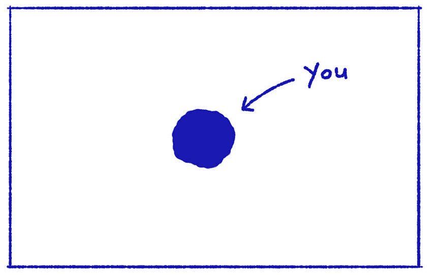
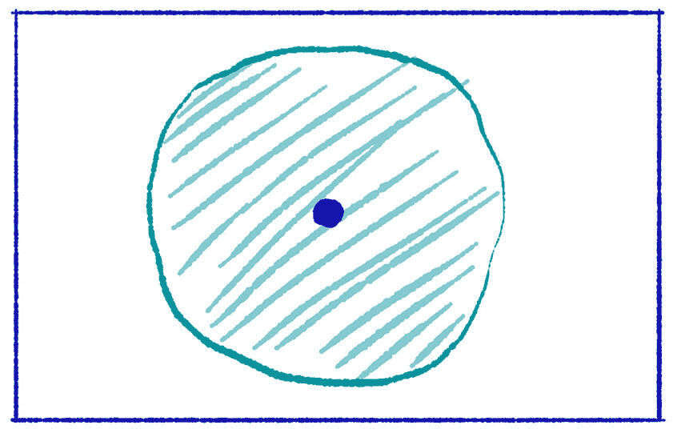
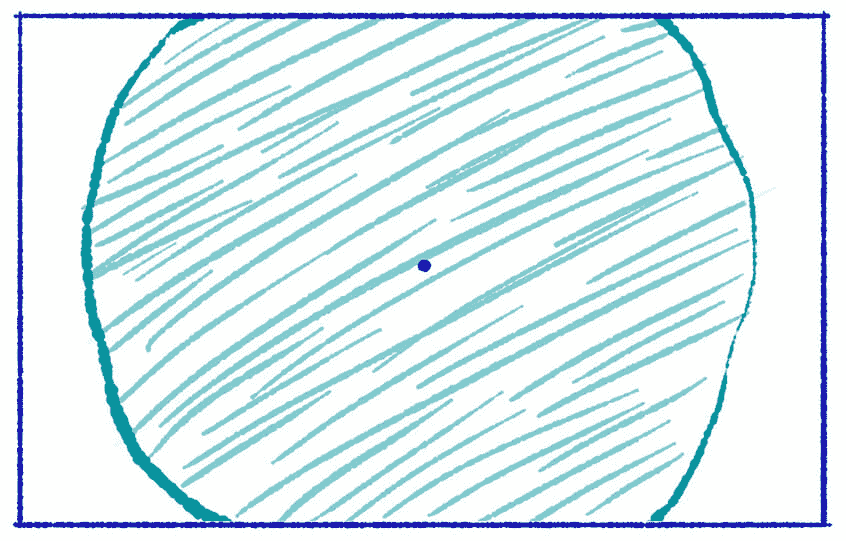
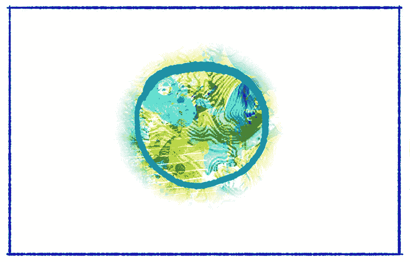

# 当一个人成为一个想法时——克里斯·贝利

> 原文：<http://alifeofproductivity.com/when-a-person-becomes-an-idea/?utm_source=wanqu.co&utm_campaign=Wanqu+Daily&utm_medium=website>

**Estimated Reading Time:** 4 minutes, 32s.

**简短描述:**你听到的关于某人的故事可能意味着你根本没有把他们当真人看待。

这是一个你无法否认的事实:你是一个人。让我们画一个点来说明这一点。

假设这个点就是你。

当你的朋友、家人和熟人想到你时，很多事情都会浮现在脑海中:你给他们的感觉；你为他们做的好的(和不太好的)事情；你们一起创造的记忆。这些是他们讲述的关于你的故事——对他们自己，也对他们谈论你的人。

你周围的圆圈，即圆点，是人们所知道和讲述的关于你的故事的集合。当有人想到你时，脑海中就会浮现出这样的画面:他们既想到你这个人，也想到他们对你的记忆和叙述。

你生活中的一些人比其他人有更大的叙事和故事。举个例子，比如你老板的老板，或者上一次和你分手的人。当你想到他们的时候，你能记起他们是什么样的人，当你们在一起的时候，或者和他们一起工作的时候。然而，久而久之，那个人已经从你日常交往的人变成了记忆中的人。你仍然记得他们是谁——那个圆点——但是围绕着那个人的想法和故事的集合更大，也更吓人。

这太迷人了。

离职后，你会记得你老板的老板的故事——你们都经历过和听过的故事——而不是你老板的老板是一个真实的人，每天早上挣扎着起床，周末狂看《网飞》。同样，当你希望你的伴侣在分手后回到你身边，或者你决定更加不喜欢他们，你可能正在你的脑海中建立关于你伴侣的*想法*——围绕他们的叙述——而不是回忆他们作为一个人实际上是什么样子。

此外，还有一些被挑选出来的人，他们有着更大的故事。注意当你听到阿道夫·希特勒、耶稣、唐纳德·特朗普、巴拉克·奥巴马、碧昂斯和乔治·克鲁尼这样的名字时，脑海中闪现的想法和故事。这些名字可能会引发一个庞大而复杂的故事网——一个主要由你过去听到的每个人的故事构成的故事。这些人被他们的故事矮化了——一个如此庞大的故事掩盖了他们曾经是一个人的事实。

在我们心中，这些个体不再是人。转变已经完成:他们是一个想法——一个已经成为他们故事的人。

— — —

当你和某人发展并建立亲密关系和友谊时，美好的事情就会发生。你和某人越亲近，你就越能超越他们的故事，看到他们真实的一面，把他们看成和你一样复杂、脆弱和富有的人。

如今的问题是，放大来看这个真实的自己比以往任何时候都难。你的朋友也是如此。当你看到朋友的脸书更新、Instagram 照片或推文时，你并没有看到他们是谁——你看到的是他们试图包装自己的部分故事。你看到了他们制作完美的 Instagram 海滩照片，但没有看到没有出现在 Instagram 上的 25 张照片；他们早上的拿铁看起来有多美味，而不是他们看着咖啡馆在微泡沫溶解前给他们的咖啡拍了十几张照片有多可笑。

同样，以一种更大的方式，你听说过的关于亿万富翁、名人或政治家的每一件轶事或故事都只会助长和扩大掩盖了那个人真实身份的巨大故事。

这是一个危险的陷阱，尤其是在今天。原因很简单:**当我们把一个人看做一个想法时，我们忽略了他们的人性。**

想想看，爱上碧昂斯或道恩·约翰逊(The Rock)这样的名人是多么容易，而忘记了你实际上迷恋的是那个人是谁的想法。或者对一个政客感到仇恨是多么容易。或者说，无论你如何解读史蒂夫·乔布斯(Steve Jobs)或比尔·盖茨(Bill Gates)等人的故事，都很容易让人相信。

不管一个名人的故事是由他们还是他们的团队塑造的，这个故事都是为了建立那个人的想法。看到一个你只知道是一个想法的人的开放、脆弱的版本是一件罕见的事情。

通过这一切，当谈到一个对我们来说已经成为一种观念的人时，有一件事值得记住:我们并不爱或恨一个人本身。我们讨厌或喜欢他们的想法。

你在新闻中看到的，或在街上经过的，或与人一对一相处的每一个人，都是一个充满缺陷、不安全感和优点的人——就像你自己一样。

你只是不能总是放大来看他们的那一部分。

*插图作者 [Sinisa Sumina。](http://bravedodo.com/)T3】*