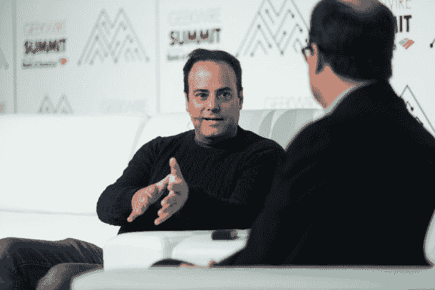

# Stack Overflow 首席执行官 Joel Spolsky 建议——geek wire

> 原文：<https://www.geekwire.com/2016/just-shut-let-devs-concentrate-programming-expert-advises/?utm_source=wanqu.co&utm_campaign=Wanqu+Daily&utm_medium=website>

Developer Joel Spolsky (left) speaks with GeekWire co-founder Todd Bishop on the second day of the 2016 GeekWire Summit (Photos by Dan DeLong).

如果你想吸引和留住开发者，不要强调乒乓球桌、休息室、火坑和巧克力喷泉。给他们私人办公室或者让他们在家工作，因为不受干扰的集中注意力的时间是最重要也是最稀缺的商品。

这是 Joel Spolsky 的观点，他是 Stack Overflow 的首席执行官，这是一个受程序员欢迎的问答网站，他今天早上在西雅图的 GeekWire 峰会上发表了讲话。

斯波尔斯基在接受 GeekWire 联合创始人托德·毕晓普(Todd Bishop)的采访时说:“脸书在硅谷的园区是一个 8 英亩的开放空间，脸书对自己为开发者建造了这个它认为令人惊叹的地方感到非常满意。”。“但是开发人员不想偷听谈话。这对于交易大厅来说是理想的，但是开发者需要集中精力，去聊天室问问题，然后得到答案。脸书的工资比其他地方高 40%到 50%，这通常表明开发商不想在那里工作。”

<iframe loading="lazy" src="https://www.youtube.com/embed/R1V8OUOb-Hw?feature=oembed" frameborder="0" allowfullscreen="">视频</iframe>

Spolsky 在 2011 年创建了项目管理软件 Trello，他说他 16 年前创建的“T2 乔尔测试”仍然是开发者评估未来雇主的有效方法。这是 12 个是非问题的列表，每一个“是”的回答都得一分。

“事实是，大多数软件组织的得分是 2 或 3，他们需要真正的帮助，因为像微软这样的公司全职工作 12 分，”斯波尔斯基在创建测试时说道。他说这在今天仍然是事实。

“微软想出了一种方法来创建高度理智的软件，”他说。“令人惊讶的是，还没有蔓延。”在其他建议中，他建议一个想要授权给开发者的公司任命一个自己也是开发者的领导者。

谈到多样性，斯波尔斯基说他想用一个随机的形象来取代默认的 StackOverflow 头像——比如一个女人或一个有色人种。与此同时，“我想鼓励那里的人们自我认同，这样他们就可以成为其他人的榜样，”他说。

斯波尔斯基指出，向云的迁移让开发者的生活“大不相同”。语言趋向于比过去更高级，限制了对低级功能的访问，甚至让开发人员不知道幕后发生了什么。

根据 [StackOverflow 调查](http://stackoverflow.com/research/developer-survey-2016)，目前最喜欢的编程工具包括 Rust、Swift 和 F#，而那些“最可怕的”包括 Visual Basic、WordPress 和 Matlab。但斯波尔斯基淡化了这些调查，称程序员“渴望使用最新、最酷的新事物”，并倾向于快速离开编程，因此他们的队伍被“带着他们刚刚发明的新奇事物出现的新人所填补，通常是重新发明轮子。”