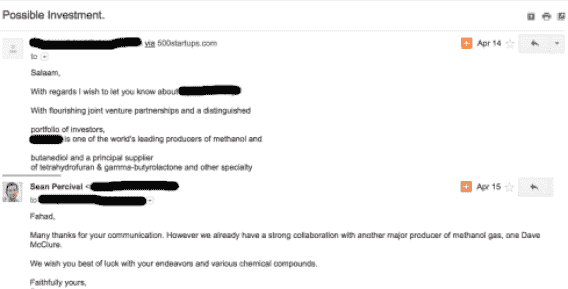

# 我从 20k 公司的推介中学到了什么——伊丽莎白·尹

> 原文：<http://blog.elizabethyin.com/post/151582614970/what-ive-learned-from-seeing-20k-company-pitches?utm_source=wanqu.co&utm_campaign=Wanqu+Daily&utm_medium=website>

我刚刚在 500 家创业公司度过了两年。前几天，我的同事问我，我个人看过多少公司的推介。当我们计算的时候，结果是大约 20k！

公平地说，这个数字包括像这样的推销邮件(包括我以前的同事 Sean Percival 的回复)。

(事实上，我见过的绝大多数推介可能都属于这一类，这些只需要几秒钟就可以阅读和存档。这就是你如何看到 20k 投球！)

也就是说，在短短两年内看到如此多的投球真是一段不平凡的经历。当我看到一个推销时，我会立即想到以下几点:

### 1.创意多如牛毛……脱颖而出很重要。

作为一个企业家，你认为你的想法是独一无二的。如果你仍处于创业教育/旅程的早期阶段，你甚至可能会认为你需要保护自己的想法，不与任何人分享。即使你处于企业家的后期阶段，你仍然会觉得你的想法是独一无二的，或者至少可能只有一两家公司像你一样，因为这是你在 TechCrunch 上读到的。

原来每个人都有相同的想法。

这不是一件坏事，但这意味着你需要带着想出如何脱颖而出的心态去做。好消息是，如果你在事业上取得了进展，你可以表现出你在执行。大多数企业家夸大了他们的想法，但低估了他们的执行方式(收入、吸引力、建立基础设施等)。).这可以让你与众不同，因为我看到的绝大多数处于种子阶段的企业都只是没有行动的想法。

### 2.速度很重要。

展示你所做的事情不仅重要，而且如果你一直在快速执行，那就更令人印象深刻了。种子阶段，有 5 个月左右的公司，也有 5 年的。你不仅要以达到的里程碑为基准，还要以你的速度为基准。

[Originally posted by gameraboy](https://tmblr.co/Zul0Mt1yQNCxt)

这是我最喜欢的启动演示之一，由迈克·卡西迪主持。证明你可以快速地做事情——无论是获得客户、雇佣和解雇员工，还是产品开发。在你的推销中传达这一点。

### 3.如果你处在一个竞争非常激烈的领域，提前解决竞争问题是非常重要的。

如果你处在一个竞争非常激烈的领域——比如清洁或送餐——对你来说会比你想象的更难，即使你进步很快。在这些领域，投资者看到的不只是少数公司在做同样的事情，而是成百上千的公司。

要想让自己最大程度地受到关注，你需要做两件事:

1.  立即证明——而不是在你的推销结束时——你知道还有其他像你这样的企业。这表明你已经考虑过竞争格局，尽管知道竞争激烈，但你相信你有机会击败所有其他公司。进入竞争领域并不是一件坏事——谷歌是第八家进入这一领域的搜索引擎，它们表现不错——但你需要解决这个问题。
2.  说明你在这个景观中的位置。这是关于真正理解你与其他玩家的不同之处。

例如，我上周与一家公司进行了交谈，这家公司是一种新型的求职平台。他们给我看了他们的问题幻灯片，上面说了一些大意如下的话，“有这么多的人失业，有这么多的雇主找不到优秀的人才……等等等等。”在线招聘板已经存在了几十年，即使在今天也是一个竞争异常激烈的领域！这个问题大家都懂。因此，这并不是本营销中要概述的正确问题。概述这个问题的正确方式是告诉我为什么现有的求职板解决方案很糟糕或无效，并对为什么会出现这种情况的细微差别有深刻的见解。之后，提出一个不同的解决方案，没有这些细微差别的问题。从某种意义上说，如果你在一个拥挤的空间里，你的工作就是说，“问题是公司 A、B 和 C 很烂，原因如下。”

如果你能做到这一点，这至少会帮助你在球场上获得关注。

### 3.我对推荐和冷邮件一视同仁(在很大程度上)。

一开始，我认为从其他人那里获得的推荐质量会比那些冷冰冰地发邮件的公司高得多。有时候这是真的。往往不是。这在很大程度上取决于谁给推荐。事实证明,“著名”投资者推荐的公司不一定是更好的公司，创始人也不一定是伟大的公司。许多创始人通过说好话来帮助他们的朋友。另一方面，有些人你可能没听说过，他们的推荐是我最看重的。

所以，最后，这有点白费，这就是为什么我认为你，作为一个企业家，[现在可以有效地写冰冷的电子邮件来吸引投资者的注意力。](https://elizabethyin.com/2016/09/01/7-tips-for-cold-emailing-investors/)

### 4.人们如何在推销邮件中展示自己告诉我是否不应该参加会议

我用推销邮件作为寻找最切中要害、最敏锐的创始人的一个很好的代理。真的，我不能马上说出谁是对的和敏锐的，但是我能说出谁不是。蜿蜒的电子邮件副本不是一个好兆头。拼写错误和缺少标点符号也不是一个好兆头。如果你的母语不是英语，糟糕的语法是可以原谅的，但如果你的母语是英语，那就不可原谅了。使用公司域名，而不是 Gmail、Yahoo、Hotmail 或 AOL 电子邮件地址。不然你的生意好像还不够认真。

这些似乎都是显而易见的，不值得一提，但你会惊讶有多少球场有基本的机械问题。如果你不擅长注意细节，请一个擅长这个的朋友帮你校对。带着你最好的一面进门是非常重要的，因为你的邮件很容易被忽略或丢失。

尽可能使用项目符号，而不是段落。它们更容易阅读。关于你的生意的关键的令人敬畏的事情。以下是一些示例项目符号:

*   收入:目前为 1.5 万美元的 MRR，同比增长 30%
*   每月流失率< 1%
*   LTV 到目前为止是 700 美元；混合付费频道的 CAC 为 250 美元
*   试点客户包括三星、MSFT 和甲骨文
*   CEO 之前创建了一家营销技术公司，并将其出售给 MarketoCTO 此前在 Google X 担任软件工程师；已经一起工作两年了

如果你要发送一份资料，请参考[这篇文章，“理想的电子邮件资料”](https://elizabethyin.com/2017/06/06/the-ideal-email-deck/)你的邮件只是为了激起见面的兴趣，而不是为了获得投资。

在过去的两年里，我从这份工作中学到了很多东西，但这些是我看到球场时想到的东西。