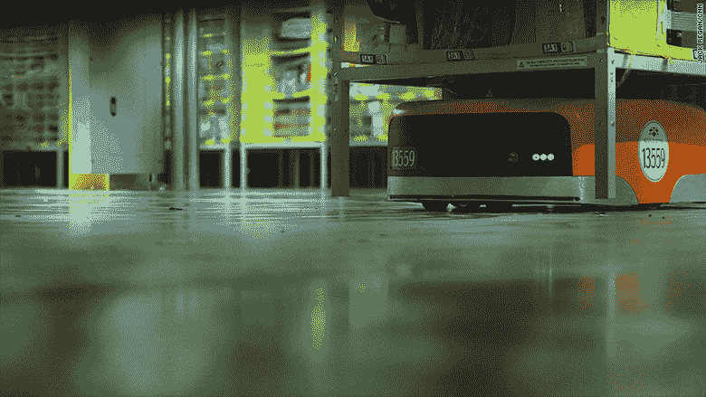
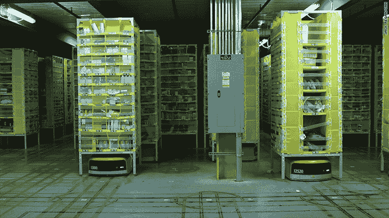
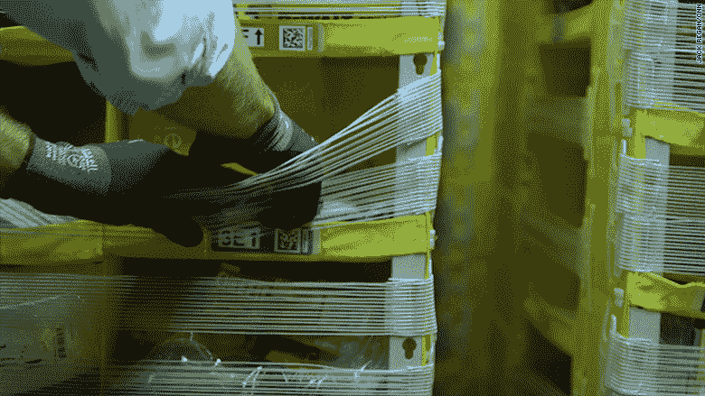
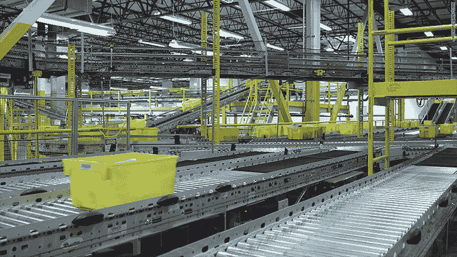
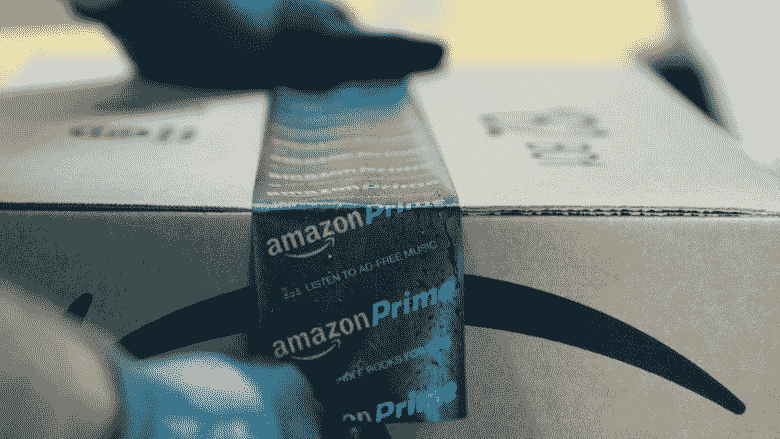
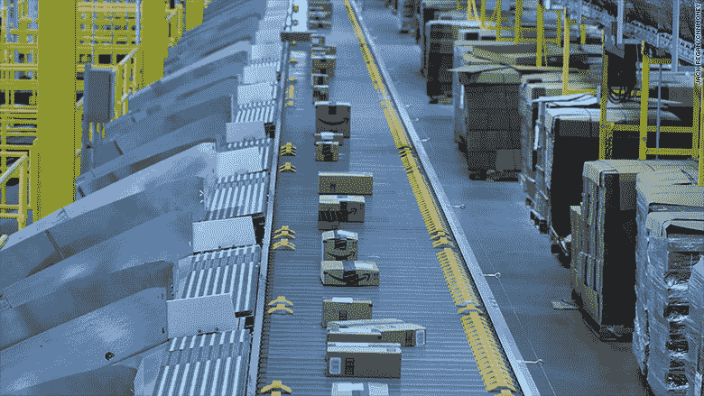

# 亚马逊只需要一分钟的人工来运送你的下一个包裹

> 原文：<https://money.cnn.com/2016/10/06/technology/amazon-warehouse-robots/index.html?utm_source=wanqu.co&utm_campaign=Wanqu+Daily&utm_medium=website>

## 当你从门廊下拿起亚马逊的快递，走进你的家，找到一把剪刀，打开棕色盒子时，你已经花了几乎和亚马逊员工一样多的时间来处理包裹。

凭借 22 年的电子商务经验和对效率的执着，亚马逊为其存储、包装和运输商品的仓库带来了显著的优化。

在一个典型的亚马逊、T2、T4【AMZN)订单上，员工总共会花大约一分钟的时间——把一件商品从货架上拿下来，然后装箱发货。

剩下的工作由机器人和自动化系统完成。

上个月的一天，亚马逊让我参观了它在巴尔的摩外的履行中心。该工厂在 2005 年关闭之前一直是通用汽车的工厂。当我走进这个巨大的设施时，我的导游递给我一副灰色手套，这样我就可以和成千上万的机器人一起尝试人类所做的工作。

据该公司称，亚马逊在 2014 年增加的机器人使其储存的库存增加了 50%。有了机器人，亚马逊可以更紧密地包装存放物品的书架。

[相关:亚马逊要 Prime 会员读一本书](http://money.cnn.com/2016/10/05/technology/amazon-prime-reading-launch/)

亚马逊的员工被称为拣货员，过去他们不得不在长长的商品通道中走来走去，才能找到货架上的每一件商品。凭借 Kiva 机器人，这些拣货员现在可以就位，这意味着他们每班可以拣更多的货物。Kiva 机器人会滑到一个相关的书架下，稍微抬起它，然后把它带到提货人那里。当书架慢慢靠近拣货员时，电脑屏幕会提醒拣货员物品的位置。

在亚马逊的巴尔的摩工厂，运送比面包盒还小的物品，所有东西都可以放在货架上。架子被分隔成小隔间。一些投币口塞满了多种物品，比如几件 t 恤和六瓶除臭剂。

一旦物品被扫描并放入黄色的箱子中，机器人就会自动离开。很快，一个等待轮到它的新书架停在了挑选站，就像快餐店里排队的汽车一样。

黄色的箱子通过条形码在仓库中移动时被跟踪，然后沿着每个仓库中 8 英里长的传送带蜿蜒到另一个站，在那里一名员工将包裹装箱。

当黄色箱子到达时，电脑屏幕会提醒员工使用哪个尺寸的箱子。在我们的旅行中，我们看到一些亚马逊包装工(这些员工的术语)只需要 15 秒钟就可以组装好合适的盒子，添加气泡包装，用胶带包裹，添加条形码，然后放回传送带上。

[相关:亚马逊、脸书、谷歌创建集团缓解 AI 担忧](http://money.cnn.com/2016/09/28/technology/partnership-on-ai/)

他们的速度得益于一台机器，该机器根据所用盒子的大小，吐出完美尺寸的包装带。包装工人要做的唯一决定就是要包括多少气泡包装。

亚马逊履行中心的精心协调就像一首交响乐。这些建筑的声音也非常大，在传送带的旋转声中很难进行交谈。

当包裹回到传送带上后，它会通过一台机器，机器会自动在盒子上印上地址标签。当机械臂下降并在箱子上印上最终目的地时，有些箱子甚至不会停下来。

然后，这些包裹需要被送往正确的邮件卡车。当箱子通过传送带上看起来像一个迷你收费站的地方时，红色激光扫描它们，以确定它们需要被指引到哪里。

当包裹越过相应的滑槽时，一个自动缓冲器滑过传送带，将包裹送到正确的卡车上。

然后是亚马逊仓库员工最后一次直接与包裹互动，因为一个人将它放在送货卡车上。

亚马逊表示，其巴尔的摩履行中心有大约 3000 名全职员工，该中心面积近 100 万平方英尺。亚马逊在 2015 年雇佣了 7.67 万名新员工，在 2016 年上半年雇佣了 3.81 万名新员工，以在全国各地建立分销网络。尽管它对机器的掌握限制了每个包装所需的员工投入，但人类仍有一席之地。

CNNMoney (Washington) 首次发布 2016 年 10 月 6 日:美国东部时间下午 12:02