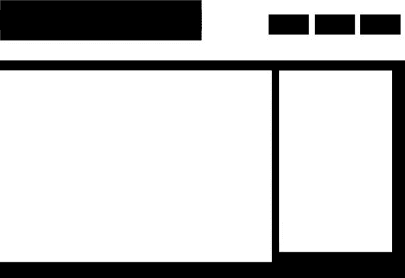

# 你能从你的产品中去掉什么？作者@ttunguz

> 原文：<http://tomtunguz.com/perfection-nothing-to-take-away/?utm_source=wanqu.co&utm_campaign=Wanqu+Daily&utm_medium=website>

[T2】](https://res.cloudinary.com/dzawgnnlr/image/upload/q_auto/f_auto/w_auto/not-negative-spaced-design.jpg)

> 最终达到完美不是因为不再有任何东西可以添加，而是因为不再有任何东西可以拿走。
> 
> *安托万·德圣·艾斯利*

我记得在 AdSense 产品中推出了一个新的过滤功能。当时，我们有成千上万的网站出版商使用我们的用户界面来完成许多任务。他们可能会下载运行 AdSense 广告的收入报告，配置广告以匹配其网站的风格，并表明他们对网站上显示的广告内容的偏好。

不幸的是，目前只有不到 2%的用户对我们推出的功能感兴趣。发布几周后，我在想我们是否应该取消这个功能。一方面，数百名用户从我们的辛勤工作中受益。

另一方面，我们为其他成千上万的用户引入了新的复杂性。此外，我们扩大了产品和工程表面积，以便进行测试和后续产品设计。在某种程度上，我们引入了产品债务。

产品债务不同于技术债务，这个词让工程师们不寒而栗。技术债务意味着必须回头重写大量代码，因为它们不是按比例构建的，或者是用深奥的语言编写的。创造比重写或重构有趣得多。

产品债务包括工作良好的特性集合，但是只有极少数用户使用。它们给下游带来了各种各样的复杂性。你可以想象一下，当一个出版商想要过滤广告时，可以通过许多不同的方式来破坏:他们可以通过语言，地理，关键词，人口统计，平台来过滤。

这些过滤器中的每一个都必须与其他过滤器结合起来考虑，从而产生爆炸性的组合效果。对于其他过滤器或每个增量过滤器中的每个后续变化，必须考虑仅有益于一小部分人群的新过滤类型。

设计师必须发明新的方式来表达复杂性。质量保证团队必须设计标准来测试一切是否正常工作。设计新功能的产品经理有更多的复杂性。最后也是最重要的，用户不得不使用越来越复杂的产品。

在零售业中，有一个概念叫做[持有成本](https://en.wikipedia.org/wiki/Carrying_cost)，它包括了所有存储库存的成本。它包括仓库、员工、运输和商品折旧等成本。持有成本强调了产品越多并不总是越好的观点，因为越多就有成本。

和创业公司，有一个类似的产品持有成本的想法。每个产品和工程组织必须明确决定他们愿意承担什么样的产品持有成本。有多少比例的用户必须使用某个特性才能保留它？或者创收用户或总收入的几分之一？

删除不符合该标准的功能可以确保产品开发组织能够更快地行动，减少他们的产品债务，并向他们的用户提供更完美的体验，在这种体验中，没有任何其他东西可以被带走。