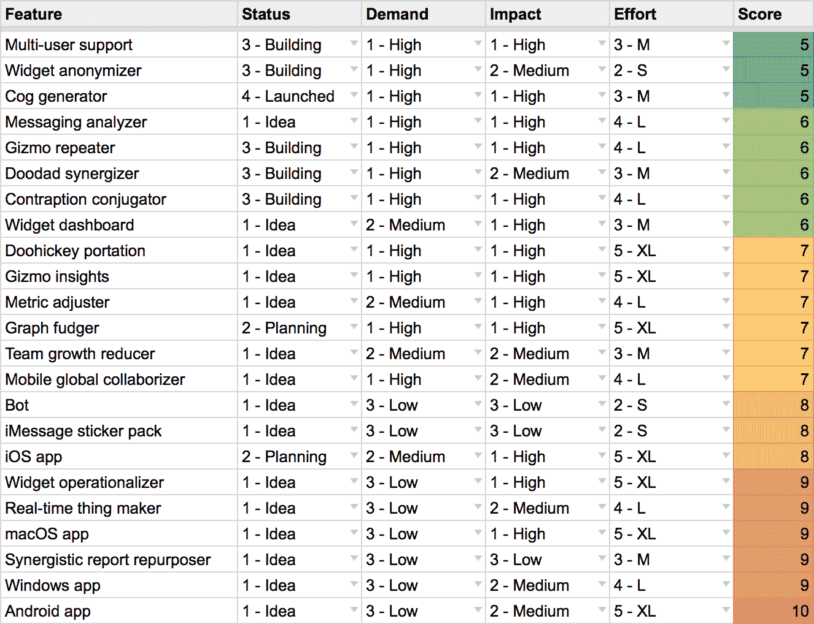

# 计算下一步要构建的功能- Baremetrics

> 原文：<https://baremetrics.com/blog/feature-framework?utm_source=wanqu.co&utm_campaign=Wanqu+Daily&utm_medium=website>

“下一步我们应该构建什么功能？”这不是今年的热门话题吗？虽然下一个功能[不会拯救你的业务](https://baremetrics.com/blog/new-features-will-not-save-your-business)，但实际改进你的产品并为你的客户创造更多价值仍然很重要。弄清楚你下一步应该做什么可能是你经常做的最困难的决定之一。

大多数创始人(见鬼，大多数人)都有很多想法。问题是，大多数想法，你知道…都很糟糕。但是当你拥有它们的时候，它们*看起来很棒。*

将溢出的想法与区分下一步要做什么的困难混合在一起，你就会得到臃肿、混乱、难以使用的软件，这些软件缺乏真正的方向，对客户几乎没有影响。

为了帮助解决这个问题，我们创建了一个简单的评分系统来指导和影响我们接下来要解决的问题。

[T2】](https://docs.google.com/spreadsheets/d/1BXuFcn-M2E6Mbz7DxKDB3SsCWlXS036wxR89s6I8qC0/edit?usp=sharing)

我们的[营销优先级系统](https://baremetrics.com/blog/marketing-idea-scoring-system)面向营销人员和营销工作，而这个面向产品团队。

[这个系统](https://docs.google.com/spreadsheets/d/1BXuFcn-M2E6Mbz7DxKDB3SsCWlXS036wxR89s6I8qC0/edit?usp=sharing)要简单得多，因为几乎不可能完全量化和测量构建某个东西所需的影响或努力。构建软件是数据和直觉的混合。你把所有的东西都扔进锅里，用你知道的最好的方式混合，但是在一天结束的时候，你必须做出决定。

那么它是如何工作的呢？

## 该系统

*你会想要[复制一份谷歌电子表格](https://docs.google.com/spreadsheets/d/1BXuFcn-M2E6Mbz7DxKDB3SsCWlXS036wxR89s6I8qC0/edit?usp=sharing)，这样你就可以跟着做了。*

你和你的团队对改进产品的所有想法？你不应该把它们扔出窗外。你应该把它们写下来。在电子表格中。在那里你为他们生成一个骰子点数。

“一个死分数？！？！OMGBBQ，太吓人了！”别担心，小强尼，没事的。让我解释一下。

## 死亡:需求、影响、努力

所以我的缩写有点病态，但至少你会记得。每当你对某个功能有了想法，你就把它添加到电子表格中，然后给三个因素打分。

这些评级的结果是一个分数，分数越低，您就越有可能继续使用该功能。

### 需求

需求是你的客户群和目标市场对该功能的需求程度。如果您不断地收到对某个特定功能的请求，或者经常听说您的客户遇到的某个问题可以通过某个给定的功能来解决，那么对该功能的需求将是“高”的。

如果你在淋浴时有一些随机的想法，你只是有一种“预感”人们会想要，但没有这种东西的切实证据，对它的需求就会“低”。

### 影响

影响是一个因素，对不同的公司有不同的意义，取决于你目前的主要目标是什么。这是你想要影响的东西。收入、客户增长、产品使用或任何其他因素。

这个特性会对目标产生多大影响？这就是这个因素的意义。

### 努力

这项功能需要做多少工作？你的设计团队需要花很多时间做研究和客户访谈吗？你需要你所有的工程团队几周或几个月的时间来解决这个问题吗？

努力是至关重要的，因为它关系到你最稀缺的资源:时间和金钱。

我们按照从 XS 到 XL(从特小到特大)的等级来评定某件事情需要付出的努力。你可以把它改成其他的单位，比如天数或者甚至是金额，但是我们发现保持这个单位有点模糊可以让我们避免对这个步骤过于挑剔。

### 分数

一旦你设置了需求、影响和努力因素，你就会得到你的分数！同样，它越低，你就越有可能下一步处理这个特性。

例如，接下来要解决的最理想的特征是高需求、高影响和低(或 XS)努力。对我们来说是 3 分。

另一端是低需求、低影响和高(或 XL)努力，得分为 11。你可能想远离这些。

## 将它投入使用

这样做的目的不是创造一些明确地为你做决定的东西，或者以某种方式量化这会产生多大的商业影响，这样你就不会把事情搞砸了。这里的目标是帮助指导你的决策过程，减少一些未知因素。

这里的目的是系统地构建特性，以适当地平衡它们对您的客户和业务的影响以及您的团队可用的努力和资源。

每当你有了一个功能想法，在你把它扔给你的团队并告诉每个人马上开始黑掉之前，把这个想法[放到功能电子表格](https://docs.google.com/spreadsheets/d/1BXuFcn-M2E6Mbz7DxKDB3SsCWlXS036wxR89s6I8qC0/edit?usp=sharing)中，给你自己一剂现实。