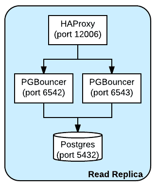
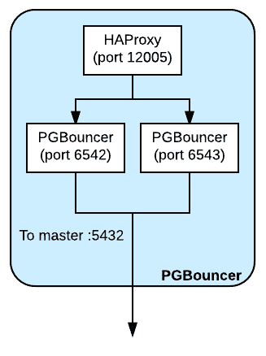

# Twitch 如何使用 PostgreSQL | Twitch 博客

> 原文：<https://blog.twitch.tv/how-twitch-uses-postgresql-c34aa9e56f58?utm_source=wanqu.co&utm_campaign=Wanqu+Daily&utm_medium=website>

Twitch 拥有大约 125 台数据库主机，为生产中的 OLTP 工作负载提供服务，通常作为集群的一部分。大约 4%运行 MySQL，2%运行 Amazon Aurora，其余运行 PostgreSQL。我们管理几个数据库的配置、系统映像、复制和备份，尽管大多数新集群都是针对 PostgreSQL 的 RDS。

我们管理的最有趣的集群是可以追溯到 Twitch 起源的原始中央数据库。总体而言，该集群平均每秒处理超过 300，000 个事务。我们构建并维护自己的专用基础设施，以保持其稳定性、响应性，并能够处理它所支持的各种用例。

我们采用多区域拓扑、弹性集群容量供应、针对有问题的客户端的保护策略、快速主节点故障转移和零停机凭据轮换。

## 拓扑学

直到 2015 年末，整个集群都运行在我们的主数据中心拥有的硬件以及网站和所有其他客户端上。在 AWS 中诱人的易用性的诱惑下，网站被迁移了。由于 AWS 中的 i2.8xlarge 实例类似于我们自己的硬件实例，并且与我们数据中心的主机相比，可以快速轻松地进行配置，为了降低写入延迟，我们很快将主控主机和主读取副本集迁移到 AWS 中。

为了简化计划内或紧急故障切换，在另一个可用性分区中有一个热备盘。自从迁移到 AWS 以来，我们已经为系统映像升级之类的事情做了一些计划内的故障转移事件，谢天谢地，它们都平安无事。

我们希望能够灵活地调配读取容量，以便所有读取副本都位于自动扩展组(ASG)中，该组具有启动配置和自动加入群集的云初始化。我们构建了一个小的运行状况检查 HTTP 服务，它与数据库运行在同一台主机上，仅当副本可供读取并且被认为没有经历过度负载时，它才返回运行状况良好的状态。ASG 连接了一个弹性负载平衡器(ELB ),它使用健康检查来确保不会将查询路由到未准备好的主机。不能使用 ELB 的客户端使用本地代理，该代理路由到可用 AWS 副本集。

我们的数据中心仍然保留着少数客户端应用程序。大多数不写数据，对复制延迟不敏感，因此我们在自己硬件上建立了一个读取副本库，以减少数据中心内的查询延迟。为了减少从 AWS 复制到我们的数据中心所消耗的带宽，只有两个复制流进入不用作读取副本的主机。从那里，复制从其中一个复制中继级联到该数据中心的实时读取副本。第二台主机是复制中继的热备盘，以防该主机出现故障。这使得客户端可以在一毫秒内返回一个毫秒查询，而不是一毫秒加上数据中心之间 30 毫秒的往返。

这里的数据科学家、分析师、工程师和其他人偶尔会需要即席查询。例如，为了生成 vod 上传的直方图，每个数据中心都有一个不属于实时读取集的主机。由于它们不是读取副本的一部分，我们可以让它们运行昂贵的特别查询和报告，这些查询和报告对有些陈旧的数据不敏感。我们在这些特殊的节点上设置 postgresql.conf 中的`hot_standby_feedback = off`和`max_standby_streaming_delay = 6h`,这样复制源就没有负担，并且复制不会因为多版本并发控制(MVCC)而取消查询。这个习语非常有用，我们已经在一些较新的数据库集群中重复了它。

## 角色

## 资格证书

每个团队都有一套进入数据库的凭证。凭据有一些重叠，其中关系和列具有读写访问权限。我们需要零停机凭据轮换，并希望在向这些角色授予读写访问权限时降低出错几率。为了处理这个问题，我们创建了 3 个角色，一个是不能登录的“组”角色，另外两个角色继承组角色的权限。除了在凭证轮换期间，只允许其中一个具体角色登录。例如，创建一个新角色可能如下所示:

```
 create role team nologin; -- create a team role
create role team_01 with encrypted password ‘md5…’; -- current active role
create role team_02 with encrypted password ‘md5…’ nologin; -- disabled role
grant team to team_01; -- gives team_01 the same rights as team
grant team to team_02; -- gives team_02 the same rights as team 
```

对于零停机凭据轮换，请启用下一个角色，例如:

```
 alter role team_02 login; 
```

然后，将该角色及其密码分发给所有客户端，最后使用以下命令禁用旧角色:

```
 alter role team_01 nologin; 
```

## 昂贵的查询保护

多年来，我们经常发布运行昂贵查询的代码，例如聚合或序列扫描。当一个昂贵的查询发送时，后端将开始占用所有 CPU 时间，这将导致客户端和查询的备份因副本中的 MVCC 规则而无法及时运行或失败。为了解决这个问题，我们为每个角色设置了一个适当的`statement_timeout`时间限制。

与授权不同，这些参数不是继承的，因此必须为每个活动角色设置值。

```
 alter user team_01 set statement_timeout = ‘1s’;
alter user team_02 set statement_timeout = ‘1s’; 
```

通过这种设置，我们仍然可以在集群上放置太多的负载，但这通常会给我们足够的容量，这样不相关的查询将得到缓慢的响应，而不是完全没有响应。

## PGBouncer

因为每个团队都需要访问数据库，所以有很多角色。这些角色竞争有限数量的可用 PostgreSQL 进程，这意味着一个客户端中的错误可能会通过消耗所有可用的连接来阻止对其他客户端的访问。为了防止这种情况，我们使用 PGBouncer 来提供一个虚拟模式名，它是数据库模式的别名。PGBouncer 中的每个虚拟模式都有有限的连接数，当客户端连接到虚拟模式时，它们只能耗尽自己的连接池。例如，在 PGBouncer 配置文件中，您可以找到:

```
 [databases]
site_sitedb = dbname=sitedb host=127.0.0.1 pool_size=70 port=5432
sso_sitedb = dbname=sitedb host=127.0.0.1 pool_size=8 port=5432 
```

这为站点角色提供了 70 个到 sitedb 的连接，sso 服务获得了 8 个连接。

PGBouncer 在事务模式下运行，以便后端尽快为另一个客户端释放。Go 的 lib/pq 对带有参数的查询使用匿名预准备语句，这与默认的 PGBouncer 不兼容—后端将在准备和执行之间换出。为了解决这个问题，我们有一个 PGBouncer 分支，它检测匿名准备并保持后端，直到参数被提供用于执行。github.com/lib/pq 的[最新版本现在可以通过在连接字符串中指定`binary_parameters=yes`来使用主线 PGBouncer。`binary_parameters`参数由 lib/pq 使用，通过避免参数化查询的第二次往返来工作。我们的客户端应用程序正在被移植以使用这个来代替我们的 fork。](https://github.com/lib/pq/commit/2997d165a566810a3b9e4d16e7cff1300f744c12)

## 按指定路线发送

在某一点上，CPU 将 PGBouncer 作为单线程应用程序 100%运行，这导致连接停止。我们有一个专门的初始化和配置，它运行两个进程，每个进程监听一个不同的端口，然后将流量定向到 PostgreSQL 后端。在两个进程分担负载的情况下，CPU 仍然很热，尽管不再达到 100%。在与每个 PGBouncer 相同的主机上，HAProxy 也在一个端口上运行和侦听，代理两个 PGBouncer 进程。这为每个主机提供了单个客户端端点，并简化了配置。

对于读取副本，PGBouncer 和 HAProxy 运行在与 PostgreSQL 代理到本地主机 PostgreSQL 相同的主机上。



有一个小型主机集群运行类似的 PGBouncer 配置，只是它们都指向主数据库主机。PGBouncer 集群位于一个 ASG 中，该集群易于扩展和缩小，一个 ELB 指向 ASG 的成员，该成员同样具有在单个端口上监听并代理到在本地主机上运行的 PGBouncer 进程的 HAProxy。通过这种设置，升级新的主服务器只需更改该集群的配置并重新启动 PGBouncers。这使得主提升对客户端来说基本上是透明的，而不是一个失败写入的短暂窗口。



客户最好与尽可能靠近后端的 PGBouncer 交谈。有一次，在主服务器前面有两个 PGBouncer 集群，一个在 AWS 中，一个在我们的数据中心中。当集群与主集群位于不同的区域时，协议感知代理会出现严重的性能问题，因此我们恢复使用 HAProxy 在区域之间进行通信，并且只依赖更近的 PGBouncer 集群。

## 问题

到目前为止，这个方案在 Twitch 上运行良好，尽管还存在一些问题。

## MVCC

PostgreSQL 上的多版本并发控制(MVCC)有点弱。由于存储的工作方式，或许还有其他原因，副本必须与磁盘上的主副本完全匹配。我们过去常常看到消息`canceling statement due to conflict with recovery`有很多错误，而不是得到一个结果集。自从在配置中积极限制每个角色的`statement_timeout`和设置`hot_standby_feedback = on`以来，这已经不是什么大问题了。

## 连接

postgresql.conf 的值`max_connections`被编码在复制流中，因此您不能从 max_connections 值比副本高的主服务器流。为了提高集群中的值，您必须为每个副本设置它(这需要重启)，然后使用新的值对主服务器进行故障转移。

## 重大升级

如果您有大量数据或负载，跨主要版本(例如 9.4 到 9.5)执行 PostgreSQL 升级需要长时间的停机事件或逻辑复制流，而不是内置的预写日志(WAL)流。使用转储和加载会花费大量时间来移动位。`pg_upgrade`可能会出现长时间停机事件或快速停机事件，并通过减少容量来分摊成本，直到完全重写存储。

在我们上次的主要升级中，我们构建了两个并行集群，为逻辑复制安装了 slony，将数据复制到新集群，并保留逻辑工作队列以供重放。有几个星期的计划和设置和复制了大约一天。虽然导致事故的工作非常耗时，但停机时间本身只有一分钟。

## 结论

Twitch 使用许多不同的技术来存储和分析我们的生产数据。

*   我们将 Redis 用于缓存和磁盘持久化的键值数据。

*   我们有许多 DynamoDB 表用于高写负载数据用例。

*   我们将数据传输到 Kinesis，以便在数据库之间进行迁移。

*   我们将事件流存储到 S3。

*   我们加载红移进行数据分析。

*   说到我们的 OLTP 用例，我们依赖 PostgreSQL。

我们这样做是因为我们发现 PostgreSQL 是一个高性能和可靠的 SQL ACID 关系数据库。

Twitch 在招人！了解 Twitch 的生活，查看我们的公开职位[点击这里](https://engineering.twitch.tv/)。