# 重构——不在待办事项中！

> 原文：<http://ronjeffries.com/xprog/articles/refactoring-not-on-the-backlog/?utm_source=wanqu.co&utm_campaign=Wanqu+Daily&utm_medium=website>

关于将重构“故事”放在待办事项列表上，最近在列表上有很多噪音，在会议上有很多问题。即使“技术债”已经长大，这也总是一个低劣的想法。原因如下:

* * *

[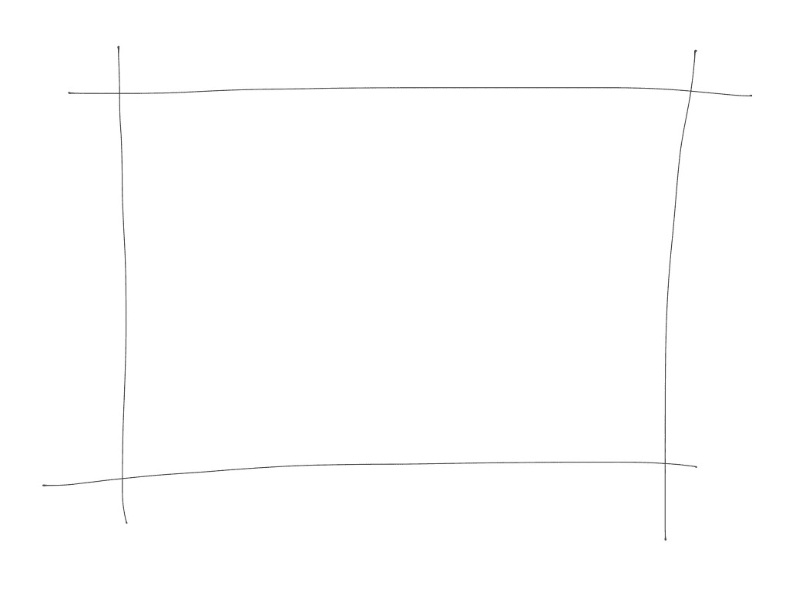T2】](/xprog/wp-content/uploads/Ref01.jpg)

当我们的项目开始时，代码是干净的。田地收割得很好，生活很好，世界是我们的。一切都会好的。

* * *

[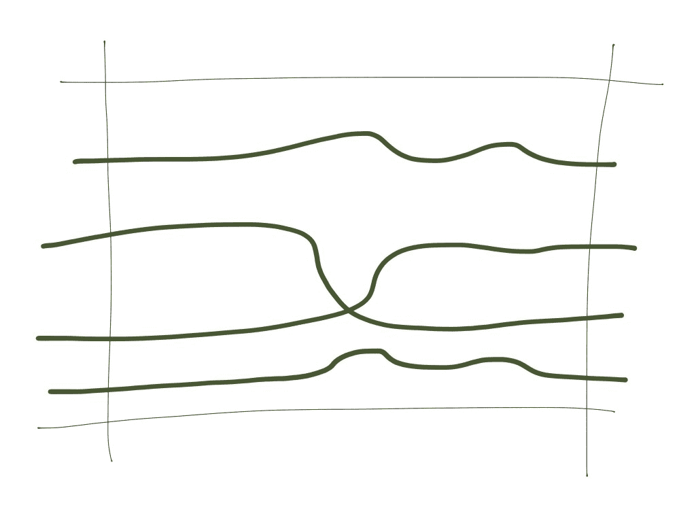T2】](/xprog/wp-content/uploads/Ref02.jpg)

我们可以轻松流畅地构建特性，尽管我们似乎总是要经历一些小小的曲折。东西看起来很干净，而且，我们赶时间。我们没有注意到任何问题，我们快速前进。

* * *

[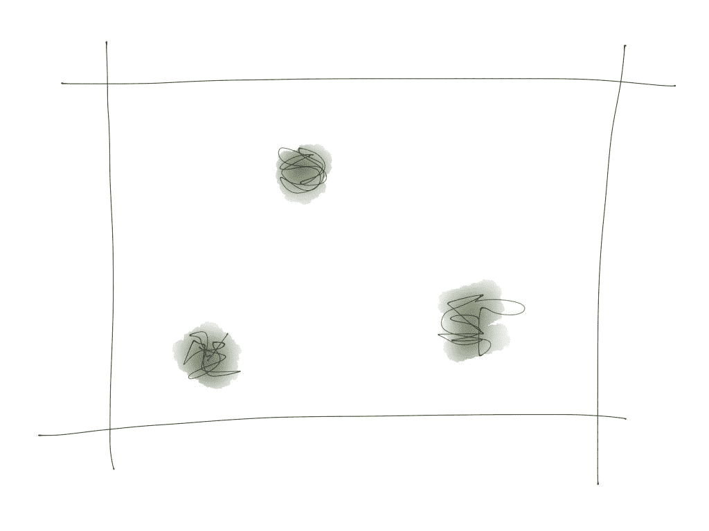T2】](/xprog/wp-content/uploads/Ref03.jpg)

然而，我们让一些刷建立在我们近乎完美的代码领域。有时人们称之为“技术债务”。它真的不是:它真的不是很好的代码。但是现在看起来还不算太糟。

* * *

[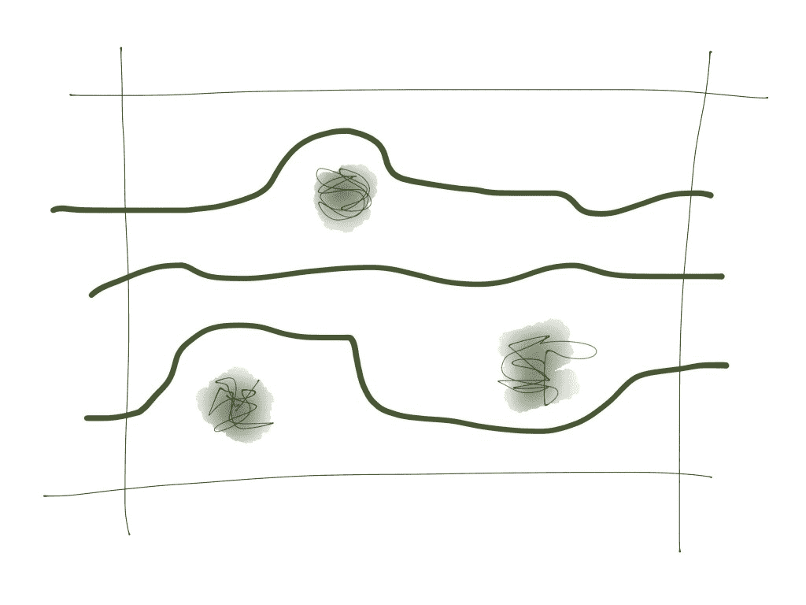T2】](/xprog/wp-content/uploads/Ref04.jpg)

然而，当我们建造时，我们不得不绕过灌木丛，或者穿过它们。通常我们绕道而行。

* * *

[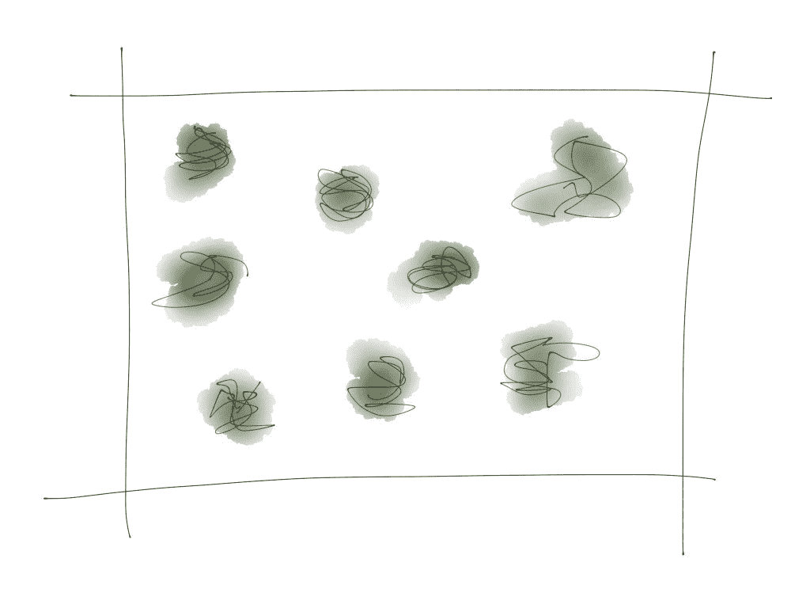T2】](/xprog/wp-content/uploads/Ref05.jpg)

不可避免地，这让我们慢了一点。为了保持快速前进，我们甚至比以前更不小心，很快就长出了更多杂草丛生的灌木丛。

* * *

[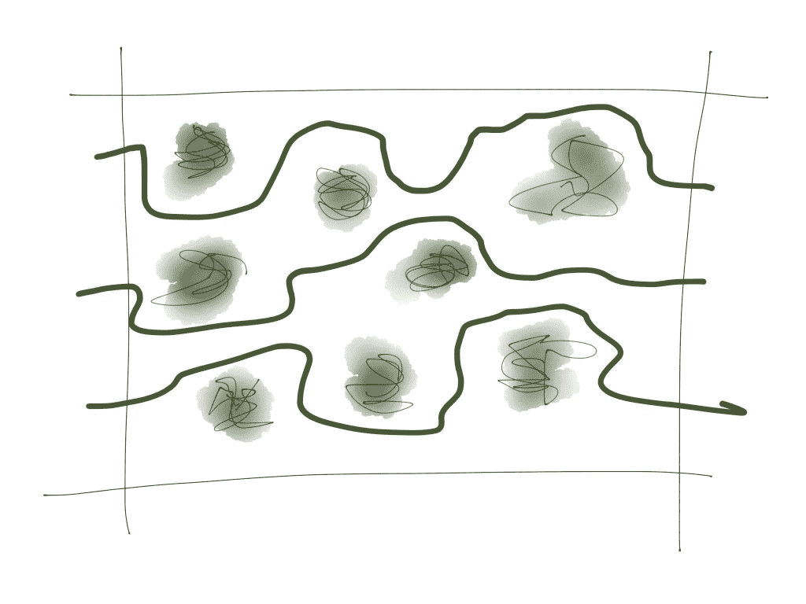T2】](/xprog/wp-content/uploads/Ref06.jpg)

这些新的灌木丛，在旧的灌木丛之上，使我们更加缓慢。我们意识到有一个问题，但是我们太匆忙了，不能做任何事情。我们更加努力地保持我们早期的速度。

* * *

[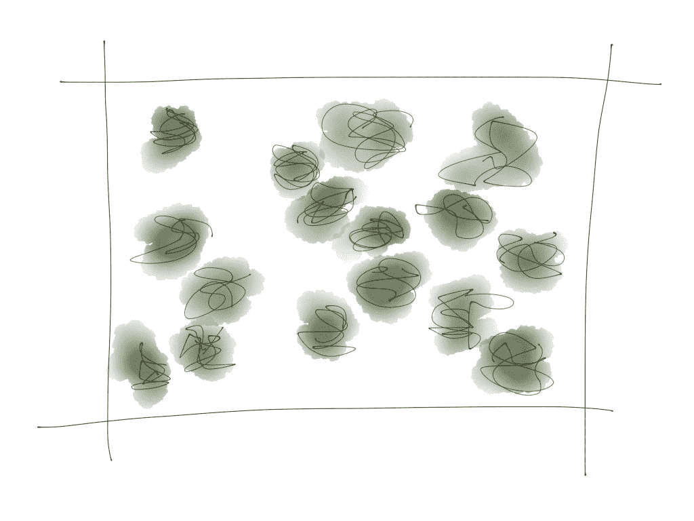T2】](/xprog/wp-content/uploads/Ref07.jpg)

很快，似乎我们必须处理的一半代码都被杂草、灌木、矮树丛和各种各样的障碍所拖累。在那里的某个地方甚至可能有一些旧罐子和脏衣服。甚至可能有些坑。

* * *

[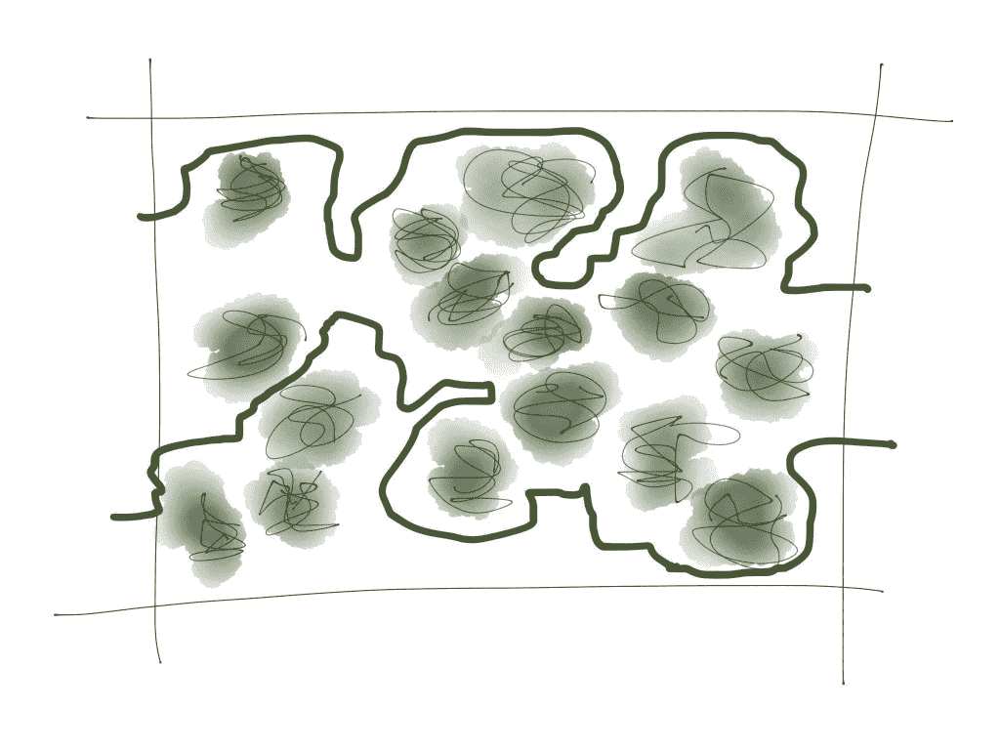T2】](/xprog/wp-content/uploads/Ref08.jpg)

在这个混乱的代码领域中的每一次旅行都变成了在灌木丛中躲闪的长途跋涉，试图避开已经留下的坑。不可避免的是，我们会陷入其中，并不得不挖出来。我们比以前走得更慢了。有些东西必须要付出！

* * *

[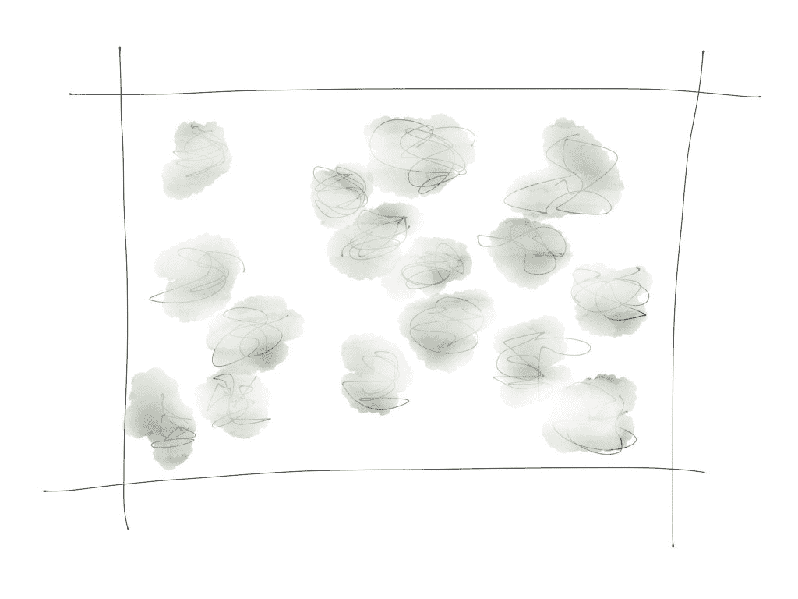T2】](/xprog/wp-content/uploads/Ref09.jpg)

问题的密度现在对我们来说是非常明显的，我们看到我们不能只是在现场快速擦拭并对我们自己有任何好处。为了回到一个干净的领域，我们有很多重构要做。我们很想向产品负责人要求时间来重构。通常，这个时间是不允许的:我们要求时间来修复我们过去搞砸的事情。不太可能有人会放过我们。

* * *

[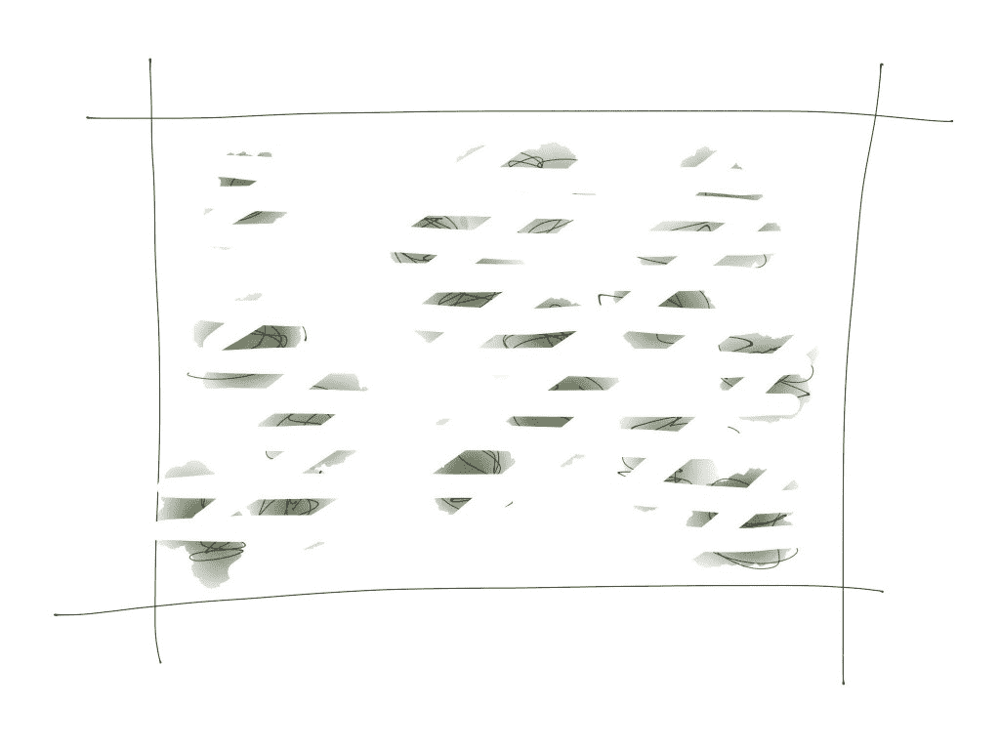T2】](/xprog/wp-content/uploads/Ref10.jpg)

如果我们真的有时间，我们不会得到一个很好的结果。我们会在有限的时间内尽我们所能清理我们所看到的，但这永远不够。我们花了好几个星期才得到这么糟糕的代码，而且我们肯定不会花那么多星期来修复它。

这不是应该走的路。大型重构会议很难销售，如果销售了，在长时间的延迟后，它的回报比我们希望的要少。这不是个好主意。我们做什么呢

* * *

[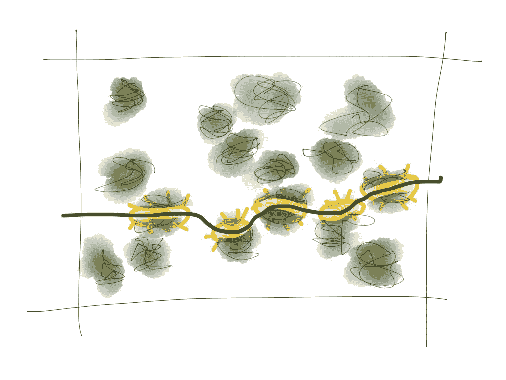T2】](/xprog/wp-content/uploads/RefA1.jpg)

简单！我们选择下一个被要求建造的特征，而不是绕过所有的杂草和灌木丛，我们花时间清理出一条穿过它们的路。也许我们绕过了别人。我们改进我们工作的代码，忽略我们不需要工作的代码。我们为我们的一些工作找到了一条干净的道路。很有可能，我们会再次访问这个地方:这就是软件开发的工作方式。

也许这个功能需要一点时间。通常不会，因为清理帮助了我们，即使是通过这种方式的第一个特性。当然，这也会帮助其他人。

* * *

[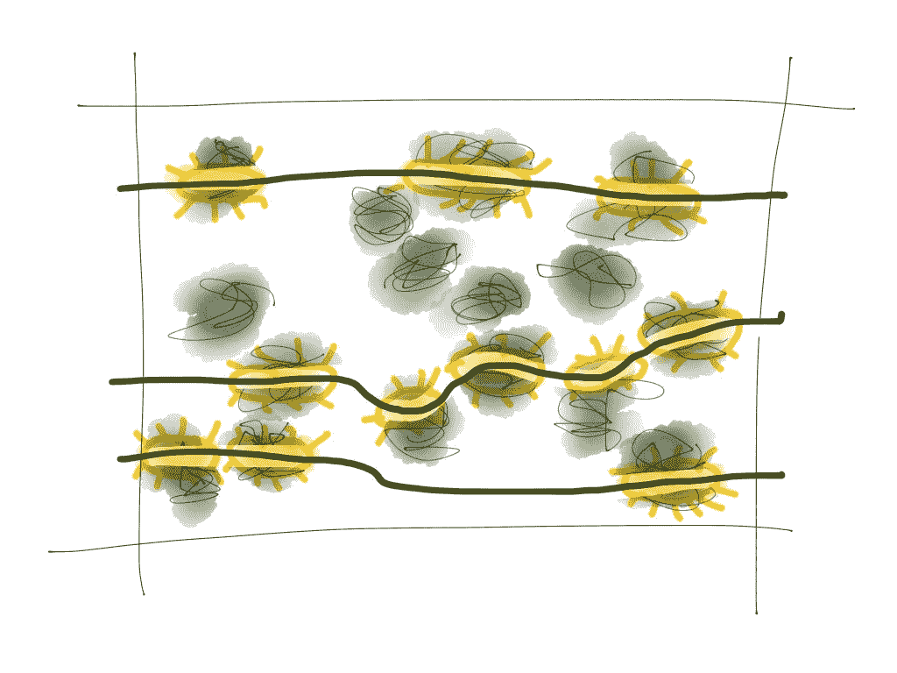T2】](/xprog/wp-content/uploads/RefA2.jpg)

冲洗，重复。对于每一个新特性，我们都会清理该特性所需的代码。我们投入的时间会比我们继续糟蹋这片土地时多一点，但不会多很多，而且往往会更少。特别是随着过程的进行，我们从我们的清理中得到越来越多的好处，事情开始变得越来越快。

* * *

[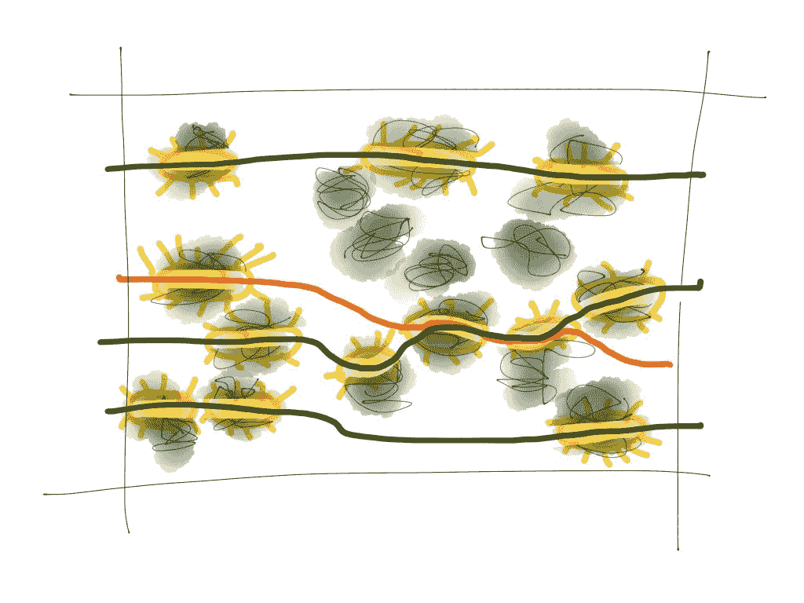T2】](/xprog/wp-content/uploads/RefA3.jpg)

很快，通常在我们开始清理的同一个 Sprint 中，我们发现随后的特性实际上使用了我们刚刚清理过的区域。我们马上开始从增量重构中获益。如果我们等到大批量的时候再做，我们会付出更多的努力，把收益推迟到更晚的时候，并且很可能把努力浪费在还没有提供收益的地方。

工作进行得更好，代码变得更干净，我们交付了比以前更多的功能。每个人都赢了。

这是你如何做它。

