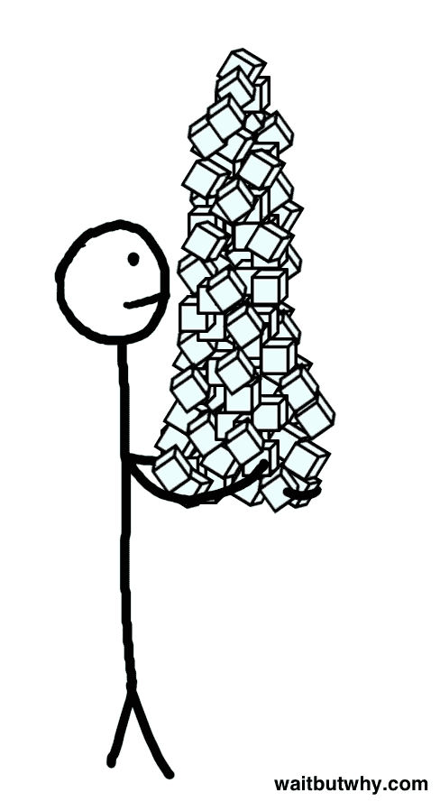
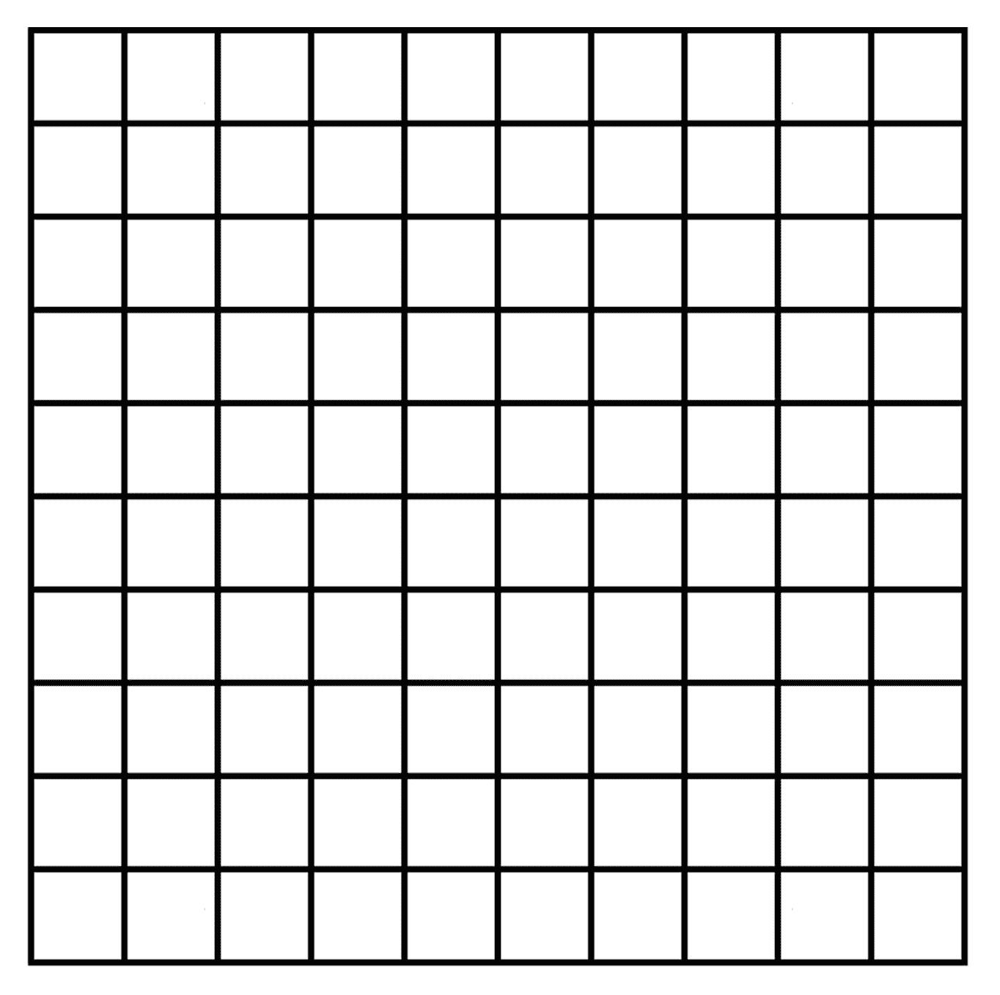
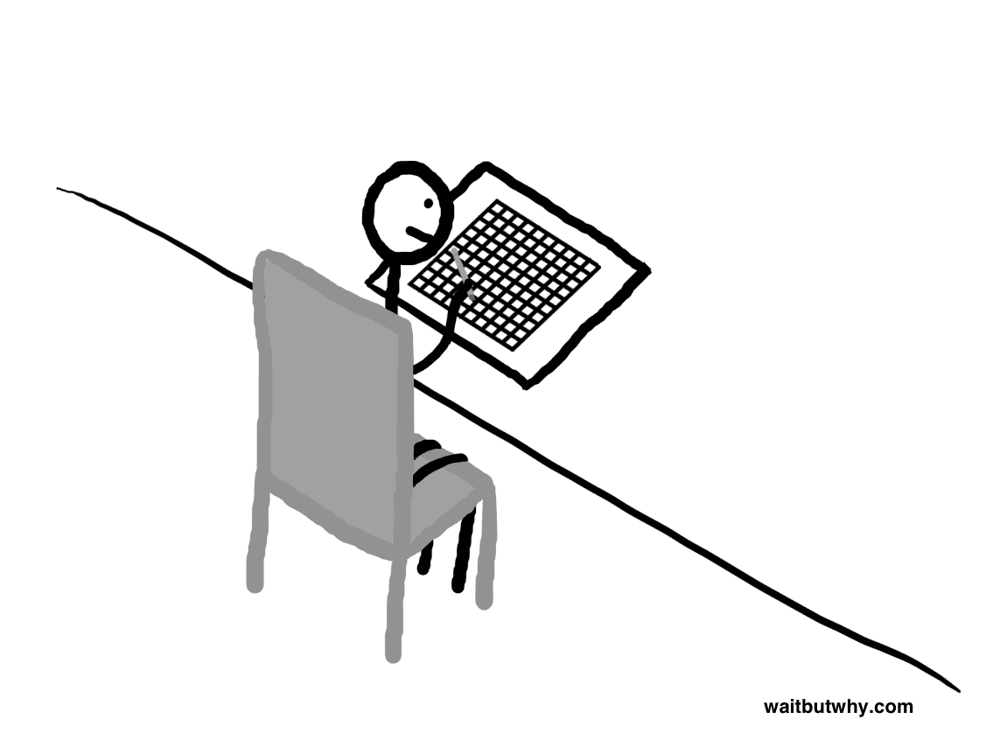

# 一天 100 个街区——等等，为什么

> 原文：<http://waitbutwhy.com/2016/10/100-blocks-day.html?utm_source=wanqu.co&utm_campaign=Wanqu+Daily&utm_medium=website>

大多数人每晚睡七八个小时。这意味着每天有 16 到 17 个小时是醒着的。或者大约 1000 分钟。

让我们把这 1000 分钟想象成 100 个 10 分钟的时间段。这就是你每天醒来的感觉。

[T2】](https://waitbutwhy.com/wp-content/uploads/2016/10/100-blocks-a-day.png)

一天中，你在每个街区花 10 分钟，直到你用完了所有的街区，该睡觉了。

[T2】](https://waitbutwhy.com/wp-content/uploads/2016/10/1-block.jpg)

退一步想想我们是如何使用我们每天得到的 100 块总是好的。有多少是为了让你的未来变得更好，又有多少是为了享受？其中有多少是和别人一起度过的，又有多少是为了自己的时间？有多少是用来创造东西的，有多少是用来消费东西的？有多少块集中在你的身体上，多少块集中在你的思想上，又有多少块两者都不特别？一天中你最喜欢的街区是哪几个，最不喜欢的是哪几个？

想象一下这些方块排列在一个网格上。如果你必须给每一个都贴上有目的的标签会怎么样？

[T2】](https://waitbutwhy.com/wp-content/uploads/2016/10/100-blocks-pdf.pdf)

你必须考虑你可能花时间做的每件事的价值。做饭需要三个街区，而订餐需要零——做饭对你来说值三个街区吗？每天 10 分钟的冥想重要到足以奉献一整块给它吗？每晚阅读 20 分钟可以让你一年多读 15 本书——值两个街区吗？如果你最喜欢的娱乐是玩电子游戏，你就必须考虑你对娱乐的重视程度，然后再决定它需要多少街区。下班后和朋友去喝一杯要占用大约 10 个街区。你多久想用 10 个积木来达到这个目的，用在哪些朋友身上？哪些区块在其标记的目的中应该被视为不可协商的，哪些应该更灵活？哪些块应该保留空白，没有任何指定的用途？

[T2】](https://waitbutwhy.com/wp-content/uploads/2016/10/Desk.png)

现在想象一个类似的网格，但是其中每个块都准确地标注了你昨天是如何度过的。

要问的问题是:这两个网格有什么不同，为什么？

___________

提示:如果你点击上面的表格，它是可以打印的。

___________

如果你喜欢等待但是为什么，注册，我们会在新帖子出来的时候马上发给你。别担心，这是一个非常令人惊讶的列表。

如果你想支持 Wait But Why， **[这里是我们的 Patreon 页面](https://www.patreon.com/waitbutwhy)** 。

___________

**趁我们都在这心情:**

**[你的一生都在一个格子上。](https://waitbutwhy.com/2014/05/life-weeks.html)T3】**

**[赤裸裸的提醒。](https://waitbutwhy.com/2015/12/the-tail-end.html)T3】**

如果你正拿着一个打印好的表格坐下来， **[这个](https://waitbutwhy.com/2014/10/religion-for-the-nonreligious.html)** 可能是一个先读的好帖子。