# 史蒂夫·乔布斯和 iPod 团队策划的 20 张 CD | nobi.com

> 原文：<http://nobi.com/entry-1239.html?utm_source=wanqu.co&utm_campaign=Wanqu+Daily&utm_medium=website>

[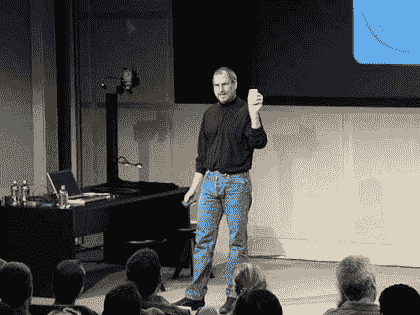](http://nobi.com/archives/001/201603/large-720396aa4c31af3819c6c8c10549a5ba.jpg) 

明天早上(美国太平洋时间)的苹果发布会将在库比蒂诺苹果公司 4 号楼的市政厅举行。自从我上次去那里已经差不多 15 年了。
‘提示:这不是 Mac’阅读邀请函上的信息；2001 年 10 月 23 日，我被邀请参加第一代 iPod 的发布会。那是在 911 恐怖袭击之后，人们害怕坐飞机回去。
如果你读过史蒂文·利维的书《完美的事》，你会发现即使是像他这样在东海岸的美国记者也避免飞到圣何塞参加这个活动。我相信我是唯一飞越太平洋报道这一历史时刻的记者。
除了会场之外，苹果市政厅的房间太小了，只能容纳大约 250 人，所以明天我将和 15 年前的我一样回到被选中的少数人当中。
如果阿什顿·库彻版的史蒂夫·乔布斯电影更准确的话，我必须在电影开始的第一分钟出现在屏幕上，而且我必须成为史蒂夫最先看到的记者之一；但在现实中，史蒂夫·乔布斯是从舞台的右侧走上舞台的(而不是电影中的左侧)。

今天，你可以在 YouTube 上观看那个历史事件:

* * *

从广播、电视到网络新闻，不计其数的媒体都报道了这一事件(当时博客还很新，几乎没有社交媒体)。但是没有多少报道谈到这 20 张 CD 的故事。

* * *

在宣布了第一代 iPod 之后，史蒂夫·乔布斯说苹果已经准备了大约 250 个第一代 iPod 的原型，受邀的记者可以带走(但稍后会归还)。iPod 装载了 20 张 CD 上的音乐，因此记者们可以在回家的路上试用 iPod。

乔布斯坚称苹果无意偷走(音乐行业的销量；请记住，这是 iTunes 音乐商店之前的事情了。苹果公司信守承诺，购买了同样数量的 20 套 CD，并将其与 iPod 原型一起发给了记者。

* * *

从那以后已经 15 年了，我以为我已经失去了他们。但是最近，当我搬到新家时，我发现了那套(收缩包装的)。

下面你会发现这 20 张 CD 是由史蒂夫·乔布斯和最初的 iPod 团队(由 Stan Ng 领导)精心挑选的。尽情享受吧！

[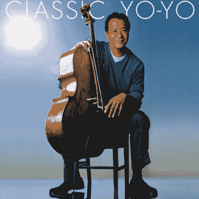
Classic Yo-Yo by Yo-Yo Ma](https://geo.itunes.apple.com/us/album/classic-yo-yo/id155722108?at=10lwWY&app=itunes) [
Mozart:Symphonies Nos.35-41 by Karl Böhm](https://geo.itunes.apple.com/us/album/mozart-symphonies-nos.-35-41/id968876434?at=10lwWY&app=itunes) [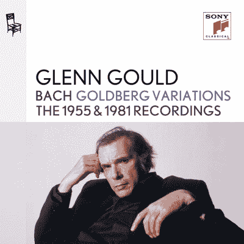
Goldberg Variations by Glenn Gould](https://geo.itunes.apple.com/us/album/bach-goldberg-variations-bwv/id594521223?at=10lwWY&app=itunes) [
Bridge Over Troubled Water by Simon & Garfunkel](https://geo.itunes.apple.com/us/album/bridge-over-troubled-water/id324127933?at=10lwWY&app=itunes) [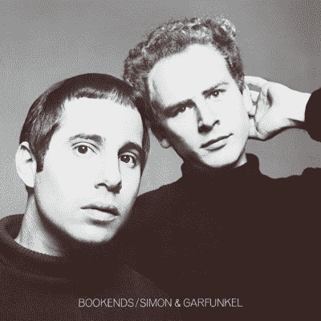
Bookends by Simon & Garfunkel](https://geo.itunes.apple.com/us/album/bookends/id203303421?at=10lwWY&app=itunes) [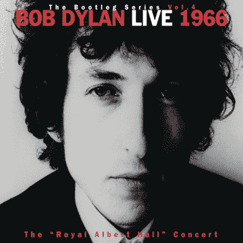
The Bootleg Series, Vol. 4: Live 1966 - The "Royal Albert Hall" Concert by Bob Dylan](https://geo.itunes.apple.com/us/album/bootleg-series-vol.-4-live/id157433155?at=10lwWY&app=itunes) [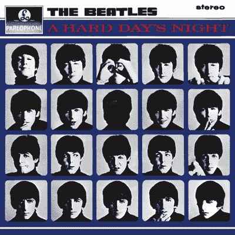
A Hard Day's Night by The Beatles](https://geo.itunes.apple.com/us/album/a-hard-days-night/id401132835?at=10lwWY&app=itunes) [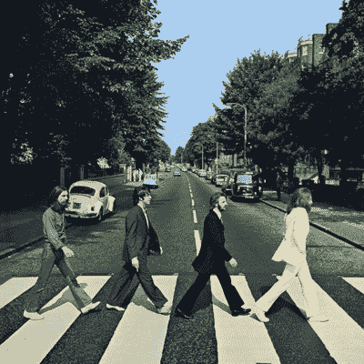
Abbey Road by The Beatles](https://geo.itunes.apple.com/us/album/abbey-road/id401186200?at=10lwWY&app=itunes) [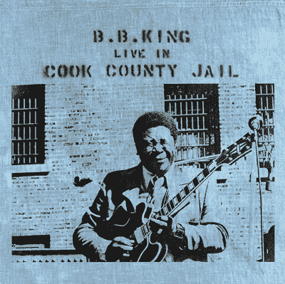
Live In Cook County Jail by B.B. King](https://geo.itunes.apple.com/us/album/live-in-cook-county-jail/id1036336053?at=10lwWY&app=itunes) [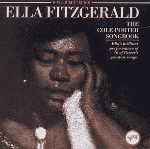
The Cole Porter Songbook, Vol 1 by Ella Fitzgerald](http://www.amazon.com/Cole-Porter-Songbook-Vol/dp/B0000046UG/ref=sr_1_1?ie=UTF8&qid=1458535394&sr=8-1&keywords=Ella+Fitzgerald+-+The+Cole+Porter+Songbook%2C+Vol+1) [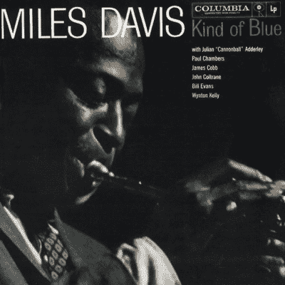
Kind of Blue by Miles Davis](https://geo.itunes.apple.com/us/album/kind-of-blue/id268443092?at=10lwWY&app=itunes) [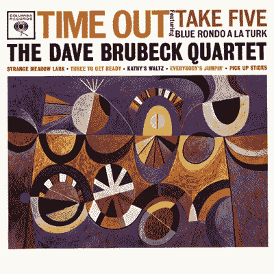
Time Out by The Dave Brubeck Quartet](https://geo.itunes.apple.com/us/album/time-out/id193085545?at=10lwWY&app=itunes) [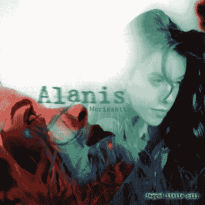
Jagged Little Pill by Alanis Morissette](https://geo.itunes.apple.com/us/album/jagged-little-pill-2015-remastered/id1050392837?at=10lwWY&app=itunes) [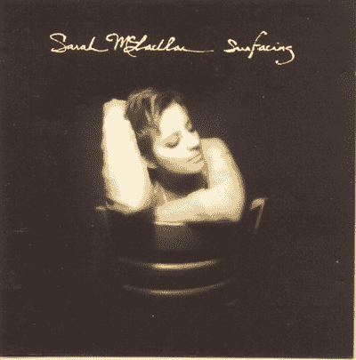
Surfacing by Sarah McLachlan](https://geo.itunes.apple.com/us/album/surfacing/id388153718?at=10lwWY&app=itunes) [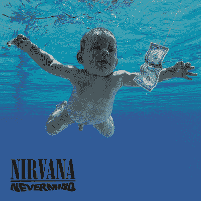
Never mind by Nirvana](https://geo.itunes.apple.com/us/album/nevermind/id485495703?at=10lwWY&app=itunes) [
Bob Marley & The Wailers by Legend](https://geo.itunes.apple.com/us/album/legend-deluxe-edition/id19851211?at=10lwWY&app=itunes) [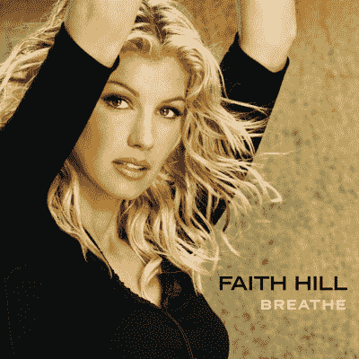
Breathe by Faith Hill](https://geo.itunes.apple.com/us/album/breathe/id321981503?at=10lwWY&app=itunes) [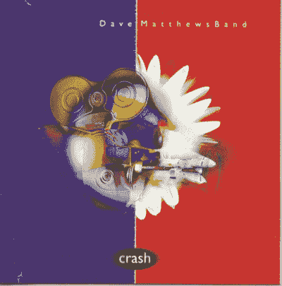
Crash by Dave Matthews Band](https://geo.itunes.apple.com/us/album/crash/id388136111?at=10lwWY&app=itunes) [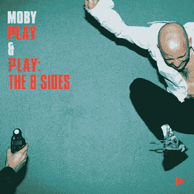
Play & Play: B Sides by Moby](https://geo.itunes.apple.com/us/album/play-play-b-sides/id281242279?at=10lwWY&app=itunes) [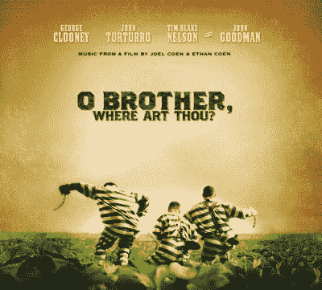
O Brother, Where Art Thou? (Music from the Motion Picture)](https://geo.itunes.apple.com/us/album/o-brother-where-art-thou-music/id524827132?at=10lwWY&app=itunes)

* * *