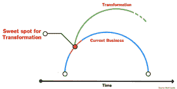
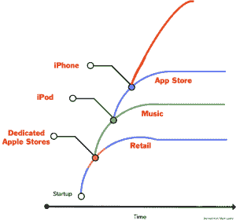
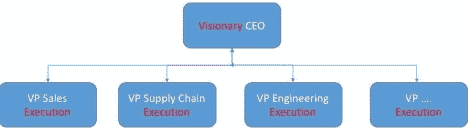

# 史蒂夫·布兰克为什么蒂姆·库克是史蒂夫·鲍尔默，为什么他仍然在苹果公司工作

> 原文：<https://steveblank.com/2016/10/24/why-tim-cook-is-steve-ballmer-and-why-he-still-has-his-job-at-apple/?utm_source=wanqu.co&utm_campaign=Wanqu+Daily&utm_medium=website>

一个有远见的 CEO 不在了，公司会怎么样？最常见的情况是，创新消失了，公司在势头和品牌上滑行了多年。

<noscript></noscript>

它很少重现昔日的辉煌。

原因如下。

* * *

进入 21 世纪时，微软是所有与计算设备互动的人的主要软件供应商。16 年后，它只是另一家软件公司。

在执掌微软 25 年后，比尔·盖茨于 2000 年 1 月将 CEO 的权力移交给史蒂夫·鲍尔默。在接下来的 14 年里，鲍尔默继续执掌微软。如果你认为首席执行官的工作是增加销售额，那么鲍尔默做得非常出色。他使微软的销售额翻了三番，达到 780 亿美元，利润翻了一倍多，从 90 亿美元增加到 220 亿美元。Xbox 和 Kinect 的推出，Skype 和 Yammer 的收购都发生在他的岗位上。如果微软董事会能够实现季度间甚至年度间的收入增长，那么鲍尔默就是一位优秀的首席执行官。但如果公司的目的是长期生存，那么人们可以提出一个更好的论点，即他作为首席执行官是失败的，因为他通过浪费长期机会来优化短期收益。

**如何错失良机——五次** 尽管微软的财务表现出色，但由于微软首席执行官鲍尔默未能理解和执行 21 世纪最重要的五大技术趋势:在搜索领域——输给了谷歌；在智能手机方面——输给苹果；在移动操作系统方面——输给谷歌/苹果；在媒体方面——输给苹果/网飞；在云端——输给了亚马逊。微软在 20 世纪拥有超过 95%的运行在电脑上的操作系统(几乎都在台式机上)。15 年来，21 世纪智能手机出货量达到 20 亿部，而微软的移动操作系统份额只有 1%。这些失误并不在一些无关紧要的市场——遗漏的搜索、移动和云计算是微软用户的直接目标。然而，一个非常聪明的 CEO 错过了所有这些。为什么？

核心业务的执行和组织
这并不是说微软没有从事搜索、媒体、移动和云计算的聪明工程师。他们有很多这样的项目。问题是鲍尔默围绕着执行(T4)当前的优势——Windows 和 Office 业务——来组织公司。与这些活动不直接相关的项目从未得到管理层的重视和/或资源。

对于微软来说，要解决他们错过的领域——云、音乐、移动、应用程序——需要向服务公司进行组织转型。服务(云、广告、音乐)有非常不同的商业模式。在一个擅长产品的公司里，这是很难做到的。

鲍尔默和微软之所以失败，是因为这位首席执行官是现有商业模式的世界级执行者(哈佛毕业生和世界级推销员)，试图在一个不断变化和破坏的世界中进行管理。微软将其 20 世纪的商业模式执行得非常好，但是它错过了新的和更重要的模式。结果呢？巨大的短期收益，但微软的长期前景远没有那么令人信服。

2014 年，微软终于宣布鲍尔默将退休，2014 年初，塞特亚·纳德拉接手。纳德拉让微软围绕移动和云(Azure)进行组织，将 Office 和 Azure 团队从 Windows 中解放出来，扼杀了手机业务，并在没有通常创伤的情况下推出了 Windows 的主要版本。并正在将公司推向增强现实和对话式人工智能。虽然他们可能永远不会重新获得他们在 20 世纪的市场主导地位，(他们的商业模式仍然非常有利可图)，纳德拉可能会拯救微软。

**少了什么？** 有远见的首席执行官们不仅“不仅仅”擅长确保一个经过考验的成功商业模式的世界级执行，他们还是世界级的创新者。有远见的 CEO 以产品和商业模式为中心，极度关注客户。

最好的是敏捷的，知道如何改变——在他们的市场发生变化时或之前，对商业模式做出实质性的改变。他们中最优秀的人塑造了市场——他们知道如何在任何人之前发现机会，从而创造新的市场。他们仍然是企业家。

[

<noscript></noscript>](http://firstround.com/review/The-Arc-of-Company-Life-and-How-to-Prolong-It/) 
有远见的 CEO 的最好例子之一是史蒂夫·乔布斯，他将苹果从一家小众电脑公司转变为世界上最赚钱的公司。从 2001 年到 2008 年，乔布斯三次重塑了公司。每一次转型——从新的电脑分销渠道——苹果商店到 2001 年用 iPod 和 iTunes 颠覆音乐业务；到 2007 年的 iPhone2008 年的 App store 将收入和利润推向了新的高度

[

<noscript></noscript>](http://firstround.com/review/The-Arc-of-Company-Life-and-How-to-Prolong-It/) 这些不仅仅是产品转型，而是彻底的商业模式转型——新渠道、新客户和新市场——以及对组织不同部分的新强调(设计变得比硬件本身更重要，新高管变得比现任更重要)。

有远见的首席执行官不需要别人为他们演示公司的关键产品。他们对产品有着深刻的理解，对于当今的行业/商业模式和客户，以及他们需要将公司带向何处，他们有着自己连贯一致的愿景。他们知道谁是他们的客户，因为他们花时间与他们交谈。他们向战略委员会和高管人员寻求建议，但这些首席执行官都不会听从委员会的意见。

为什么蒂姆·库克会成为新的史蒂夫·鲍尔默
这让我们想到了苹果、蒂姆·库克和苹果董事会。

成功的*富有远见和魅力的*首席执行官的优势之一是，他们建立了一个由世界级运营高管组成的执行团队(他们不自觉地将任何世界级创新者从他们的直接下属中排挤出去)。问题是，在一个由有远见的 CEO 领导的公司里，只有一个有远见的人。这种类型的 CEO 身边都是非常能干的执行者，而不是颠覆性的创新者。史蒂夫·乔布斯(Steve Jobs)执掌苹果时，他推动了愿景，但在每个领域——硬件、软件、产品设计、供应链、制造——都安排了强有力的运营高管，他们将他的愿景和急躁转化为计划、流程和程序。

[

<noscript></noscript>](https://i0.wp.com/steveblank.com/wp-content/uploads/2016/10/slide1.jpg?ssl=1) 当有远见的创始人离去(死亡、解雇等。)，向他们汇报工作的运营高管认为，该轮到他们来管理公司了(通常是在前任 CEO 的祝福下)。在微软，比尔·盖茨任命史蒂夫·鲍尔默，在苹果，史蒂夫·乔布斯明确表示蒂姆·库克将成为他的继任者。

一旦掌权，这些运营/执行首席执行官要做的第一件事就是[摆脱组织中的混乱和动荡](http://www.businessinsider.com/tim-cook-why-i-fired-scott-forstall-2012-12)。执行首席执行官重视稳定性、流程和可重复的执行。一方面，这对可预测性很好，但它通常会引发一个*创意死亡螺旋*——创意人员开始离开，其他执行者(没有旧领导者的创新才能)被安排到更高级的角色——雇佣更多的流程人员，这反过来会迫使剩余的创意人才离开。这种文化转变是自上而下的，T4 曾经被认为是一家以改变世界为使命的公司，现在却被认为是另一份工作。

<iframe loading="lazy" class="youtube-player" src="https://www.youtube.com/embed/l4dCJJFuMsE?version=3&amp;rel=1&amp;showsearch=0&amp;showinfo=1&amp;iv_load_policy=1&amp;fs=1&amp;hl=en-US&amp;autohide=2&amp;start=90&amp;wmode=transparent" allowfullscreen="true" sandbox="allow-scripts allow-same-origin allow-popups allow-presentation">视频</iframe>

尽管新任首席执行官以流程为导向，但你会感觉到他们不喜欢也不推动的事情之一是产品(去看看 Apple Watch 的公告和[看看谁演示了产品](https://youtu.be/OD9ZQ9WylRM?t=1h4m8s))。

蒂姆·库克已经执掌苹果五年了，这段时间足以让苹果成为他的公司，而不是史蒂夫·乔布斯的。盖茨和鲍尔默、乔布斯和库克之间的相似之处令人毛骨悚然。库克领导下的苹果公司收入翻了一番，达到 2000 亿美元，同时利润翻了一番，银行存款增加了两倍(现在是 1/4 万亿美元)。iPhone 继续其年度升级的增量改进。然而，在五年内，唯一成功走出国门的新事物是苹果手表。拥有 115，000 名员工的苹果公司几乎不能为他们的笔记本电脑和台式电脑进行年度更新。

但世界即将颠覆苹果，就像鲍尔默领导下的微软面临颠覆一样。苹果出色地掌握了用户界面和产品设计，让 iPhone 占据了主导地位。但谷歌和亚马逊打赌，下一波计算产品将是人工智能指导的服务——机器智能驱动的应用和硬件。想想亚马逊 Alexa、谷歌 Home 和由智能、对话式人工智能驱动的语音识别指导的助手——其中大多数都将是分散在你家中的一类新设备,而不仅仅是你的手机。有可能在手机上下注作为对话式人工智能的平台可能不是获胜的一手牌。

这并不是说苹果在他们的实验室里没有令人兴奋的对话式人工智能。见鬼，Siri 其实是第一个。苹果公司在他们的实验室中也有自动驾驶汽车项目，基于人工智能的扬声器，增强和虚拟现实等。问题在于，一个对产品缺乏热情、尚未清晰表达苹果未来发展方向的个人愿景的供应链首席执行官，无法做出正确的组织、商业模式和产品押注，从而将这些产品推向市场。

**董事会面临的四大挑战** 微软、苹果的董事会或任何董事会在一位创新型首席执行官离职时面临的困境是*战略性的*:我们还想成为一家创新、敢于冒险的公司吗？或者，我们现在应该专注于核心业务的执行，减少高风险投资，实现股东回报最大化。

从策略上来说，这个问题会引出这样一个问题:你是从外部寻找另一个创新者，提拔一个执行者，还是深入组织内部寻找一个创新者？

这里存在四个挑战。史蒂夫·乔布斯和比尔·盖茨(以及 20 世纪的另一位创意偶像华特·迪士尼)都有一个相同的盲点:他们都建议高管作为他们的继任者。他们将世界级的执行力与对产品和客户的热情以及市场洞察力混为一谈。从盖茨的角度来看，他和鲍尔默没有区别，乔布斯和库克也没有区别。然而，历史已经向我们展示了 T2 在瞬息万变的市场中的长期生存，事实绝对不是这样。

第二个难题是，如果董事会决定公司需要另一位创新者掌舵，你几乎可以保证最佳执行者——公司的二号和/或三号副总裁——将会离开，觉得他们应该得到这份工作。现在，董事会面临的不仅是失去了首席执行官，还有可能失去最优秀的管理人员。

第三个挑战是，许多创新/有远见的首席执行官已经成为公司品牌的一部分。史蒂夫·乔布斯，杰夫·贝索斯，马克·扎克伯格，杰夫·伊梅尔特，埃隆·马斯克，马克·贝尼奥夫，拉里·埃里森。这并不是一个新现象，想想 20 世纪的偶像，如华特·迪士尼、宝丽来的爱德华·兰德、亨利·福特、克莱斯勒的李·艾柯卡、通用电气的杰克·韦尔奇和通用汽车的阿尔费雷德·斯隆。但是他们不仅仅是公司的外部形象，他们经常是 T2 内部决策的试金石。一个有远见的首席执行官去世多年后，公司仍然在问“华特·迪士尼/史蒂夫·乔布斯/亨利·福特会怎么做？”而不是弄清楚*他们*现在应该在不断变化的市场中做什么。

最后，第四个难题是，随着公司变得越来越大，管理层陷入了这样一种谬论，即它的存在只是为了最大化股东的短期投资回报，公司变得厌恶风险。大公司和他们的董事会生活在恐惧中，害怕失去他们多年来赢得的东西(客户、市场份额、收入、利润)。)这在稳定的市场和技术中可能行得通。但是今天这些已经很少了。

**在 21 世纪，执行 CEO 作为继任者越来越可能是错误的选择** 在一家初创公司，董事会意识到*风险是新创企业的本质，创新是它们存在的原因*。在第一天，没有客户流失，没有收入和利润下降。相反，一切都会有所收获。相比之下，大公司通常是规避风险的引擎——它们执行的是一种可重复、可扩展的商业模式，这种模式能产生股票市场回报的短期股息、收入和利润。而不断上涨的股价成为存在的理由。具有讽刺意味的是，在 21 世纪，你对现有产品/市场抓得越紧，就越有可能被颠覆。(正如 Clayton Christensen 的经典著作[创新者的困境](https://www.amazon.com/gp/product/0060521996?ie=UTF8&tag=wwwsteveblank-20&linkCode=as2&camp=1789&creative=9325&creativeASIN=0060521996)中所阐述的，在技术或市场快速变化的行业中，颠覆是不可忽视的。)

越来越多的是，一个亲力亲为的产品/客户，以商业模式为中心的首席执行官，对未来的企业家愿景，可能是市场主导地位和第 11 章之间的区别。在这些行业中，颠覆将创造机会，迫使企业在产品方向、市场、定价、供应链、运营以及执行新商业模式所需的重组方面做出“赌一把”的决策。最终，幸存下来的首席执行官们拥抱创新，传达新的愿景，并建立管理层来执行这一愿景。

**吸取的经验教训**

##### 这篇文章的一个简短版本曾发表在《哈佛商业评论》上。

### 像这样:

像 装...

归档于:[企业/政府创新](https://steveblank.com/category/corporate-govt-innovation/) |