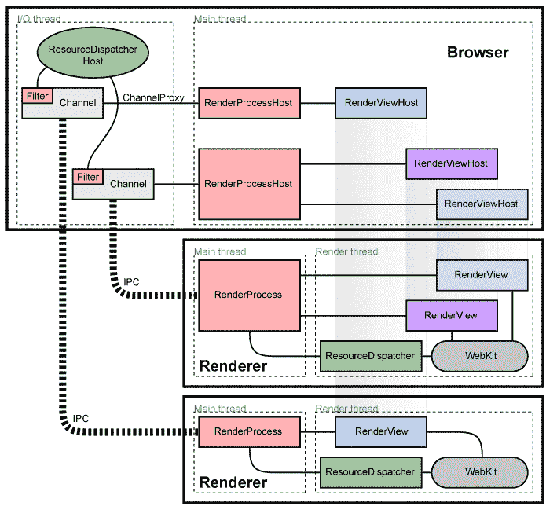

# 用电子松弛工程构建混合应用

> 原文：<https://slack.engineering/building-hybrid-applications-with-electron-dc67686de5fb?utm_source=wanqu.co&utm_campaign=Wanqu+Daily&utm_medium=website>

今天，我们刚刚发布了一个新版本的用于 macOS 的 Slack 桌面应用程序。我们用[电子](http://electron.atom.io/)制造了它，结果，它更快，运动无框外观，并有许多幕后改进，以获得更好的松弛体验。

当然，使用 web 技术构建桌面应用程序有不同的方式。与其他一些应用程序采用的 100%内置方法不同，Slack 采用了一种混合方法，我们将一些资产作为应用程序的一部分，但大部分资产和代码都是远程加载的。由于没有太多关于如何使用 electronic 实现这一点的信息，我们想更深入地了解一下我们的混合应用程序是如何工作的。

## 首先，一些历史

最初，Slack 桌面应用程序是使用 [MacGap v1](https://github.com/MacGapProject/MacGap1) 框架编写的，该框架在内部使用 [WebView](https://developer.apple.com/reference/webkit/webview) 在本地应用程序框架内托管 web 内容。虽然这在很长一段时间内为我们提供了很好的服务(包括多团队支持的改进)，但这种架构开始显示出它的年龄。像 HTTP/2 这样的新功能只出现在苹果新的 [WKWebView](https://developer.apple.com/reference/webkit/wkwebview) 视图中，转移到这个视图实际上需要完全重写应用程序。此外，WebView 与操作系统的 Safari 版本捆绑在一起，这意味着当旧版本的 macOS 在 Safari 中出现影响我们应用程序的问题时，我们没有太多选择。

> 另外，当我们创建 Slack Windows 应用程序时，我们无法使用现有的代码库，所以我们决定押注于一个名为 Electron 的全新平台。

在之前我们已经[写过关于 Electron 的文章，但是总结一下，Electron 是一个结合了 Chromium 的渲染引擎和 Node.js 运行时和模块系统的平台。](/using-es2015-with-electron-introducing-electron-compile)

自从 Slack Electron 应用程序开发的早期，我们就有了一个工作的 macOS 版本(尽管有许多缺失的功能)。对于我们来说，能够使用 macOS 与同事分享我们的应用程序非常有用，例如设计反馈。因此，当我们研究如何更新 Mac 应用程序时，转移到跨 Mac、Windows 和 Linux 的统一代码库是一个简单的选择。

## 技术栈

尽管是除了 Atom T1 之外的第一个生产电子应用程序，Slack 桌面应用程序在 web 技术方面一直保持相当的更新。我们的应用程序已经从一个用普通 DOM APIs 编写的 [CoffeeScript](http://coffeescript.org/) 应用程序迁移到一个现代的[ES6+async/await](https://babeljs.io/)T6】React 应用程序，我们目前正在逐步将我们的应用程序迁移到 [TypeScript](https://www.typescriptlang.org/) 。

### Chromium 多进程模型

Electron 继承了 Chromium 的多进程模型——主应用程序以及您登录的每个 Slack 团队都生活在一个单独的进程中，拥有自己的内存空间。对我们来说，这意味着我们可以在不影响应用程序其余部分的情况下重新启动崩溃或出现其他问题的单个团队，以及通过单独的 GPU 进程保护 GPU 驱动程序问题。



在 macOS 上，这些渲染器进程被标记为“Slack Helper”您将看到每个团队一个，另外三个用于崩溃报告、GPU 和托管团队切换器的进程。

### WebView 标签

虽然我们通常相信本地 Slack 应用程序可以完全访问桌面和 Node.js，但允许远程内容直接访问桌面功能和 Node.js 是不安全的——如果有人在 Slack 中做手脚，他们将完全控制用户计算机！为了防止这一点，我们使用了一个从 Chrome 应用程序移植而来的电子功能，称为 [WebView 元素](https://github.com/electron/electron/blob/master/docs/api/web-view-tag.md)(与上面提到的苹果 WebView 无关)。从概念上讲，这个 HTML 元素类似于 iframe，因为它包含另一个内联站点作为块元素。然而，它实际上创建了一个单独的 Chromium 渲染器进程，并为其托管渲染器委托呈现内容，类似于 Flash 插件主机框架的工作方式。

在任何导航发生之前，我们有机会运行启用了 Node.js 集成的定制代码，称为“预加载脚本”这个脚本在 DOM 创建之前和页面有原点之前运行，但是让我们可以访问 Electron 和 Node.js APIs。

我们可以在预加载脚本中做的一件事是在窗口对象上设置一个键。这允许我们向 Slack 的 webapp 端公开一个 API。因为我们定义了这个 API，所以我们可以设置一个安全边界，只授予 webapp 某些方法。

为了确保这种方法的安全性，您*必须*做几件事情:

1.  您必须确保不会将 Node.js 模块泄漏到您的 API 表面。
2.  您应该考虑您的 API，尤其是涉及文件路径的 API。确保 API 的恶意调用者不能访问用户文件系统上的数据。
3.  您只需担心通过 JavaScript 本身访问 JS 对象，通过 DevTools 控制台选项卡查看 Node.js 对象通常是安全的。DevTools 可以访问 JavaScript 不能访问的隐藏 V8 方法，所以能够通过“closure”伪变量访问 Node.js 对象并不重要。

### 进程间的通信

在所有这些不同的进程之间进行通信是一件棘手的事情。在 Chromium 的底层 IPC 模块之上，我们构建了一个名为[electronic-remote](https://github.com/paulcbetts/electron-remote)的库。

电子遥控是电子遥控模块的精简版，速度更快，使用 [ES6 代理对象](https://developer.mozilla.org/en-US/docs/Web/JavaScript/Reference/Global_Objects/Proxy)。使用代理，我们创建一个对象来表示远程渲染器上的窗口，所有方法调用都作为消息发送到远程渲染器。这使您可以完成与传统远程模块相同的事情，但是没有远程事件处理程序和同步 IPC 的缺陷。

首先，在主窗口中设置您想要创建的 API。为了让我们的例子更容易理解，我们将使用一个全局变量:

```
import {remote} from ‘electron’;
class DockHelper {
    bounceDock() {
        remote.app.dock.bounce(‘informational’);
    }
}
window.dockHelper = new DockHelper();
```

接下来，在我们的预加载脚本中，我们将实际连接它:

```
import {remote} from ‘electron’;
import {createProxyForRemote} from ‘electron-remote’;
let mainWindow = createProxyForRemote(remote.getCurrentWindow());
window.desktopIntegration = {
    bounceDock: () => {
        // NB: bounceDock returns a Promise here because we’re
        // accessing it Remotely — if app.dock.bounce throws,
        // we’ll see it show up here as a rejected Promise.
        return mainWindow.dockHelper.bounceDock();
    }
}
```

现在，您的 web 应用程序可以访问一个新的对象 desktopIntegration，它具有一个 bounceDock 方法:

```
window.desktopIntegration.bounceDock
 .catch((e) => console.log(`Failed to bounce dock: ${e.message}`));
```

能够有效地访问远程对象使得实现 webapp 的 API 变得更加容易。在我们的例子中，它允许我们轻松地发送 [Redux 应用程序动作](http://redux.js.org/)来更新我们的应用程序的状态，并通过代理，依赖于该状态的 UI，来呈现对 Dock 图标上的徽章的更新，或者更新团队切换器项目上的未读取状态。

你必须小心使用电子远程审计你的远程对象，就像你审计你的其他预加载对象一样——能够要求另一个进程做一些恶意的事情和在进程内做一样糟糕！

### 开源库

作为编写 Slack 桌面应用程序的一部分，我们开发了大量开源的库和工具:

我们也花了一些时间对电子项目本身做出贡献，以帮助开发人员改进框架。

正如你所看到的，新的 Slack 桌面应用程序帮助我们的开发团队拥有两个世界的最好的东西 web 开发的快速迭代和生态系统，以及能力(用一点 C++和肘脂！)以网站无法到达的方式访问底层 Mac 操作系统。我们对桌面应用的未来感到兴奋，尤其是我们可以做的所有事情，以将您团队的工作整合在一起。

如果你想帮助我们让 Slack 每一天都变得更好，请访问职业网站并立即申请。[立即申请](https://slack.com/careers)