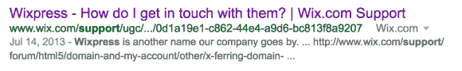

# Wix 移动应用，WordPress 联合-马特·莫楞威格

> 原文：<https://ma.tt/2016/10/wix-and-the-gpl/?utm_source=wanqu.co&utm_campaign=Wanqu+Daily&utm_medium=website>

任何了解我的人都知道我喜欢尝试新事物——手机、小工具、应用程序。上周我下载了新的 Wix(封闭的、专有的、非开源的、非 GPL 的)移动应用。我总是很有兴趣看到其他人如何解决从移动设备上构建和编辑网站的挑战。

我开始摆弄编辑器，感觉……似曾相识。很熟悉。好像我以前用过一样。

原来我有。因为是 WordPress。

如果我很仁慈的话，我会说，“这个应用的编辑器是基于 WordPress 移动应用的编辑器的。”如果我是诚实的，我会说 Wix 抄袭 WordPress 没有署名，信用，或遵循许可。自定义图标，类名，甚至是 bug。你可以在 GitHub 上看到[分叉的](https://github.com/wix/WordPress-Editor-Android) [储存库](https://github.com/wix/react-native-wordpress-editor)，以及来自 Automattic 移动团队的两位开发人员 Alex 和 Maxime 的原始提交。Wix 总是大量借用 WordPress——包括他们的公司名称，以前是 Wixpress ltd——但这种明目张胆的剽窃和代码盗窃是我以前从竞争对手那里看到过的。

### 亲爱的 Wix，

这明显违反了 GPL，GPL 要求你发布的基于 GPL 代码的任何东西都要有归属和相应的 GPL 许可。是 GPL 让 WordPress 蓬勃发展，让我们创造了这段代码。你的应用程序的编辑器是用偷来的代码构建的，所以你的整个应用程序现在违反了许可证。

我想我们会把这当成一种赞美——我敢肯定，为 WordPress Core 和我们的移动应用做出贡献的数百人对你选择使用我们的代码来构建你公司的核心功能之一感到受宠若惊。我们也很兴奋地看到你用节省下来的时间创造了多么伟大的东西，而不必编写自己的移动编辑器。

你知道什么更令人兴奋吗？看到你遵守 GPL 并把你的源代码发布回给你带来飞跃的社区。

我总是说[GPL 不是关于限制，而是关于可能性](https://ma.tt/2014/01/four-freedoms/)。在开源软件中，你作为一个开发者，为了更好地服务于开发者社区和使用你的站点和产品的人们，你会放弃一些控制权。我不认为这是一个限制，我认为这是一种确保我们鼓励创新和动力的方式。如果你想关上创新的大门，Wix，那是你自己的决定——写你自己的代码。如果你要加入开源社区，就要遵守开源规则。

在 GPL 下发布你的应用程序，并把你的应用程序的源代码放到 GitHub 上，这样我们都可以在它的基础上构建，改进它，并从中学习。

Love，
Matt 和开源社区

### 最新消息

Wix 的首席执行官在他们的博客上发布了回应。我也会试着把我的回应贴在那里。[米里亚姆·施瓦布也有很好的回应](http://wpgarage.com/news-views/weak-wix-response-wordpress-gpl/)。

> 我们都对你的帖子感到非常惊讶，因为你对我们有这么多的指控。
> 
> 哇，伙计，我都不知道我们在吵架。

这不是一场战斗:索赔是 Wix 移动应用程序分发 GPL 代码，本身不是 GPL，所以他们违反了许可证。

> 首先，你说我们一直从开源社区索取而不回馈，当然，这不是真的。这里是我们的公共 [GitHub 页面](https://github.com/wix)上的 224 个项目的列表，正如你所看到的，它们的日期都在你发帖之前。我们还没有检查 WordPress 是否在使用它们，但是非常欢迎你这样做，其中一些非常好。

很高兴贵公司在 GitHub 上有项目！感谢您提供使用它们的机会；如果我们这样做，我们将确保非常小心地遵循您在代码上添加的许可。

发布其他开源项目并不意味着您可以违反您在移动应用程序中发布的编辑器代码的许可。重复我之前的观点:因为你用你的应用程序发布 GPL 代码，整个应用程序需要在 GPL 发布，而不仅仅是你对那个库的修改。

正如[这篇黑客新闻评论所说的](https://news.ycombinator.com/item?id=12828814)，“开源不是一次交换会议；如果你自愿发布一些其他代码来弥补，你就不能违反许可证。”

> 我们一直分享并钦佩您的回馈承诺，这正是我们拥有 224 个开源项目的原因，开源社区还有数千个 bugs 改进，我们也将发布您看到的应用程序。

如果你在 GPL 下发布应用程序的全部源代码，这将使你重新遵守你违反的许可。我想你是说你会在这里这么做，但你能澄清一下吗？我们应该在什么时候寻找要发布的应用程序代码，在哪里？这将彻底解决这个问题。

> 接下来，你说说 Wix 应用从 WordPress 被盗。Wix 应用程序中有超过 300 万行代码，特别是酒店/博客/聊天/电子商务/日程安排/预订都是我们的代码。

我说的应用程序包括被盗代码。不管是 30 行还是 3000 万行:因为它包括 GPL 代码，并且你分发了应用程序，所以整个东西都需要是 GPL 的。如果你发布整个应用程序的代码，我想你说过你会这样做的，那么这就解决了违反许可的问题。

> 是的，我们确实在应用程序的一小部分使用了 WordPress 开源库(这就是开源的概念，对吗？)，我们在那里改进或修改的所有东西，我们都以开源的方式提交回来，看这里的[链接](https://github.com/wix/react-native-wordpress-editor)——你应该看看，在 mobile native 上使用它是一种非常酷的方式。我真的认为你们可以在自己的应用中使用它(而且它是开源的，所以欢迎你们免费使用)。顺便说一下，我们用的那部分实际上是由另一个人开发的，并由你修改过。

感谢你承认你使用了代码，并没有试图隐藏它。问题不在于你所做的改变，而是包括编辑器意味着你需要将整个应用作为开源提交，而你还没有——它是完全专有的。

> 如果你想读这个项目的主要工程师之一 Tal Kol 的报告，这里是。他真的很乐意分享他的故事。

我已经看到了它，它已经有了很多好的评论，包括这个:“你能解决 Matt 的帖子中提出的这一点吗:‘这明显违反了 GPL，它要求你公开发布的基于 GPL 代码的任何东西都要有归属和相应的 GPL 许可’。”看来你和 Tal 可能对 GPL 的工作方式有误解——软件许可可能很棘手，许多人会犯诚实的错误。(如果你想了解更多细节，[这篇评论](https://ma.tt/2016/10/wix-and-the-gpl/#comment-586319)清楚地列出了许可要求。)纠正这一点很容易:在 GPL 下以开源形式发布你的应用程序。

> 我们偷了你的品牌是怎么回事？我们的产品一直叫 Wix，我们的网站叫 Wix.com，我们从来没有借用过你们的营销或品牌。

很抱歉包括这个分心；我特别提到了 Wix 过去被称为“Wixpress”的事实。你可以在你的表单 F-1 中看到这个[，在你的网站上曾经有一个关于这个的支持页面:](http://files.shareholder.com/downloads/AMDA-29IDMU/0x0xS1193125-13-387285/1576789/filing.pdf)

<noscript>T3】</noscript>

尽管它仍在谷歌中，但它链接到[的](https://cloudup.com/cu5miENIoLl)[页面](https://www.wix.com/support/html5/ugc/62ae9410-79d0-4198-8ff1-4a37966e1e94/0d1a19e1-c862-44e4-a9d6-bc813f8a9207)现在神秘地返回了一个 404 错误，你可能想调查一下。

> 事实上，如果我没记错的话，直到最近自动主页都是关于博客的，只是最近才变成“网站”此外，你的商业模式几乎与我们多年前的模式一模一样。会不会是你们在向我们借钱？如果是这样的话，再次欢迎你。

自 2009 年以来，[自动主页](http://automattic.com/)一直是一系列关于我们产品[的俳句，几乎没有变化——我想你指的是这里的 WordPress.com 主页。自从](http://web.archive.org/web/20121218130226/http://wordpress.com/)[我们 2005 年的 1.5 版本增加了主题和页面](https://wordpress.org/news/2005/02/strayhorn/)以来，WordPress 已经被用于创建网站，而不仅仅是博客。在我的 2014 年 Word address 状态报告中，我谈到了 87%的 WordPress 网站是如何将它作为 CMS 使用的。我们定期测试 WP.com 主页的几十种变化，其中一些肯定强调网站创建。我要说的是，我们将 Wix、Weebly 和 Squarespace 视为该领域的创新者，其产品覆盖了许多小企业，Wix 作为一家上市公司的成功和发展尤其值得称赞。

> 如果你认为我们需要给你信用，你应该得到信用，我必须说，绝对是的。你们值得表扬，但不是因为几行源代码，你们值得表扬是因为你们让互联网变得更好，为此我们 Wix 是你们的忠实粉丝。我们喜欢你一直在努力做的事情，并且非常努力地为使互联网变得更好做出我们自己的贡献。

非常感谢，你真好。我确实认为我们有许多共同的价值观，并且希望看到这个问题得到解决。

> 如果你需要我们有的源代码，而我们还没有发布，那么，很可能我们会很乐意分享，你只需要问。我们和你一样相信，让互联网变得更好，对每个人都是最好的。

这就是我的帖子所要求的，让你发布代码。引用我的原信:“在 GPL 下发布你的应用程序，并把你的应用程序的源代码放到 GitHub 上，这样我们都可以在它的基础上构建，改进它，并从中学习。”

> 最后，在过去的几年里，我几次试图与你见面。我能在这里再做一次吗？我相信友好竞争，尽管在博客上聊天很有趣，也许我们也可以边喝咖啡边聊？

一旦这件事解决了，我很乐意见面。我相信当我们在 2014 年交换电子邮件时，很难发现我们的旅行日程有重叠。

我希望以上阐明了我们认为 Wix 在哪里犯了错误，以及如何修复它。

### *相关帖子*