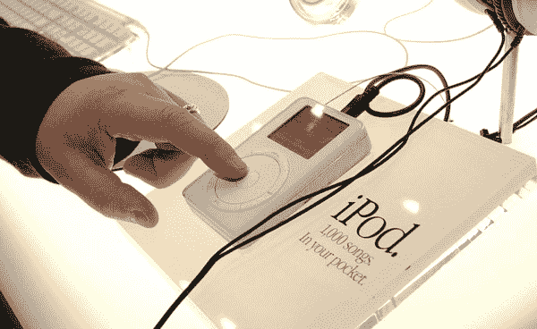

# 2001 年 iPod 发布会的电子邮件历史

> 原文：<https://backchannel.com/an-email-history-of-the-2001-ipod-launch-709b3ac4ea03?utm_source=wanqu.co&utm_campaign=Wanqu+Daily&utm_medium=website>

但这不全是 911。科技界正开始从无所作为的深渊中爬出来。10 月 25 日，微软在纽约举行了其主要新操作系统升级 Windows XP 的发布会。它意在表明这座城市正在恢复生机，尽管这种生机带有更多的金属探测器。

***来自:****Windows XP Launch【SMTP:Windows XP Launch @*[*EVENTS.CRGNET.COM*](http://events.crgnet.com/)*】*

***发送:****2001 年 10 月 16 日星期二晚上 9:30:13*

***主题:*** *微软 Windows XP 启动安全*

Windows XP 即将发布，我们很高兴您能加入我们的行列。对于每个使用个人电脑技术的人来说，这是一次重要的发布——我们将在纽约为它举办一场合适的盛大发布会。我们有很多关于安全的问题，我们想确认我们正在采取一切适当的措施使这次活动非常安全。。。为了帮助确保每个人的安全，我们要求您做一些事情:

*   *带上两种形式的身份证明。*

*   早点来登记。

*   不要携带包、背包、相机或瓶子参加活动。Windows XP 发布团队

现在有消息称苹果公司将在加州举办一场新的活动，以邮寄邀请函的形式出现。关于它的性质的唯一线索是卡片底部的一条线。“提示:这不是苹果电脑，”上面写道。

我不会去的。老实说，我还没准备好上飞机。但当然，我不会忽视史蒂夫·乔布斯提供的东西。正如本文顶部的电子邮件所示，苹果明白我不能去库比蒂诺的园区参加活动，但该公司会在史蒂夫·乔布斯介绍这款设备的同一天给我提供一台设备，我可以花几分钟时间与乔布斯通话。

在那个星期一，我带儿子去看医生，并观看了美国联赛冠军系列赛的最后一场比赛，扬基队痛击西雅图水手队(令我的同伴、RealNetworks 首席执行官罗布·格拉泽和华盛顿州的初级参议员玛丽亚·坎特威尔大为沮丧)。

周二是发布日。(我后来得知，苹果早在一周前就准备好了举办这次活动，但一直推迟到硬件副总裁乔恩·鲁宾斯坦度蜜月回来。)我错过了实际的发布会，史蒂夫·乔布斯从牛仔裤口袋里掏出了一个 iPod 那是直播出现之前的日子。但在活动开始后的几个小时内，一直在大西洋海岸来回运送盒子给科技作家的苹果快递员送来了我的 iPod。

盒子很醒目，上面有一张吉米·亨德里克斯的动态照片。当你打开它时，这个纯白色的设备——我把它描述为大卫·霍克尼画作中的恒温器——就像珠宝盒中的宝石。苹果还向评论者提供了一叠 CD(大概是为了消除非法下载的音乐会填充 iPod 的 5g 硬盘的指控)。有披头士、莎拉·麦克拉克兰、莫比、涅槃乐队、艾拉·费兹杰拉、阿兰妮斯·莫利塞特、格伦·古尔德、米勒·戴维斯、戴夫·布鲁贝克和鲍勃·迪伦的作品。鲍勃·迪伦是 1966 年在伦敦举行的现场音乐会，其最终版本是“像一块滚石”尽管布景是多风格的，但有人怀疑乔布斯的音乐品味是选择的决定性因素。