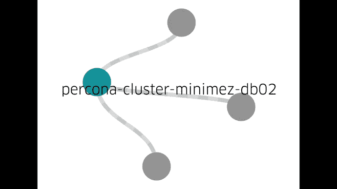

# 优步工程|优步博客

> 原文：<https://eng.uber.com/dockerizing-mysql/?utm_source=wanqu.co&utm_campaign=Wanqu+Daily&utm_medium=website>

优步工程公司的 [无模式存储系统](https://eng.uber.com/schemaless-part-one/) 为优步一些最大的服务提供动力，例如 [夹层](https://eng.uber.com/mezzanine-migration/) 。无模式是一个基于[MySQL](http://www.mysql.com/)集群的可扩展且高度可用的数据存储。当我们有 16 个集群时，管理这些集群相当容易。现在，我们有超过 1000 个集群，包含超过 4000 个数据库服务器，这需要不同种类的工具。

最初，我们所有的集群都由 [傀儡](https://puppet.com/) 管理，大量临时脚本和手动操作无法以优步的速度扩展。当我们开始寻找一种更好的方法来管理数量不断增长的 MySQL 集群时，我们有一些基本的需求:

*   在每台主机上运行多个数据库进程
*   自动化一切
*   通过单一入口点管理和监控所有数据中心的所有集群

我们想到的解决方案是一个叫做 Schemadock 的设计。我们在 [Docker](https://www.docker.com/) 容器中运行 MySQL，这些容器由配置文件中定义集群拓扑的目标状态管理。集群拓扑指定了 MySQL 集群的外观；例如，应该有一个包含 3 个数据库的集群 A，哪一个应该是主服务器。然后，代理将这些拓扑应用于各个数据库。集中式服务维护和监控每个实例的目标状态，并对任何偏差做出反应。

Schemadock 有很多组件，Docker 是一个很小但很重要的组件。切换到更具可伸缩性的解决方案是一项巨大的工作，本文解释了 Docker 是如何帮助我们实现这一目标的。

### 首先为什么是 Docker？

运行容器化进程使得在同一台主机上以不同版本和配置运行多个 MySQL 进程变得更加容易。它还允许我们在相同的主机上托管小型集群，以便我们可以在更少的主机上运行相同数量的集群。最后，我们可以消除对 Puppet 的任何依赖，并将所有主机调配到同一个角色中。

至于 Docker 本身，工程师现在在 Docker 中构建我们所有的无状态服务。这意味着我们有很多关于 Docker 的工具和知识。Docker 绝不是完美的，但它目前比其他选择要好。

#### 为什么不用 Docker？

Docker 的替代方案包括完全虚拟化、[【LXC 容器】](https://linuxcontainers.org/) ，以及通过例如 Puppet 直接在主机上管理 MySQL 进程。对我们来说，选择 Docker 相当简单，因为它适合我们现有的基础设施。然而，如果你还没有运行 Docker，那么只为 MySQL 运行 Docker 将会是一个相当大的项目:你需要处理映像构建和分发、监控、升级 Docker、日志收集、联网等等。

所有这些都意味着，如果你愿意在 Docker 上投入相当多的资源，你真的应该只使用它。此外，Docker 应该被视为一项技术，而不是解决所有问题的解决方案。在优步，我们做了一个仔细的设计，将 Docker 作为一个更大的系统中的一个组件来管理 MySQL 数据库。然而，并不是所有的公司都和优步的规模一样，对他们来说，一个更简单的设置可能更合适，比如木偶)。

### 无模式 MySQL Docker 映像

在它的基础上，我们的 Docker 镜像只是下载并安装 [Percona 服务器](https://www.percona.com/software/mysql-database/percona-server) 并启动[mysqld](http://dev.mysql.com/doc/refman/5.7/en/mysqld.html)——这或多或少类似于现有的 Docker MySQL 镜像。然而，在下载和启动之间，发生了许多其他的事情:

*   如果挂载的卷中没有现有数据，那么我们知道我们处于引导场景中。对于主机，运行 mysql_install_db 并创建一些默认用户和表。对于一个 [小程序](https://en.wikipedia.org/wiki/Master/slave_(technology)) ，从备份或集群中的另一个节点发起数据同步。T11】
*   一旦容器有了数据，mysqld 就会启动。
*   如果任何数据复制失败，容器将再次关闭。

使用环境变量配置容器的角色。这里有趣的是，角色只控制如何检索初始数据 Docker 映像本身不包含任何设置复制拓扑、状态检查等的逻辑。由于这种逻辑比 MySQL 本身变化得更频繁，所以将其分离是非常有意义的。

MySQL 数据目录从主机文件系统挂载，这意味着 Docker 不会引入写开销。然而，我们确实将 MySQL 配置放入了映像中，这基本上使它不可变。虽然您可以更改配置，但它永远不会生效，因为我们从来不重用 Docker 容器。如果一个容器因为某种原因关闭了，我们不只是重新启动它。我们删除容器，用相同的参数从最新的映像创建一个新的容器(或者如果目标状态已经改变，则创建新的容器)，然后启动那个容器。

这样做给了我们很多好处:

*   配置漂移更容易控制。它归结为一个 Docker 镜像版本，我们积极地监控它。
*   升级 MySQL 是一件简单的事情。我们建立一个新的形象，然后有序地关闭容器。
*   如果有什么东西坏了，我们就从头开始。我们不是试图修补东西，而是丢弃现有的东西，让新的容器接管。

构建映像是通过支持无状态服务的相同优步基础设施进行的。相同的基础架构跨数据中心复制图像，使它们在本地注册表中可用。

在同一台主机上运行多个容器有一个缺点。由于容器之间没有适当的 I/O 隔离，一个容器可能会使用所有可用的 I/O 带宽，从而使其余的容器处于饥饿状态。Docker 1.10 引入了 I/O 配额，但是我们还没有试验过。目前，我们通过不超额订阅主机和持续监控每个数据库的性能来应对这一问题。

### 调度 Docker 容器和配置拓扑

现在我们有了一个 Docker 镜像，它可以被启动并配置为主服务器或附属服务器，需要做的是实际启动这些容器，并将它们配置到正确的复制拓扑中。为此，每个数据库主机上都运行一个代理。代理接收应该在各个主机上运行的所有数据库的目标状态信息。典型的目标状态如下:

" schema dock 01-mezzanine-mezzanine-us1-cluster 8-db4 ":{

“app _ id”:“mezzanine-mezzanine-us1-cluster 8-db4”，

“状态”:“已开始”，

“数据”:{

“半同步复制启用”:假，

【名称】:“夹层-us1-集群 8-db4”，

"master_host": "schemadock30 "，

【主端口】:7335，

“禁用”:假，

“角色”:“宠臣”，

【端口】:7335，

"大小":"全部"

}

}

这告诉我们，在主机 schemadock01 上，我们应该在端口 7335 上运行一个 [夹层](https://eng.uber.com/mezzanine-migration/) 数据库附属程序，并且它应该将在 schemadock30:7335 上运行的数据库作为主数据库。它的大小为“all”，这意味着它是该主机上运行的唯一数据库，因此应该为它分配所有内存。

如何创建这个目标状态是另一篇文章的主题，所以我们将跳到下一步:在主机上运行的代理接收它，在本地存储它，并开始处理它。

该处理实际上是每 30 秒运行一次的无限循环，有点像每 30 秒运行一次 Puppet。处理循环通过以下动作检查目标状态是否与系统的实际状态相匹配:

1.  检查容器是否已经在运行。如果没有，用配置创建一个并启动它。
2.  检查容器是否具有正确的复制拓扑。如果没有，请尝试修复它。
    *   如果它是一个奴才，但应该是一个主人，请验证更改为主人角色是否安全。我们通过检查旧的主模块是只读的，并且所有的[gtid](https://dev.mysql.com/doc/refman/5.6/en/replication-gtids-concepts.html)都已经被接收和应用，来实现这一点。一旦出现这种情况，就可以安全地删除与旧主机的链接并启用写操作。
    *   如果它是主机，但应该被禁用，请打开只读模式。
    *   如果它是一个附属程序，但复制没有运行，则设置复制链接。
3.  检查 MySQL 的各种参数( 只读 和 超级只读 、 sync_binlog 等。)基于角色。主人应该是可写的，奴仆应该是只读的，等等。此外，我们通过关闭 binlog fsync 和其他类似的参数 来减少 minions 上的负载。
4.  启动或关闭任何支持容器，如[pt-heart](https://www.percona.com/doc/percona-toolkit/2.1/pt-heartbeat.html)和[pt-deadlock-logger](https://www.percona.com/doc/percona-toolkit/2.1/pt-deadlock-logger.html)。

请注意，我们非常赞同单进程、单用途容器的想法。这样我们就不必重新配置正在运行的容器，控制升级也容易得多。

如果在任何一点发生错误，流程只会引发错误并中止。然后在下一次运行中重试整个过程。我们确保各个代理之间尽可能少的协调。这意味着我们不关心排序，例如，在配置新集群时。如果您正在手动配置一个新的集群，您可能会这样做:

1.  创建 MySQL master 并等待它准备就绪
2.  创建第一个 minion 并将其连接到 master
3.  对剩余的奴才重复

当然，这样的事情最终还是会发生。不过，我们不关心的是显式排序。我们将创建反映我们想要达到的最终状态的目标状态:

" schema dock 01-mezzanine-cluster 1-db1 ":{

【数据】:{

【禁用】:假，

“角色”:“主人”，

【港口】:7335、

【大小】:【所有】

}

}，

" schema dock 02-mezzanine-cluster 1-DB2 ":{

“数据”:{

"master_host": "schemadock01 "，

【主端口】:7335，

“禁用”:假，

“角色”:“宠臣”，

【端口】:7335，

"大小":"全部"

}

}，

" schema dock 03-mezzanine-cluster 1-db3 ":{

“数据”:{

"master_host": "schemadock01 "，

【主端口】:7335，

“禁用”:假，

“角色”:“宠臣”，

【端口】:7335，

"大小":"全部"

}

}

这是以随机顺序推送给相关代理的，他们都开始处理它。为了达到目标状态，可能需要多次重试，具体取决于排序。通常，目标状态会在几次重试后达到，但有些操作实际上可能需要数百次重试。例如，如果从设备首先开始处理，那么它们将无法连接到主设备，它们必须稍后重试。因为让主服务器启动并运行可能需要一点时间，所以从服务器可能需要重试很多次:

An example of 2 minions starting up before the master. On the initial startup (steps 1 and 2), the minions won’t be able to get a snapshot from the master, which will fail the startup process. Then the master starts up in step 3, and the minions are able to connect and sync data in step 4 and 5.

### Docker 运行时体验

我们大部分主机在)上运行 Docker 1.9.1 与 devicemapper 进行存储。对设备映射器 使用 LVM 在回环上的性能明显优于 设备映射器 。 devicemapper 在性能和可靠性方面有很多问题，但是替代产品如[AuFS](https://en.wikipedia.org/wiki/Aufs)和[OverlayFS](https://en.wikipedia.org/wiki/OverlayFS)也有很多问题 。这意味着社区中对最佳存储选项有很多困惑。到目前为止，OverlayFS 获得了很大的牵引力，似乎已经稳定下来，所以我们将切换到这一点，并升级到 Docker 1.12.1。T37】

升级 Docker 的一个痛点是需要重启，这也会重启所有容器。这意味着升级过程必须受到控制，这样我们在升级主机时就不会有主服务器在运行。希望 Docker 1.12 将是我们不得不关心的最后一个版本；1.12 可以在不重启容器的情况下重启和升级 Docker 守护进程。

每个版本都有许多改进和新功能，同时也引入了相当数量的错误和倒退。1.12.1 似乎比以前的版本更好，但我们仍然面临一些限制:

*   Docker inspectDocker 运行几天后有时会挂起。
*   使用带有 [用户域代理](https://docs.docker.com/engine/reference/commandline/dockerd/) 的网桥联网会导致 TCP 连接终止周围的奇怪行为。客户端连接有时永远不会接收到 RST 信号，并且无论您配置哪种超时都保持打开状态。
*   容器进程偶尔会被重解析为 pid 1 (init ),这意味着 Docker 会失去对它们的跟踪。
*   我们经常看到 Docker 守护进程花费很长时间来创建新容器的情况。

### 总结

我们提出了优步存储集群管理的几个要求:

1.  在同一主机上运行的多个容器
2.  自动化
3.  单一入口点

现在，我们可以通过简单的工具和单一的用户界面进行日常维护，这些都不需要直接访问主机:

Screenshot from our management console. From here, we can follow goal state progress, in this case where we are splitting a cluster into two by first adding a 2nd cluster and then cutting the replication link.

通过在每个主机上运行多个容器，我们可以更好地利用我们的主机。我们可以以可控的方式进行全舰队升级。使用 Docker 让我们很快到达这里。Docker 还允许我们在测试环境中本地运行完整的集群设置，并尝试所有的操作程序。

我们在 2016 年初开始向 Docker 迁移，到目前为止，我们运行着大约 1500 台 Docker 生产服务器(仅用于 MySQL ),并且我们已经配置了大约 2300 个 MySQL 数据库。

Schemadock 还有很多功能，但 Docker 组件对我们的成功有很大的帮助，让我们可以快速移动和试验，同时还可以连接到现有的优步基础设施。整个旅行商店每天接收数百万次旅行，现在与其他商店一起运行在 Dockerized MySQL 数据库上。换句话说，码头工人已经成为优步之旅的重要组成部分。

Joakim Recht 是优步工程公司奥胡斯办事处的软件工程师，也是无模式基础设施自动化的技术主管。T3】

*图片片头鸣谢:**[座头鲸-巨头鲸](https://www.flickr.com/photos/87895263@N06/16197459124/)作者[西尔克·罗尔拉赫](https://www.flickr.com/photos/87895263@N06/ "Go to Sylke Rohrlach's photostream")* *，授权于*[*CC-BY 2.0*](https://creativecommons.org/licenses/by/2.0/)*。针对页眉尺寸和颜色进行了裁剪的图像。*

* * *

准确的说是 Percona Server 5.6

sync_binlog = 0 和innodb _ flush _ log _ at _ Trx _ commit = 2

小范围的问题选择:[【https://github . com/docker/issues/16653】，【https://github . com/docker/issues/15629】](https://github.com/docker/docker/issues/16653)