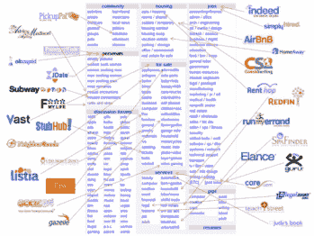

# 打造适合你的产品——伊丽莎白·尹

> 原文：<http://blog.elizabethyin.com/post/151241562185/build-a-product-that-fits-your-runway?utm_source=wanqu.co&utm_campaign=Wanqu+Daily&utm_medium=website>

作为一名企业家，你应该打造什么样的产品，在很大程度上取决于你的跑道。例如，很少有企业家能造出特斯拉，因为大多数企业家既不是超级富豪，也没有能力马上筹集大量资金。这似乎很明显。

每天，我都看到企业家试图打造超出他们的跑道范围的产品。例如，如果你试图建立一种新型的电子邮件营销工具，你将需要一种与 MailChimp 完全不同的方法，因为你将无法负担得起建立一个成熟的传统电子邮件营销系统的所有功能。要与它们的特征正面交锋需要数年时间。类似地，如果你想开发一个 CMS，你甚至不应该考虑整合 Weebly 或 WordPress 的所有功能，因为他们已经开发了几年的功能。

[Originally posted by aviationgifs](https://tmblr.co/ZkZLXo1Ndyq2r)

那么，这是否意味着根本不应该在现有的空间里制造产品呢？不。但是，这意味着你需要认真考虑如何建立一个简单快速的产品，通过强大的差异化在现有的市场中竞争。SendGrid (500 家投资组合公司)就是一个很好的例子。他们没有(一开始)构建出电子邮件营销解决方案的所有典型特征。它们是发送邮件的 API。就是这样。没有界面，没有所见即所得的功能。这就足够了。他们采用了传统电子邮件营销解决方案的一个方面，并把它搞砸了。Hubspot 一开始也只是专注于帮助人们写内容。当时，他们没有电子邮件功能或客户关系管理或任何东西。这都花了好几年才建成。该产品的最初版本基于这样的假设，即他们可以构建一个简单的工具，搭上新一轮内容营销的顺风车。直到现在，它们才在传统的营销自动化领域展开竞争。

## 不要把你的大部分跑道用在产品开发上

我看到企业家犯的一个最大的错误是，他们在产品开发上花了太多时间。部分原因是产品的范围对于第一次迭代来说太复杂了。更好的方法是只选择一个特征，然后把它从水中吹出来。让它变得超级简单易用，而且只需要你跑道的一小部分。如果你是第一次创业，不太容易获得资金，你应该力争在不到两个月的时间内完成这项工作。如果你不能在这个时间内完成，你的范围可能太大了。

*Image credit: Quora*

小功能可以解决很多大问题。这通常最容易在构建了臃肿软件的产品(现有恐龙玩家的)中找到。Craigslist 就是一个很好的例子。

 *从这些庞大臃肿的产品或公司中选择一个，写下该产品实现的每一个功能或事物的完整列表。在这个列表中，通常有几个功能本身可以是独立的产品。

## 在描绘愿景和解释当前产品之间找到平衡

出于所有这些原因，我讨厌风投们说:“这是一个功能吗？”是啊！为了让你一开始就有生存能力，你的产品真的应该感觉只是一个功能。但事情不一定要这样。

当你推销你的公司时，在传达你的愿景和今天的事情之间找到一条平衡点是非常重要的。解释你目前产品的来龙去脉是不鼓舞人心的，但是过多地谈论未来会让你看起来什么都没做，或者更糟的是，如果投资者发现你的产品实际上是什么样子，他/她会认为你在撒谎。

当你谈论你的愿景时，你应该明确地提到这是你对未来的看法，也是你对公司发展的看法。确保你的推销回到你目前所处的位置，以及实现你的愿景需要采取的步骤。* 