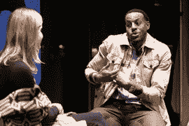
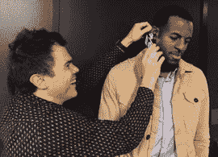

# 作为一名科技投资者，NBA 球星安德烈·伊戈达拉正在向 CNET 学习什么

> 原文：<https://www.cnet.com/news/heres-what-nba-star-andre-iguodala-is-learning-as-a-tech-investor/?utm_source=wanqu.co&utm_campaign=Wanqu+Daily&utm_medium=website>

安德烈·伊戈达拉的使命是改变他的 NBA 球员在投资游戏中的做法——尤其是在科技领域。

金州勇士队摇摆人和 2015 年 NBA 总决赛 MVP 也变得非常精通技术，与他的商业伙伴鲁迪·克莱恩·托马斯一起投资了几家公司。周一，他们在旧金山 LinkedIn 总部与初创公司老板的问答会上分享了他们的方法。

 金州勇士队球星安德烈·伊戈达拉在 Linkedin 旧金山总部的一次讨论中讨论了他是如何成为硅谷科技投资者的。 Kimberly White, Getty Images for LinkedIn

伊戈达拉说，他在 2013 年加入勇士队，不仅因为这是一支正在崛起的球队，还因为它靠近硅谷的科技公司，特别是创业投资。现在他想让他的篮球同龄人寻求相似的兴趣。

“我只是想让我的同事们明白，在我们正常的投资之外，还有一个属于我们的空间，”他说。“你通常会看到(玩家投资)理发店。你可以看到音乐公司。你会看到很多房地产。你不会看到很多人走出他们的舒适区。

“我们想改变这种情况。”

自从四个赛季前加入勇士队以来，伊戈达拉就像海绵一样沉浸在硅谷的科技场景中。他不是唯一一个深谙科技的职业篮球运动员。伊戈达拉的队友斯蒂芬·库里投资了在线教练服务、[应用](http://www.pressplay.global/)和[社交媒体平台](http://www.cbssports.com/nba/news/steph-curry-is-a-co-founder-of-new-social-media-platform-called-slyce/)等。洛杉矶快船全明星[克里斯·保罗](http://www.cbssports.com/nba/players/playerpage/555969/chris-paul)共同创建[游戏视觉](http://www.cp3app.com/)，使用游戏的应用程序声称将增加法院视觉意识。

最近退役的洛杉矶湖人队的伟大球员科比·布莱恩特(Kobe Bryant)正与杰夫·斯蒂贝尔(Jeff Stibel)一起管理着一只 1 亿美元的风险投资基金，投资于科技、媒体和数据公司，斯蒂贝尔是一位资深企业家和投资者，曾执掌 Web.com。

至于伊戈达拉，他认为来自著名风险投资公司安德森·霍洛维茨的科技巨头马克·安德森和本·霍洛维茨是他的朋友和知己。他还感谢[公司合伙人、在线餐厅预订网站 OpenTable 的前首席执行官杰夫·乔丹](https://a16z.com/author/jeff-jordan/)，帮助他和克莱恩·托马斯穿越了这个山谷。

“对他来说，这就像是，‘如果你们是认真的，我会迈出第一步。’他只是想知道我们有多认真，这对我们来说到底意味着什么。他给了我们很多早期的经验，尤其是在投资时应该注意什么和应该遵循什么原则。"

LinkedIn 的新经济编辑卡罗琳·费尔柴尔德(Caroline Fairchild)问道，乔丹告诉他们要远离什么？

“如果你不了解它，就不要投资它，”伊戈达拉说。“更具体地说，坚持你所知道的，什么感觉舒服，理解规模和不同的指标。”

伊戈达拉和克莱恩·托马斯表示，他们在三年内投资了大约 15 家公司，包括健康和美容初创公司沃克&公司品牌为非洲裔美国男性设计的广受欢迎的剃须套装 [Bevel](https://getbevel.com/) ，并在塔吉特百货等零售商处销售。

他们说，他们被该公司富有魅力的首席执行官特里斯坦·沃克所吸引，他曾在 Twitter 和 Andreeseen Horowitz 担任高管职务，被认为是科技多元化的倡导者。

 <noscript></noscript> 

 CellScope 首席执行官兼联合创始人埃里克·道格拉斯(左)在旧金山 LinkedIn 总部讨论他的技术投资之前，在金州勇士队球星安德烈·伊戈达拉的右耳上演示了他的健康创业公司 OTO 之家，这是一款智能手机耳镜。 CellScope

“我们知道他想用自己的产品和公司做些什么。这非常合理。我们马上就知道了，”伊戈达拉谈到沃克时说。伊戈达拉还曾两次担任初创公司[的男装总监，这是一家买卖二手服装的在线网站。该网站于 2014 年被出售给易贝。](https://www.liketwice.com/)

伊戈达拉和克莱恩·托马斯都表示，他们希望自己与风险资本家的关系网有助于消除对运动员的一些刻板印象。

“这是我们已经讨论过很多次的事情。我们如何改变人们对运动员的看法？我们希望在球场外受到重视，”伊戈达拉说。"你不想只是作为一名篮球运动员或名人."

“或者推销员，”克莱恩·托马斯补充道。

“对，”伊戈达拉继续说道。“这是最重要的事情，因为我们过去与企业打交道的方式是直接交易:你付给我这笔钱，我会拍张照片或为你的产品背书。

“我认为，就广告代言而言，形势已经发生了变化，因为消费者变得更聪明了。他们知道什么是正宗的，什么是有机的，什么是真正的。”

这也促使伊戈达拉和克莱恩·托马斯帮助创建了国家篮球运动员协会(National Basketball Players Association)的首届技术峰会(T1)，该峰会将现任和前任 NBA 球员(T2)聚集在一起，与重要的技术高管在 7 月份进行交流。伊戈达拉利用他作为球员工会[副主席](http://nbpa.com/leadership/)的影响力促成了这件事。

他们说，30 多名玩家参加了为期三天的活动。许多玩家像精明的商人一样做好了准备，他们和技术高管们互相问了很多问题。

“反响令人惊讶，”伊戈达拉说，他改变了一些怀疑者的看法。“他们中的许多人说，‘哇，我们不知道你是什么意思？’"

克莱恩·托马斯补充道，“一些玩家已经在投资了。所需要的只是一些曝光。”

他们说，科技峰会现在将成为一年一度的盛事。

“我们有一个具体的议程，”伊戈达拉说。“为了胜利。”