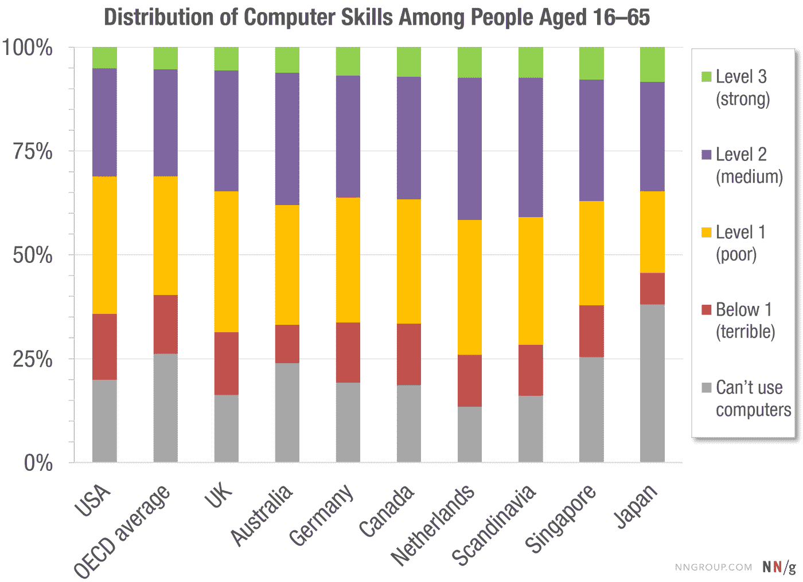

# 用户计算机技能的分布:比你想象的更糟

> 原文：<https://www.nngroup.com/articles/computer-skill-levels/?utm_source=wanqu.co&utm_campaign=Wanqu+Daily&utm_medium=website>

可用性最惨痛的教训之一是 [*你不是用户*](https://www.nngroup.com/videos/you-are-not-user-slogan/) 。这就是为什么猜测用户需求是一场[灾难的原因。由于设计师与大多数目标受众如此不同，所以不仅仅是*不相关的*你喜欢什么或者你认为什么容易使用——依赖这样的个人偏好常常会*误导*。](https://www.nngroup.com/articles/guesses-vs-data/)

当然，任何参与设计项目的人都会比局外人拥有更准确、更详细的用户界面心智模型。如果你的目标是广大的消费者，你也会比普通用户有更高的智商，更高的[文化水平](https://www.nngroup.com/articles/writing-for-lower-literacy-users/)，而且，最有可能的是，你会比你的许多用户更年轻，经历更少的[年龄驱动的能力退化](https://www.nngroup.com/articles/middle-aged-web-users/)。

你和普通用户之间还有一个更大的区别，它会对你预测什么是好的用户界面的能力造成更大的伤害:使用计算机、互联网和一般技术的技能。与普通人相比，任何参与网页设计团队或其他用户体验项目的人都是名副其实的超级极客。这不仅仅适用于开发商。与工程师相比，即使是技术含量较低的团队成员也只是“技术含量较低”。他们仍然拥有比大多数正常人强得多的技术技能。

## 经合组织技能研究

最近的一项国际研究让我们能够量化普通人群和科技精英之间的差异。这些数据是从 2011 年至 2015 年在 33 个国家收集的，并于 2016 年由经合组织(经济合作与发展组织，工业化国家的俱乐部)发表。总共有 **215，942 人**接受了测试，大多数国家至少有 5，000 名参与者。这项研究的大规模解释了为什么花了几年时间才公布结果。

这项研究旨在测试 16-65 岁的人的技能，这是报告中称为“成年人”的年龄范围。虽然 66 岁以上的人在劳动力中确实很少(因此对这个以劳动力为目标的项目不太感兴趣)，但他们是许多网站的主要用户群。我们对 65 岁以上用户的[研究发现，这个年龄段的用户有很多重要的可用性问题，他们的技术水平通常比年轻用户低。因此，在评估经合组织的发现时，我们应该记住，全部用户群的技能低于研究数据所显示的。](https://www.nngroup.com/articles/usability-for-senior-citizens/)

经合组织的项目考察了一系列与工作相关的技能，但我们最感兴趣的是技术技能测试。在研究的这一部分，参与者被要求完成 14 项基于计算机的任务。参与者没有使用实时网站，而是在测试主持人的计算机上的模拟软件上尝试这些任务。这使得研究人员能够确保所有参与者多年来都面临相同程度的困难，并能够控制用户界面翻译成每个国家的当地语言。

这些任务的难度从非常简单到有些复杂不等。其中一个简单的任务是使用电子邮件程序的回复所有功能给三个人发送回复。这很容易，因为问题是显而易见的，只涉及一个步骤和一个约束(三个人)。

其中一个**困难的任务**是使用几封电子邮件中包含的信息，在日程安排应用程序中安排一个会议室。这很困难，因为问题陈述是隐含的，并且涉及多个步骤和多个约束。解决周三下午 3 点预订房间 A 的明确问题会容易得多，但是必须根据来自不同应用程序的许多信息来确定最终需求，这对许多用户来说是一项困难的工作。

即使是被认为是困难的任务听起来也没有那么难，我当然希望我所有的读者都能够快速地、高度自信地完成它们。然而，我的全部观点是，仅仅因为*你*能做到，并不意味着*普通用户*也能做到。

## 技术熟练程度的 4 个级别

研究人员根据用户可以成功完成的任务类型，定义了 4 个熟练程度级别。对于每个级别，这里是达到该级别的人口百分比(经合组织国家的平均水平)，以及报告对该级别内人员能力的定义。

### “低于 1 级”= 14%的成年人口

出于礼貌，经合组织的研究人员没有使用“零级”这样的术语，而是将最低的技能水平称为“1 级以下”。

这是低于 1 级的人可以做的:“任务基于明确定义的问题，涉及在通用接口中仅使用一个函数来满足一个显式标准，而没有任何分类或推理推理，或信息转换。只需要很少的步骤，并且不需要产生任何子目标。”

这一级别的任务的一个例子是电子邮件应用中的“删除该电子邮件消息”。

### 1 级=成年人口的 29%

这是 1 级人员可以做的:“任务通常需要使用广泛可用且熟悉的技术应用程序，如电子邮件软件或网络浏览器。访问解决问题所需的信息或命令几乎不需要导航。不管回答者是否意识到并使用了特定的工具和功能(如排序功能)，问题都可能得到解决。这些任务只需要很少的步骤和很少的操作人员。在认知层面，回答者可以很容易地从任务陈述中推断出目标；问题解决要求回答者应用明确的标准；并且很少有监控需求(例如，回答者不必检查他或她是否使用了适当的程序或在解决方案方面取得了进展)。识别内容和操作符可以通过简单的匹配来完成。只需要简单的推理形式，例如将项目分配到类别中；不需要对比或整合信息。”

上述“回复所有人”任务需要 1 级技能。第一级任务的另一个例子是“查找来自约翰·史密斯的所有电子邮件”

### 2 级=成年人口的 26%

这是第二级人员可以做的:“在这个级别，任务通常需要使用通用和更具体的技术应用程序。例如，被调查者可能不得不使用一种新的在线表格。要解决这个问题，需要跨页面和应用程序的导航。使用工具(例如排序功能)可以帮助解决问题。该任务可能涉及多个步骤和操作符。问题的目标可能必须由回答者来定义，尽管要满足的标准是明确的。有更高的监控需求。一些意想不到的结果或僵局可能会出现。该任务可能需要评估一组项目的相关性，以消除干扰因素。可能需要一些整合和推理。”

第二级任务的一个例子是“你想找一份与可持续发展相关的文件，这份文件是约翰·史密斯去年 10 月发给你的。”

### 3 级=成年人口的 5%

这是最有技能的一组人可以做的:“在这个级别，任务通常需要使用通用的和更具体的技术应用程序。要解决这个问题，需要跨页面和应用程序的导航。需要使用工具(例如分类功能)来解决问题。该任务可能涉及多个步骤和操作符。问题的目标可能必须由回答者定义，要满足的标准可能是明确的，也可能不是明确的。通常有很高的监控要求。意想不到的结果和僵局可能会发生。这项任务可能需要评估信息的相关性和可靠性，以便排除干扰因素。可能很大程度上需要整合和推理。”

上述会议室任务需要 3 级技能。第三级任务的另一个例子是“你想知道约翰·史密斯上个月发送的电子邮件中有多少是关于可持续发展的。”

### 不会使用电脑= 26%的成年人

4 个技能水平的数字相加不到 100%,因为大部分受访者从未尝试过这些任务，因为他们不会使用计算机。总的来说，在经合组织国家中，26%的成年人不会使用电脑。

四分之一的人口根本不会使用电脑，这是数字鸿沟最严重的因素。在很大程度上，这个问题是由计算机对许多人来说仍然太复杂造成的。

## 按国家划分的技术技能

你可能会说，你不是在为整个经合组织设计。你只是在为你最有可能居住的富裕特权国家设计。很公平，但结论不会有太大变化，即使我们看看最富裕的国家，如下图所示(按最高技能水平的人数升序排列，即像你这样的人):

*(Scandinavia is the average of Denmark, Finland, Norway, and Sweden. The UK is the population-weighted average of England and Northern Ireland, since Scotland and Wales didn’t participate in the research.)*

尽管根本不会使用电脑的人数有很大的差异，但最高技能水平的人数只有很小的差异。

## 你=前 5%–8%

我想说的主要观点是，亲爱的读者，你几乎可以肯定是计算机技能的顶级类别，3 级。在美国，只有 5%的人口拥有这些高水平的计算机技能。在澳大利亚和英国，6%的人处于这一水平；在加拿大和整个北欧，这个数字上升到 7%；新加坡和日本甚至更好，3 级百分比为 8%。

总体而言，无论他们来自哪个富裕国家，拥有强大技术技能的人只占他们国家人口的 5-8%。回到上面引用的经合组织对第三级技能的定义。考虑根据隐含的标准来定义你的目标。或者在使用计算机时克服意想不到的结果和僵局。或者评估信息的相关性和可靠性以便丢弃干扰物。这些听起来像是你有能力做的事情吗？他们当然知道。

重要的是要记住美国 95%的人口(北欧 93%；富裕的亚洲)**92%做不到这些事情**。

你能做到；92%–95%的人不会。

这个简单的事实告诉我们什么？*你不是用户*，除非你是为精英观众设计。(即使你的目标是，比如说，一群除了工程师什么都不是的 [B2B 受众](https://www.nngroup.com/articles/b2b-vs-b2c/)，他们对你的特定产品的了解仍然比你少得多，所以你仍然不是用户。)

如果你认为事情很简单，或者“人们肯定可以在我们的网站上做这件简单的事情”，那么你很可能错了。

## 大多数用户可以做什么

如果你想瞄准广泛的消费者受众，最安全的做法是假设用户的技能是为级别 1 指定的。(但是，请记住，14%的成年人技能更差，即使不考虑那些根本不会使用电脑的人。)

概括来说，1 级技能是:

*   访问解决问题所需的信息或命令几乎不需要导航
*   步骤少，操作人员少
*   要求回答者仅应用明确标准(无隐含标准)的问题解决方案
*   很少的监控需求(例如，必须检查个人实现目标的进度)
*   通过简单的匹配识别内容和操作符(不需要转换或推断)
*   无需对比或整合信息

任何更复杂的东西，你的设计只能被拥有 2 级或 3 级技能的人使用，这意味着你要服务美国 31%的人口，日本和英国 35%的人口，加拿大和新加坡 37%的人口，北欧和澳大利亚 38%的人口。同样，国际差异相对于总体结论来说并不重要:**保持简单，否则三分之二的人无法使用你的设计**。

### 参考

经合组织(2016)， [*技能很重要:成人技能调查的进一步结果*](http://dx.doi.org/10.1787/9789264258051-en) ，经合组织技能研究，经合组织出版社，法国巴黎。

