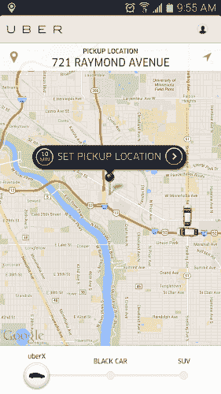
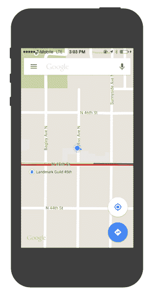
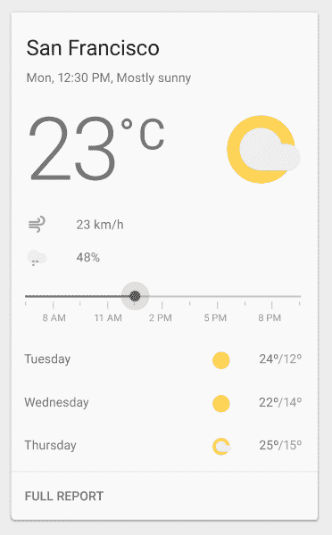
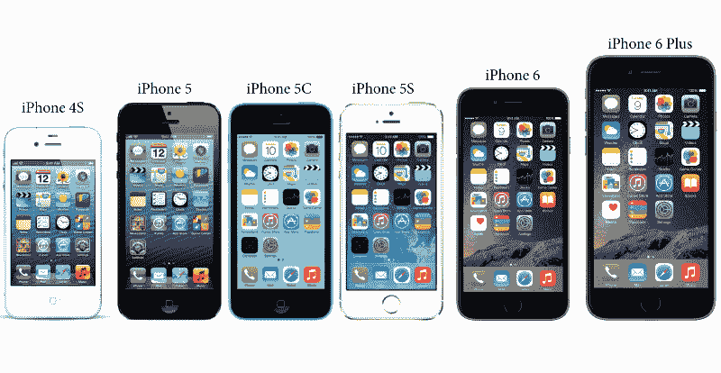
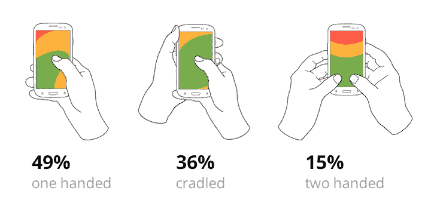
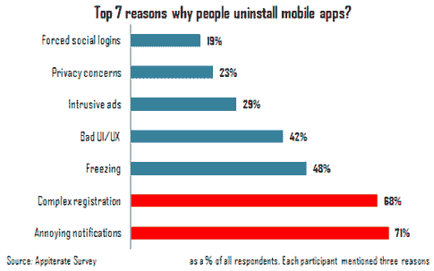

# 移动设计最佳实践

> 原文：<http://babich.biz/mobile-design-best-practices/?utm_source=wanqu.co&utm_campaign=Wanqu+Daily&utm_medium=website>

应用程序现在是交付内容和服务的主流、可信的方式。但在一个拥挤的市场中，一个移动应用程序如何变得有用、相关和有价值，从而吸引和留住用户？

这里有 7 个 UX 设计技巧，我认为是创造真正伟大的移动用户体验的关键。

# 1.一个屏幕，一个任务

*减少用户为得到想要的东西而付出的努力*

你为应用程序设计的每一个屏幕都应该支持*一个对用户真正有价值的动作*。为一件事设计每个屏幕，并且只为一件事设计，不超过一个行动号召。这使得它更容易学习，更容易使用，并且在必要时更容易添加或构建。

以优步为例。优步知道，使用这款应用的用户的目标是打车。应用程序不会给用户带来太多的信息:它会根据地理数据自动检测用户的位置，用户唯一要做的就是选择一个取货地点。

# 2.不可见的用户界面

*内容变成界面*

关注内容，删除不支持用户任务的不必要元素。由于注意力持续时间缩短，用户应该很快被引导到他们正在寻找的内容。*内容变成了界面。*谷歌地图是一个很好的例子——在重新设计阶段，谷歌移除了所有不必要的面板和按钮，谷歌称*地图是界面*。

# 3.休息时间

*使用空格来吸引对重要内容的注意*

空白或“负空间”，指的是设计或页面布局元素之间和周围的空白空间，经常被忽视和忽略。尽管许多设计师可能认为这是对宝贵的屏幕资源的浪费，但空白是移动设计中的一个基本元素。

> “留白应该被视为一种主动的元素，而不是被动的背景，”—简·奇霍尔德

空白不仅负责可读性和内容优先级，它在视觉布局中也起着重要的作用。因此，它可以简化用户界面，提高 UX。

Follow “less is more” principle in your designs. Image credit: Material Design

# 4.导航变得简单

*让导航不言自明*

帮助用户导航应该是每个应用程序的重中之重。移动导航必须是可发现的、可访问的，并且占用很少的屏幕空间。然而，由于小屏幕的限制以及内容优先于 chrome 的需要，在移动设备上实现导航是一个挑战。

[标签栏和导航栏](https://www.smashingmagazine.com/2016/11/the-golden-rules-of-mobile-navigation-design/)非常适合导航选项相对较少的应用。它们很棒，因为它们显示所有主要的导航选项，用户只需轻轻一点，就可以立即从一个页面转到另一个页面。
T3】

Tab bar navigation in Apple AppStore

# 5.单手操作

*让您的设计适应更大的屏幕*

随着 iPhone 6 和 6 Plus 的发布，很明显屏幕尺寸将继续扩大。

以下是人们握手机的三种基本方式:

Basic ways of how people are holding their phones. Research by Steven Hoober

[85% of observed users](http://www.uxmatters.com/mt/archives/2013/02/how-do-users-really-hold-mobile-devices.php) working with their phones using one hand. The following heat map shows sorts of the thumb zones applied to every iPhone display size since 2007\. *You can see that the bigger the display is, the less easily-accessible zone is.* 

Thumb zones. According to the observation by Scott Hurff

It’s necessary to adapt a design to improve the user experience. Try to make sure that your app can be easily (and fully) be used on a large screen (such as iPhone 6 or 7) with one hand. Place navigation options within the thumb’s reach. 

Pocket app for iOS. All the navigation controls are in the footer. They can be easily reached in case you hold your phone normally. Image credit: Dmitry Kovalenko

#6\. Make App Appear Fast *Don’t make users wait for content*

尽最大努力[让应用程序快速响应](https://babich.biz/how-to-make-users-think-your-app-loads-faster/)。在后台做一些事情，让它看起来动作很快。打包到后台操作中的动作有两个好处——它们对用户是不可见的，并且在用户实际请求它们之前发生。在 Instagram 上上传图片就是一个很好的例子。一旦用户选择了要分享的图片，它就开始上传。
T3】

Instagram invites the user to add tags as the picture uploads in the background. By the time when users’ll be ready to press a share button, upload will be completed and it’ll be possible to share their picture instantly.

#7\. Use Push Notifications Wisely *Think twice before sending a message*

每天，用户都被无用的通知轰炸，分散了他们的日常活动，这变得非常烦人。令人讨厌的通知是人们卸载移动应用的首要原因(71%的受访者)。

移动就是让每一条信息都有价值。不要“为了吸引他们”而发送通知。只有当你认为它们对用户有价值的时候，才发送它们。

**提示:**建立有效的移动应用消息策略的最佳方式是使用不同的消息类型——推送通知、电子邮件、应用内通知和新闻订阅消息。使你的信息多样化——你的信息应该完美和谐地协同工作，创造一个伟大的用户体验。
T3】

Select proper notification type based on urgency and content. Source: Appboy

# 结论

设计手机应用时，最重要的是要确保它既有用又直观。如果应用程序没有用，它对用户来说就没有实用价值，没有人有任何理由使用它。如果 app 很有用，但需要大量的时间和精力，人们就不会费心去学习如何使用它。好的用户界面和 UX 设计解决了这两个设计问题。

谢谢大家！

