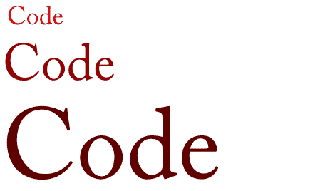

# 代码，代码，代码

> 原文：<https://www.pydanny.com/code-code-code.html?utm_source=wanqu.co&utm_campaign=Wanqu+Daily&utm_medium=website>

# 如何提高你的编码技能

这是我的路。这可能不是你的路。这条道路也没有任何特定的顺序，所有这些都适用于你开始踏上这条道路的那一刻。

1.  我编码了。很多。从愚蠢的小脚本到自动化任务，再到尝试成熟的项目。无论是工作还是娱乐。我失败了很多，但一路走来学到了很多。
2.  我没有从一种语言跳到另一种语言。相反，我在几个地方呆了几年，把我的学习集中在那些工具上。我 19 年以上的职业生涯可以总结为 FoxPro 然后 Java 然后 Python。在这些事情当中，我学会了 JavaScript。当然，我也尝试过一些东西(Lisp、Haskell、Lua、Perl、ColdFusion、Go)，但是通过专注于一小部分工具，我比平庸的人要好。
3.  我编码了很多。是的，这是对第一条的重复。
4.  一旦我掌握了一门语言的基础知识，我就会查找每门语言的最佳实践。然后我虔诚地遵守它们，甚至变得教条。一般来说，这意味着我的代码更容易阅读。更容易调试。最重要的是，更容易分享。
5.  我说过我写了很多代码吗？除非你练习，否则你永远做不好任何事。#1 的又一次重复。
6.  我克服了问问题的恐惧/骄傲。嗯，大多数情况下，我仍然时不时地感到害怕/骄傲。老实说，通过提问，你不是在展示你不知道什么，而是在展示你愿意学习。此外，弄清楚如何提问这个简单的行为可以让你有正确的心态来自己决定答案。
7.  我一问问题，不管有没有答案，我就再编码一些。代码，代码，代码！#1 的又一次重复
8.  一旦我掌握了一门语言，我就会寻找相关的食谱和/或袖珍参考资料。我更喜欢纸质版的科技书籍(我阅读的其他东西都是电子版的)。烹饪书中的食谱成了我工具箱的基础。袖珍参考手册中简洁、易于找到的提醒意味着认知负荷更小。
9.  我拿了那些食谱和参考资料并用它们编码。我一次又一次地编码。无论是工作时间还是娱乐时间。熟能生巧！为什么我一直重复#1？
10.  多年来，我一直使用最容易学习的稳定的 IDEs 文本编辑器。是的，我知道有非常强大的带有神秘命令的工具(Vim，EMACS 等)，但是我不想停下手头的工作去学习新的工具。我想编码，而不是修补桌面工具或晦涩难懂的文本编辑器。
11.  再次回到#1，我使用文本编辑器来编写代码。代码，代码，代码！直到我的手指和手受伤，直到我不得不学习如何处理腕管综合症。代码，代码，代码！这就像学习武术、吉他或任何东西一样，简单动作的重复为你提供了信心，要么将这些动作组合成更大的东西，要么学习更复杂的东西。

# 我希望我做了什么

*   学习计算机科学。如果我能从头再来一遍，那将是我学术研究的重点。它不会取代我清单上的任何东西，我定义的路径保持不变。代码，代码，代码！
*   不言而喻，我应该参加更多的辅导。没有什么比拥有一个在线或面对面的指导者更能给你一个启动，他会指引你走上正确的道路。然后你就可以编码，编码，编码！

熟能生巧，对吗？

[T2】](/code-code-code.html)