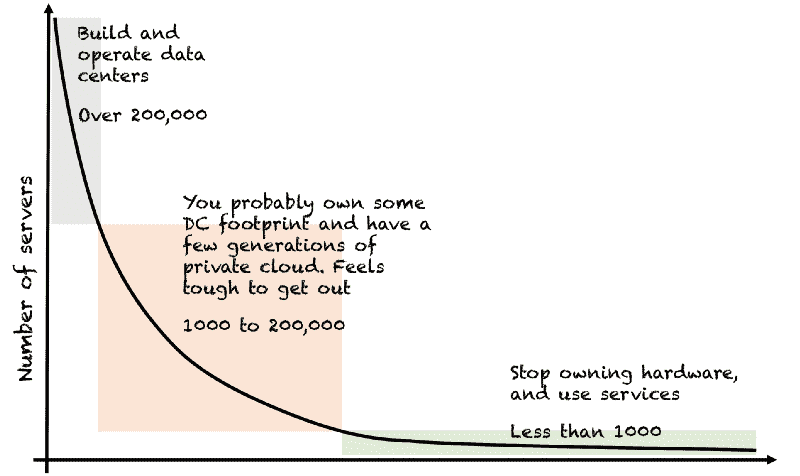
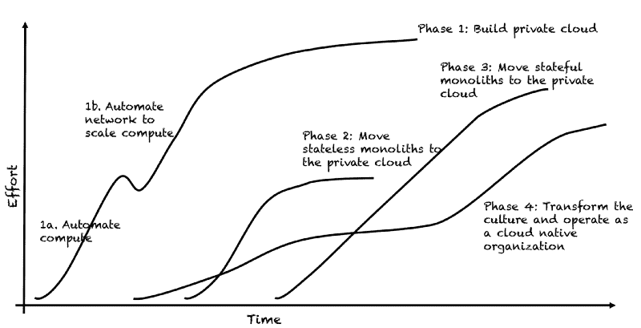

# 不要构建私有云——因为写作是澄清

> 原文：<https://m.subbu.org/dont-build-private-clouds-9a54b3d30c8b?utm_source=wanqu.co&utm_campaign=Wanqu+Daily&utm_medium=website>

我已经在这个职位上徘徊了一年多。在这段时间里，我和几个人讨论、辩论并解释了我下面写的部分内容。今年也换了工作。从 2012 年年中到今年年初，我领导的团队构建了一个规模最大、相当成功的中型私有云。我现在负责将几个大规模关键任务系统从内部企业数据中心迁移到公共云。这种转变给了我时间和机会来完善和扩展我的思维范围。所以，这是我的呼吁。 ***放慢您的私有云项目*** 、 ***和*** ***尽快离开企业数据中心。*** 您的私有云战略可能会追求局部最优，而不是业务的全局最大值。

## **你不需要拥有数据中心，除非你很特别**

目前，世界上很少有企业需要拥有、运营和自动化数据中心。除非您在多个地点拥有至少 200，000 台服务器，或者您从事特定的技术行业，如通信、网络、媒体交付、电力等，否则您不应该从事数据中心和私有云业务。如果低于这个阈值，您应该将大部分时间和精力花在离开数据中心上，而不是花在自动化和改善内部数据中心占用空间上。

虽然该行业对计算足迹的总体需求全面增长，但需要*构建和运营数据中心来托管该计算的企业数量一直在稳步减少。这一趋势背后有多种因素在起作用。*

*   在过去的几年里，云服务的规模、质量和广度成倍增长。如今，三大公共云无法应对的用例非常少。
*   您不再使用公共云，因为您需要按需配置虚拟机。你去公共云消费大量的服务。
*   物理计算、存储和网络基础架构非常脆弱，容易出现故障，并且不具有延展性。自动化这些基础设施原语并使它们准备好托管应用和数据是一项“即服务”工作。这些服务是大型分布式系统，需要人才、专注、反复试验以及多年的学习和运营经验。典型的企业 IT 部门并不是为解决这类问题而设立的。试图在您的数据中心内模拟同样的情况需要数年时间，并且很可能会将您的注意力从核心业务上转移开。以下是更多相关信息。
*   尽管基础架构供应商在其 brochureware 中声称，没有一家供应商能够为您提供满足或超过公共云所能提供的全部功能。
*   与十年前相比，如今需要专用硬件的雪花型工作负载更少了。在大多数情况下，你在设计服务器时得到的选择是虚幻的，很可能是向后看的。随着时间的推移，使用运行在商用计算上的商用软件构建块来解决问题变得越来越便宜，耗时也越来越少。
*   尽管有数亿美元的资本支出投资，但大多数私有云无法抵御常见的基础架构或软件故障。支持现代弹性模式的服务很少存在于私有云中。因此，弹性仍然是一个白日梦。

## 私有云让你拖延做正确的事情

当执行到完成时，典型的私有云之旅包括四个关键阶段:

*   第 1 阶段:构建私有云，从计算开始，然后是存储和网络，然后扩展到几个独立的容错域(如公共云区域)，实现网络自动化，以便实施负载平衡、DNS 和各种故障转移模式。
*   阶段 2:将您的无状态整体迁移到私有云。大多数企业至少有一代这样整体。
*   阶段 3:然后处理有状态的整体。这些是运行在手工制作的硬件上的大型整体数据库。这通常是私有云之旅碰壁的地方，因为将这种整体云本地化的风险和复杂性。
*   第 4 阶段:然后转变您的文化，以云原生组织的方式运营。

这是一个多年的旅程，每个阶段都涉及几个障碍，需要数年时间来执行。

您会从内部数据中心的第 1 阶段开始，还是直接进入公共云的第 2 阶段？

## 私有云成本模型具有误导性

一台现代规格的典型服务器价格在 5000 美元到 10000 美元之间，可以使用 4 年。具有类似规格的公共云虚拟机每月的成本在 1000 美元到 1500 美元之间。这种比较使得私有云战略引人注目。然而，还有额外的成本要添加。

1.  构建和运营云服务的工程成本
2.  网络自动化的成本(注意，没有网络供应商希望您使用开放 API 实现自动化)
3.  因漫长的规划、采购和入职周期而丧失敏捷性的成本
4.  因构建私有云花费的时间而失去业务机会的成本

## 不要低估内部数据中心对您组织文化的影响

基础设施的状态会影响您的组织文化。运行在可编程云上的现代企业有助于自主团队、快速学习和更快的想法迭代。另一方面，脆弱、耗时、人为操作驱动、基于票证的内部基础架构孕育了一种不信任、集中化、依赖和控制的文化。

比方说，一个团队想要从负载平衡器到他们的应用服务器全程支持 TLS。这样的团队可能需要与网络团队、安全团队以及潜在的几个中层管理人员打交道，以便在几周甚至几个月的时间内执行变更。同一个团队可以在不到一周的时间内在公共云上执行这一变更，然后继续下一步。这样的例子不胜枚举。

内部数据中心和公共云之间的这些差异会影响团队思考、规划和执行的方式。这些不过是文化的属性。