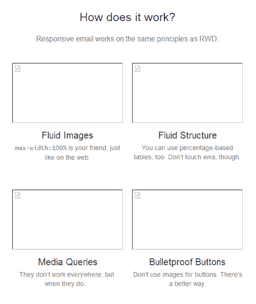
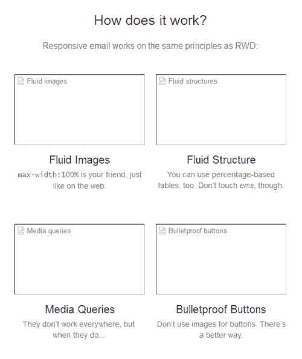
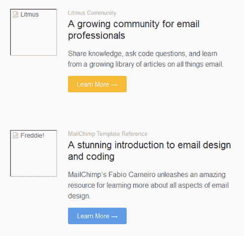

# 邮件能有反应吗？–一份清单之外

> 原文：<http://alistapart.com/article/can-email-be-responsive?utm_source=wanqu.co&utm_campaign=Wanqu+Daily&utm_medium=website>

不管你喜不喜欢，不可否认 HTML 电子邮件的流行。而且，就像之前的网络一样，收件箱已经正式移动化——超过 50%的电子邮件是在移动设备上打开的。

下文继续

尽管如此，电子邮件设计仍然是一种极其过时的做法。还记得 web 标准成为…标准之前的编码吗？欢迎来到电子邮件设计的地狱。

但是写邮件并不需要成为挫折的一课。而电子邮件设计者仍然不得不使用表格来构建布局，并用 HTML 属性和样式来设计它们——哇！—内联风格，许多勇敢的设计师正在采用为网络开创的现代技术，并将它们应用到电子邮件设计的古老实践中。

基于 Ethan Marcotte 最先编纂的响应式网页设计原则，一场电子邮件设计的革命正在催生一种快速接近现代网络的体验。用户不再需要忍受可怕的阅读体验、令人沮丧的触摸目标和微小的文本。

## HTML 电子邮件的值 [#section2](#section2)

不管你喜不喜欢 HTML 格式的电子邮件，它对几乎每个企业来说都是一个重要的工具。说到营销，电子邮件一直比脸书和推特等其他渠道表现更好。更重要的是，电子邮件可以让你以越来越个人化的方式与[潜在的庞大受众](http://blog.getvero.com/email-marketing-statistics/)互动。

你可能不会积极参与电子邮件营销，但作为一名网页设计师或开发人员，你可能会定期使用电子邮件与用户交流。它可以是发送收据，更新用户的新产品特性，或者让他们知道你最新的博客文章。不管是什么原因，电子邮件是一个重要的但经常被忽视的媒介。

许多开发人员选择向客户发送纯文本电子邮件。虽然纯文本有很多好处(易于创建、随处呈现、下载速度快等)。)，HTML 电子邮件有许多优点:

*   **超链接**。你可以从一封 HTML 邮件中链接到登陆页面，增加流量和参与度。
*   **设计**。一封精心设计的 HTML 邮件可以让你强化你的品牌，甚至在收件箱里。
*   **层级**。你可以在 HTML 电子邮件中建立层次结构，更容易引起对重要内容或重要链接的注意。
*   **追踪**。HTML 电子邮件可让您跟踪开放和参与情况，这些宝贵的数据可用于优化您的营销工作。

由于没有给予电子邮件像你的像素完美的应用程序那样多的关注，你实际上失去了 1)一个有价值的品牌推广机会，2)在你的电子邮件中跟踪打开和交互的能力，以及 3)在你的应用程序之外提供惊人的用户体验的机会。

传统上，设计和开发 HTML 电子邮件是所有网页设计师最糟糕的经历之一。这就像进入了时间机器，步入了地狱般的 90 年代世界，那里有基于表格的布局、内联样式、非语义标记和特定于客户端的黑客。

以下只是 HTML 电子邮件令人烦恼的一小部分原因:

*   **没有标准**。当然，我们使用 HTML 和 CSS。但不像在网上。电子邮件客户端之间不存在真正的标准，导致一些疯狂的代码。
*   **电子邮件客户端**。电子邮件客户端，如 Outlook 和 Gmail，都以不同的方式呈现 HTML 和 CSS，这种情况经常令人发指。这导致…
*   **大量黑客**。即使是精心设计的电子邮件活动也需要依靠针对客户的技巧来实现。
*   **没有 JavaScript** 。网络上最受欢迎的语言在电子邮件中没有一席之地，因为电子邮件客户端出于安全考虑(理所当然地)删除了它。再见互动。
*   **内嵌样式**。我喜欢把结构和表现分开。不幸的是，大多数电子邮件客户端强迫你依赖内联样式和属性来处理邮件中的几乎所有内容。

虽然事情可能不会很快改变，但在电子邮件设计社区有一个运动(是的，有一个*存在*)来减轻通常与开发电子邮件活动相关的痛苦。许多公司和个人正在改进电子邮件设计的工具和方法，并比以往更多地分享他们的知识。

我工作的公司 [Litmus](http://litmus.com) 就是其中之一。我们建立工具，使测试和跟踪电子邮件活动尽可能无痛。我们全力传播关于电子邮件营销的信息，特别是电子邮件设计。我们甚至建立了一个专门的[社区](http://litmus.com/email-community)来联系电子邮件营销人员，让他们分享知识，改进技术，向我们和彼此学习。

虽然我在这篇文章中引用了 Litmus 的一些工具和资源，但是还有许多其他公司和个人在努力提高电子邮件设计的艺术。特别是，MailChimp 和 T2 的竞选监督员都有优秀的博客和指南。像[安娜·伊曼](https://twitter.com/stylecampaign)、[妮可·梅林](https://twitter.com/moonstrips)、[法比奥·卡内罗](https://twitter.com/flcarneiro)、[埃利奥特·罗斯](https://twitter.com/iamelliot)和[布莱恩·格雷夫斯](https://twitter.com/briangraves)这样的人都在努力让电子邮件设计成为一门真正的手艺。

就像网络的其他部分一样，收件箱正在变得可移动。2013 年，[51%的用户在移动设备上打开电子邮件](https://litmus.com/blog/email-client-market-share-where-people-opened-in-2013)。这个数字很可能会增加，特别是考虑到越来越多的 T2 人出于习惯和需要，依靠他们的移动设备访问互联网。

好消息是，网页设计师可以调整他们现有的技能，并将其应用到电子邮件活动中，在一个对大多数用户至关重要的频道上创建一个美丽的用户体验，但被许多设计师忽略了。

## HTML 电子邮件的工作原理 [#section5](#section5)

一般来说，HTML 电子邮件就像设计网页一样——假设网页设计没有任何知识 post- [<cite>用网页标准</cite>](http://en.wikipedia.org/wiki/Designing_with_Web_Standards) 设计。HTML 电子邮件依赖于三样东西:表格、HTML 属性和内联 CSS。当你学习构建 HTML 电子邮件时，请记住，由于电子邮件客户端渲染引擎的原因，我们使用的是非常有限的 HTML 和 CSS 子集。Campaign Monitor 维护了一个[的优秀图表](http://www.campaignmonitor.com/css/)，显示了主要电子邮件客户端支持的 CSS。

让我们先简单回顾一下 HTML 电子邮件的基础知识，然后看看如何让电子邮件具有响应性。例如，我在 Litmus 修改了我们自己的时事通讯使用的模板。感谢 Litmus 和我们出色的设计师，[凯文·曼德维尔](http://dribbble.com/KEVINgotbounce)，<cite>一个单独列表</cite>读者可以学习和建立我们在大多数活动中使用的相同代码——它现在托管在 [<cite>一个单独列表</cite> Github 帐户](https://github.com/alistapart/salted)上。要了解它在不同客户端上的表现，您可以查看所有的[石蕊测试](https://litmus.com/pub/d5586ad/screenshots)。

大多数网页设计师使用类似于`div`、`header`、`section`、`article`、`nav`和`footer`的标签来构建网页的结构。不幸的是，电子邮件设计师没有使用语义元素的奢侈。相反，你必须使用 HTML 表格来设计你的电子邮件活动。这些表将嵌套…很深。

表格的基本样式将在很大程度上使用大多数人已经很久没有使用过的属性:`width`、`height`、`bgcolor`、`align`、`cellpadding`、`cellspacing`和`border`。再加上像`padding`、`width`和`max-width`这样的内嵌样式，设计者可以构建健壮的电子邮件布局。

下面是一个电子邮件中编码良好的表格的示例:

```
<table border="0" cellpadding="0" cellspacing="0" width="100%">
	<tr>
		<td bgcolor="#333333">
			
				<table border="0" cellpadding="0" cellspacing="0" width="500" class="wrapper">
					<tr>
						<td>…Content…</td>
					</tr>
				</table>
			
		</td>
	</tr>
</table>
```

您可以看到我们如何嵌套表格，并使用`border`、`cellpadding`和`cellspacing`属性来确保设计中没有不必要的间隙。一个`bgcolor`应用于表格单元级别，这是一个比`background`或`background-color`更可靠的方法(尽管`background-color`也有它的位置)。

值得注意的一件有趣的事情是,`div`用于将嵌套表格居中，并在内容周围提供填充。虽然表格应该构成结构的主体，但是偶尔的实用程序`div`对于对齐内容块、提供填充和设置一些基本样式是有用的。然而，它们不应该被用作电子邮件的主要结构，因为大多数电子邮件客户端至少在盒子模型的某些方面有问题，这使得它对于布局电子邮件来说不可靠。

在电子邮件中使用图像与在网络上使用图像非常相似，但有一点需要注意:许多电子邮件客户端默认禁用图像，让用户看到一片混乱。



An email with images disabled


虽然没有办法自动启用这些图像，但我们可以通过使用 alt-text 为丢失的图像提供一些上下文来改善这种情况。更重要的是，我们可以在`img`元素上使用内联样式来设计替代文本，并保持一些外观设计。

```

```

使用上面的代码，我们丢失的图像现在更有意义了:



Alt-text goes a long way


HTML 电子邮件的主要优势之一是能够包含可点击的超链接。除了在文本中包含链接，HTML 电子邮件还允许你使用大而漂亮的按钮来吸引订阅者。

许多电子邮件营销人员使用链接图像作为按钮。然而，使用[防弹按钮](http://buttons.cm)，设计者可以通过代码来制作按钮，即使图像被禁用，也能可靠地呈现在客户端上。

下表是一个全 HTML 防弹按钮的示例，它使用边框来确保整个按钮都是可点击的，而不仅仅是文本:

```
<table border="0" cellspacing="0" cellpadding="0" class="responsive-table">
	<tr>
		<td align="center"><a href="//alistapart.com" target="_blank" style="font-size: 16px; font-family: Helvetica, Arial, sans-serif; font-weight: normal; color: #666666; text-decoration: none; background-color: #5D9CEC; border-top: 15px solid #5D9CEC; border-bottom: 15px solid #5D9CEC; border-left: 25px solid #5D9CEC; border-right: 25px solid #5D9CEC; border-radius: 3px; -webkit-border-radius: 3px; -moz-border-radius: 3px; display: inline-block;" class="mobile-button">Learn More →</a></td>
	</tr>
</table>
```



Bulletproof buttons look great with images disabled


一旦你有了这些基础知识，是时候看看我们如何让电子邮件在各种尺寸的设备上都能很好地工作了。

## 回复邮件的工作方式[#第 9 节](#section9)

就像响应式网站一样，一封响应式电子邮件有三个主要组成部分:**灵活的图片**、**灵活的布局**和**媒体查询**。

网络和电子邮件的唯一区别在于这三种技术是如何实现的。

在电子邮件设计中，我们拥有有限的 HTML 和 CSS 子集。我们不能依赖于设计者在 web 上为响应式站点使用的属性和值；边距、浮动和 ems 在许多电子邮件客户端都不起作用。所以我们必须想出变通办法。

流动的图像并不复杂。尽管它们使用设置为 100%的`width`属性，但是一些客户端很难按照预期的大小呈现图像，除非使用相应的 HTML 属性定义宽度和高度。因此，我们必须将它们构建到特定的维度，然后再将其拆除。

第一步是确保图像被鲁棒地编码。让我们看看之前的电子邮件屏幕图像。

```

```

注意到包含的`display`属性了吗？这只是对付淘气的电子邮件客户端所需的众多技巧中的一个例子，就像`border`属性一样。大多数网络邮件客户端在图片周围增加空间，试图解决可能出现的行高问题。使图像块级将杀死间距，保存你的设计。

现在，当我们想让我们的图像流畅时，我们可以在电子邮件标题的媒体查询中这样做:

```
img[class="img-max”] {
	width:100% !important; 
	height: auto !important;
}
```

不是每个图像都需要是流动的。无论设备大小如何，像徽标和社交图标这样的元素通常保持相同的大小，这就是为什么我们使用类来定位灵活的图像。

因为我们将总是覆盖内联样式和 HTML 属性，所以使用`important`声明来确保在呈现文档时我们的响应样式优先。

让我们开始做一些更难的事情。

大多数网页设计师都熟悉使用[语义元素](//alistapart.com/article/semanticsinhtml5)和[相对单位](//alistapart.com/article/fluidgrids)来构建响应式设计，比如百分比、ems 和 rems。虽然我们仍然可以在电子邮件中使用百分比进行灵活的布局，但它们将在表格中内联使用，并受到一些限制。

几乎所有的表格都会使用百分比来表示宽度。一个例外是一个具有特定像素尺寸的容器表，用于限制电子邮件设计的整体宽度，以防止它在不能很好地处理百分比的客户端(通常是大多数版本的 Microsoft Outlook)中爆炸。

让我们从容器表开始:

```
<table border="0" cellpadding="0" cellspacing="0" width="500" class="wrapper">
	<tr>
		<td>…Content…</td>
	</tr>
</table>
```

您将看到我们使用`width`属性强制表格为 500 像素宽。

该容器将保存电子邮件中所有其他嵌套的表格。因为它会将所有内容限制在 500 像素的宽度内，所以我们可以安全地使用百分比来调整其他表格的大小。

但是如果电子邮件总是 500 像素宽，那么灵活的表格有什么用呢？再看一下那个容器表。注意，我包含了一个`wrapper`类。我们将使用该选择器来使我们的电子邮件真正具有响应性，使用(还有什么？)媒体查询。

### 电子邮件中的媒体查询 [#section12](#section12)

电子邮件中的媒体查询就像网页设计一样。通过将它们包含在电子邮件的标题中，您可以针对特定的设备属性，相应地调整您的风格。

为了简单起见，我们将使用 525 像素及以下的`max-width`作为目标视口。然后，针对该包装器表，我们可以覆盖那些 HTML 属性和内联样式，以强制该表成为移动设备上的整个屏幕宽度。

```
@media screen and (max-width:525px) {
	table[class=“wrapper”] {
		width:100% !important;
	}
}
```

我们还可以针对任何嵌套的表格执行同样的操作—有效地堆叠内容部分以改善移动体验。在手机上增加文本和按钮的大小也不是一个坏主意。

```
@media screen and (max-width:525px) {
	body, table, td, a {
		font-size:16px !important;
	}	
	table[id=“responsive-table”] {
		width:100% !important;
	}
}
```

使用媒体查询的主要缺点是并不是所有地方都支持它们。虽然基于 WebKit 的电子邮件客户端，如 iOS Mail 和默认的 Android 电子邮件应用程序运行良好，但旧的黑莓设备、Windows Phone 8 和每个平台上的 Gmail 应用程序都无视媒体的查询。

幸运的是，iOS 和 Android [构成了移动电子邮件受众的大多数](http://emailclientmarketshare.com),因此你可以相信大多数订阅者会如期看到你的回复邮件。

上述技术仅仅是开始。无畏的电子邮件设计师正在探索在电子邮件中使用 web 字体、SVG 和 CSS3 动画。当然，电子邮件的设计很难，而且经常会出问题，但这不应该阻止你探索先进的技术，看看什么对你和你的观众有用。

我的一个建议是，对你创建的任何电子邮件进行彻底的测试。邮件客户端在渲染和对 HTML、CSS 的支持上，远不如浏览器。在设备上测试和使用电子邮件预览服务——无论是 [Litmus](http://litmus.com) 、 [Email on Acid](http://emailonacid.com) 、你自己的[设备实验室](http://stylecampaign.com/blog/2012/09/mobile-email-testing-rig/)还是其他完全不同的服务——都有助于发现问题，让你在发送给一百万用户之前解决问题。

除了测试你的代码和渲染，跟踪你所有的电子邮件，测试什么样的内容会引起你的听众的共鸣。

最重要的是，不要忽视电子邮件设计。这是一种必要的邪恶，但它一直在变得更好。一个围绕电子邮件设计的[社区终于形成了](https://litmus.com/community)，技术也在不断改进和完善。响应式电子邮件设计就是其中之一。如果你真的关心你的产品和在网络上的存在，你会把你的激情和工艺应用到你的应用程序的界面，并把它转移到最广泛和最有价值的媒体之一。