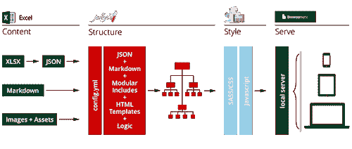
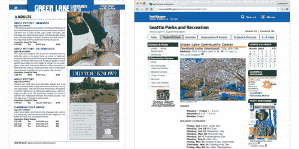
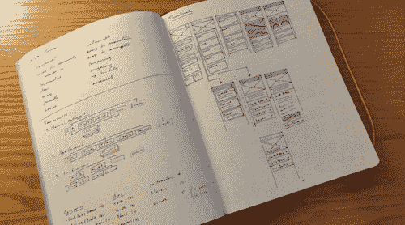
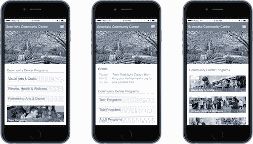

# 内容第一原型——粉碎杂志

> 原文：<https://www.smashingmagazine.com/2016/05/content-first-prototyping/?utm_source=wanqu.co&utm_campaign=Wanqu+Daily&utm_medium=website>

内容是数字经济的核心商品。它是我们打造奢华体验的黄金，是我们包装在忠诚度计划和追加销售中的钻石。然而，作为设计师，我们经常在事后插入它。我们把我们的交互和视觉设计原型化到筋疲力尽，但是接受“真实的文字”可以在以后被加入。有更好的方法。我们创造的数字商品越来越多地在一个包含内容、功能、代码和意图的动态系统中运作。我们的产品和服务漂移和溢出到合作伙伴网站，社交媒体和无数的电子聚合器，都试图塑造游客的行为和理解。**系统建立在系统**的基础上，并且，在很短的时间内，我们拼凑了一个庞然大物，其广度令人震惊。

内容是数字经济的核心商品。它是我们打造奢华体验的黄金，是我们包装在忠诚度计划和追加销售中的钻石。然而，作为设计师，我们经常在事后插入它。我们把我们的交互和视觉设计原型化到筋疲力尽，但是接受“真实的文字”可以在以后被加入。有更好的方法。

我们创造的数字商品越来越多地在一个包含内容、功能、代码和意图的动态系统中运作。我们的产品和服务漂移和溢出到合作伙伴网站，社交媒体和无数的电子聚合器，都试图塑造游客的行为和理解。系统建立在系统的基础上，并且，在很短的时间内，我们拼凑了一个庞然大物，其广度令人震惊。

## smashing mag 上的进一步阅读:

尽管我们在过去已经很好地理解了简单的系统(想想静态网站和内部网)，但事实证明大型动态系统要复杂得多——而且不太容易预测。随着系统的增长，它们变得更加复杂，随着复杂性的增加，它们的行为变得越来越非线性，我们这些可怜的猴子很难预测。在大型系统中，小数点后一千位的舍入误差会彻底改变结果。随着互联网接近一万亿个节点，这就是我们现在设计的世界。

More after jump! Continue reading below ↓

然而，那些我们习惯于使用的简单系统可以为设计更复杂的空间提供一把钥匙。正如系统理论家[约翰·高尔所说](https://en.wikipedia.org/wiki/John_Gall_(author)#Gall.27s_law)，“一个有效的复杂系统总是被发现是从一个有效的简单系统进化而来的。”在数字设计领域，如果我们确保我们最简单的内容、结构和意义构建的动态系统在基础层面上按预期工作，那么我们就可以为更大、更复杂的系统奠定基础，这些系统也能按预期工作。

作为设计师，我们保持复杂性的一个方法是在一开始就将我们的内容引入原型制作过程。内容优先的方法鼓励我们更早地面对内容的限制和机会，并在做出主要设计决策之前，与渴望真实内容的用户一起对我们提出的解决方案进行功能测试。

在本文中，我将向您展示**如何使用一套简单的开源工具**从第一天起就将真实、动态的内容引入您的原型制作过程。这种方法允许你从项目一开始就关注用户如何理解你的内容，然后在理解的基础上构建结构、视觉和技术元素。

## 内容的白盒模型

系统研究人员用来理解动态系统行为的工具之一叫做“白盒”模型。系统学者 Gerald Weinberg 写道，黑盒模型的行为是“完全隐藏的”，而白盒模型的行为是“完全暴露的”。对于复杂的系统，这种透明性是很重要的:温伯格进一步指出，“即使是最简单的系统有时也会给它们的构建者带来惊喜”(172)。

内容优先原型的目标是为我们的内容、其内部结构及其支持信息架构创建一个白盒模型。这将使我们能够在设计过程的早期发现我们的最终用户如何从我们的数字系统提供的结构化内容中构建意义。通过花时间来纠正我们内容系统的核心结构，我们为这些简单的系统集成到更大、更复杂的系统中做好了准备。

为了创建数字内容的白盒，我们需要考虑三件事:

*   **内容本身**，由不同粒度级别的[内容包](https://karenmcgrane.com/2012/09/04/adapting-ourselves-to-adaptive-content-video-slides-and-transcript-oh-my/)组成，取决于内容的类型和目的；
*   **结构**，在本地页面或屏幕级别以及在全球网站或应用程序级别；
*   **用户参与**我们的内容最终将被消费的环境和状态(台式机、平板电脑或手机)。

为了保持“完全可见”，这个模型还需要在功能上是透明的，这样设计团队的成员就可以理解为什么模型会有这样的行为。这最后一项——透明度，结合用户参与——对于白盒模型至关重要:我们构建原型不仅仅是为了展示功能，而是为了根据我们使用的词语和结构如何被目标受众理解来学习、修改和完善我们的底层内容结构。

当你为现有内容进行设计时，内容优先的原型方法是有用的，但这也是在内容创建过程中让编辑团队参与进来的好方法。在项目早期将真实的文字、图像和资产呈现在用户面前，让每个人都有时间进行微调、调整或调整，以实现项目的目标。如果您的项目计划遵循“以后再补”的策略，内容优先的原型设计让您有机会在用户面前获得一些内容变化，然后在利益相关者面前获得用户的反应。

## 内容优先的原型框架

根据上面描述的原则和目标，我已经为创建这种原型构建了一个入门框架。在很大程度上本着系统思维本身的精神，这个工具依赖于更简单系统的松散耦合，每个系统都很好地执行简单的主要任务。

对于这个框架，我组装了 Excel、Jekyll、ZURB Foundation 和 Browsersync，并用一个 Gulp 脚本将它们链接在一起。我选择这些特定的应用程序和框架是因为它们随处可得，是开源的(大多数情况下)，有活跃的支持社区和优秀的文档。

A content-first prototyping framework ([View large version](https://cloud.netlifyusercontent.com/assets/344dbf88-fdf9-42bb-adb4-46f01eedd629/e1c81fd1-4a2f-448f-b704-8e9d53ee0ea9/01-cfp-schema-opt.png))

您可以从 GitHub 的项目页面下载下面讨论的示例项目的副本和内容优先原型框架[初学者工具包](https://github.com/andybywire/content-first-prototyping)。让我们回顾一下这些部分是如何组合在一起的，以及它们各自的作用。

### 擅长

Excel(或任何保存为 XLSX 格式的电子表格程序)用于创建和编辑结构化内容和分类系统。每次保存文档时，内容集中的每个包(由电子表格中的一行表示)都会导出为 Jekyll 页面和 JSON 文档。这使您可以对您的内容执行页面和全局操作，并通过一个“保存”命令将内容的更改传播到整个网站。

### 吉基尔博士

Jekyll 是一个开源的静态网站生成器，用于阐明内容包、页面和类别之间的动态结构。Jekyll 将您保存在电子表格中的内容表示为变量，并允许您对这些变量执行操作以创建结构。Jekyll 还提供了用于应用条件逻辑的“if/then”标签和用于循环和过滤内容集的`for`循环。

### 基础

ZURB Foundation 是一个开源的移动优先前端框架，用于阐明信息层次结构和构建响应行为。Foundation 的网格、样式定义和响应行为允许您通过简单地将类应用于 HTML 元素来创建几乎任何标准的 web 布局模式。

### 浏览器同步

最后，Browsersync 将您的原型提供给浏览器，并在您做出更改时更新 CSS 和页面。Browsersync 还允许您从连接到同一网络的任何设备访问原型。这意味着，当你在笔记本电脑上进行编辑时，你可以在手机和平板电脑上看到自动更新。

将这些工具连接在一起，您可以在一个类似于动态系统的环境中构建原型，这些动态系统将构成您的最终生产环境，但在您需要快速行动以尝试想法时，您不必遭受数据库、云服务和网络延迟的影响。

### 如果你因为这涉及到代码而感到恐慌…

不要惊慌。这些工具是设计者友好的，并且有很好的支持社区。你不需要成为一个前端开发人员来实现你的想法。你确实需要了解 HTML 和 CSS 的基础知识。这些语言并不难——学习它们不会破坏你做好设计工作的能力。用字体设计传奇 Erik Spiekermann 的话来说，“即使不编码，你也必须学会欣赏代码，理解代码。因为代码是一百年前的螺母和螺栓。”最好的开始方式是一头扎进去。

为了更好地理解内容优先原型的实际效果，让我们从现实世界中收集一些数字内容。

情况是这样的。绿湖社区中心为绿湖附近的社区成员提供课程、项目和活动。不幸的是，它目前所有的课程、项目和活动信息都只能通过 PDF 在网上获得，而 PDF 只能从该中心的固定宽度桌面优化网站上获得。请看:

Green Lake Community Center’s course listings ([View large version](https://cloud.netlifyusercontent.com/assets/344dbf88-fdf9-42bb-adb4-46f01eedd629/da34904a-3f88-489b-8de4-2e2382059a27/02-gcc-current-opt.png))

为了接触越来越多试图通过手机访问课程、项目和活动信息的社区成员，该中心决定推出一个移动优先项目网站。这一举措最终将成为一种催化剂，推动建立一个全市范围的公园和娱乐响应网站。

像任何其他设计项目一样，我将从启发式和竞争性分析开始，并查看可用的流量和用户数据。如果利益相关者和最终用户有空，我也一定会和他们谈谈。一旦我觉得对网站的目的有了很好的理解，我会在纸上探索一些基本的高级信息架构和用户界面的想法。

Sketchbook explorations ([View large version](https://cloud.netlifyusercontent.com/assets/344dbf88-fdf9-42bb-adb4-46f01eedd629/08cb2cc8-edc7-42fc-9867-571799cf9804/03-sketchbook-opt.png))

随着最初的设计方法开始成形，我可以使用内容优先的原型工作流来将我最初的想法——更重要的是，这些想法要服务的内容——放到最终消费它们的上下文中——在这种情况下，就是浏览器。让我们详细回顾一下这个过程。

### 捕获内容

在这个例子中，您可以看到我在内容优先原型框架电子表格中捕获的结构化内容是如何在每次保存我的`_data`文件时自动写入页面模板的。在这里，我使用了“目录”表来组织内容。“标题”、“描述”、“类别”和“标签”变量已经包含在页面模板中，因此这些值会立即更新。您可以向内容行中添加任意多的其他列，只要确保在模板中包含相应的变量即可(下面将详细介绍)。

“目录”和“提要”表也包含在初学者工具包中，它们包含各自内容类型的不同类别(列)。每个工作表将内容导出到自己的文件夹(在这些情况下是“目录”、“目录”和“提要”)和自己的 JSON 文件中。您可以根据需要添加任意多的其他工作表——只要确保更新您的 Jekyll 配置文件，以便它知道将它们拉入(有关完整的详细信息，请参见" [Jekyll 数据页面生成器](https://github.com/avillafiorita/jekyll-datapage_gen)"插件文档)。

### 添加更多内容包

当我添加内容包(电子表格中的行)时，新页面会自动添加到原型中。每一行代表一个页面，该行中的每一列代表一个变量，Jekyll 在构建页面时在模板中填充该变量。在这个例子中，来自“社区中心”目录的内容是相当统一的，但是如果项目描述在长度上变化很大，您可以很容易地看到(并体验到)这种变化将如何影响页面的布局。也许你会决定以不同的方式将内容分成不同的块，或者添加新的元素，比如摘要或 slugs。

这个系统还可以让你很容易地试验标签，类别和标记。通过更改“category”列中的值，您可以测试不同的架构方法如何影响用户轻松找到给定内容的能力。例如，在这个例子中，我根据班级类型和参与者的年龄组创建了组织系统。这允许我在原型成型时，在菜单和主页上轻松测试不同的导航方法。

### 用 HTML 添加结构和层次

一旦我对适当的内容感到满意，我将开始用标记包装这些内容，以便其结构对用户有意义。将这里的变量视为文本，并像在“平面”HTML 文件中标记文本一样标记它们。这里的结果应该看起来很容易预测(这是一件好事)。

Jekyll 的模板系统将获取您创建的页面模板，并用包含标题和导航图标的全局模板包装它们。这就是“layout: default”的意思:我们将“default”模板称为这个模板的包装器。尽管通常不需要一层或两层以上的模板，但是您可以根据需要嵌套多深的模板。为了适应重复的元素，例如页面列表和全局链接，您还可以使用“includes”，它会在呈现网站时在模板中插入一段特定的代码。查看 [Jekyll 的官方文档](https://jekyllrb.com/docs/home/)了解更多关于模板和包含的内容。

Jekyll 允许您通过包含特定于其模板系统的基本标记来添加基本逻辑。这里，我使用了一个`for`标签来遍历绿湖社区中心的类列表(这是我在上面添加多个内容包时创建的)，并将列表中的每个社区中心类呈现为一个链接:

你也可以使用`if`语句来创建条件。这里，我使用了一个`if`语句来隐藏我当前所在的类页面的链接:

如果你的头爆炸了，请不要惊慌。添加逻辑是一种高级功能。如果你坚持使用内容变量和 HTML，你的原型会工作得很好。然而，Jekyll 的模板系统可读性很强，也很容易上手。查看创作者关于基本作品如何工作的[快速介绍](https://www.youtube.com/watch?v=tZLTExLukSg)。

### 使用 Foundation 的 CSS 添加风格和响应行为

一旦 HTML 结构的初稿完成，我就可以简单地通过包含 CSS 类并保存文档来为原型添加样式。ZURB Foundation 的前端框架已经在初学者工具包中链接起来，它为广泛的 web 和本地应用程序模式提供了样式类。在这里显示的例子中，简单地通过加入两个不同的类，我给了我的移动原型一个更“易点击”的感觉，并引入了一个更清晰的视觉层次感。这些更改会自动传播到使用该模板的所有内容。

Foundation 还使包含移动优先响应行为和使用几十个预构建的布局、容器和媒体组件变得容易。因为都是 CSS，所以可以根据自己的口味对一切进行修改和微调。对于这些例子，我已经将 Foundation 的基本调色板修改为“单色线框”样式，但是您可以将 Foundation 修改为任何您喜欢的样式。通过浏览 Foundation 的[文档](https://foundation.zurb.com/sites/docs/)或[教程](https://foundation.zurb.com/learn/tutorials.html)或[上课](https://foundation.zurb.com/learn/classes.html)来了解更多关于使用 Foundation 的知识(顺便说一下，这些课非常棒)。

### 尽早获得反馈，并随时修改

一旦内容就位，创建和测试结构的多个变体就很容易了。标签、类别、关键字和其他元数据可以在内容电子表格中直接更改。同样，页面结构、流程和显示的变化只是创建 Jekyll 模板的替代版本的问题。当你点击“保存”的时候，所有这些改变将会在原型中立即级联

Alternate versions of the Green Lake Community Center’s mobile home screen ([View large version](https://cloud.netlifyusercontent.com/assets/344dbf88-fdf9-42bb-adb4-46f01eedd629/d60c858d-8f6e-4d30-95ac-c1160d10d513/04-gcc-homepages-opt.png))

为了完成绿湖社区中心原型的第一个版本，我创建了三个不同版本的移动主页。在这种情况下，我需要做的只是重新排列主页模板中的元素，并交换两个导航元素(即全角按钮和图像块)的数据源。

虽然我已经按顺序介绍了所有这些步骤，但是请记住，Gulp(将我们所有简单系统链接在一起的 JavaScript 任务运行器)会在每次保存文档时进行更新。这意味着您可以在任何时候返回到任何步骤，并根据用户反应、利益相关者反馈或关于内容或上下文的新发现进行调整。

这种灵活性使您可以轻松地测试不同的屏幕层次和用户的内容处理方式，并允许您在这些测试中使用真实的内容，即您的观众可以直接体验(并做出反应)的内容。因为原型的最终形式是 HTML、CSS 和 JavaScript，你可以用你最熟悉的任何测试工具收集用户反馈(我喜欢[用户测试](https://www.usertesting.com/)和[回看](https://lookback.io/))。

HTML、CSS 和 JavaScript 的原型格式也意味着您的工作将更容易为并行和后续工作提供信息。例如，如果您的最终产品将建立在现有的 CMS 平台上，那么您能够清楚表达的内容、结构和显示要求将有助于您评估 CMS 选项。同样，你的原型可以作为设计决策的规范文档，包括网格、层次结构、标题、链接行为和字体。

但是，不要忘记，内容优先原型的目标不仅仅是在浏览器中设计:目标是使用浏览器和用户的反馈来微调内容的组织，以便构建工作良好的简单结构。

这种方法的优势在于允许您快速修改您的类别、标签和导航路径创建的系统。与静态内容建模相比，这提供了一个明显的优势。如果你发现为了让你的动态内容按照你想要的方式工作，你使用了很多额外的 CSS，回到源头。你能以不同的方式将内容分块以使其更好地工作吗？添加(或删除)一组类或标签？尝试不同的变化，直到你找到简单、优雅的解决方案，让其他一切都井井有条。

## 超越网络的系统思维

这里展示的基本例子说明了内容优先的原型方法如何帮助我们创建简单的内容系统——反过来，这些系统为更大、更复杂的系统奠定了基础。内容优先的原型设计帮助我们发现内容模型、层次结构、类别和标签的微小调整可以为我们用户的信息需求带来更干净、更优雅的解决方案。

虽然这个工具是建立在网络技术上的，但是我们为理解而构建内容的方式超越了单独的工具、技术和平台。如果你的内容以最基本的形式，去除了特定实现的要求和限制，对其受众有意义，并以简单、优雅的方式实现了你的沟通目标，那么你已经建立了一个超越单个技术实现的基础。你已经构建了不需要特定平台或脚本就有意义的内容；它是一个希望以某种方式被理解的内容集。

当我们把内容放在设计过程的核心时，我们开始解决的不是特定的实现，而是理解。其他都是中间步骤。通过认识到我们设计的最终平台是人类的头脑，我们可以识别出简单的结构，从而产生理解，并可以在整个设计过程中努力加强这些结构。

## 引用的作品

 (cc, ml, al, il)