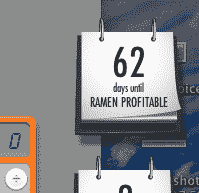
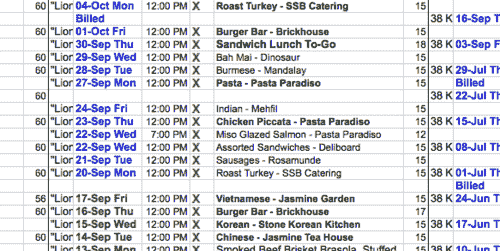
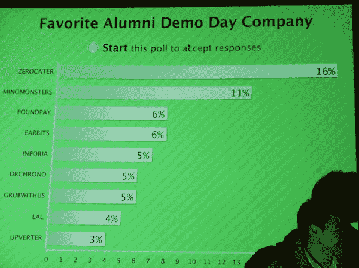
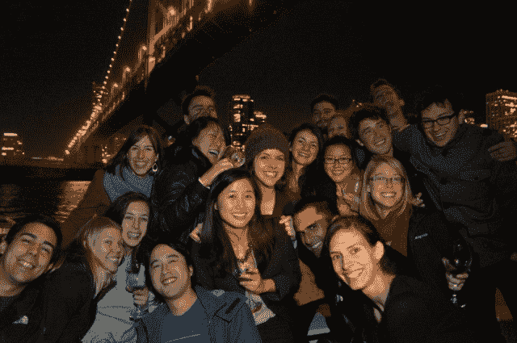

# 从卖冰淇淋到创办 zero cater TechCrunch

> 原文：<https://techcrunch.com/2013/04/06/how-i-started-zerocater/?utm_source=wanqu.co&utm_campaign=Wanqu+Daily&utm_medium=website>

**编者按:** Arram Sabeti 是 [ZeroCater](http://www.crunchbase.com/company/zerocater) 的 CEO。在推特上关注他 [@arram](https://twitter.com/arram) 。

> 当你把一块石头扔进水中时，它会以最快的速度沉入水底。当悉达多有一个目标时，情况就是这样，[……]这就是傻瓜们所说的魔法，他们认为这将通过守护进程来实现。没有什么是受守护进程影响的，没有守护进程。如果他能够思考，如果他能够等待，如果他能够斋戒，每个人都可以表演魔术，每个人都可以达到他的目标

五年前，我搬到了湾区，因为我想开一家公司。我带着这个单一的目标和一打保罗·格拉厄姆论文的教育来到这里。对我来说，决心有一种近乎神奇的品质。我总觉得有了足够的钱，我可以做任何事。

人们说创业有风险，但对我来说，一辈子做一份工作似乎是最糟糕的结果，所以创办公司是我能做的风险最小的事情。我想这就是人们谈论创始人有点疯狂的意思。我意识到这是一种不寻常的性格特征。

为了资助我的冒险，我卖掉了汽车，搭便车去了海湾地区。我花了两天时间在伯克利公共图书馆的电脑上寻找住处。我说服了一位退休牙医，在他看到钱或者甚至在租约上得到我的签名之前，把埃尔塞里托一家廉价工作室的钥匙给了我。寻找我的学徒期，我开始申请创业工作。

事实证明，没有学位或市场技能的 21 岁年轻人并不受欢迎。幸运的是，我拿起的一份报纸告诉我，这是乔布斯十年来最糟糕的一个夏天。最终，我的现金少得可怜，于是我走到伯克利市中心，敞开大门，走进每一家企业，询问求职申请。即使在那里，反应也很糟糕。一周后，我得到了一份工作。这是本&杰里的，我接受了。

几天后，我在 Hacker News 上看到一个招聘 Justin.tv 社区经理的职位。我记得曾读到过这些创始人在易贝卖掉他们上一家公司的消息，于是我兴奋地给他们发了电子邮件，很快就收到了面试邀请。

我乘火车穿越海湾，思考如何从其他申请者中脱颖而出。当我到达那里时，我拿出笔记本，确保像他们采访我一样严格地采访他们。我甚至说“为了公平起见，我应该提到我将在一年后辞职去创建我自己的公司。”

经过三次面试，候选人从 16 人减少到 6 人，剩下我和另外一个人。第三次面试结束时，贾斯汀·坎问:“你需要多少薪水？”我告诉他“我只是为了体验才加入的；我只需要足够活下去。

那天晚上我接到了电话。“很接近，但我们希望有人能在这里工作一年以上。”我以为我搬起石头砸了自己的脚，直到他补充道，“但我们想为你创造一个新的职位。”我通知了本杰里公司。

这项工作是多余任务的大杂烩。我测试了网站的新版本，管理了求职者，甚至为团队订了午餐。这份工作很乏味，但被 Justin.tv 录用是最好的事情了。我和我见过的最有能力的人一起工作，我了解了创业公司是如何真正运作的，并认识了几十个后来提供了宝贵帮助和建议的人。两位创始人最终成为了我公司的投资者和顾问。

创业社区最大的好处之一就是令人难以置信的先付钱再发展的态度。这几乎就像退伍军人之间的纽带。个人情况可能会有所不同，但每位创始人都可以对这种挣扎感同身受。

**T2】**

在 Justin.tv 工作了一年半之后，我仍然没有创业的想法，所以我给自己定了一个期限:六个月后我要辞职，所以我最好在那之前有东西支付房租和拉面。我在桌面上加了一个倒计时器，并把我的工作密码改成了“六个月退出”，我一天要敲八次。(你经常在做站点测试的时候清理你的 cookies。)

##### 午餐压力的承诺

我和朋友们就潜在的想法进行了很多交流。大约在那个时候，贾斯汀提到另一家公司的一个朋友向我要了一份我午餐去的餐馆清单。也许我可以帮助他们？令人惊讶的是，当时订午餐是我工作中最烦人、最有压力的部分。我的餐馆名单花了一年时间反复试验才建立起来。我和他们的办公室经理见了一次面，她似乎非常轻松地把责任交给了我。管理公司的伙食被证明是一个非常棘手的问题。我开始向所有我认识的人介绍办公室经理，一个客户变成了两个，然后是三个。在设定最后期限三个月后，我辞职了。

我记得我非常尴尬，因为我的“技术”创业公司只有 0 行代码、一个收件箱和一个巨大的电子表格。最终，我克服了尴尬，明白了做销售的第一条规则是不羞于销售。如果有人在聚会上提到他们公司订了食物，我就拿出手机，在那里找到了他们的电子邮件地址。当我收到销售人员的电子邮件时，我会翻翻剧本:他们的公司考虑过送餐吗？我能和做决定的人谈谈吗？如果你听我的，我就听你的。

投球成了一种条件反射。当我买手机时，一名威瑞森员工看到了我的卡，问我是做什么的。甚至没有想到会有销售，我开始反射性地推销:“ZeroCater 让公司为员工提供食物变得简单。你可以直接告诉我们，例如:我们有 74 个人，两个素食者，一个纯素食者，每周一、三、五都要吃午饭。我们通过一系列精选的餐馆、食品车和餐饮服务商创建定制订单。美味的食物就这么出现了，你再也不用去想它了。”当我回到家时，我发现旧金山所有的威瑞森商店都已经签约在新 iPhone 发布会期间为员工提供食物。

开始是最难的，只有几个客户站在我和不交租金之间，但一年过去了，公司成长了。我用于计划的电子表格增长到了 500 列，我已有的流程开始崩溃。计费增加到每周 20 小时。我开始寻找一个技术合伙人来开发软件。不幸的是，我认识的大多数开发人员已经在有前途的初创公司工作了。

最终，我说服了一个开发者朋友加入我。我们申请了 Y Combinator，得到了面试机会。幸运的是，保罗·格拉厄姆喜欢这个主意。"你帮助公司解决他们的头号问题:招聘！"然后，他转向杰西卡·利文斯顿问道:“你觉得管理 Y Combinator 活动的餐饮服务怎么样？”“我讨厌！”尽管如此，我们还是太紧张了，以至于无法完成任何工作，直到那天晚上接到录取通知。

在 Y Combinator 快结束的时候，一位投资者通过我们试图招募的人听说了我们，并要求见面。我们边喝咖啡边聊，第二天他给我们发了电子邮件:“好消息——我们作为一个团队讨论了 ZeroCater，我们希望继续推进条款清单。[……]我们可以进行可转换票据或“过桥”股权融资(假设你还没有准备好进行首轮融资)，我们还想知道你是否愿意投资 100 万美元。”

景色令人叹为观止，但就在那一刻，我的过山车到达了轨道的顶端。第二天，我的技术合伙人告诉我他要辞职。

那是充满压力的三个月，我们经常在午夜后离开办公室。我一直在谈论建立一个 10 亿美元的企业，我想那时他意识到他还没有足够热爱这家公司，以至于不能在接下来的 4-8 年里全力以赴。

作为一家科技公司，当你试图融资时，有两件事是你不想做的。你不想成为一个单一的创始人，因为每个人都知道创业对一个人来说是太多的工作，你也不想成为非技术型的，因为每个人都知道有想法的商业家伙没有内在价值。

我两者都是。没关系。我打算建立一家公司。

演示日快到了，我会向一屋子的投资者推销我的公司。

在我尝试了几次重写之后，在演示日的前两天，保罗·格拉厄姆建议结束我的演示:“越来越多的公司在为员工提供食物，我们想乘着这股浪潮，食物的浪潮。”在寻找一种方法让投资者从其他 44 场演示中清醒过来的时候，我找到了一位艺术家，他可以在一夜之间创作出一幅画来说明“食物的浪潮”。

我的演讲以“我们想乘风破浪”结束，我会停下来，翻到这幅画，说“一波食物”这引起了很多笑声。

直到我走上舞台的那一刻，我肯定已经练习了 150 多次了，大部分时间是在 Y Combinator 的停车场，一个朋友走过来对我说:“啊哈，你知道有一种东西叫过度练习。”

有一句来自 Teller(Penn & Teller)的名言:“有时候，魔法只是某人在某件事情上花费的时间比其他任何人合理预期的都多。”

我做了介绍，ZeroCater 在校友展示日被选为第一名。

一些投资者对投资一个非技术型创始人的想法犹豫不决，但幸运的是，大多数人都很热情，我筹集了 150 万美元——比我计划的要多。

在接下来的两年里，我们建立了团队，并不断壮大。我们现在每月为超过 350 家公司提供食物，包括索尼、ZipCar、Yelp 和易贝，并且已经提供了超过一百万份食物。

零队在船上。

保罗·格拉厄姆写道，在创办 Y Combinator 后，他们发现了一件令人惊讶的事情:决心是预测成功的最重要因素，甚至比智力更重要。

我想起了比尔·沃尔什，他执教 49 人队，拥有 NFL 历史上最差的战绩，试图打破对迈阿密海豚队的八连败，但失败了。我想起了他在回旧金山的飞机上在黑暗中哭泣，而他的助理教练则保护他不让他的任何球员看到，在改变主意并继续赢得三次超级碗之前，他几乎提交了辞呈。

我想起了巴克明斯特·富勒(Buckminster Fuller)，他身无分文，看着自己的女儿死于小儿麻痹症，处于自杀的边缘，然后决定开始“一项实验，以发现一个人可以为改变世界和造福全人类做出什么贡献。”

我想起了谢家华以 2.65 亿美元将 LinkExchange 卖给微软，最终投资了，然后加入了一家名为 Zappos 的苦苦挣扎的鞋类公司。我想到他越来越多地投资自己的钱，直到他破产，亏本出售自己的公寓，只是为了支付工资，然后被亚马逊以近 1B 美元收购。

我想起了埃隆·马斯克(Elon Musk)，在他第三次火箭发射失败后，他将全部财富投入到他的三家公司，不得不借钱支付租金，在成功到达太空并与美国宇航局(NASA)达成协议之前，现金只够再发射一次。

马斯克形容得最好:“就像嚼玻璃，凝视深渊。”在最糟糕的时候，痛苦是身体上和精神上的。我每个月至少会看一次他的 60 分钟采访的一部分，在那里马斯克被问及在第三次发射失败后他是否考虑过辞职。他用平静、低调的声音回答:“从来没有。我从不放弃。我可能已经死了，或者完全丧失行为能力。”

马斯克是为数不多的几个创建了三家价值超过 10 亿美元的独立公司的人之一，这是有原因的，那个时刻完美地捕捉到了这一点。

你愿意付出多少痛苦来决定你的成就有多伟大。你的野心越大，你要嚼的玻璃就越多。每个人都有自己的苦衷，即使是做自己喜欢的事情的人。

任何人，只要身体健康，智力合理，都可以在全球范围内实现目标。我真的不觉得有上限。这就是我五年的实验向我证实的:只要有足够的毅力，你可以做任何事情。

我想引用网飞创始人兼首席执行官马克·伦道夫的一句话:

> 我一直在说这有多难。每一次你登上面前的山峰，都会让你清楚地看到更大的山峰的规模。它持续了很长时间。多年来，我呕心沥血，让网飞活了下来，而我们找到了解决办法——硅谷其他所有成功的企业家也是如此。