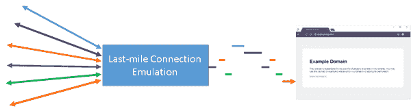
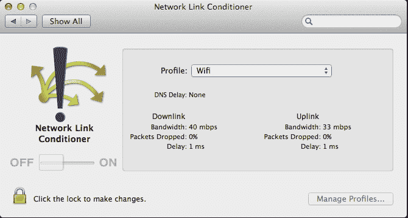
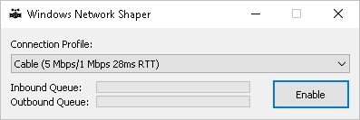
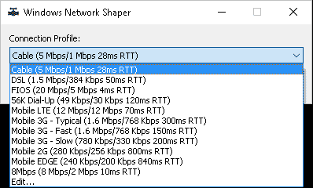
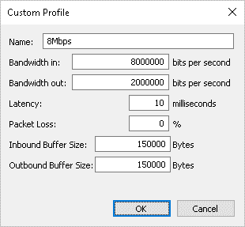

# 在真实网络条件下进行网络性能日历测试

> 原文：<http://calendar.perfplanet.com/2016/testing-with-realistic-networking-conditions/?utm_source=wanqu.co&utm_campaign=Wanqu+Daily&utm_medium=website>

测试您正在使用的网站或应用程序的性能时，使用代表您的用户的网络条件进行测试至关重要。这是我最初创建 [WebPageTest](http://www.webpagetest.org/) 的主要原因之一，这样就可以很容易地测试和演示当页面没有加载到超高速公司网络上时的性能。

有很多方法可以做到这一点，从在真实网络上测试到在实验室中模拟网络条件，再到浏览器提供的工具。

真实的网络往往会大幅改变性能，尤其是移动网络，在移动网络中，信号强度、一天中的时间以及网络上的其他流量会将性能改变几个数量级。我认为最有效的方法是对实际网络进行一些初步测量，以了解它们的行为，然后使用数据包级流量整形工具来模拟最后一英里的网络条件。这也解决了无法始终访问您可能希望优化的各种不同网络的问题。

同样需要注意的是，您只能真实地模拟最后一英里的情况，而不能轻易模拟整个网络路径。任何给定内容中涉及的所有 CDN 和服务器的路由和对等关系意味着，如果您从靠近您的用户将来自的物理位置的位置进行测试，然后使用流量整形来模拟您想要测试的链路条件，通常效果最佳。

# 浏览器级流量整形

Chrome 支持模拟各种不同的[网络条件](https://developers.google.com/web/tools/chrome-devtools/network-performance/network-conditions)作为开发工具的一部分，但我只推荐使用它来进行真正粗略的计时，并查看资源大小如何影响整体时间。因为它是在网络堆栈之上实现的，所以连接的许多方面都没有正确建模。我想到的一些是:

***   **[buffer bloat](https://en.wikipedia.org/wiki/Bufferbloat)**–由于整形是在数据包层之上完成的，因此没有原始数据包的底层缓冲。它们在快速网络上被接收和确认，然后在浏览器中缓慢地传送。在现实世界中，如果您过度共享您的内容，并通过慢速底层网络的大量并行连接进行交付，您很容易陷入这样的情况:服务器认为缓冲区中排队的数据已经丢失，并重新传输数据，导致重复数据消耗了有限的可用带宽([虚假重新传输](https://insouciant.org/tech/network-congestion-and-web-browsing/))。**

 **有许多服务器/CDN 调整参数对性能至关重要([初始拥塞窗口](https://developers.google.com/speed/protocols/#an-argument-for-increasing-tcps-initial-congestion-window)、 [HTTP/2](https://http2.github.io/) 、 [BBR](http://netdevconf.org/1.2/slides/oct5/04_Making_Linux_TCP_Fast_netdev_1.2_final.pdf) 、 [QUIC](https://en.wikipedia.org/wiki/QUIC) )，准确了解影响的唯一方法是在数据包级别进行流量整形。

## FreeBSD

[Dummynet](http://info.iet.unipi.it/~luigi/dummynet/) 几乎是流量整形的黄金标准，逻辑上很容易推理出能够建立各种网络条件的“管道”,并使用`ipfw`规则来管理流量。WebPageTest 在历史上非常依赖于`dymmynet`进行所有的流量整形，并为入站流量和出站流量分别配置一个管道。有一个 Windows 端口从一开始就是 WebPageTest 桌面代理的一部分，对于移动设备，我通常通过 FreeBSD 网桥路由它们的连接，该网桥进行流量整形。

不幸的是，Windows 10 破坏了 Windows 驱动程序使用的一个接口，因此它只能通过 Windows 8.1 运行。KVM 中的加速网络驱动程序也有一些不兼容的问题(例如在 Amazon AWS 上)，但当它可以使用时，它工作得很好。

## OSX/iOS

作为 XCode 开发工具的一部分，Apple 提供了一个名为 [Network Link Conditioner](http://nshipster.com/network-link-conditioner/) 的工具，它基本上是 dummynet 上的一个 GUI，使在本地开发环境中获得高质量的流量整形变得非常容易。如果您主要在 Mac 上进行开发，我强烈建议您在所有测试中使用 link conditioner。

## Linux 操作系统

在 Linux 上使用 NetEm 进行流量控制可以用来模拟具有极大灵活性的网络，尽管达到速度可能有点令人生畏。脸书已经为它发布了一个[前端](https://facebook.github.io/augmented-traffic-control/)，如果你在网络上使用 Linux 设备来进行流量整形(提供一个 web UI 来为你当前用来访问网络的设备选择一个配置文件)，它会工作得特别好。

# winShaper 简介

在推荐的工具列表中，您可能会注意到 Windows 的明显漏洞。Dummynet 很棒，但它不如 Mac 的 link conditioner 用户友好，也不能在 Windows 10 上运行。作为向 WebPageTest 添加 Windows 10 支持的一部分，我必须创建一个新的数据包级[流量整形驱动程序](https://github.com/WPO-Foundation/win-shaper/tree/master/driver)，一旦运行良好，创建一个简单的 GUI 只需几个小时。

GUI 版本可以在 [GitHub](https://github.com/WPO-Foundation/win-shaper/releases) 上获得，并且是完全独立的(没有安装程序)。你需要是一个管理员来运行它，因为它需要运行一个设备驱动程序来做过滤，否则它只是一个运行 winShaper 的问题，选择一个连接配置文件并打开它。

一旦启用，你会看到一些活动的“网络缓冲区”填充和流失的基础上的交通流量，当你想关闭它回来，你可以关闭它或按下禁用按钮。

默认情况下，它与 WebPageTest 附带相同的连接配置文件，但您也可以指定自定义配置文件，包括网络缓冲区应该有多大(150KB 大致反映了 dummynet 默认的 100 个数据包，但实际上实际网络上的缓冲区可能会更大)。

这些代码都在 GitHub 上，并且都在一个非常自由的 Apache 许可下，所以如果你需要一个项目的流量整形功能，非常欢迎你使用它。该驱动程序经过数字签名，因此除了管理员权限外，它不需要任何特殊的安装权限。还有一个独立的命令行测试应用程序，显示如何使用驱动程序的 API(只有几行代码来控制它)，我预计允许完全控制的控制台应用程序将很快出现，使其更容易与 CI 工具和其他项目集成。一如既往，欢迎提出要求或建议。**