# 代码的半衰期&忒修斯之船

> 原文：<https://erikbern.com/2016/12/05/the-half-life-of-code.html?utm_source=wanqu.co&utm_campaign=Wanqu+Daily&utm_medium=website>

# 代码的半衰期&忒修斯之船

<time datetime="2016-12-05T00:00:00Z" class="post-date">2016-12-05</time>

随着项目的发展，新代码会添加到旧代码之上吗？还是随着时间的推移慢慢取代旧代码？为了理解这一点，在强大的 [GitPython](https://gitpython.readthedocs.io/en/stable/) 项目的帮助下，我构建了一个[小东西](https://github.com/erikbern/git-of-theseus)来分析 Git 项目。这个想法是回到历史中运行一个`git blame`(事实证明，这样做有点快有点不容易，但是我不会告诉你细节，这涉及到一些文件的机会缓存，选择在时间上分散的历史点，使用`git diff`使改变的文件无效，等等)。

我一时糊涂，把“忒修斯的饭桶”命名为忒修斯的船上一个可怕的双关语。我现在是爸爸了，所以我会说可怕的双关语。它指的是一个哲学悖论，一艘船的零件几百年来一直在更换。如果把所有的部件都换掉，还是同一艘船吗？

忒修斯和雅典的年轻人从克里特岛返回的船有三十只桨，被雅典人保存下来，甚至到德米特里厄斯·菲勒留斯的时候，因为他们带走了腐烂的旧木板，在它们的位置上放入新的和更强的木材，以至于这艘船成为哲学家中的一个站立的例子，对于事物增长的逻辑问题；一方认为这艘船保持不变，另一方则认为它已经变了。

事实证明，代码并没有按照我预期的方式进化。这里*是*一个“忒修斯之船”效应，但也有一个复合效应，代码库随着时间的推移不断增长(也许我应该称之为“第二大道地铁”效应，在纽约市的建设项目[从 1919 年开始](https://en.wikipedia.org/wiki/Second_Avenue_Subway#Initial_attempts)之后)。

先从分析 Git 本身开始。Git 很早就成为了[自托管](https://en.wikipedia.org/wiki/Self-hosting)，它是最流行和最古老的 Git 项目之一:

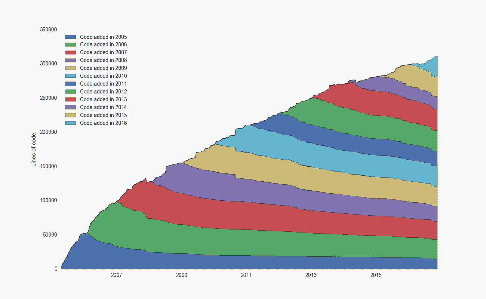

该图绘制了一段时间内代码行的总数，并根据添加的年份划分为不同的组。我本以为这里会有更多的衰退，我很惊讶地看到这么多写于 2006 年的代码仍然存在于代码库中——有趣！

我们也可以计算单个提交的衰减。如果我们在 x=0 时对齐所有提交，我们可以查看某个回购中代码的聚合衰减。由于各种原因，这种分析比听起来更难实现(主要是因为新提交的时间更少，所以曲线的右端代表更少提交的集合)。

对于 Git，该图如下所示:

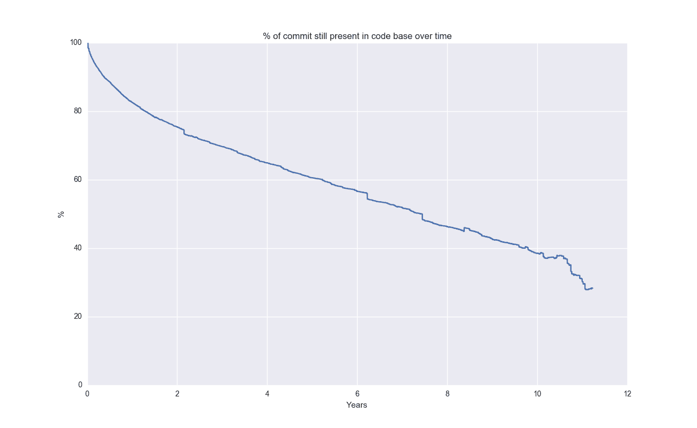

即使 10 年后，40%的代码行仍然存在！让我们看看更广泛的(有些随机选择的)开源项目:

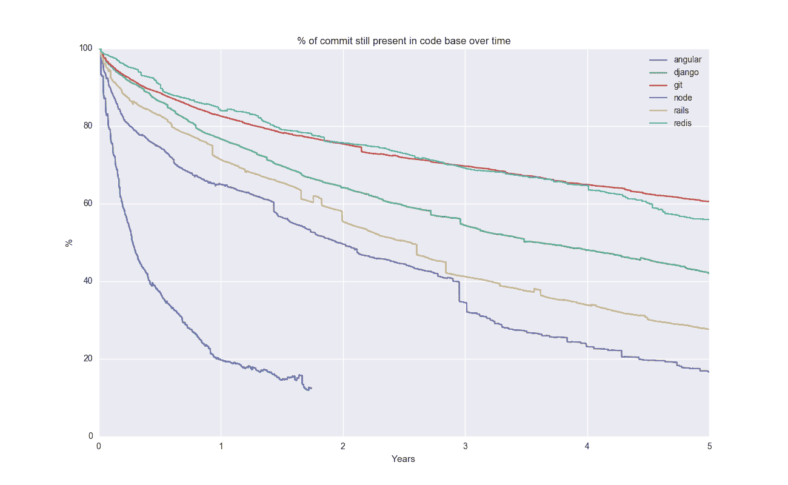

看起来 Git 在这里有点离群。拟合 Git 的指数衰减，求解半衰期，得出大约 6 年。

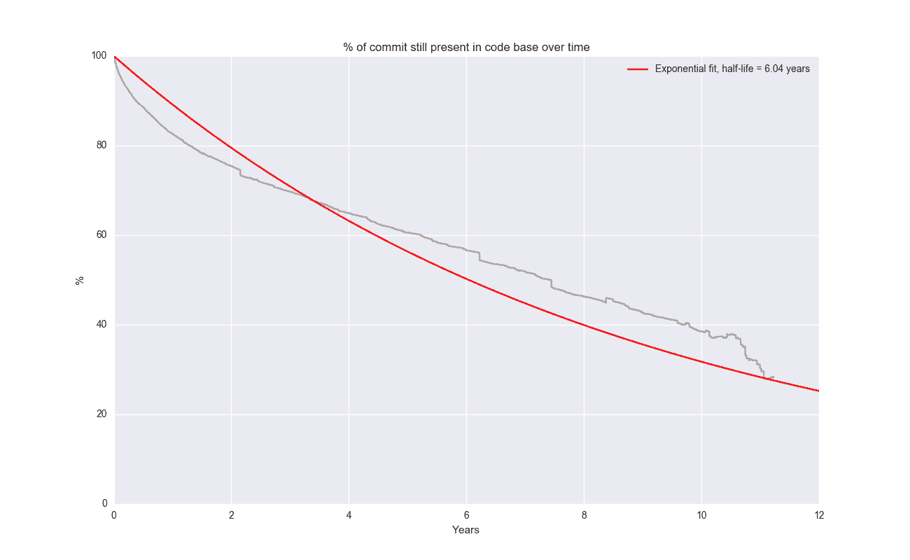

嗯……我不相信这一定是完美的匹配，但正如那句名言所说的那样:*所有的模型都是错的，有些模型是有用的。*我喜欢指数衰减的解释力——代码有预期的生命周期和不断被替换的风险。

我怀疑一个稍微好一点的模型是拟合一个指数和。这将适用于回购，其中一些代码变化很快，一些代码变化很慢。但在进入曲线拟合的兔子洞之前，我提醒自己冯·诺依曼的名言:*用四个参数我可以拟合一头大象，用五个参数我可以让它扭动鼻子。*可能有办法让它工作，但我会在其他时间再来。

让我们一起来看看大量的项目(也是任意抽样的):

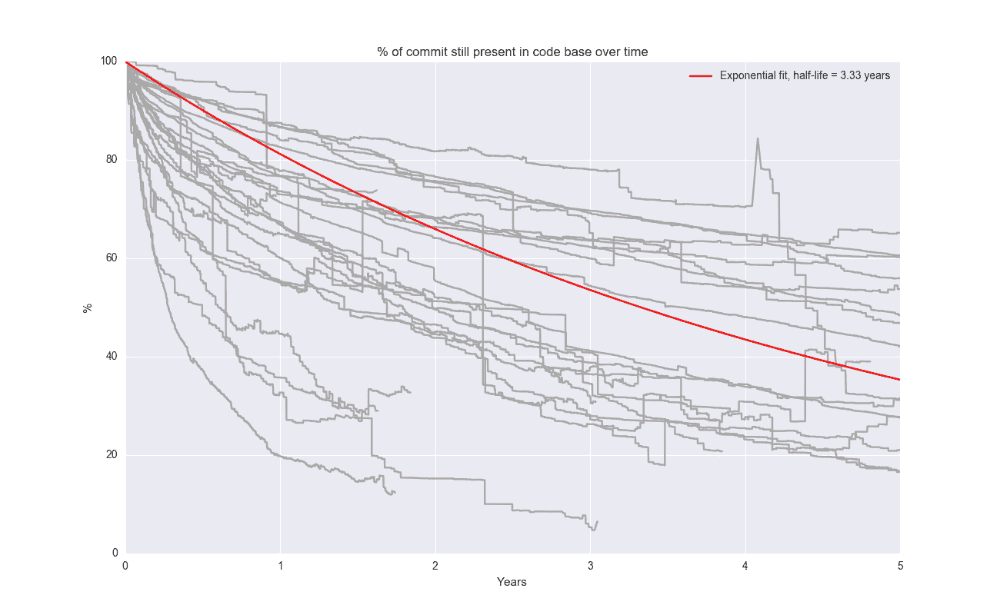

总体而言，半衰期约为 3.33 年。我喜欢，这是一个容易记住的数字。但是不同项目之间的差价很大。聚合模型并不一定具有超强的预测能力——很难指向一个任意的开源项目，并期望它的一半在 3.33 年后消失。

## 移动休息

阿帕奇(又名 [HTTPD](https://github.com/apache/httpd) )是另一个可以追溯到很久以前的回购:

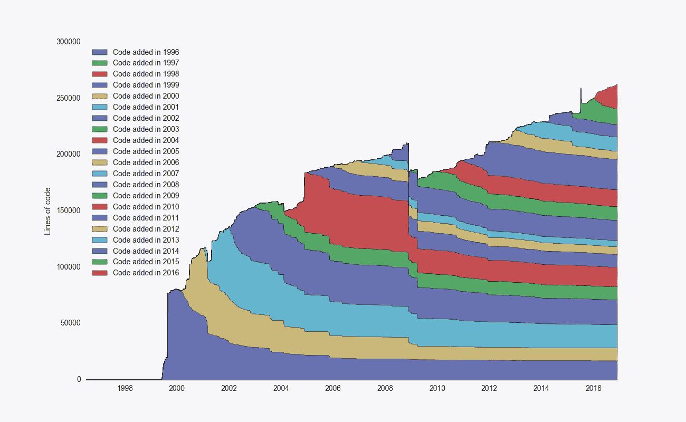 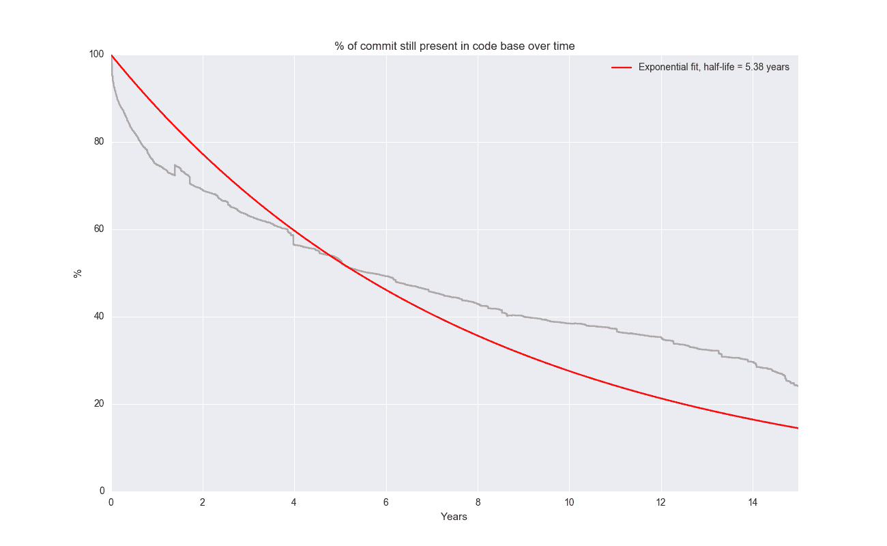

[轨道](https://github.com/rails/rails):

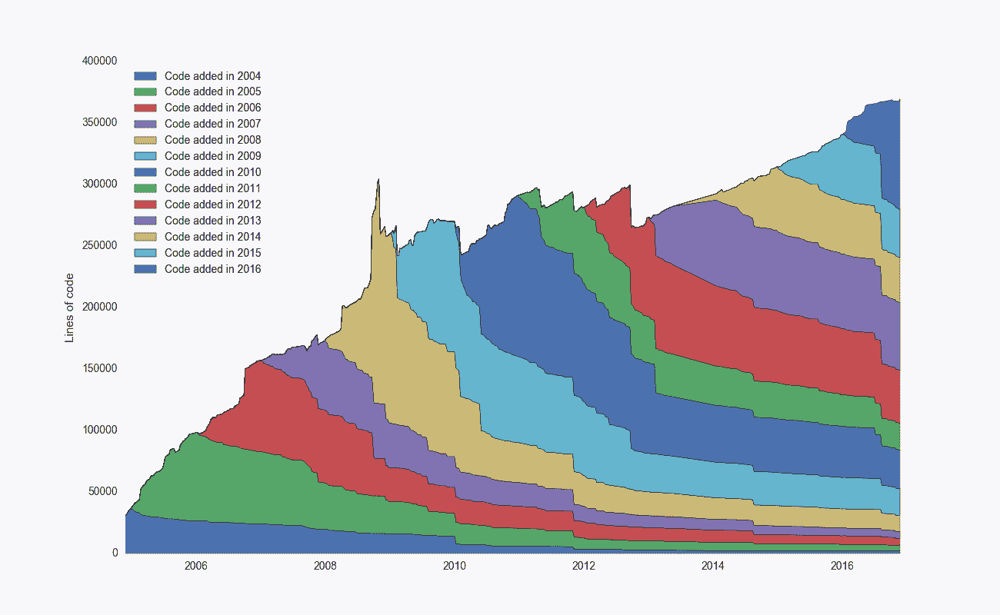 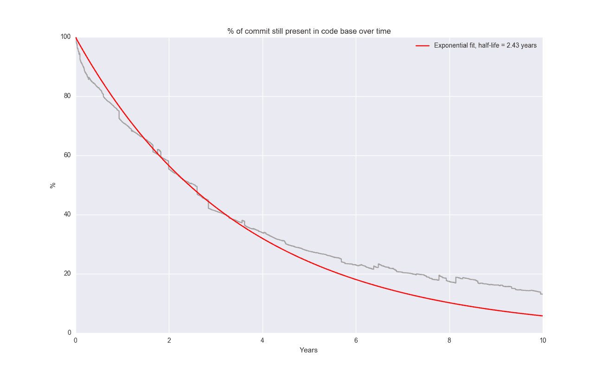

*美*指数拟合！

[节点](https://github.com/nodejs/node)

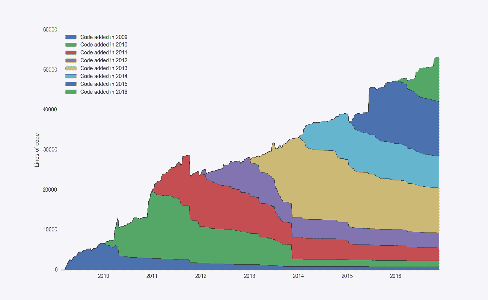 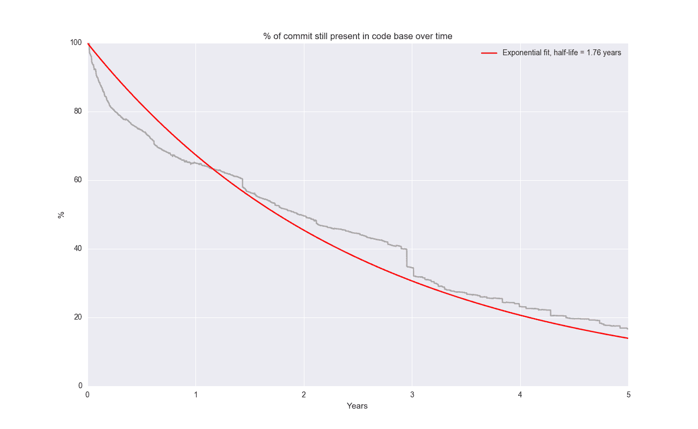

想为你自己的回购运作吗？同样，代码在处[可用。](https://github.com/erikbern/git-of-theseus)

## 他们所有人的怪物回购

请注意，使用我的脚本，这些回购中的大多数最多花几分钟来分析。作为最后的测试，我决定在 [Linux 内核](https://github.com/torvalds/linux)上运行它，这是*巨大的*-到今天为止有 635，229 个提交。这比我看的第二大回购大 16 倍( [rails](https://github.com/rails/rails) )，我花了好几天在我的破电脑上分析。为了加快速度，我最终只计算了至少 3 周内提交的完整的`git blame`,并将其限制为`.c`文件:

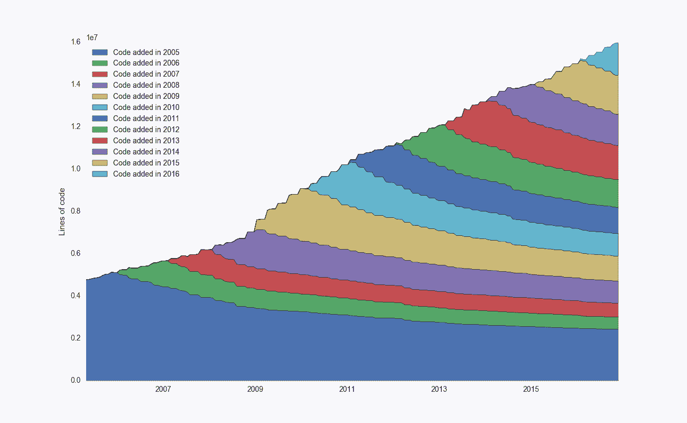

弯弯曲曲的线条很可能是来自采样机制。但是看看这个美丽的——高达 1600 万行！在这种规模下，来自每年群组的代码贡献极其平滑。在这种规模下，单个提交完全没有意义——它们的累积总和是非常可预测的。这就像[从牛顿定律到热力学](https://en.wikipedia.org/wiki/Kinetic_theory_of_gases)。

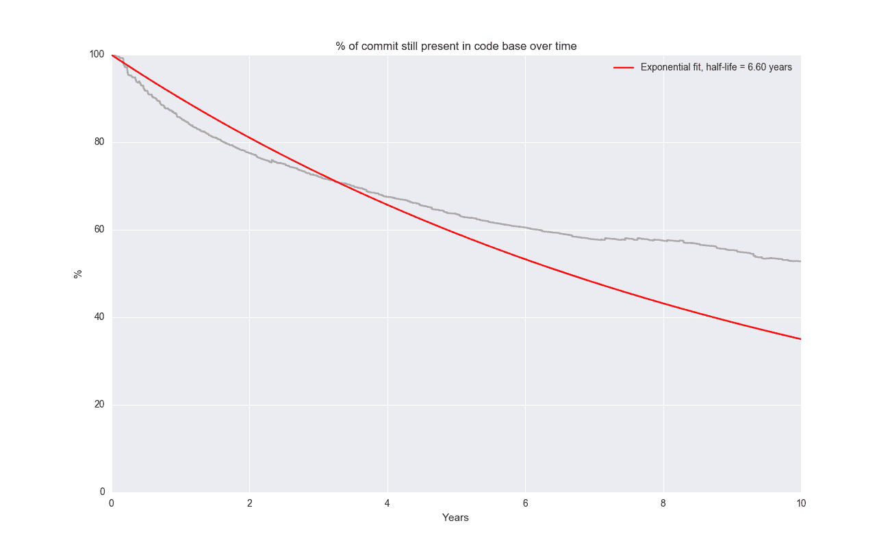

Linux 也明显表现出更多的线性增长模式。我推测这和它的高度模块化有关。到目前为止，`drivers`目录拥有最多的文件(22，091)，其次是包含各种架构支持的`arch` (17，967)。这正是你所期望的那种能够很好地适应复杂性的东西，因为它们有一个定义良好的接口。

有点跑题，但是我喜欢项目如何随着复杂性扩展的概念。线性可伸缩性是最终目标，其中每一个边缘特性占用大致相同的代码量。糟糕的项目会超线性扩展，每个边缘特性会占用越来越多的代码。

有趣的是回过头来将 Linux 与 Angular 之类的东西进行对比，后者基本上表现出相反的行为:

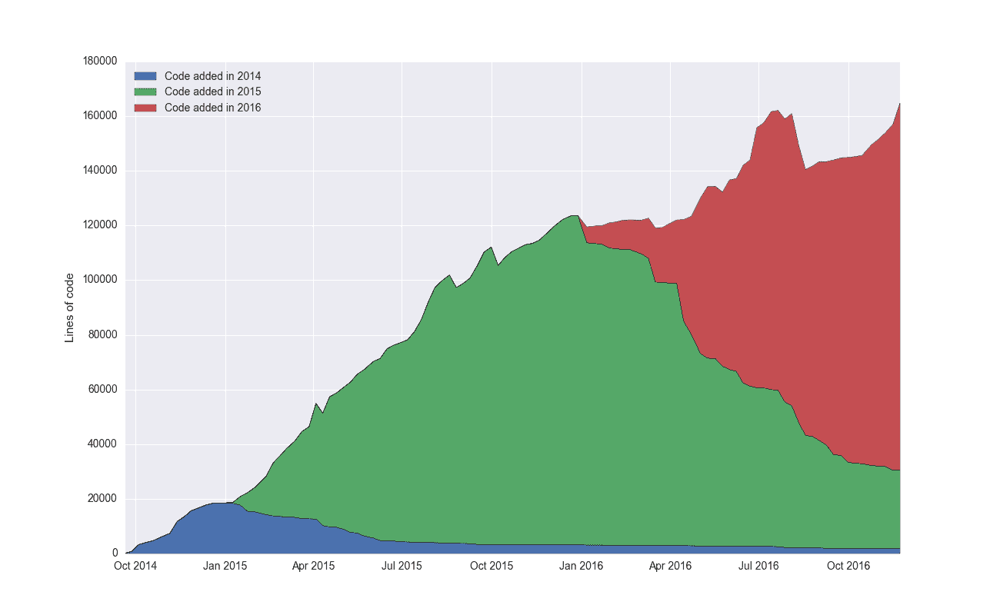 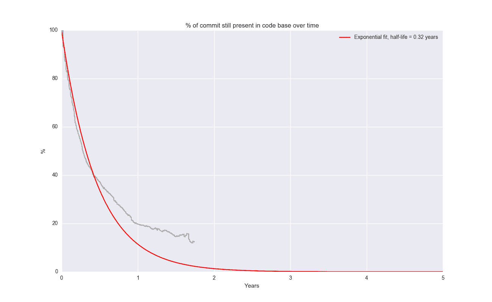

随机选择的线的半衰期约为 0.32 年。这是否反映在 Angular 上？架构基本上没有“线性”和一致性吗？你可能会说这种比较不公平，因为 Angular 是新出现的。那是一个公平的观点。但如果它确实反映了一些有问题的设计，我也不会感到惊讶。我并不是说这里有棱角，但这是一个有趣的对比。

## 储存库的半衰期

项目及其半衰期的任意样本:

| 项目 | 半衰期(年) | 第一次提交 |
| --- | --- | --- |
| 有角的 | Zero point three two | Two thousand and fourteen |
| 蓝知更鸟 | Zero point five six | Two thousand and thirteen |
| 库伯内特斯 | Zero point five nine | Two thousand and fourteen |
| keras | Zero point six nine | Two thousand and fifteen |
| tensorflow | One point zero eight | Two thousand and fifteen |
| 表达 | One point two three | Two thousand and nine |
| scikit-learn | One point two nine | Two thousand and eleven |
| 路易吉 | One point three | Two thousand and twelve |
| 毅力 | One point four eight | Two thousand and ten |
| ansible | One point five two | Two thousand and twelve |
| 反应 | One point six six | Two thousand and thirteen |
| 结节 | One point seven six | Two thousand and nine |
| 强调 | One point nine seven | Two thousand and nine |
| 要求 | Two point one | Two thousand and eleven |
| 轨道 | Two point four three | Two thousand and four |
| 姜戈 | Three point three eight | Two thousand and five |
| 提亚诺 | Three point seven one | Two thousand and eight |
| numpy | Four point one five | Two thousand and six |
| 瞬间 | Four point five four | Two thousand and fifteen |
| 我的天啊 | Four point six two | Two thousand and seven |
| 龙卷风 | Four point eight | Two thousand and nine |
| 雷迪斯 | Five point two | Two thousand and ten |
| 瓶 | Five point two two | Two thousand and ten |
| 超文本协议服务 | Five point three eight | One thousand nine hundred and ninety-nine |
| 饭桶 | Six point zero four | Two thousand and five |
| 厨师 | Six point one eight | Two thousand and eight |
| Linux 操作系统 | Six point six | Two thousand and five |

有趣的是, [moment](https://github.com/moment/moment) 有如此高的半衰期，但原因是如此多的代码是特定于地区的。随着时间的推移，这通过稳定的代码核心和线性增加创建了更线性的可伸缩性。[快车](https://github.com/expressjs/express)是另一个方向的异数。它已经有 7 年的历史了，但是代码变化非常快。我猜这部分是因为(a)代码缺乏线性可伸缩性(b)这可能是第一个主流/流行的主要 Javascript 开源项目之一，在 Node.js 浪潮中冲浪。可能代码库也很糟糕，但我不知道😊

## 编码有变化吗？

我能想到三个原因来解释为什么项目启动的年份和半衰期之间有如此紧密的联系

1.  在项目的早期，代码变得更加混乱，而在之后的一段时间里变得更加稳定
2.  编码从 2006 年到 2016 年发生了变化，现代项目进化更快
3.  存在某种选择偏差，只有可扩展的稳定项目才能存活下来

有趣的是，我没有在数据中找到任何#1 的明确证据。旧项目中较早编写的代码的半衰期与较晚编写的代码一样长。我也对第三点持怀疑态度，因为我不明白为什么生存和代码结构之间会有联系(但也许有)。我的结论是，在过去的 10 年里，编写代码已经发生了根本性的变化。在现代项目中，代码似乎变化得更快。

顺便看看黑客新闻上的讨论[和 Reddit](https://news.ycombinator.com/item?id=13112449) 上的[！](https://www.reddit.com/r/programming/comments/5gqurc/the_halflife_of_code_the_ship_of_theseus/)

**Tagged with: [software](https://erikbern.com/tags/software.html), [statistics](https://erikbern.com/tags/statistics.html), [popular](https://erikbern.com/tags/popular.html)**